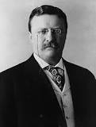
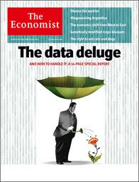
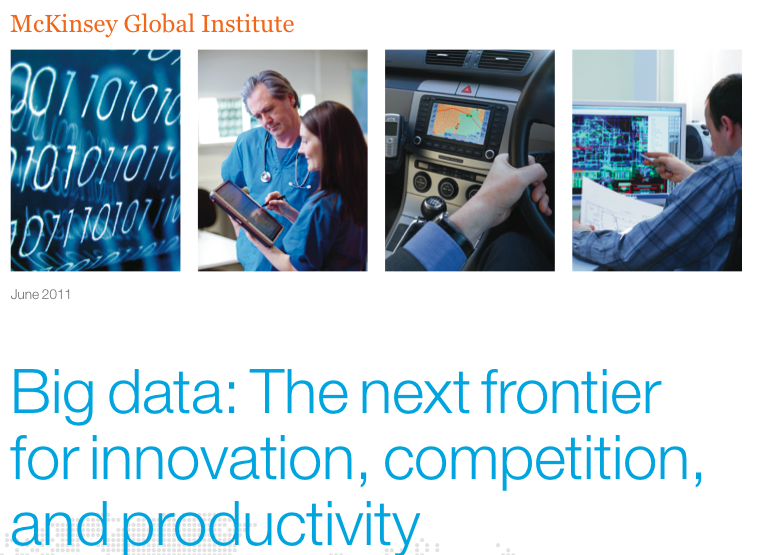
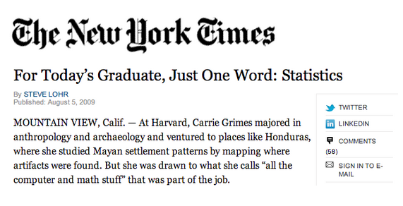

```{r setup, cache = F, echo = F, message = F, warning = F, tidy = F}
# make this an external chunk that can be included in any file
options(width = 100)
opts_chunk$set(message = F, error = F, warning = F, comment = NA, fig.align = 'center', dpi = 100, tidy = F, cache.path = '.cache/', fig.path = 'fig/')

options(xtable.type = 'html')
knit_hooks$set(inline = function(x) {
  if(is.numeric(x)) {
    round(x, getOption('digits'))
  } else {
    paste(as.character(x), collapse = ', ')
  }
})
knit_hooks$set(plot = knitr:::hook_plot_html)
```


## Why do data science?

"It is not the critic who counts: not the man who points out how the strong man stumbles or where the doer of deeds could have done better. The credit belongs to the man who is actually in the arena, whose face is marred by dust and sweat and blood, who strives valiantly, who errs and comes up short again and again, because there is no effort without error or shortcoming, but who knows the great enthusiasms, the great devotions, who spends himself for a worthy cause; who, at the best, knows, in the end, the triumph of high achievement, and who, at the worst, if he fails, at least he fails while daring greatly, so that his place shall never be with those cold and timid souls who knew neither victory nor defeat."

  _Theodore Roosevelt, 26th President of the United States_

[Statistics and the science game](http://simplystatistics.org/2012/06/22/statistics-and-the-science-club/)

---

## The key challenge in data science

"Ask yourselves, what problem have you solved, ever, that was worth solving, where you knew all of the given information in advance? Where you didn’t have a surplus of information and have to filter it out, or you didn’t have insufficient information and have to go find some?"

 [Dan Myer, Mathematics Educator](http://www.ted.com/talks/dan_meyer_math_curriculum_makeover.html)

[The key word in data science is not data; it is science](http://simplystatistics.org/2013/12/12/the-key-word-in-data-science-is-not-data-it-is-science/)

---

## About us

<center> <font color="#CD3278">Data intensive</font> statistics in <font color="#008B45">biology and medicine</font></center>

* Brian Caffo 
  * Website [http://www.bcaffo.com/](http://www.bcaffo.com/)
  * Twitter [@bcaffo](https://twitter.com/bcaffo) 
  * Github [https://github.com/bcaffo](https://github.com/bcaffo)
* Jeff Leek 
  * Website [http://biostat.jhsph.edu/~jleek/](http://biostat.jhsph.edu/~jleek/), [http://simplystatistics.org/](http://simplystatistics.org/)
  * Twitter [@jtleek](https://twitter.com/jtleek) 
  * Github [https://github.com/jtleek](https://github.com/jtleek)
* Roger Peng
  * Website [http://www.biostat.jhsph.edu/~rpeng/](http://www.biostat.jhsph.edu/~rpeng/),[http://simplystatistics.org/](http://simplystatistics.org/)
  * Twitter [@rdpeng](https://twitter.com/rdpeng) 
  * Github [https://github.com/rdpeng](https://github.com/rdpeng)

---


## Why data science?



[http://www.economist.com/node/15579717](http://www.economist.com/node/15579717)


---

## Why data science?



[http://www.mckinsey.com/insights/business_technology/big_data_the_next_frontier_for_innovation](http://www.mckinsey.com/insights/business_technology/big_data_the_next_frontier_for_innovation)

--- 

## Why statistical data science?



[http://www.nytimes.com/2009/08/06/technology/06stats.html?_r=0](http://www.nytimes.com/2009/08/06/technology/06stats.html?_r=0)


---

## Why are you lucky?


---

## Why are you lucky?


[Heritage Health Prize](http://www.heritagehealthprize.com/c/hhp)


---

## Why R? 

 

[http://www.nytimes.com/2009/01/07/technology/business-computing/07program.html?pagewanted=all](http://www.nytimes.com/2009/01/07/technology/business-computing/07program.html?pagewanted=all)

---

## Why R? 

* It is free
* It has a comprehensive set of packages
  * Data access
  * Data cleaning
  * Analysis
  * Data reporting
* It has one of the best development environments - Rstudio [http://www.rstudio.com/](http://www.rstudio.com/)
* It has an amazing ecosystem of developers
* Packages are easy to install and "play nicely together"


---

## Who is a data scientist?


[Daryl Morey](http://en.wikipedia.org/wiki/Daryl_Morey)


---

## Who is a data scientist?


[Hilary Mason](http://www.hilarymason.com/)


---

## Who is a data scientist?


[Daphne Koller](http://ai.stanford.edu/~koller/)


---

## Who is a data scientist?

 

[Nate Silver](http://fivethirtyeight.blogs.nytimes.com/)


---

## Our goal

 


[Drew Conway](http://www.drewconway.com/zia/?p=2378)


---

## Plus jobs


[http://radar.oreilly.com/2011/09/building-data-science-teams.html](http://radar.oreilly.com/2011/09/building-data-science-teams.html)

---

## This course

* Introducing you to the track
* Getting tools set up
* Giving you basic background

