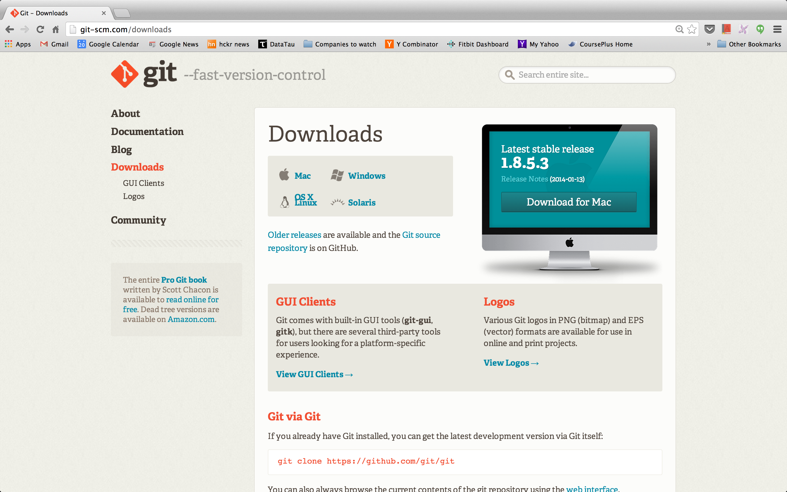
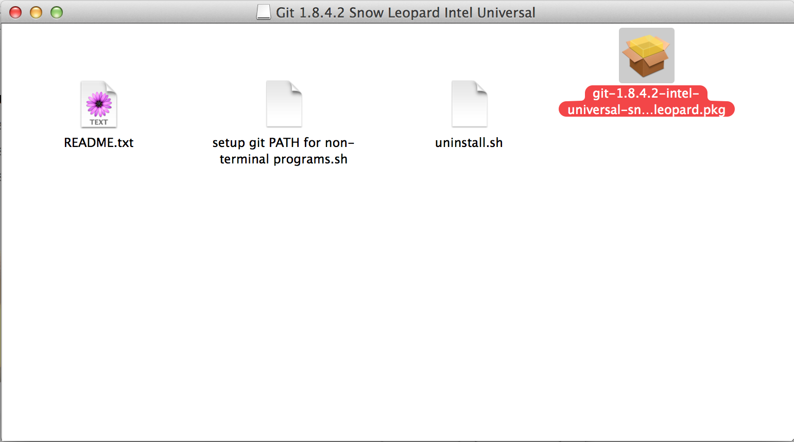
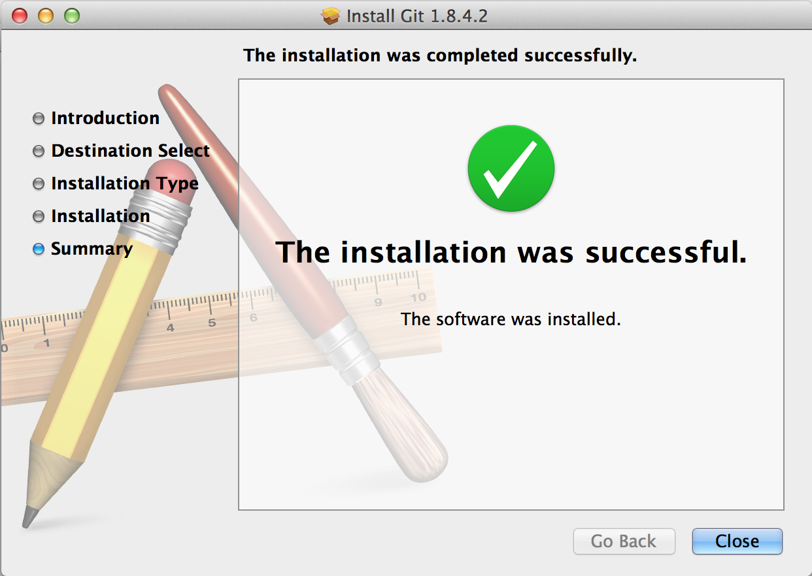
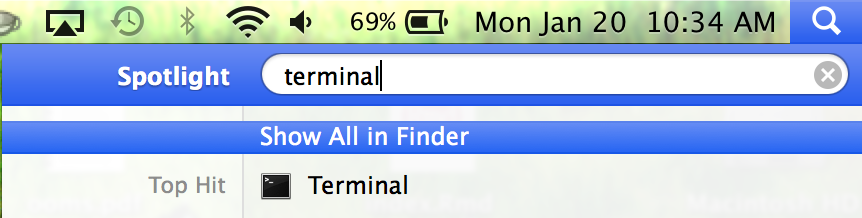
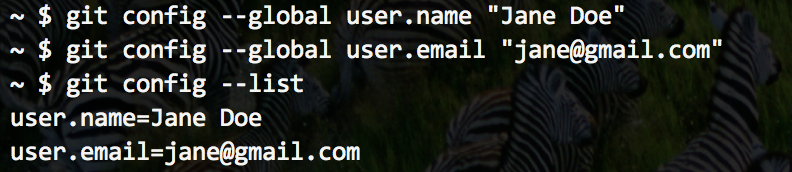

## Download Git

* Go to the following website and click on the Mac download link:

[http://git-scm.com/downloads](http://git-scm.com/downloads)



---

## Install Git

* Once the download is complete, open it up and select the file ending with __.pkg__ to begin the Git installation
* If you get a message saying that the file is from an untrusted source, just ignore it and click the __Open__ button
* If there is no option to __Open__ anyways, hold down the CTRL key, select the same __.pkg__ file, then choose __Open With__ -> __Installer.app__



---

## Install Git

* Unless you really know what you are doing, just go with the default options at each step of the installation

* Once the install is complete, hit the __Close__ button



---

## Open Terminal

* Open the Terminal app on your Mac
* The easiest way to find it is by using Spotlight



---

## Open Terminal

* Once Terminal opens, you'll see a prompt with a dollar sign at the end of it
* It may look a little different from the picture below depending on your setup
* The dollar sign means that it's your turn to type a command


---

## Configure Username and Email

* Each commit to a Git repository will be "tagged" with the username of the person who made the commit
* Enter the following commands in Terminal, one at a time, to set your username and email:

```
$ git config --global user.name "Your Name Here"
$ git config --global user.email "your_email@example.com"
```
* Make sure there are 2 dashes side-by-side before the word "global"
* You'll only have to do this once, but you can always change these down the road using the same commands

---

## Configure Username and Email

* Now type the following to confirm your changes (they may be listed toward the bottom):

```
$ git config --list
```
* Make sure there are 2 separate dashes (side-by-side) before the word "global"



---

## What's Next?

* Go ahead and close Terminal (__command-Q__ by default)

* Now that Git is set up on your computer, we're ready to move on to GitHub, which is a web-based platform that lets you do some pretty cool stuff
* Once GitHub is up and running, we'll show you how to start using these tools to your benefit
