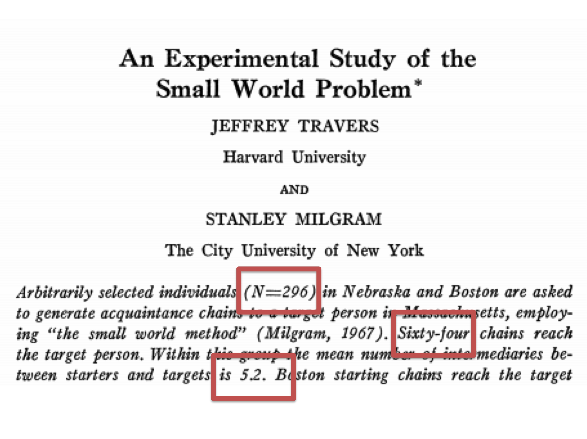
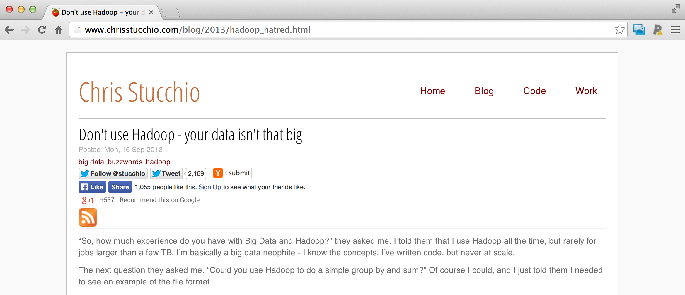

## How much is there?

[http://mashable.com/2011/06/28/data-infographic/](http://mashable.com/2011/06/28/data-infographic/)

---

## So what about big data? 

---

## Depends on your perspective

---

## Why big data now?

[Travers and Milgram (1969) Sociometry](http://www.jstor.org/discover/10.2307/2786545?uid=3739704&uid=2&uid=4&uid=3739256&sid=21101674727517)

---

## Why big data now?

[Leskovec and Horvitz WWW '08](http://arxiv.org/abs/0803.0939)

---

## Big or small - you need the right data

[http://www.chrisstucchio.com/blog/2013/hadoop_hatred.html](http://www.chrisstucchio.com/blog/2013/hadoop_hatred.html)

---

## Big or small - you need the right data

<q>The data may not contain the answer. The combination of some data and an aching desire for an answer does not ensure that a reasonable answer can be extracted from a given body of data... </q> 

[Tukey](http://en.wikipedia.org/wiki/John_Tukey)

---

## Big or small - you need the right data

<q>...no matter how big the data are.</q>

[Leek](http://www1.usu.edu/utahstatetoday/images/mar%2003/JeffLeek.jpg)
