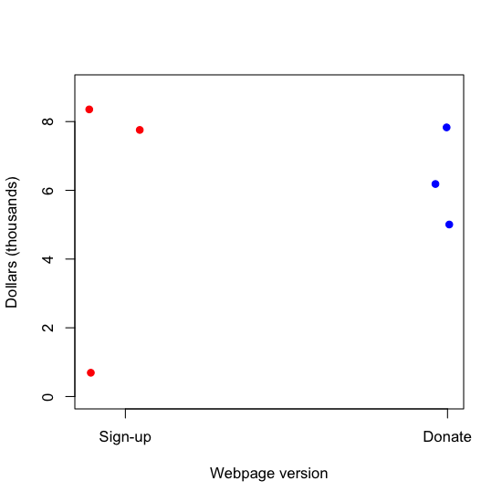
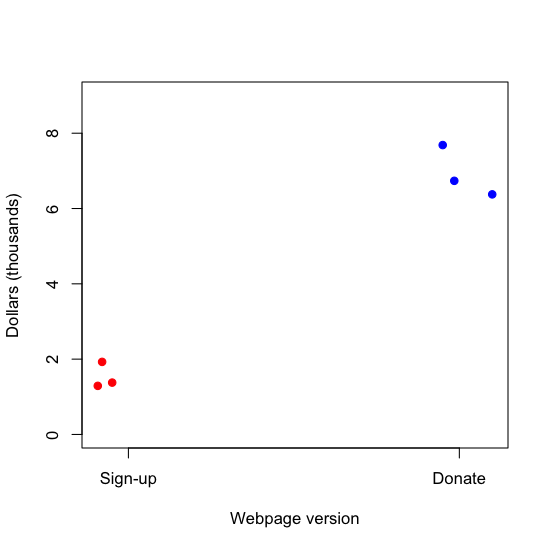

## Why you should care - an exciting result!

[http://www.nature.com/nm/journal/v12/n11/full/nm1491.html](http://www.nature.com/nm/journal/v12/n11/full/nm1491.html
)

---

## Why you should care - uh oh! 

[http://arxiv.org/pdf/1010.1092.pdf](http://arxiv.org/pdf/1010.1092.pdf)

---

## Why you should care - serious trouble

---

## Know and care about the analysis plan!

[http://nsaunders.wordpress.com/2012/07/23/we-really-dont-care-what-statistical-method-you-used/](http://nsaunders.wordpress.com/2012/07/23/we-really-dont-care-what-statistical-method-you-used/)

---

## Have a plan for data and code sharing

[https://github.com/](https://github.com/)

[http://figshare.com/](http://figshare.com/)

---

## May I recommend? 

[https://github.com/jtleek/datasharing](https://github.com/jtleek/datasharing
)

---

## Formulate your question in advance

__Question__: Does changing the text on your website improve donations?

__Experiment__:

1. Randomly show visitors one version or the other
2. Measure how much they donate
3. Determine which is better

[http://www.wired.com/business/2012/04/ff_abtesting](http://www.wired.com/business/2012/04/ff_abtesting)

---

## Statistical inference

[http://www.gs.washington.edu/academics/courses/akey/56008/lecture/lecture2.pdf](http://www.gs.washington.edu/academics/courses/akey/56008/lecture/lecture2.pdf)

---

## Variability - Scenario 1

---

## Variability - Scenario 2

---

## Variability - Scenario 3

---

## Confounding

---

## Correlation is not causation*

[http://www.nejm.org/doi/full/10.1056/NEJMon1211064](http://www.nejm.org/doi/full/10.1056/NEJMon1211064)

_Sometimes called spurious correlation*_

---

## Randomization and blocking

* If you can (and want to) fix a variable
  * Website always says Obama 2014 on it
* If you don't fix a variable, stratify it
  * If you are testing sign up phrases and have two website colors, use both phrases equally on both. 
* If you can't fix a variable, randomize it

---

## Why does randomization help? 

[http://www.gs.washington.edu/academics/courses/akey/56008/lecture/lecture1.pdf](http://www.gs.washington.edu/academics/courses/akey/56008/lecture/lecture1.pdf)

---

## Prediction

----

## Prediction versus inference

[http://www.biostat.jhsph.edu/~iruczins/teaching/140.615/](http://www.biostat.jhsph.edu/~iruczins/teaching/140.615/)

----

## Prediction key quantities

[http://www.biostat.jhsph.edu/~iruczins/teaching/140.615/](http://www.biostat.jhsph.edu/~iruczins/teaching/140.615/)

----

## Beware data dredging

[http://xkcd.com/882/](http://xkcd.com/882/)

----

## Beware data dredging

[http://xkcd.com/882/](http://xkcd.com/882/)

----

## Beware data dredging

[http://xkcd.com/882/](http://xkcd.com/882/)

----

## Summary

* Good experiments
  * Have replication
  * Measure variability
  * Generalize to the problem you care about
  * Are transparent
* Prediction is not inference
  * Both can be important
* Beware data dredging
