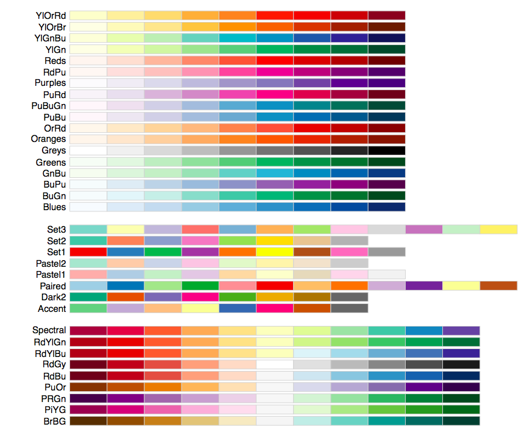
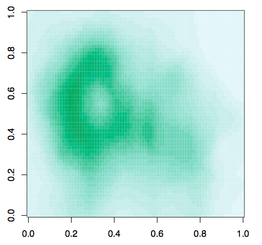
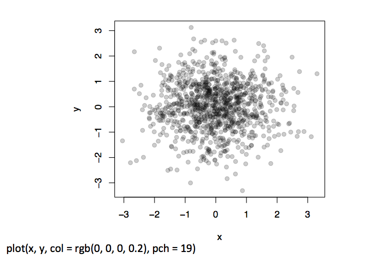

## Plotting and Color
- The default color schemes for most plots in R are horrendous
  - I don’t have good taste and even I know that
- Recently there have been developments to improve the handling/specifica1on of colors in plots/graphs/etc.
- There are functions in R and in external packages that are very handy

---

## Colors 1, 2, and 3


---

## Default Image Plots in R


---

## Color U1li1es in R

- The `grDevices` package has two functions 
  - `colorRamp`
  - `colorRampPalette`
- These functions take palettes of colors and help to interpolate between the colors
- The function colors() lists the names of colors you can use in any plotting function

---

## Color Palette Utilities in R

- `colorRamp`: Take a palette of colors and return a function that takes valeus between 0 and 1, indicating the extremes of the color palette (e.g. see the 'gray' function)
- `colorRampPalette`: Take a palette of colors and return a function that takes integer arguments and returns a vector of colors interpolating the palette (like `heat.colors` or `topo.colors`)

---

## colorRamp

`[,1] [,2] [,3]` corresponds to `[Red] [Blue] [Green]`

```r
> pal <- colorRamp(c("red", "blue"))

> pal(0)
     [,1] [,2] [,3]
[1,]  255    0    0

> pal(1)
     [,1] [,2] [,3]
[1,]    0    0  255

> pal(0.5)
      [,1] [,2]  [,3]
[1,] 127.5    0 127.5
```

---

## colorRamp

```r
> pal(seq(0, 1, len = 10))
                  [,1] [,2]       [,3]
        [1,] 255.00000    0          0
        [2,] 226.66667    0   28.33333
        [3,] 198.33333    0   56.66667
        [4,] 170.00000    0   85.00000
        [5,] 141.66667    0  113.33333
        [6,] 113.33333    0  141.66667
        [7,]  85.00000    0  170.00000
        [8,]  56.66667    0  198.33333
        [9,]  28.33333    0  226.66667
        [10,]  0.00000    0  255.00000
```

---

## colorRampPalette

```r
> pal <- colorRampPalette(c("red", "yellow"))

> pal(2)
[1] "#FF0000" "#FFFF00"

> pal(10)
 [1] "#FF0000" "#FF1C00" "#FF3800" "#FF5500" "#FF7100"
 [6] "#FF8D00" "#FFAA00" "#FFC600" "#FFE200" "#FFFF00”
```

---

## RColorBrewer Package

-  One package on CRAN that contains interes1ng/useful color palettes

- There are 3 types of palettes
  - Sequential
  - Diverging
  - Qualitative
- Palette informa1on can be used in conjunction with the `colorRamp()` and `colorRampPalette()`

---



---

## RColorBrewer and colorRampPalette

```r
> library(RColorBrewer)

> cols <- brewer.pal(3, "BuGn")

> cols
[1] "#E5F5F9" "#99D8C9" "#2CA25F"

> pal <- colorRampPalette(cols)

> image(volcano, col = pal(20))
```

---

## RColorBrewer and colorRampPalette



---

## The smoothScatter function


---

## Some other plotting notes

- The `rgb` function can be used to produce any color via red, green, blue proportions
- Color transparency can be added via the `alpha` parameter to `rgb`
- The `colorspace` package can be used for a different control over colors

---

## Scatterplot with no transparency


---

## Scatterplot with transparency



---

## Summary

- Careful use of colors in plots/maps/etc. can make it easier for the reader to get what you're trying to say (why make it harder?)
- The `RColorBrewer` package is an R package that provides color palettes for sequential, categorical, and diverging data
- The `colorRamp` and `colorRampPalette` functions can be used in conjunction with color palettes to connect data to colors
- Transparency can sometimes be used to clarify plots with many points
