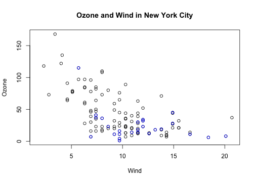
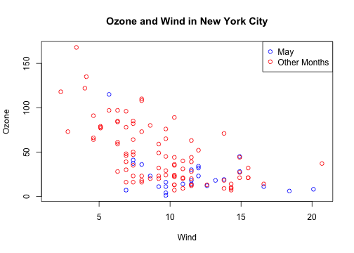

## Plotting System

The core plotting and graphics engine in R is encapsulated in the
following packages:

- *graphics*: contains plotting functions for the "base" graphing
   systems, including `plot`, `hist`, `boxplot` and many others.

- *grDevices*: contains all the code implementing the various graphics
   devices, including X11, PDF, PostScript, PNG, etc.

The lattice plotting system is implemented using the following packages:

- *lattice*: contains code for producing Trellis graphics, which are
   independent of the “base” graphics system; includes functions like
   `xyplot`, `bwplot`, `levelplot`

- *grid*: implements a different graphing system independent of the
   “base” system; the *lattice* package builds on top of *grid*; we
   seldom call functions from the *grid* package directly

---

## The Process of Making a Plot

When making a plot one must first make a few considerations (not
necessarily in this order):

- Where will the plot be made? On the screen? In a file? 

<!--
  - The default in Unix is `x11`; on Windows it is `windows`; on Mac
    OS X it is `quartz`
-->

- How will the plot be used?
  - Is the plot for viewing temporarily on the screen?  
  - Will it be presented in a web browser?
  - Will it eventually end up in a paper that might be printed? 
  - Are you using it in a presentation?

- Is there a large amount of data going into the plot? Or is it just a
  few points?

- Do you need to be able to dynamically resize the graphic?

---

## The Process of Making a Plot

- What graphics system will you use: base, lattice, or ggplot2? These
  generally cannot be mixed.

- Base graphics are usually constructed piecemeal, with each aspect of
  the plot handled separately through a series of function calls; this
  is often conceptually simpler and allows plotting to mirror the
  thought process

- Lattice graphics are usually created in a single function call, so
  all of the graphics parameters have to specified at once; specifying
  everything at once allows R to automatically calculate the necessary
  spacings and font sizes.

- ggplot2 combines concepts from both base and lattice graphics but
  uses an independent implementation

We focus on using the **base plotting system** to create graphics on
the **screen device**.

---

## Base Graphics

Base graphics are used most commonly and are a very powerful system for creating 2-D graphics.

- There are two *phases* to creating a base plot
  - Initializing a new plot
  - Annotating (adding to) an existing plot

- Calling `plot(x, y)` or `hist(x)` will launch a graphics device (if
  one is not already open) and draw a new plot on the device

- If the arguments to `plot` are not of some special class, then the
  _default_ method for `plot` is called; this function has _many_
  arguments, letting you set the title, x axis label, y axis label,
  etc.

- The base graphics system has _many_ parameters that can set and
  tweaked; these parameters are documented in `?par`; it wouldn’t hurt
  to try to memorize this help page!

---

## Simple Base Graphics: Histogram


```r
library(datasets)
hist(airquality$Ozone)  ## Draw a new plot
```

 


---

## Simple Base Graphics: Scatterplot


```r
library(datasets)
with(airquality, plot(Wind, Ozone))
```

 


---

## Simple Base Graphics: Boxplot


```r
library(datasets)
airquality <- transform(airquality, Month = factor(Month))
boxplot(Ozone ~ Month, airquality, xlab = "Month", ylab = "Ozone (ppb)")
```

 

---


## Some Important Base Graphics Parameters

Many base plotting functions share a set of parameters. Here are a few
key ones:

- `pch`: the plotting symbol (default is open circle)

- `lty`: the line type (default is solid line), can be dashed, dotted, etc.

- `lwd`: the line width, specified as an integer multiple

- `col`: the plotting color, specified as a number, string, or hex
  code; the `colors()` function gives you a vector of colors by name

- `xlab`: character string for the x-axis label

- `ylab`: character string for the y-axis label


---

## Some Important Base Graphics Parameters

The `par()` function is used to specify *global* graphics parameters
that affect all plots in an R session. These parameters can be
overridden when specified as arguments to specific plotting functions.

- `las`: the orientation of the axis labels on the plot
- `bg`: the background color
- `mar`: the margin size
- `oma`: the outer margin size (default is 0 for all sides)
- `mfrow`: number of plots per row, column (plots are filled row-wise) 
- `mfcol`: number of plots per row, column (plots are filled column-wise)

---

## Some Important Base Graphics Parameters

Default values for global graphics parameters


```r
par("lty")
```

```
## [1] "solid"
```

```r
par("col")
```

```
## [1] "black"
```

```r
par("pch")
```

```
## [1] 1
```


---

## Some Important Base Graphics Parameters

Default values for global graphics parameters


```r
par("bg")
```

```
## [1] "transparent"
```

```r
par("mar")
```

```
## [1] 5.1 4.1 4.1 2.1
```

```r
par("mfrow")
```

```
## [1] 1 1
```


---

## Base Plotting Functions

- `plot`: make a scatterplot, or other type of plot depending on the
  class of the object being plotted

- `lines`: add lines to a plot, given a vector x values and a
  corresponding vector of y values (or a 2-column matrix); this
  function just connects the dots

- `points`: add points to a plot
- `text`: add text labels to a plot using specified x, y coordinates
- `title`: add annotations to x, y axis labels, title, subtitle, outer margin 
- `mtext`: add arbitrary text to the margins (inner or outer) of the plot 
- `axis`: adding axis ticks/labels

---

## Base Plot with Annotation


```r
library(datasets)
with(airquality, plot(Wind, Ozone))
title(main = "Ozone and Wind in New York City")  ## Add a title
```

 


---

## Base Plot with Annotation


```r
with(airquality, plot(Wind, Ozone, main = "Ozone and Wind in New York City"))
with(subset(airquality, Month == 5), points(Wind, Ozone, col = "blue"))
```

 


---

## Base Plot with Annotation


```r
with(airquality, plot(Wind, Ozone, main = "Ozone and Wind in New York City", 
    type = "n"))
with(subset(airquality, Month == 5), points(Wind, Ozone, col = "blue"))
with(subset(airquality, Month != 5), points(Wind, Ozone, col = "red"))
legend("topright", pch = 1, col = c("blue", "red"), legend = c("May", "Other Months"))
```

 


---

## Base Plot with Regression Line


```r
with(airquality, plot(Wind, Ozone, main = "Ozone and Wind in New York City", 
    pch = 20))
model <- lm(Ozone ~ Wind, airquality)
abline(model, lwd = 2)
```

 


---

## Multiple Base Plots


```r
par(mfrow = c(1, 2))
with(airquality, {
    plot(Wind, Ozone, main = "Ozone and Wind")
    plot(Solar.R, Ozone, main = "Ozone and Solar Radiation")
})
```

 


---

## Multiple Base Plots


```r
par(mfrow = c(1, 3), mar = c(4, 4, 2, 1), oma = c(0, 0, 2, 0))
with(airquality, {
    plot(Wind, Ozone, main = "Ozone and Wind")
    plot(Solar.R, Ozone, main = "Ozone and Solar Radiation")
    plot(Temp, Ozone, main = "Ozone and Temperature")
    mtext("Ozone and Weather in New York City", outer = TRUE)
})
```

 


---

## Summary

* Plots in the base plotting system are created by calling successive
  R functions to "build up" a plot

* Plotting occurs in two stages:
  - Creation of a plot
  - Annotation of a plot (adding lines, points, text, legends)

* The base plotting system is very flexible and offers a high degree
  of control over plotting
