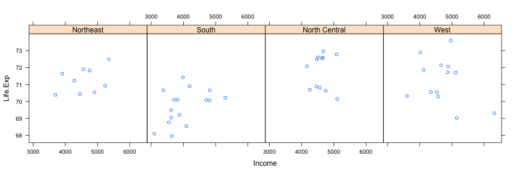
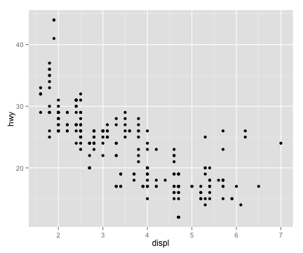

## The Base Plotting System

* "Artist's palette" model
* Start with blank canvas and build up from there
* Start with plot function (or similar)

* Use annotation functions to add/modify (`text`, `lines`, `points`,
  `axis`)

---

## The Base Plotting System

* Convenient, mirrors how we think of building plots and analyzing data

* Can’t go back once plot has started (i.e. to adjust margins); need
  to plan in advance

* Difficult to "translate" to others once a new plot has been created
  (no graphical "language")

* Plot is just a series of R commands

---

## Base Plot


```r
library(datasets)
data(cars)
with(cars, plot(speed, dist))
```

 


---

## The Lattice System

* Plots are created with a single function call (`xyplot`, `bwplot`,
etc.)

* Most useful for conditioning types of plots: Looking at how y changes with x across levels of z

* Things like margins/spacing set automatically because entire plot is
  specified at once

*  Good for puttng many many plots on a screen

---

## The Lattice System

* Sometimes awkward to specify an entire plot in a single function call

* Annotation in plot is not especially intuitive

* Use of panel functions and subscripts difficult to wield and
  requires intense preparation

* Cannot "add" to the plot once it is created

---

## Lattice Plot


```r
library(lattice)
state <- data.frame(state.x77, region = state.region)
xyplot(Life.Exp ~ Income | region, data = state, layout = c(4, 1))
```

 


---

## The ggplot2 System

* Splits the difference between base and lattice in a number of ways

* Automatically deals with spacings, text, titles but also allows you
  to annotate by "adding" to a plot

* Superficial similarity to lattice but generally easier/more
  intuitive to use

* Default mode makes many choices for you (but you can still customize
  to your heart's desire)


---

## ggplot2 Plot


```r
library(ggplot2)
data(mpg)
qplot(displ, hwy, data = mpg)
```

 


---

## Summary

* Base: "artist's palette" model

* Lattice: Entire plot specified by one function; conditioning

* ggplot2: Mixes elements of Base and Lattice

---

## References

Paul Murrell (2011). *R Graphics*, CRC Press.

Hadley Wickham (2009). *ggplot2*, Springer.
