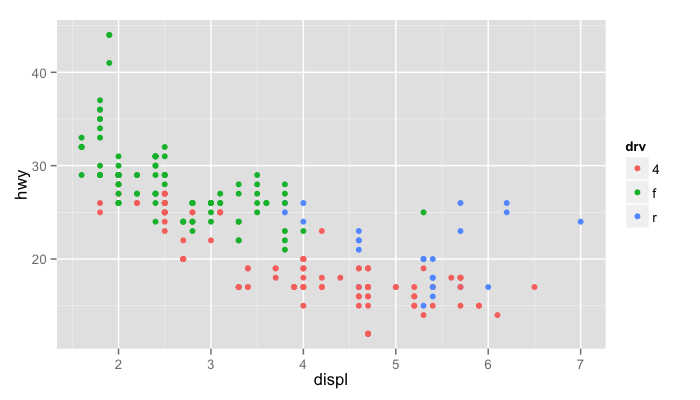
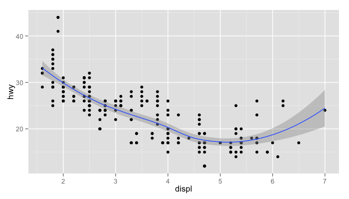
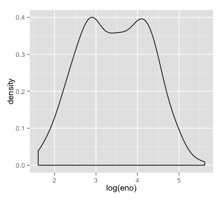
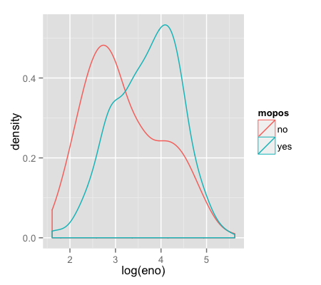
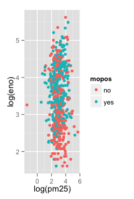
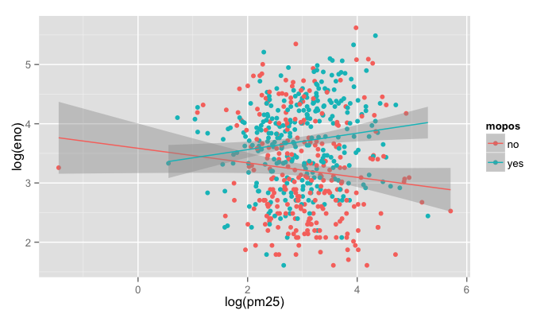
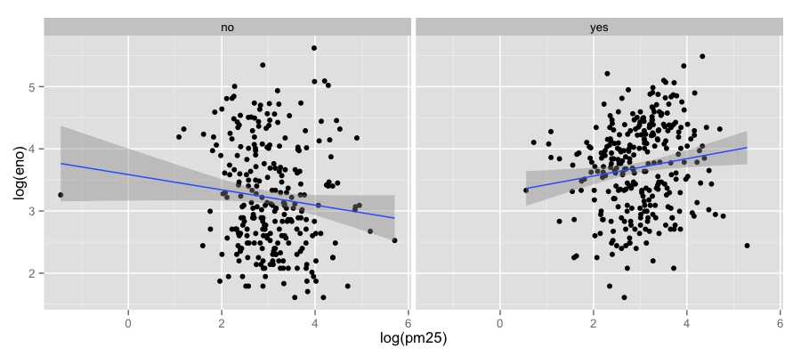

## What is ggplot2?

- An implementation of _The Grammar of Graphics_ by Leland Wilkinson
- Written by Hadley Wickham (while he was a graduate student at Iowa State)
- A “third” graphics system for R (along with __base__ and __lattice__)
- Available from CRAN via `install.packages()`
- Web site: http://ggplot2.org (better documentation)

---

## What is ggplot2?

- Grammar of graphics represents an abstraction of graphics ideas/objects
- Think “verb”, “noun”, “adjective” for graphics
- Allows for a “theory” of graphics on which to build new graphics and graphics objects
- “Shorten the distance from mind to page”

---

## Grammer of Graphics

### “In brief, the grammar tells us that a statistical graphic is a __mapping__ from data to __aesthetic__ attributes (colour, shape, size) of __geometric__ objects (points, lines, bars). The plot may also contain statistical transformations of the data and is drawn on a specific coordinate system”

- from _ggplot2_ book

---

## Plotting Systems in R: Base

- “Artist’s palette” model
- Start with blank canvas and build up from there
- Start with `plot` function (or similar)
- Use annotation functions to add/modify (`text`, `lines`, `points`, `axis`)

---

## Plotting Systems in R: Base

- Convenient, mirrors how we think of building plots and analyzing data
- Can’t go back once plot has started (i.e. to adjust margins); need to plan in advance
- Difficult to “translate” to others once a new plot has been created (no graphical “language”)
  - Plot is just a series of R commands

---

## Plotting Systems in R: Lattice

- Plots are created with a single function call (`xyplot`, `bwplot`, etc.)
- Most useful for conditioning types of plots: Looking at how $y$ changes with $x$ across levels of $z$
- Things like margins/spacing set automatically because entire plot is specified at once
- Good for putting many many plots on a screen

---

## Plotting Systems in R: Lattice

- Sometimes awkward to specify an entire plot in a single function call
- Annotation in plot is not intuitive
- Use of panel functions and subscripts difficult to wield and requires intense preparation
- Cannot “add” to the plot once it’s created

---

## Plotting Systems in R: ggplot2

- Split the difference between base and lattice
- Automatically deals with spacings, text, titles but also allows you to annotate by “adding”
- Superficial similarity to lattice but generally easier/more intuitive to use
- Default mode makes many choices for you (but you _can_ customize!)

---

## The Basics: `qplot()`

- Works much like the `plot` function in base graphics system
- Looks for data in a data frame, similar to lattice, or in the parent environment
- Plots are made up of _aesthetics_ (size, shape, color) and _geoms_ (points, lines)

---

## The Basics: `qplot()`

- Factors are important for indicating subsets of the data (if they are to have different properties); they should be __labeled__
- The `qplot()` hides what goes on underneath, which is okay for most operations
- `ggplot()` is the core function and very flexible for doing things `qplot()` cannot do

---

## Example Dataset


```r
library(ggplot2)
str(mpg)
```

```
'data.frame':	234 obs. of  11 variables:
 $ manufacturer: Factor w/ 15 levels "audi","chevrolet",..: 1 1 1 1 1 1 1 1 1 1 ...
 $ model       : Factor w/ 38 levels "4runner 4wd",..: 2 2 2 2 2 2 2 3 3 3 ...
 $ displ       : num  1.8 1.8 2 2 2.8 2.8 3.1 1.8 1.8 2 ...
 $ year        : int  1999 1999 2008 2008 1999 1999 2008 1999 1999 2008 ...
 $ cyl         : int  4 4 4 4 6 6 6 4 4 4 ...
 $ trans       : Factor w/ 10 levels "auto(av)","auto(l3)",..: 4 9 10 1 4 9 1 9 4 10 ...
 $ drv         : Factor w/ 3 levels "4","f","r": 2 2 2 2 2 2 2 1 1 1 ...
 $ cty         : int  18 21 20 21 16 18 18 18 16 20 ...
 $ hwy         : int  29 29 31 30 26 26 27 26 25 28 ...
 $ fl          : Factor w/ 5 levels "c","d","e","p",..: 4 4 4 4 4 4 4 4 4 4 ...
 $ class       : Factor w/ 7 levels "2seater","compact",..: 2 2 2 2 2 2 2 2 2 2 ...
```


---

## ggplot2 “Hello, world!”


```r
qplot(displ, hwy, data = mpg)
```

<div class="rimage center"></div>


---

## Modifying aesthetics


```r
qplot(displ, hwy, data = mpg, color = drv)
```

<div class="rimage center"></div>


---

## Adding a geom


```r
qplot(displ, hwy, data = mpg, geom = c("point", "smooth"))
```

<div class="rimage center"></div>


---

## Histograms


```r
qplot(hwy, data = mpg, fill = drv)
```

<div class="rimage center"></div>


---

## Facets


```r
qplot(displ, hwy, data = mpg, facets = . ~ drv)
qplot(hwy, data = mpg, facets = drv ~ ., binwidth = 2)
```

<div class="rimage center">
</div>


---

## MAACS Cohort

- Mouse Allergen and Asthma Cohort Study
- Baltimore children (aged 5—17)
- Persistent asthma, exacerbation in past year
- Study indoor environment and its relationship with asthma morbidity
- Recent publication: http://goo.gl/WqE9j8


---

## Example: MAACS


```r
str(maacs)
```

```
'data.frame':	750 obs. of  5 variables:
 $ id       : int  1 2 3 4 5 6 7 8 9 10 ...
 $ eno      : num  141 124 126 164 99 68 41 50 12 30 ...
 $ duBedMusM: num  2423 2793 3055 775 1634 ...
 $ pm25     : num  15.6 34.4 39 33.2 27.1 ...
 $ mopos    : Factor w/ 2 levels "no","yes": 2 2 2 2 2 2 2 2 2 2 ...
```


---

## Histogram of eNO


```r
qplot(log(eno), data = maacs)
```

<div class="rimage center"></div>


---

## Histogram by Group


```r
qplot(log(eno), data = maacs, fill = mopos)
```

<div class="rimage center"></div>


---

## Density Smooth


```r
qplot(log(eno), data = maacs, geom = "density")
qplot(log(eno), data = maacs, geom = "density", color = mopos)
```

<div class="rimage center">
</div>


---

## Scatterplots: eNO vs. PM$_{2.5}$


```r
qplot(log(pm25), log(eno), data = maacs)
qplot(log(pm25), log(eno), data = maacs, shape = mopos)
qplot(log(pm25), log(eno), data = maacs, color = mopos)
```

<div class="rimage center">

</div>


---

## Scatterplots: eNO vs. PM$_{2.5}$


```r
qplot(log(pm25), log(eno), data = maacs, color = mopos, 
      geom = c("point", "smooth"), method = "lm")
```

<div class="rimage center"></div>


---

## Scatterplots: eNO vs. PM$_{2.5}$


```r
qplot(log(pm25), log(eno), data = maacs, geom = c("point", "smooth"), 
      method = "lm", facets = . ~ mopos)
```

<div class="rimage center"></div>


---

## Summary of qplot()

- The `qplot()` function is the analog to `plot()` but with many built-in features
- Syntax somewhere in between base/lattice
- Produces very nice graphics, essentially publication ready (if you like the design)
- Difficult to go against the grain/customize (don’t bother; use full ggplot2 power in that case)

---

## Resources

- The _ggplot2_ book by Hadley Wickham
- The _R Graphics Cookbook_ by Winston Chang (examples in base plots and in ggplot2)
- ggplot2 web site (http://ggplot2.org)
- ggplot2 mailing list (http://goo.gl/OdW3uB), primarily for developers
