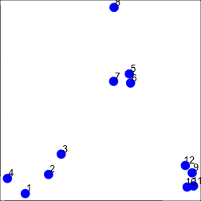
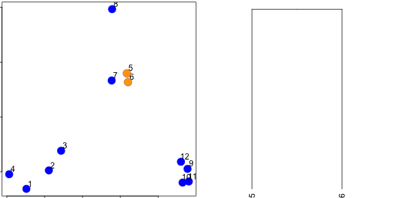
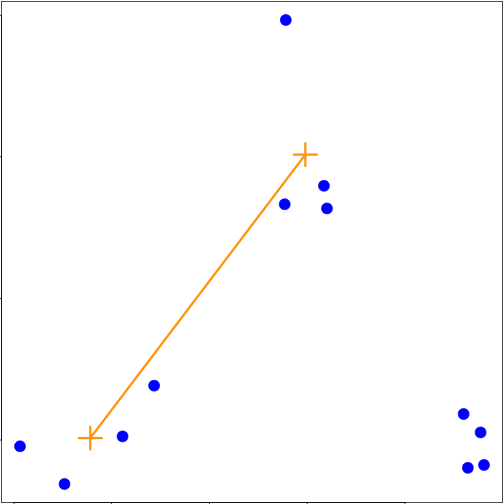
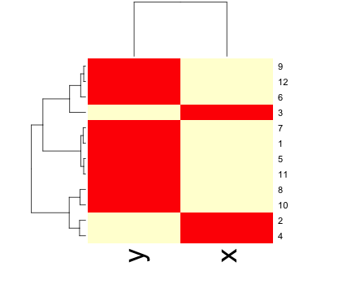

## Can we find things that are close together? 

Clustering organizes things that are __close__ into groups


* How do we define close?
* How do we group things?
* How do we visualize the grouping? 
* How do we interpret the grouping? 

---

## Hugely important/impactful


[http://scholar.google.com/scholar?hl=en&q=cluster+analysis&btnG=&as_sdt=1%2C21&as_sdtp=](http://scholar.google.com/scholar?hl=en&q=cluster+analysis&btnG=&as_sdt=1%2C21&as_sdtp=)

---

## Hierarchical clustering

* An agglomerative approach
  * Find closest two things
  * Put them together
  * Find next closest
* Requires
  * A defined distance
  * A merging approach
* Produces
  * A tree showing how close things are to each other


---


## How do we define close?

* Most important step
  * Garbage in -> garbage out
* Distance or similarity
  * Continuous - euclidean distance
  * Continuous - correlation similarity
  * Binary - manhattan distance
* Pick a distance/similarity that makes sense for your problem
  
  

---

## Example distances - Euclidean


[http://rafalab.jhsph.edu/688/lec/lecture5-clustering.pdf](http://rafalab.jhsph.edu/688/lec/lecture5-clustering.pdf)


---

## Example distances - Euclidean


In general:

$$\sqrt{(A_1-A_2)^2 + (B_1-B_2)^2 + \ldots + (Z_1-Z_2)^2}$$
[http://rafalab.jhsph.edu/688/lec/lecture5-clustering.pdf](http://rafalab.jhsph.edu/688/lec/lecture5-clustering.pdf)


---

## Example distances - Manhattan


In general:

$$|A_1-A_2| + |B_1-B_2| + \ldots + |Z_1-Z_2|$$

[http://en.wikipedia.org/wiki/Taxicab_geometry](http://en.wikipedia.org/wiki/Taxicab_geometry)


---

## Hierarchical clustering - example


```r
set.seed(1234)
par(mar = c(0, 0, 0, 0))
x <- rnorm(12, mean = rep(1:3, each = 4), sd = 0.2)
y <- rnorm(12, mean = rep(c(1, 2, 1), each = 4), sd = 0.2)
plot(x, y, col = "blue", pch = 19, cex = 2)
text(x + 0.05, y + 0.05, labels = as.character(1:12))
```

 


---

## Hierarchical clustering - `dist`

* Important parameters: _x_,_method_

```r
dataFrame <- data.frame(x = x, y = y)
dist(dataFrame)
```

```
##          1       2       3       4       5       6       7       8       9
## 2  0.34121                                                                
## 3  0.57494 0.24103                                                        
## 4  0.26382 0.52579 0.71862                                                
## 5  1.69425 1.35818 1.11953 1.80667                                        
## 6  1.65813 1.31960 1.08339 1.78081 0.08150                                
## 7  1.49823 1.16621 0.92569 1.60132 0.21110 0.21667                        
## 8  1.99149 1.69093 1.45649 2.02849 0.61704 0.69792 0.65063                
## 9  2.13630 1.83168 1.67836 2.35676 1.18350 1.11500 1.28583 1.76461        
## 10 2.06420 1.76999 1.63110 2.29239 1.23848 1.16550 1.32063 1.83518 0.14090
## 11 2.14702 1.85183 1.71074 2.37462 1.28154 1.21077 1.37370 1.86999 0.11624
## 12 2.05664 1.74663 1.58659 2.27232 1.07701 1.00777 1.17740 1.66224 0.10849
##         10      11
## 2                 
## 3                 
## 4                 
## 5                 
## 6                 
## 7                 
## 8                 
## 9                 
## 10                
## 11 0.08318        
## 12 0.19129 0.20803
```


---

## Hierarchical clustering - #1

 


---

## Hierarchical clustering - #2

 


---

## Hierarchical clustering - #3

 


---

## Hierarchical clustering - hclust


```r
dataFrame <- data.frame(x = x, y = y)
distxy <- dist(dataFrame)
hClustering <- hclust(distxy)
plot(hClustering)
```

 


---

## Prettier dendrograms


```r
myplclust <- function(hclust, lab = hclust$labels, lab.col = rep(1, length(hclust$labels)), 
    hang = 0.1, ...) {
    ## modifiction of plclust for plotting hclust objects *in colour*!  Copyright
    ## Eva KF Chan 2009 Arguments: hclust: hclust object lab: a character vector
    ## of labels of the leaves of the tree lab.col: colour for the labels;
    ## NA=default device foreground colour hang: as in hclust & plclust Side
    ## effect: A display of hierarchical cluster with coloured leaf labels.
    y <- rep(hclust$height, 2)
    x <- as.numeric(hclust$merge)
    y <- y[which(x < 0)]
    x <- x[which(x < 0)]
    x <- abs(x)
    y <- y[order(x)]
    x <- x[order(x)]
    plot(hclust, labels = FALSE, hang = hang, ...)
    text(x = x, y = y[hclust$order] - (max(hclust$height) * hang), labels = lab[hclust$order], 
        col = lab.col[hclust$order], srt = 90, adj = c(1, 0.5), xpd = NA, ...)
}
```


---

## Pretty dendrograms


```r
dataFrame <- data.frame(x = x, y = y)
distxy <- dist(dataFrame)
hClustering <- hclust(distxy)
myplclust(hClustering, lab = rep(1:3, each = 4), lab.col = rep(1:3, each = 4))
```

 


---

## Even Prettier dendrograms


[http://gallery.r-enthusiasts.com/RGraphGallery.php?graph=79](http://gallery.r-enthusiasts.com/RGraphGallery.php?graph=79)


---

## Merging points - complete

 


---

## Merging points - average

 


---

## `heatmap()`


```r
dataFrame <- data.frame(x = x, y = y)
set.seed(143)
dataMatrix <- as.matrix(dataFrame)[sample(1:12), ]
heatmap(dataMatrix)
```

 


---

## Notes and further resources

* Gives an idea of the relationships between variables/observations
* The picture may be unstable
  * Change a few points
  * Have different missing values
  * Pick a different distance
  * Change the merging strategy
  * Change the scale of points for one variable
* But it is deterministic
* Choosing where to cut isn't always obvious
* Should be primarily used for exploration 
* [Rafa's Distances and Clustering Video](http://www.youtube.com/watch?v=wQhVWUcXM0A)
* [Elements of statistical learning](http://www-stat.stanford.edu/~tibs/ElemStatLearn/)


