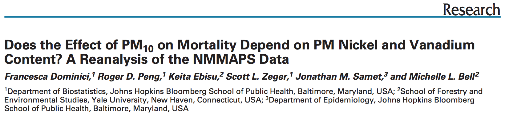

## What Causes PM to be Toxic?

- PM is composed of many different chemical elements

- Some components of PM may be more harmful than others 

- Some sources of PM may be more dangerous than others

- Identifying harmful chemical constituents may lead us to strategies
  for controlling sources of PM

---

## NMMAPS

- The National Morbidity, Mortality, and Air Pollution Study (NMMAPS)
  was a national study of the short-term health effects of ambient air
  pollution

- Focused primarily on particulate matter ($PM_{10}$) and ozone ($O_3$)

- Health outcomes included mortality from all causes and
  hospitalizations for cardiovascular and respiratory diseases

- Key publications
  - http://www.ncbi.nlm.nih.gov/pubmed/11098531
  - http://www.ncbi.nlm.nih.gov/pubmed/11354823

- Funded by the [Health Effects
  Institute](http://www.healtheffects.org) 

  - Roger Peng currently serves on the Health Effects Institute Health
  Review Committee

---

## What Causes Particulate Matter to be Toxic?

<http://www.ncbi.nlm.nih.gov/pmc/articles/PMC1665439/>

- Lippmann et al. found strong evidence that Ni and V modified
  the short-term effect of $PM_{10}$ across 60 US communities

- No other PM chemical constituent seemed to have the same modifying
  effect

---

## A Reanalysis

---

## Lessons Learned

