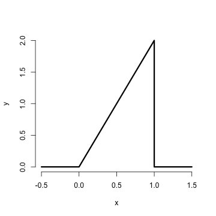
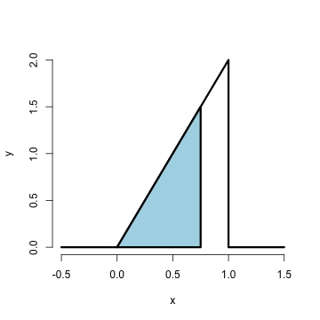

## Probability

- In these slides we will cover the basics of probability at low enough level
to have a basic understanding for the rest of the series
- For a more complete treatment see the class Mathematical Biostatistics Boot Camp 1
    - Youtube: www.youtube.com/playlist?list=PLpl-gQkQivXhk6qSyiNj51qamjAtZISJ-
    - Coursera: www.coursera.org/course/biostats
    - Git: http://github.com/bcaffo/Caffo-Coursera


---

## Probability

Given a random experiment (say rolling a die) a probability measure is a population quantity
that summarizes the randomness.

Specifically, probability takes a possible outcome from the expertiment and:

- assigns it a number between 0 and 1 
- so that the probability that something occurs is 1 (the die must be rolled)
and 
- so that the probability of the union of any two sets of outcomes that have nothing in common (mutually exclusive)
is the sum of their respective probabilities.


The Russian mathematician Kolmogorov formalized these rules.

---


## Rules probability must follow

- The probability that nothing occurs is 0
- The probability that something occurs is 1
- The probability of something is 1 minus the probability that the opposite occurs
- The probability of at least one of 
    two (or more) things that can not simultaneously occur (mutually exclusive) 
    is the sum of their
    respective probabilities
- If an event A implies the occurrence of event B, then the probability of A
occurring is less than the probability that B occurs
- For any two events the probability that at least one occurs is the sum of their
    probabilities minus their intersection.

---

## Example

The National Sleep Foundation ([www.sleepfoundation.org](http://www.sleepfoundation.org/)) reports that around 3% of the American population has sleep apnea. They also report that around 10% of the North American and European population has restless leg syndrome. Does this imply that 13% of people will have at least one sleep problems of these sorts?

---

## Example continued

Answer: No, the events can simultaneously occur and so 
are not mutually exclusive. To elaborate let:

---
## If you want to see the mathematics

$$
\begin{eqnarray*}
    A_1 & = & \{\mbox{Person has sleep apnea}\} \\
    A_2 & = & \{\mbox{Person has RLS}\} 
  \end{eqnarray*}
$$

Then 

$$
\begin{eqnarray*}
    P(A_1 \cup A_2 ) & = & P(A_1) + P(A_2) - P(A_1 \cap A_2) \\
   & = & 0.13 - \mbox{Probability of having both}
  \end{eqnarray*}
$$
Likely, some fraction of the population has both.

---
## Going further

Probability calculus is useful for understanding the rules that probabilities
must follow. 

However, we need ways to model and think about probabilities for
numeric outcomes of experiments (broadly defined). 

Densities and mass functions for random variables are the best starting point for this.

Remember, everything we're talking about up to at this point is a population quantity 
not a statement about what occurs in the data.  
- We're going with this is: use the data to estimate properties of the population.

---
## Random variables

- A **random variable** is a numerical outcome of an experiment.
- The random variables that we study will come in two varieties,
  **discrete** or **continuous**.
- Discrete random variable are random variables that take on only a
countable number of possibilities and we talk about the probability that they
take specific values
- Continuous random variable can conceptually take any value on the real line or some subset of the real line and we talk about the probability that they line within
some range

---

## Examples of variables that can be thought of as random variables

Experiments that we use for intuition and building context
- The $(0-1)$ outcome of the flip of a coin
- The outcome from the roll of a die

Specific instances of treating variables as if random
- The web site traffic on a given day
- The BMI of a subject four years after a baseline measurement
- The hypertension status of a subject randomly drawn from a population
- The number of people who click on an ad 
- Intelligence quotients for a sample of children

---

## PMF

A probability mass function evaluated at a value corresponds to the
probability that a random variable takes that value. To be a valid
pmf a function, $p$, must satisfy

  1. It must always be larger than or equal to 0.
  2. The sum of the possible values that the random variable can take has to add up to one.

---

## Example

Let $X$ be the result of a coin flip where $X=0$ represents
tails and $X = 1$ represents heads.
$$
p(x) = (1/2)^{x} (1/2)^{1-x} ~~\mbox{ for }~~x = 0,1
$$
Suppose that we do not know whether or not the coin is fair; Let
$\theta$ be the probability of a head expressed as a proportion
(between 0 and 1).
$$
p(x) = \theta^{x} (1 - \theta)^{1-x} ~~\mbox{ for }~~x = 0,1
$$

---

## PDF

A probability density function (pdf), is a function associated with
a continuous random variable 

  *Areas under pdfs correspond to probabilities for that random variable*

To be a valid pdf, a function must satisfy

1. It must be larger than or equal to zero everywhere.

2. The total area under it must be one.

---
## Example

Suppose that the proportion of help calls that get addressed in
a random day by a help line is given by
$$
f(x) = \left\{\begin{array}{ll}
    2 x & \mbox{ for }& 0< x < 1 \\
    0                 & \mbox{ otherwise} 
\end{array} \right. 
$$

Is this a mathematically valid density?

---


```r
x <- c(-0.5, 0, 1, 1, 1.5)
y <- c(0, 0, 2, 0, 0)
plot(x, y, lwd = 3, frame = FALSE, type = "l")
```




---

## Example continued

What is the probability that 75% or fewer of calls get addressed?




---

```r
1.5 * 0.75/2
```

```
## [1] 0.5625
```

```r
pbeta(0.75, 2, 1)
```

```
## [1] 0.5625
```

---

## CDF and survival function
### Certain areas are so useful, we give them names

- The **cumulative distribution function** (CDF) of a random variable, $X$, returns the probability that the random variable is less than or equal to the value $x$
$$
F(x) = P(X \leq x)
$$
(This definition applies regardless of whether $X$ is discrete or continuous.)
- The **survival function** of a random variable $X$ is defined as the probability
that the random variable is greater than the value $x$
$$
S(x) = P(X > x)
$$
- Notice that $S(x) = 1 - F(x)$

---

## Example

What are the survival function and CDF from the density considered before?

For $1 \geq x \geq 0$
$$
F(x) = P(X \leq x) = \frac{1}{2} Base \times Height = \frac{1}{2} (x) \times (2 x) = x^2
$$

$$
S(x) = 1 - x^2
$$


```r
pbeta(c(0.4, 0.5, 0.6), 2, 1)
```

```
## [1] 0.16 0.25 0.36
```


---

## Quantiles

You've heard of sample quantiles. If you were the 95th percentile on an exam, you know
that 95% of people scored worse than you and 5% scored better. 
These are sample quantities. Here we define their population analogs.


---
## Definition

The  $\alpha^{th}$ **quantile** of a distribution with distribution function $F$ is the point $x_\alpha$ so that
$$
F(x_\alpha) = \alpha
$$
- A **percentile** is simply a quantile with $\alpha$ expressed as a percent
- The **median** is the $50^{th}$ percentile

---
## For example

The $95^{th}$ percentile of a distribution is the point so that:
- the probability that a random variable drawn from the population is less is 95%
- the probability that a random variable drawn from the population is more is 5%

---
## Example
What is the median of the distribution that we were working with before?
- We want to solve $0.5 = F(x) = x^2$
- Resulting in the solution 

```r
sqrt(0.5)
```

```
## [1] 0.7071
```

- Therefore, about 0.7071 of calls being answered on a random day is the median.

---
## Example continued
R can approximate quantiles for you for common distributions


```r
qbeta(0.5, 2, 1)
```

```
## [1] 0.7071
```


---

## Summary

- You might be wondering at this point "I've heard of a median before, it didn't require integration. Where's the data?"
- We're referring to are **population quantities**. Therefore, the median being
  discussed is the **population median**.
- A probability model connects the data to the population using assumptions.
- Therefore the median we're discussing is the **estimand**, the sample median will be the **estimator**


