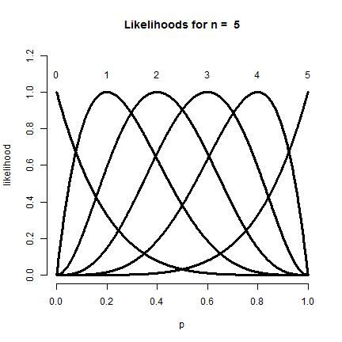
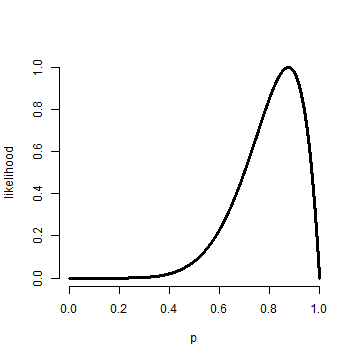
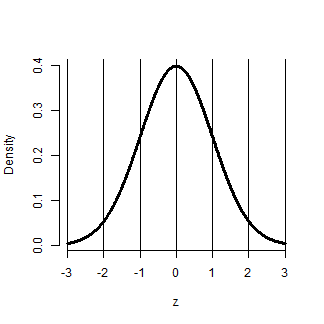

## The Bernoulli distribution

- The **Bernoulli distribution** arises as the result of a binary outcome
- Bernoulli random variables take (only) the values 1 and 0 with probabilities of (say) $p$ and $1-p$ respectively
- The PMF for a Bernoulli random variable $X$ is $$P(X = x) =  p^x (1 - p)^{1 - x}$$
- The mean of a Bernoulli random variable is $p$ and the variance is $p(1 - p)$
- If we let $X$ be a Bernoulli random variable, it is typical to call $X=1$ as a "success" and $X=0$ as a "failure"

---

## iid Bernoulli trials

- If several iid Bernoulli observations, say $x_1,\ldots, x_n$, are observed the
likelihood is 
$$
  \prod_{i=1}^n p^{x_i} (1 - p)^{1 - x_i} = p^{\sum x_i} (1 - p)^{n - \sum x_i}
$$
- Notice that the likelihood depends only on the sum of the $x_i$
- Because $n$ is fixed and assumed known, this implies that the sample proportion $\sum_i x_i / n$ contains all of the relevant information about $p$
- We can maximize the Bernoulli likelihood over $p$ to obtain that $\hat p = \sum_i x_i / n$ is the maximum likelihood estimator for $p$

---
## Plotting all possible likelihoods for a small n
```
n <- 5
pvals <- seq(0, 1, length = 1000)
plot(c(0, 1), c(0, 1.2), type = "n", frame = FALSE, xlab = "p", ylab = "likelihood")
text((0 : n) /n, 1.1, as.character(0 : n))
sapply(0 : n, function(x) {
  phat <- x / n
  if (x == 0) lines(pvals,  ( (1 - pvals) / (1 - phat) )^(n-x), lwd = 3)
  else if (x == n) lines(pvals, (pvals / phat) ^ x, lwd = 3)
  else lines(pvals, (pvals / phat ) ^ x * ( (1 - pvals) / (1 - phat) ) ^ (n-x), lwd = 3) 
  }
)
title(paste("Likelihoods for n = ", n))
```

---
 


---

## Binomial trials

- The *binomial random variables* are obtained as the sum of iid Bernoulli trials
- In specific, let $X_1,\ldots,X_n$ be iid Bernoulli$(p)$; then $X = \sum_{i=1}^n X_i$ is a binomial random variable
- The binomial mass function is
$$
P(X = x) = 
\left(
\begin{array}{c}
  n \\ x
\end{array}
\right)
p^x(1 - p)^{n-x}
$$
for $x=0,\ldots,n$

---

## Choose

- Recall that the notation 
  $$\left(
    \begin{array}{c}
      n \\ x
    \end{array}
  \right) = \frac{n!}{x!(n-x)!}
  $$ (read "$n$ choose $x$") counts the number of ways of selecting $x$ items out of $n$
  without replacement disregarding the order of the items

$$\left(
    \begin{array}{c}
      n \\ 0
    \end{array}
  \right) =
\left(
    \begin{array}{c}
      n \\ n
    \end{array}
  \right) =  1
  $$ 

---

## Example justification of the binomial likelihood

- Consider the probability of getting $6$ heads out of $10$ coin flips from a coin with success probability $p$ 
- The probability of getting $6$ heads and $4$ tails in any specific order is
  $$
  p^6(1-p)^4
  $$
- There are 
$$\left(
\begin{array}{c}
  10 \\ 6
\end{array}
\right)
$$
possible orders of $6$ heads and $4$ tails

---

## Example

- Suppose a friend has $8$ children (oh my!), $7$ of which are girls and none are twins
- If each gender has an independent $50$% probability for each birth, what's the probability of getting $7$ or more girls out of $8$ births?
$$\left(
\begin{array}{c}
  8 \\ 7
\end{array}
\right) .5^{7}(1-.5)^{1}
+
\left(
\begin{array}{c}
  8 \\ 8
\end{array}
\right) .5^{8}(1-.5)^{0} \approx 0.04
$$

```r
choose(8, 7) * 0.5^8 + choose(8, 8) * 0.5^8
```

```
## [1] 0.03516
```

```r
pbinom(6, size = 8, prob = 0.5, lower.tail = FALSE)
```

```
## [1] 0.03516
```


---

```r
plot(pvals, dbinom(7, 8, pvals)/dbinom(7, 8, 7/8), lwd = 3, frame = FALSE, type = "l", 
    xlab = "p", ylab = "likelihood")
```

 


---

## The normal distribution

- A random variable is said to follow a **normal** or **Gaussian** distribution with mean $\mu$ and variance $\sigma^2$ if the associated density is
  $$
  (2\pi \sigma^2)^{-1/2}e^{-(x - \mu)^2/2\sigma^2}
  $$
  If $X$ a RV with this density then $E[X] = \mu$ and $Var(X) = \sigma^2$
- We write $X\sim \mbox{N}(\mu, \sigma^2)$
- When $\mu = 0$ and $\sigma = 1$ the resulting distribution is called **the standard normal distribution**
- The standard normal density function is labeled $\phi$
- Standard normal RVs are often labeled $Z$

---

```r
zvals <- seq(-3, 3, length = 1000)
plot(zvals, dnorm(zvals), type = "l", lwd = 3, frame = FALSE, xlab = "z", ylab = "Density")
sapply(-3:3, function(k) abline(v = k))
```




---

## Facts about the normal density

- If $X \sim \mbox{N}(\mu,\sigma^2)$ the $Z = \frac{X -\mu}{\sigma}$ is standard normal
- If $Z$ is standard normal $$X = \mu + \sigma Z \sim \mbox{N}(\mu, \sigma^2)$$
- The non-standard normal density is $$\phi\{(x - \mu) / \sigma\}/\sigma$$

---

## More facts about the normal density

1. Approximately $68\%$, $95\%$ and $99\%$  of the normal density lies within $1$, $2$ and $3$ standard deviations from the mean, respectively
2. $-1.28$, $-1.645$, $-1.96$ and $-2.33$ are the $10^{th}$, $5^{th}$, $2.5^{th}$ and $1^{st}$ percentiles of the standard normal distribution respectively
3. By symmetry, $1.28$, $1.645$, $1.96$ and $2.33$ are the $90^{th}$, $95^{th}$, $97.5^{th}$ and $99^{th}$ percentiles of the standard normal distribution respectively

---

## Question

- What is the $95^{th}$ percentile of a $N(\mu, \sigma^2)$ distribution? 
  - Quick answer in R `qnorm(.95, mean = mu, sd = sd)`
- We want the point $x_0$ so that $P(X \leq x_0) = .95$
$$
  \begin{eqnarray*}
    P(X \leq x_0) & = & P\left(\frac{X - \mu}{\sigma} \leq \frac{x_0 - \mu}{\sigma}\right) \\ \\
                  & = & P\left(Z \leq \frac{x_0 - \mu}{\sigma}\right) =  .95
  \end{eqnarray*}
$$
- Therefore
  $$\frac{x_0 - \mu}{\sigma} = 1.645$$
  or $x_0 = \mu + \sigma 1.645$
- In general $x_0 = \mu + \sigma z_0$ where $z_0$ is the appropriate standard normal quantile

---

## Question

- What is the probability that a $\mbox{N}(\mu,\sigma^2)$ RV is 2 standard deviations above the mean?
- We want to know
$$
  \begin{eqnarray*}
  P(X > \mu + 2\sigma) & = & 
P\left(\frac{X -\mu}{\sigma} > \frac{\mu + 2\sigma - \mu}{\sigma}\right)    \\ \\
& = & P(Z \geq 2 ) \\ \\ 
& \approx & 2.5\%
  \end{eqnarray*}
$$

---

## Other properties

- The normal distribution is symmetric and peaked about its mean (therefore the mean, median and mode are all equal)
- A constant times a normally distributed random variable is also normally distributed (what is the mean and variance?)
- Sums of normally distributed random variables are again normally distributed even if the variables are dependent (what is the mean and variance?)
- Sample means of normally distributed random variables are again normally distributed (with what mean and variance?)
- The square of a *standard normal* random variable follows what is called **chi-squared** distribution 
- The exponent of a normally distributed random variables follows what is called the **log-normal** distribution 
- As we will see later, many random variables, properly normalized, *limit* to a normal distribution

---

## Final thoughts on normal likelihoods
- The MLE for $\mu$ is $\bar X$.
- The MLE for $\sigma^2$ is
  $$
  \frac{\sum_{i=1}^n (X_i - \bar X)^2}{n}
  $$
  (Which is the biased version of the sample variance.)
- The MLE of $\sigma$ is simply the square root of this
  estimate

---
## The Poisson distribution
* Used to model counts
* The Poisson mass function is
$$
P(X = x; \lambda) = \frac{\lambda^x e^{-\lambda}}{x!}
$$
for $x=0,1,\ldots$
* The mean of this distribution is $\lambda$
* The variance of this distribution is $\lambda$
* Notice that $x$ ranges from $0$ to $\infty$

---
## Some uses for the Poisson distribution
* Modeling event/time data
* Modeling radioactive decay
* Modeling survival data
* Modeling unbounded count data 
* Modeling contingency tables
* Approximating binomials when $n$ is large and $p$ is small

---
## Poisson derivation
* $\lambda$ is the mean number of events per unit time
* Let $h$ be very small 
* Suppose we assume that 
  * Prob. of an event in an interval of length $h$ is $\lambda h$
    while the prob. of more than one event is negligible
  * Whether or not an event occurs in one small interval
    does not impact whether or not an event occurs in another
    small interval
then, the number of events per unit time is Poisson with mean $\lambda$ 

---
## Rates and Poisson random variables
* Poisson random variables are used to model rates
* $X \sim Poisson(\lambda t)$ where 
  * $\lambda = E[X / t]$ is the expected count per unit of time
  * $t$ is the total monitoring time

---
## Poisson approximation to the binomial
* When $n$ is large and $p$ is small the Poisson distribution
  is an accurate approximation to the binomial distribution
* Notation
  * $\lambda = n p$
  * $X \sim \mbox{Binomial}(n, p)$, $\lambda = n p$ and
  * $n$ gets large 
  * $p$ gets small
  * $\lambda$ stays constant

---
## Example
The number of people that show up at a bus stop is Poisson with
a mean of $2.5$ per hour.

If watching the bus stop for 4 hours, what is the probability that $3$
or fewer people show up for the whole time?


```r
ppois(3, lambda = 2.5 * 4)
```

```
## [1] 0.01034
```


---
## Example, Poisson approximation to the binomial

We flip a coin with success probablity $0.01$ five hundred times. 

What's the probability of 2 or fewer successes?


```r
pbinom(2, size = 500, prob = 0.01)
```

```
## [1] 0.1234
```

```r
ppois(2, lambda = 500 * 0.01)
```

```
## [1] 0.1247
```


