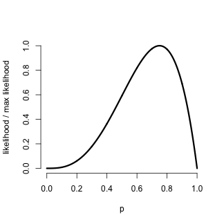
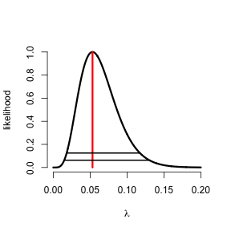

## Likelihood

- A common and fruitful approach to statistics is to assume that the data arises from a family of distributions indexed by a parameter that represents a useful summary of the distribution
- The **likelihood** of a collection of data is the joint density evaluated as a function of the parameters with the data fixed
- Likelihood analysis of data uses the likelihood to perform inference regarding the unknown parameter

---

## Likelihood

Given a statistical probability mass function or density, say $f(x, \theta)$, where $\theta$ is an unknown parameter, the **likelihood** is $f$ viewed as a function of $\theta$ for a fixed, observed value of $x$. 

---

## Interpretations of likelihoods

The likelihood has the following properties:

1. Ratios of likelihood values measure the relative evidence of one value of the unknown parameter to another.
2. Given a statistical model and observed data, all of the relevant information contained in the data regarding the unknown parameter is contained in the likelihood.
3. If $\{X_i\}$ are independent random variables, then their likelihoods multiply.  That is, the likelihood of the parameters given all of the $X_i$ is simply the product of the individual likelihoods.

---

## Example

- Suppose that we flip a coin with success probability $\theta$
- Recall that the mass function for $x$
  $$
  f(x,\theta) = \theta^x(1 - \theta)^{1 - x}  ~~~\mbox{for}~~~ \theta \in [0,1].
  $$
  where $x$ is either $0$ (Tails) or $1$ (Heads) 
- Suppose that the result is a head
- The likelihood is
  $$
  {\cal L}(\theta, 1) = \theta^1 (1 - \theta)^{1 - 1} = \theta  ~~~\mbox{for} ~~~ \theta \in [0,1].
  $$
- Therefore, ${\cal L}(.5, 1) / {\cal L}(.25, 1) = 2$, 
- There is twice as much evidence supporting the hypothesis that $\theta = .5$ to the hypothesis that $\theta = .25$

---

## Example continued

- Suppose now that we flip our coin from the previous example 4 times and get the sequence 1, 0, 1, 1
- The likelihood is:
$$
  \begin{eqnarray*}
  {\cal L}(\theta, 1,0,1,1) & = & \theta^1 (1 - \theta)^{1 - 1}
  \theta^0 (1 - \theta)^{1 - 0}  \\
& \times & \theta^1 (1 - \theta)^{1 - 1} 
   \theta^1 (1 - \theta)^{1 - 1}\\
& = &  \theta^3(1 - \theta)^1
  \end{eqnarray*}
$$
- This likelihood only depends on the total number of heads and the total number of tails; we might write ${\cal L}(\theta, 1, 3)$ for shorthand
- Now consider ${\cal L}(.5, 1, 3) / {\cal L}(.25, 1, 3) = 5.33$
- There is over five times as much evidence supporting the hypothesis that $\theta = .5$ over that $\theta = .25$

---

## Plotting likelihoods

- Generally, we want to consider all the values of $\theta$ between 0 and 1
- A **likelihood plot** displays $\theta$ by ${\cal L}(\theta,x)$
- Because the likelihood measures *relative evidence*, dividing the curve by its maximum value (or any other value for that matter) does not change its interpretation

---

```r
pvals <- seq(0, 1, length = 1000)
plot(pvals, dbinom(3, 4, pvals)/dbinom(3, 4, 3/4), type = "l", frame = FALSE, 
    lwd = 3, xlab = "p", ylab = "likelihood / max likelihood")
```

 


---

## Maximum likelihood

- The value of $\theta$ where the curve reaches its maximum has a special meaning
- It is the value of $\theta$ that is most well supported by the data
- This point is called the **maximum likelihood estimate** (or MLE) of $\theta$
  $$
  MLE = \mathrm{argmax}_\theta {\cal L}(\theta, x).
  $$
- Another interpretation of the MLE is that it is the value of $\theta$ that would make the data that we observed most probable

---
## Some results
* $X_1, \ldots, X_n \stackrel{iid}{\sim} N(\mu, \sigma^2)$ the MLE of $\mu$ is $\bar X$ and the ML of $\sigma^2$ is the biased sample variance estimate.
* If $X_1,\ldots, X_n \stackrel{iid}{\sim} Bernoulli(p)$ then the MLE of $p$ is $\bar X$ (the sample proportion of 1s).
* If $X_i \stackrel{iid}{\sim} Binomial(n_i, p)$ then the MLE of $p$ is $\frac{\sum_{i=1}^n X_i}{\sum_{i=1}^n n_i}$ (the sample proportion of 1s).
* If $X \stackrel{iid}{\sim} Poisson(\lambda t)$ then the MLE of $\lambda$ is $X/t$.
* If $X_i \stackrel{iid}{\sim} Poisson(\lambda t_i)$ then the MLE of $\lambda$ is
  $\frac{\sum_{i=1}^n X_i}{\sum_{i=1}^n t_i}$

---
## Example
* You saw 5 failure events per 94 days of monitoring a nuclear pump. 
* Assuming Poisson, plot the likelihood

---

```r
lambda <- seq(0, 0.2, length = 1000)
likelihood <- dpois(5, 94 * lambda)/dpois(5, 5)
plot(lambda, likelihood, frame = FALSE, lwd = 3, type = "l", xlab = expression(lambda))
lines(rep(5/94, 2), 0:1, col = "red", lwd = 3)
lines(range(lambda[likelihood > 1/16]), rep(1/16, 2), lwd = 2)
lines(range(lambda[likelihood > 1/8]), rep(1/8, 2), lwd = 2)
```

 


