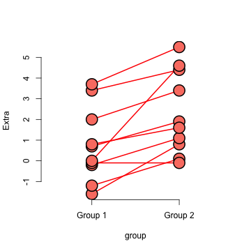

## Independent group $t$ confidence intervals

- Suppose that we want to compare the mean blood pressure between two groups in a randomized trial; those who received the treatment to those who received a placebo
- We cannot use the paired t test because the groups are independent and may have different sample sizes
- We now present methods for comparing independent groups

---

## Notation

- Let $X_1,\ldots,X_{n_x}$ be iid $N(\mu_x,\sigma^2)$
- Let $Y_1,\ldots,Y_{n_y}$ be iid $N(\mu_y, \sigma^2)$
- Let $\bar X$, $\bar Y$, $S_x$, $S_y$ be the means and standard deviations
- Using the fact that linear combinations of normals are again normal, we know that $\bar Y - \bar X$ is also normal with mean $\mu_y - \mu_x$ and variance $\sigma^2 (\frac{1}{n_x} + \frac{1}{n_y})$
- The pooled variance estimator $$S_p^2 = \{(n_x - 1) S_x^2 + (n_y - 1) S_y^2\}/(n_x + n_y - 2)$$ is a good estimator of $\sigma^2$

---

## Note

- The pooled estimator is a mixture of the group variances, placing greater weight on whichever has a larger sample size
- If the sample sizes are the same the pooled variance estimate is the average of the group variances
- The pooled estimator is unbiased
$$
    \begin{eqnarray*}
    E[S_p^2] & = & \frac{(n_x - 1) E[S_x^2] + (n_y - 1) E[S_y^2]}{n_x + n_y - 2}\\
            & = & \frac{(n_x - 1)\sigma^2 + (n_y - 1)\sigma^2}{n_x + n_y - 2}
    \end{eqnarray*}
$$
- The pooled variance  estimate is independent of $\bar Y - \bar X$ since $S_x$ is independent of $\bar X$ and $S_y$ is independent of $\bar Y$ and the groups are independent

---

## Result

- The sum of two independent Chi-squared random variables is Chi-squared with degrees of freedom equal to the sum of the degrees of freedom of the summands
- Therefore
$$
    \begin{eqnarray*}
      (n_x + n_y - 2) S_p^2 / \sigma^2 & = & (n_x - 1)S_x^2 /\sigma^2 + (n_y - 1)S_y^2/\sigma^2 \\ \\
      & = & \chi^2_{n_x - 1} + \chi^2_{n_y-1} \\ \\
      & = & \chi^2_{n_x + n_y - 2}
    \end{eqnarray*}
$$

---

## Putting this all together

- The statistic
$$
    \frac{\frac{\bar Y - \bar X - (\mu_y - \mu_x)}{\sigma \left(\frac{1}{n_x} + \frac{1}{n_y}\right)^{1/2}}}%
    {\sqrt{\frac{(n_x + n_y - 2) S_p^2}{(n_x + n_y - 2)\sigma^2}}}
    = \frac{\bar Y - \bar X - (\mu_y - \mu_x)}{S_p \left(\frac{1}{n_x} + \frac{1}{n_y}\right)^{1/2}}
$$
is a standard normal divided by the square root of an independent Chi-squared divided by its degrees of freedom 
- Therefore this statistic follows Gosset's $t$ distribution with $n_x + n_y - 2$ degrees of freedom
- Notice the form is (estimator - true value) / SE

---

## Confidence interval

- Therefore a $(1 - \alpha)\times 100\%$ confidence interval for $\mu_y - \mu_x$ is 
$$
    \bar Y - \bar X \pm t_{n_x + n_y - 2, 1 - \alpha/2}S_p\left(\frac{1}{n_x} + \frac{1}{n_y}\right)^{1/2}
$$
- Remember this interval is assuming a constant variance across the two groups
- If there is some doubt, assume a different variance per group, which we will discuss later

---


## Example
### Based on Rosner, Fundamentals of Biostatistics

- Comparing SBP for 8 oral contraceptive users versus 21 controls
- $\bar X_{OC} = 132.86$ mmHg with $s_{OC} = 15.34$ mmHg
- $\bar X_{C} = 127.44$ mmHg with $s_{C} = 18.23$ mmHg
- Pooled variance estimate

```r
sp <- sqrt((7 * 15.34^2 + 20 * 18.23^2)/(8 + 21 - 2))
132.86 - 127.44 + c(-1, 1) * qt(0.975, 27) * sp * (1/8 + 1/21)^0.5
```

```
## [1] -9.521 20.361
```


---

```r
data(sleep)
x1 <- sleep$extra[sleep$group == 1]
x2 <- sleep$extra[sleep$group == 2]
n1 <- length(x1)
n2 <- length(x2)
sp <- sqrt(((n1 - 1) * sd(x1)^2 + (n2 - 1) * sd(x2)^2)/(n1 + n2 - 2))
md <- mean(x1) - mean(x2)
semd <- sp * sqrt(1/n1 + 1/n2)
md + c(-1, 1) * qt(0.975, n1 + n2 - 2) * semd
```

```
## [1] -3.3639  0.2039
```

```r
t.test(x1, x2, paired = FALSE, var.equal = TRUE)$conf
```

```
## [1] -3.3639  0.2039
## attr(,"conf.level")
## [1] 0.95
```

```r
t.test(x1, x2, paired = TRUE)$conf
```

```
## [1] -2.4599 -0.7001
## attr(,"conf.level")
## [1] 0.95
```


---
## Ignoring pairing
 


---

## Unequal variances

- Under unequal variances
$$
    \bar Y - \bar X \sim N\left(\mu_y - \mu_x, \frac{s_x^2}{n_x} + \frac{\sigma_y^2}{n_y}\right)
$$
- The statistic 
$$
    \frac{\bar Y - \bar X - (\mu_y - \mu_x)}{\left(\frac{s_x^2}{n_x} + \frac{\sigma_y^2}{n_y}\right)^{1/2}}
$$
approximately follows Gosset's $t$ distribution with degrees of freedom equal to
$$
    \frac{\left(S_x^2 / n_x + S_y^2/n_y\right)^2}
    {\left(\frac{S_x^2}{n_x}\right)^2 / (n_x - 1) +
      \left(\frac{S_y^2}{n_y}\right)^2 / (n_y - 1)}
$$

---

## Example

- Comparing SBP for 8 oral contraceptive users versus 21 controls
- $\bar X_{OC} = 132.86$ mmHg with $s_{OC} = 15.34$ mmHg
- $\bar X_{C} = 127.44$ mmHg with $s_{C} = 18.23$ mmHg
- $df=15.04$, $t_{15.04, .975} = 2.13$
- Interval
$$
132.86 - 127.44 \pm 2.13 \left(\frac{15.34^2}{8} + \frac{18.23^2}{21} \right)^{1/2}
= [-8.91, 19.75]
$$
- In R, `t.test(..., var.equal = FALSE)`

---
## Comparing other kinds of data
* For binomial data, there's lots of ways to compare two groups
  * Relative risk, risk difference, odds ratio.
  * Chi-squared tests, normal approximations, exact tests.
* For count data, there's also Chi-squared tests and exact tests.
* We'll leave the discussions for comparing groups of data for binary
  and count data until covering glms in the regression class.
* In addition, Mathematical Biostatistics Boot Camp 2 covers many special
  cases relevant to biostatistics.
