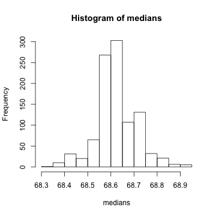
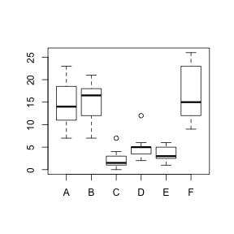
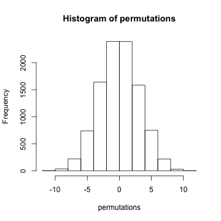

## The jackknife

- The jackknife is a tool for estimating standard errors  and the bias of estimators 
- As its name suggests, the jackknife is a small, handy tool; in contrast to the bootstrap, which is then the moral equivalent of a giant workshop full of tools
- Both the jackknife and the bootstrap involve *resampling* data; that is, repeatedly creating new data sets from the original data

---

## The jackknife

- The jackknife deletes each observation and calculates an estimate based on the remaining $n-1$ of them
- It uses this collection of estimates to do things like estimate the bias and the standard error
- Note that estimating the bias and having a standard error are not needed for things like sample means, which we know are unbiased estimates of population means and what their standard errors are

---

## The jackknife

- We'll consider the jackknife for univariate data
- Let $X_1,\ldots,X_n$ be a collection of data used to estimate a parameter $\theta$
- Let $\hat \theta$ be the estimate based on the full data set
- Let $\hat \theta_{i}$ be the estimate of $\theta$ obtained by *deleting observation $i$*
- Let $\bar \theta = \frac{1}{n}\sum_{i=1}^n \hat \theta_{i}$

---

## Continued

- Then, the jackknife estimate of the bias is
   $$
   (n - 1) \left(\bar \theta - \hat \theta\right)
   $$
   (how far the average delete-one estimate is from the actual estimate)
- The jackknife estimate of the standard error is
   $$
   \left[\frac{n-1}{n}\sum_{i=1}^n (\hat \theta_i - \bar\theta )^2\right]^{1/2}
   $$
(the deviance of the delete-one estimates from the average delete-one estimate)

---

## Example
### We want to estimate the bias and standard error of the median


```r
library(UsingR)
data(father.son)
x <- father.son$sheight
n <- length(x)
theta <- median(x)
jk <- sapply(1:n, function(i) median(x[-i]))
thetaBar <- mean(jk)
biasEst <- (n - 1) * (thetaBar - theta)
seEst <- sqrt((n - 1) * mean((jk - thetaBar)^2))
```


---

## Example test


```r
c(biasEst, seEst)
```

```
## [1] 0.0000 0.1014
```

```r
library(bootstrap)
temp <- jackknife(x, median)
c(temp$jack.bias, temp$jack.se)
```

```
## [1] 0.0000 0.1014
```


---

## Example

- Both methods (of course) yield an estimated bias of 0 and a se of 0.1014
- Odd little fact: the jackknife estimate of the bias for the median is always $0$ when the number of observations is even
- It has been shown that the jackknife is a linear approximation to the bootstrap
- Generally do not use the jackknife for sample quantiles like the median; as it has been shown to have some poor properties

---

## Pseudo observations

- Another interesting way to think about the jackknife uses pseudo observations
- Let
$$
      \mbox{Pseudo Obs} = n \hat \theta - (n - 1) \hat \theta_{i}
$$
- Think of these as ``whatever observation $i$ contributes to the estimate of $\theta$''
- Note when $\hat \theta$ is the sample mean, the pseudo observations are the data themselves
- Then the sample standard error of these observations is the previous jackknife estimated standard error.
- The mean of these observations is a bias-corrected estimate of $\theta$

---

## The bootstrap

- The bootstrap is a tremendously useful tool for constructing confidence intervals and calculating standard errors for difficult statistics
- For example, how would one derive a confidence interval for the median?
- The bootstrap procedure follows from the so called bootstrap principle

---

## The bootstrap principle

- Suppose that I have a statistic that estimates some population parameter, but I don't know its sampling distribution
- The bootstrap principle suggests using the distribution defined by the data to approximate its sampling distribution

---

## The bootstrap in practice

- In practice, the bootstrap principle is always carried out using simulation
- We will cover only a few aspects of bootstrap resampling
- The general procedure follows by first simulating complete data sets from the observed data with replacement

  - This is approximately drawing from the sampling distribution of that statistic, at least as far as the data is able to approximate the true population distribution

- Calculate the statistic for each simulated data set
- Use the simulated statistics to either define a confidence interval or take the standard deviation to calculate a standard error

---
## Nonparametric bootstrap algorithm example

- Bootstrap procedure for calculating confidence interval for the median from a data set of $n$ observations

  i. Sample $n$ observations **with replacement** from the observed data resulting in one simulated complete data set
  
  ii. Take the median of the simulated data set
  
  iii. Repeat these two steps $B$ times, resulting in $B$ simulated medians
  
  iv. These medians are approximately drawn from the sampling distribution of the median of $n$ observations; therefore we can
  
    - Draw a histogram of them
    - Calculate their standard deviation to estimate the standard error of the median
    - Take the $2.5^{th}$ and $97.5^{th}$ percentiles as a confidence interval for the median

---

## Example code


```r
B <- 1000
resamples <- matrix(sample(x, n * B, replace = TRUE), B, n)
medians <- apply(resamples, 1, median)
sd(medians)
```

```
## [1] 0.08834
```

```r
quantile(medians, c(0.025, 0.975))
```

```
##  2.5% 97.5% 
## 68.41 68.82
```


---
## Histogram of bootstrap resamples


```r
hist(medians)
```

 


---

## Notes on the bootstrap

- The bootstrap is non-parametric
- Better percentile bootstrap confidence intervals correct for bias
- There are lots of variations on bootstrap procedures; the book "An Introduction to the Bootstrap"" by Efron and Tibshirani is a great place to start for both bootstrap and jackknife information


---
## Group comparisons
- Consider comparing two independent groups.
- Example, comparing sprays B and C


```r
data(InsectSprays)
boxplot(count ~ spray, data = InsectSprays)
```

 


---
## Permutation tests
-  Consider the null hypothesis that the distribution of the observations from each group is the same
-  Then, the group labels are irrelevant
-  We then discard the group levels and permute the combined data
-  Split the permuted data into two groups with $n_A$ and $n_B$
  observations (say by always treating the first $n_A$ observations as
  the first group)
-  Evaluate the probability of getting a statistic as large or
  large than the one observed
-  An example statistic would be the difference in the averages between the two groups;
  one could also use a t-statistic 

---
## Variations on permutation testing
Data type | Statistic | Test name 
---|---|---|
Ranks | rank sum | rank sum test
Binary | hypergeometric prob | Fisher's exact test
Raw data | | ordinary permutation test

- Also, so-called *randomization tests* are exactly permutation tests, with a different motivation.
- For matched data, one can randomize the signs
  - For ranks, this results in the signed rank test
- Permutation strategies work for regression as well
  - Permuting a regressor of interest
- Permutation tests work very well in multivariate settings

---
## Permutation test for pesticide data

```r
subdata <- InsectSprays[InsectSprays$spray %in% c("B", "C"), ]
y <- subdata$count
group <- as.character(subdata$spray)
testStat <- function(w, g) mean(w[g == "B"]) - mean(w[g == "C"])
observedStat <- testStat(y, group)
permutations <- sapply(1:10000, function(i) testStat(y, sample(group)))
observedStat
```

```
## [1] 13.25
```

```r
mean(permutations > observedStat)
```

```
## [1] 0
```


---
## Histogram of permutations
 


