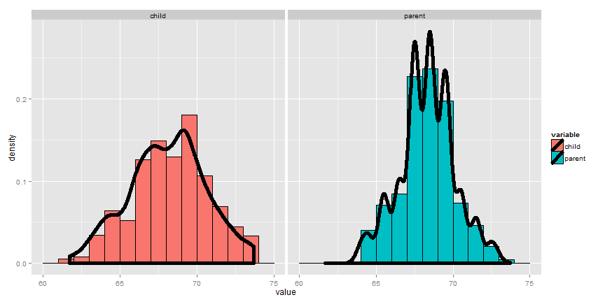
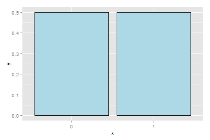
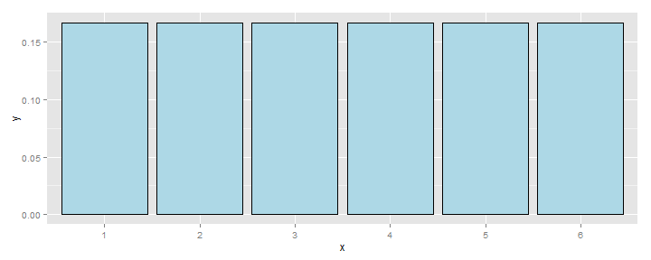
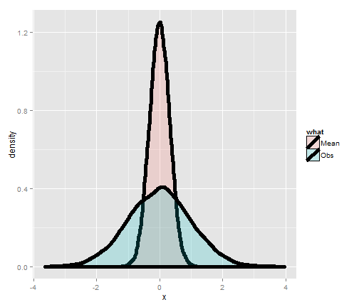
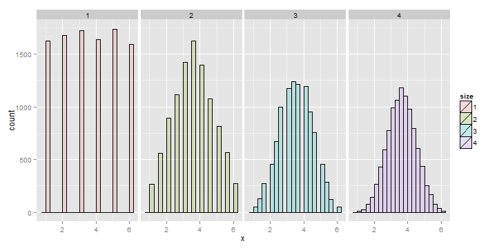

## Expected values
- Expected values are useful cor characterizing a distribution
- The mean is a characterization of its center
- The variance and standard deviation are characterizations of
how spread out it is
- Our sample expected values (the sample mean and variance) will
estimate the population versions


---
## The population mean
- The **expected value** or **mean** of a random variable is the center of its distribution
- For discrete random variable $X$ with PMF $p(x)$, it is defined as follows
    $$
    E[X] = \sum_x xp(x).
    $$
    where the sum is taken over the possible values of $x$
- $E[X]$ represents the center of mass of a collection of locations and weights, $\{x, p(x)\}$

---
## The sample mean
- The sample mean estimates this population mean
- The center of mass of the data is the empirical mean
$$
\bar X = \sum_{i=1}^n x_i p(x_i)
$$
where $p(x_i) = 1/n$

---

## Example
### Find the center of mass of the bars


---
## Using manipulate
```
library(manipulate)
myHist <- function(mu){
    g <- ggplot(galton, aes(x = child))
    g <- g + geom_histogram(fill = "salmon", 
      binwidth=1, aes(y = ..density..), colour = "black")
    g <- g + geom_density(size = 2)
    g <- g + geom_vline(xintercept = mu, size = 2)
    mse <- round(mean((galton$child - mu)^2), 3)  
    g <- g + labs(title = paste('mu = ', mu, ' MSE = ', mse))
    g
}
manipulate(myHist(mu), mu = slider(62, 74, step = 0.5))
```

---
## The center of mass is the empirical mean


---
## Example of a population mean

- Suppose a coin is flipped and $X$ is declared $0$ or $1$ corresponding to a head or a tail, respectively
- What is the expected value of $X$? 
    $$
    E[X] = .5 \times 0 + .5 \times 1 = .5
    $$
- Note, if thought about geometrically, this answer is obvious; if two equal weights are spaced at 0 and 1, the center of mass will be $.5$



---
## What about a biased coin?

- Suppose that a random variable, $X$, is so that
$P(X=1) = p$ and $P(X=0) = (1 - p)$
- (This is a biased coin when $p\neq 0.5$)
- What is its expected value?
$$
E[X] = 0 * (1 - p) + 1 * p = p
$$

---

## Example

- Suppose that a die is rolled and $X$ is the number face up
- What is the expected value of $X$?
    $$
    E[X] = 1 \times \frac{1}{6} + 2 \times \frac{1}{6} +
    3 \times \frac{1}{6} + 4 \times \frac{1}{6} +
    5 \times \frac{1}{6} + 6 \times \frac{1}{6} = 3.5
    $$
- Again, the geometric argument makes this answer obvious without calculation.



---

## Continuous random variables

- For a continuous random variable, $X$, with density, $f$, the expected value is again exactly the center of mass of the density


---

## Example

- Consider a density where $f(x) = 1$ for $x$ between zero and one
- (Is this a valid density?)
- Suppose that $X$ follows this density; what is its expected value?  


---

## Facts about expected values

- Recall that expected values are properties of distributions
- Note the average of random variables is itself a random variable
and its associated distribution has an expected value
- The center of this distribution is the same as that of the original distribution
- Therefore, the expected value of the **sample mean** is the population mean that it's trying to estimate
- When the expected value of an estimator is what its trying to estimate, we say that the estimator is **unbiased**
- Let's try a simulation experiment

---
## Simulation experiment
Simulating normals with mean 0 and variance 1 versus averages
of 10 normals from the same population



---
## Averages of x die rolls




---
## Averages of x coin flips


---
## Sumarizing what we know
- Expected values are properties of distributions
- The population mean is the center of mass of population
- The sample mean is the center of mass of the observed data
- The sample mean is an estimate of the population mean
- The sample mean is unbiased 
  - The population mean of its distribution is the mean that it's
  trying to estimate
- The more data that goes into the sample mean, the more 
concentrated its density / mass function is around the population mean
