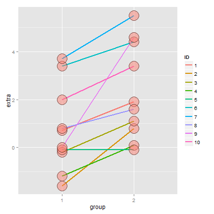
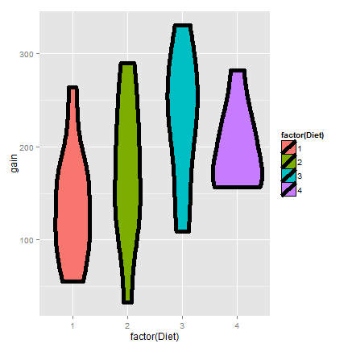

## T Confidence intervals

- In the previous, we discussed creating a confidence interval using the CLT
  - They took the form $Est \pm ZQ \times SE_{Est}$
- In this lecture, we discuss some methods for small samples, notably Gosset's $t$ distribution and $t$ confidence intervals
  - They are of the form $Est \pm TQ \times SE_{Est}$
- These are some of the handiest of intervals
- If you want a rule between whether to use a $t$ interval
or normal interval, just always use the $t$ interval
- We'll cover the one and two group versions

---

## Gosset's $t$ distribution

- Invented by William Gosset (under the pseudonym "Student") in 1908
- Has thicker tails than the normal
- Is indexed by a degrees of freedom; gets more like a standard normal as df gets larger
- It assumes that the underlying data are iid 
Gaussian with the result that
$$
\frac{\bar X - \mu}{S/\sqrt{n}}
$$
follows Gosset's $t$ distribution with $n-1$ degrees of freedom
- (If we replaced $s$ by $\sigma$ the statistic would be exactly standard normal)
- Interval is $\bar X \pm t_{n-1} S/\sqrt{n}$ where $t_{n-1}$
is the relevant quantile

---
## Code for manipulate

```r
k <- 1000
xvals <- seq(-5, 5, length = k)
myplot <- function(df){
  d <- data.frame(y = c(dnorm(xvals), dt(xvals, df)),
                  x = xvals,
                  dist = factor(rep(c("Normal", "T"), c(k,k))))
  g <- ggplot(d, aes(x = x, y = y)) 
  g <- g + geom_line(size = 2, aes(colour = dist))
  g
}
manipulate(myplot(mu), mu = slider(1, 20, step = 1))  
```

---
## Easier to see

```r
pvals <- seq(.5, .99, by = .01)
myplot2 <- function(df){
  d <- data.frame(n= qnorm(pvals),t=qt(pvals, df),
                  p = pvals)
  g <- ggplot(d, aes(x= n, y = t))
  g <- g + geom_abline(size = 2, col = "lightblue")
  g <- g + geom_line(size = 2, col = "black")
  g <- g + geom_vline(xintercept = qnorm(0.975))
  g <- g + geom_hline(yintercept = qt(0.975, df))
  g
}
manipulate(myplot2(df), df = slider(1, 20, step = 1))
```

---

## Note's about the $t$ interval

- The $t$ interval technically assumes that the data are iid normal, though it is robust to this assumption
- It works well whenever the distribution of the data is roughly symmetric and mound shaped
- Paired observations are often analyzed using the $t$ interval by taking differences
- For large degrees of freedom, $t$ quantiles become the same as standard normal quantiles; therefore this interval converges to the same interval as the CLT yielded
- For skewed distributions, the spirit of the $t$ interval assumptions are violated
  - Also, for skewed distributions, it doesn't make a lot of sense to center the interval at the mean
  - In this case, consider taking logs or using a different summary like the median
- For highly discrete data, like binary, other intervals are available

---

## Sleep data

In R typing `data(sleep)` brings up the sleep data originally
analyzed in Gosset's Biometrika paper, which shows the increase in
hours for 10 patients on two soporific drugs. R treats the data as two
groups rather than paired.

---
## The data

```r
data(sleep)
head(sleep)
```

```
##   extra group ID
## 1   0.7     1  1
## 2  -1.6     1  2
## 3  -0.2     1  3
## 4  -1.2     1  4
## 5  -0.1     1  5
## 6   3.4     1  6
```

---
## Plotting the data


---
## Results

```r
g1 <- sleep$extra[1 : 10]; g2 <- sleep$extra[11 : 20]
difference <- g2 - g1
mn <- mean(difference); s <- sd(difference); n <- 10
```

```r
mn + c(-1, 1) * qt(.975, n-1) * s / sqrt(n)
t.test(difference)
t.test(g2, g1, paired = TRUE)
t.test(extra ~ I(relevel(group, 2)), paired = TRUE, data = sleep)
```

---
## The results
(After a little formatting)

```
##        [,1] [,2]
## [1,] 0.7001 2.46
## [2,] 0.7001 2.46
## [3,] 0.7001 2.46
## [4,] 0.7001 2.46
```

---

## Independent group $t$ confidence intervals

- Suppose that we want to compare the mean blood pressure between two groups in a randomized trial; those who received the treatment to those who received a placebo
- We cannot use the paired t test because the groups are independent and may have different sample sizes
- We now present methods for comparing independent groups

---
## Confidence interval

- Therefore a $(1 - \alpha)\times 100\%$ confidence interval for $\mu_y - \mu_x$ is 
$$
    \bar Y - \bar X \pm t_{n_x + n_y - 2, 1 - \alpha/2}S_p\left(\frac{1}{n_x} + \frac{1}{n_y}\right)^{1/2}
$$
- The pooled variance estimator is $$S_p^2 = \{(n_x - 1) S_x^2 + (n_y - 1) S_y^2\}/(n_x + n_y - 2)$$ 
- Remember this interval is assuming a constant variance across the two groups
- If there is some doubt, assume a different variance per group, which we will discuss later

---

## Example
### Based on Rosner, Fundamentals of Biostatistics
(Really a very good reference book)

- Comparing SBP for 8 oral contraceptive users versus 21 controls
- $\bar X_{OC} = 132.86$ mmHg with $s_{OC} = 15.34$ mmHg
- $\bar X_{C} = 127.44$ mmHg with $s_{C} = 18.23$ mmHg
- Pooled variance estimate

```r
sp <- sqrt((7 * 15.34^2 + 20 * 18.23^2) / (8 + 21 - 2))
132.86 - 127.44 + c(-1, 1) * qt(.975, 27) * sp * (1 / 8 + 1 / 21)^.5
```

```
## [1] -9.521 20.361
```


---
## Mistakenly treating the sleep data as grouped

```r
n1 <- length(g1); n2 <- length(g2)
sp <- sqrt( ((n1 - 1) * sd(x1)^2 + (n2-1) * sd(x2)^2) / (n1 + n2-2))
md <- mean(g2) - mean(g1)
semd <- sp * sqrt(1 / n1 + 1/n2)
rbind(
md + c(-1, 1) * qt(.975, n1 + n2 - 2) * semd,  
t.test(g2, g1, paired = FALSE, var.equal = TRUE)$conf,
t.test(g2, g1, paired = TRUE)$conf
)
```

```
##         [,1]  [,2]
## [1,] -0.2039 3.364
## [2,] -0.2039 3.364
## [3,]  0.7001 2.460
```

---
## Grouped versus independent


---

## `ChickWeight` data in R

```r
library(datasets); data(ChickWeight); library(reshape2)
##define weight gain or loss
wideCW <- dcast(ChickWeight, Diet + Chick ~ Time, value.var = "weight")
names(wideCW)[-(1 : 2)] <- paste("time", names(wideCW)[-(1 : 2)], sep = "")
library(dplyr)
wideCW <- mutate(wideCW,
  gain = time21 - time0
)
```

---
## Plotting the raw data


---
## Weight gain by diet


---
## Let's do a t interval

```r
wideCW14 <- subset(wideCW, Diet %in% c(1, 4))
rbind(
t.test(gain ~ Diet, paired = FALSE, var.equal = TRUE, data = wideCW14)$conf,
t.test(gain ~ Diet, paired = FALSE, var.equal = FALSE, data = wideCW14)$conf
)
```

```
##        [,1]   [,2]
## [1,] -108.1 -14.81
## [2,] -104.7 -18.30
```


---

## Unequal variances

- Under unequal variances
$$
\bar Y - \bar X \pm t_{df} \times \left(\frac{s_x^2}{n_x} + \frac{s_y^2}{n_y}\right)^{1/2}
$$
where $t_{df}$ is calculated with degrees of freedom
$$
df=    \frac{\left(S_x^2 / n_x + S_y^2/n_y\right)^2}
    {\left(\frac{S_x^2}{n_x}\right)^2 / (n_x - 1) +
      \left(\frac{S_y^2}{n_y}\right)^2 / (n_y - 1)}
$$
will be approximately a 95% interval
- This works really well
  - So when in doubt, just assume unequal variances

---

## Example

- Comparing SBP for 8 oral contraceptive users versus 21 controls
- $\bar X_{OC} = 132.86$ mmHg with $s_{OC} = 15.34$ mmHg
- $\bar X_{C} = 127.44$ mmHg with $s_{C} = 18.23$ mmHg
- $df=15.04$, $t_{15.04, .975} = 2.13$
- Interval
$$
132.86 - 127.44 \pm 2.13 \left(\frac{15.34^2}{8} + \frac{18.23^2}{21} \right)^{1/2}
= [-8.91, 19.75]
$$
- In R, `t.test(..., var.equal = FALSE)`

---
## Comparing other kinds of data
* For binomial data, there's lots of ways to compare two groups
  * Relative risk, risk difference, odds ratio.
  * Chi-squared tests, normal approximations, exact tests.
* For count data, there's also Chi-squared tests and exact tests.
* We'll leave the discussions for comparing groups of data for binary
  and count data until covering glms in the regression class.
* In addition, Mathematical Biostatistics Boot Camp 2 covers many special
  cases relevant to biostatistics.

