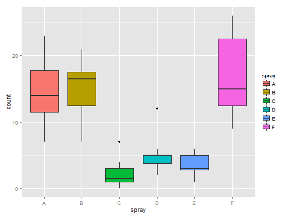
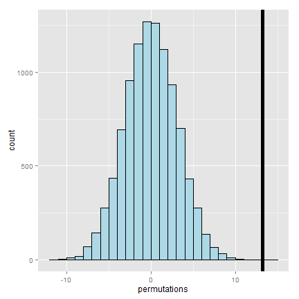

## The bootstrap

- The bootstrap is a tremendously useful tool for constructing confidence intervals and calculating standard errors for difficult statistics
- For example, how would one derive a confidence interval for the median?
- The bootstrap procedure follows from the so called bootstrap principle

---
## Sample of 50 die rolls


```
## Error: there is no package called 'gridExtra'
```

```
## Error: could not find function "grid.arrange"
```


---
## What if we only had one sample?

```
## Error: could not find function "grid.arrange"
```


---
## Consider a data set

```r
library(UsingR)
```

```
## Loading required package: MASS
## Loading required package: HistData
## Loading required package: Hmisc
## Loading required package: grid
## Loading required package: lattice
## Loading required package: survival
## Loading required package: splines
## Loading required package: Formula
## 
## Attaching package: 'Hmisc'
## 
## The following objects are masked from 'package:base':
## 
##     format.pval, round.POSIXt, trunc.POSIXt, units
## 
## Loading required package: aplpack
## Loading required package: tcltk
## Loading required package: quantreg
## Loading required package: SparseM
## 
## Attaching package: 'SparseM'
## 
## The following object is masked from 'package:base':
## 
##     backsolve
## 
## 
## Attaching package: 'quantreg'
## 
## The following object is masked from 'package:Hmisc':
## 
##     latex
## 
## The following object is masked from 'package:survival':
## 
##     untangle.specials
## 
## 
## Attaching package: 'UsingR'
## 
## The following object is masked from 'package:survival':
## 
##     cancer
## 
## The following object is masked from 'package:ggplot2':
## 
##     movies
```

```r
data(father.son)
x <- father.son$sheight
n <- length(x)
B <- 10000
resamples <- matrix(sample(x,
                           n * B,
                           replace = TRUE),
                    B, n)
resampledMedians <- apply(resamples, 1, median)
```

---
## A plot of the histrogram of the resamples


---


## The bootstrap principle

- Suppose that I have a statistic that estimates some population parameter, but I don't know its sampling distribution
- The bootstrap principle suggests using the distribution defined by the data to approximate its sampling distribution

---

## The bootstrap in practice

- In practice, the bootstrap principle is always carried out using simulation
- We will cover only a few aspects of bootstrap resampling
- The general procedure follows by first simulating complete data sets from the observed data with replacement

  - This is approximately drawing from the sampling distribution of that statistic, at least as far as the data is able to approximate the true population distribution

- Calculate the statistic for each simulated data set
- Use the simulated statistics to either define a confidence interval or take the standard deviation to calculate a standard error


---
## Nonparametric bootstrap algorithm example

- Bootstrap procedure for calculating confidence interval for the median from a data set of $n$ observations

  i. Sample $n$ observations **with replacement** from the observed data resulting in one simulated complete data set
  
  ii. Take the median of the simulated data set
  
  iii. Repeat these two steps $B$ times, resulting in $B$ simulated medians
  
  iv. These medians are approximately drawn from the sampling distribution of the median of $n$ observations; therefore we can
  
    - Draw a histogram of them
    - Calculate their standard deviation to estimate the standard error of the median
    - Take the $2.5^{th}$ and $97.5^{th}$ percentiles as a confidence interval for the median

---

## Example code


```r
B <- 10000
resamples <- matrix(sample(x,
                           n * B,
                           replace = TRUE),
                    B, n)
medians <- apply(resamples, 1, median)
sd(medians)
```

```
## [1] 0.08424
```

```r
quantile(medians, c(.025, .975))
```

```
##  2.5% 97.5% 
## 68.43 68.81
```

---
## Histogram of bootstrap resamples


```r
g = ggplot(data.frame(medians = medians), aes(x = medians))
g = g + geom_histogram(color = "black", fill = "lightblue", binwidth = 0.05)
g
```


---

## Notes on the bootstrap

- The bootstrap is non-parametric
- Better percentile bootstrap confidence intervals correct for bias
- There are lots of variations on bootstrap procedures; the book "An Introduction to the Bootstrap"" by Efron and Tibshirani is a great place to start for both bootstrap and jackknife information


---
## Group comparisons
- Consider comparing two independent groups.
- Example, comparing sprays B and C



---
## Permutation tests
-  Consider the null hypothesis that the distribution of the observations from each group is the same
-  Then, the group labels are irrelevant
- Consider a data frome with count and spray
- Permute the spray (group) labels 
- Recalculate the statistic
  - Mean difference in counts
  - Geometric means
  - T statistic
- Calculate the percentage of simulations where
the simulated statistic was more extreme (toward
the alternative) than the observed

---
## Variations on permutation testing
Data type | Statistic | Test name 
---|---|---|
Ranks | rank sum | rank sum test
Binary | hypergeometric prob | Fisher's exact test
Raw data | | ordinary permutation test

- Also, so-called *randomization tests* are exactly permutation tests, with a different motivation.
- For matched data, one can randomize the signs
  - For ranks, this results in the signed rank test
- Permutation strategies work for regression as well
  - Permuting a regressor of interest
- Permutation tests work very well in multivariate settings

---
## Permutation test B v C

```r
subdata <- InsectSprays[InsectSprays$spray %in% c("B", "C"),]
y <- subdata$count
group <- as.character(subdata$spray)
testStat <- function(w, g) mean(w[g == "B"]) - mean(w[g == "C"])
observedStat <- testStat(y, group)
permutations <- sapply(1 : 10000, function(i) testStat(y, sample(group)))
observedStat
```

```
## [1] 13.25
```

```r
mean(permutations > observedStat)
```

```
## [1] 0
```

---
## Histogram of permutations B v C

