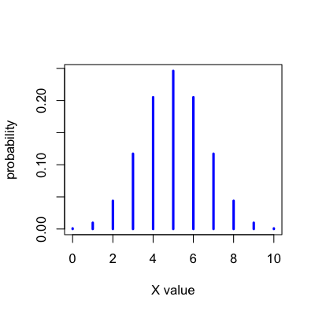
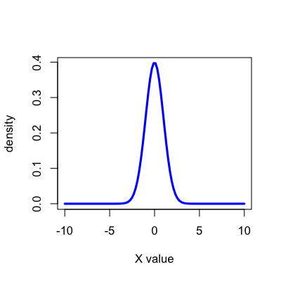
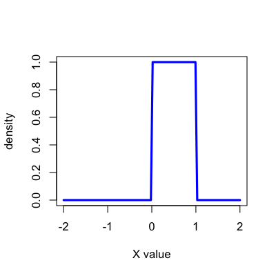
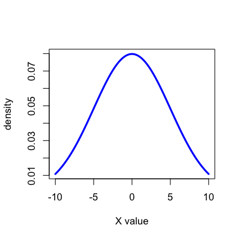
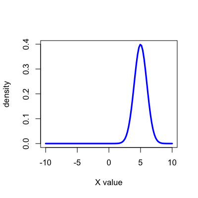
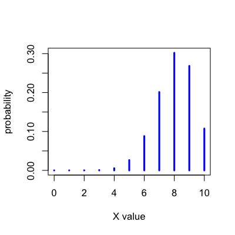
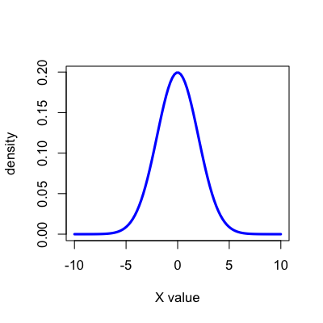

## How do we write about data?

* Each data point is usually represented by a capital letter. 
  * $H$ for height, $W$ for weight. 
* If there are more than one data point of the same type we use subscripts.
  * $H_1$, $H_2$, $H_3$ for three different people's heights.
* Sometimes it is more compact to write $X_1$ for height and $X_2$ for weight. 
* Then we need another subscript for the individual data point
  * $X_{11}$ for the height of the first person. 
* $Y$ representes general outcomes and $X$ general covariates. 
* In this course we will try to use informative letters when possible. 

---

## Randomness

* Variables like $X$ and $Y$ are called _random variables_ because we expect them to be _random_ in some way. 
* In general, randomness is a hard thing to define
* In this class a variable may be random because
  * It represents an incompletely measured variable
  * It represents a sample drawn from a population using a random mechanism.  
* Once we are talking about a specific value of a variable we have observed it isn't random anymore, we write these values with lower case letters $x,y$, etc. 
* We write $X=x$ or $X=1$ to indicate we have observed a specific value $x$ or $1$. 

---

## Randomness and measurement

* A coin flip is commonly considered random
* But it can be modeled by deterministic equations 
  * Dynamical bias in the coin toss [(Diaconis, Holmes and Montgomery SIAM Review 2007)](http://www-stat.stanford.edu/~cgates/PERSI/papers/dyn_coin_07.pdf)
  * Modeled the tossing as a dynamical system
  * Showed that a coin is more likely to land on the side it started
  * Did experiments that demonstrated it was a 51% chance
* Some have taken it a bit farther making [predictable coin flipping machines](http://www.dotmancando.info/index.php?/projects/coin-flipper/) based on [physical properties](http://www.dotmancando.info/index.php?/projects/coin-flipper/). 

--- 

## Distributions

* In statistical modeling, random variables like $X$ are assumed to be samples from a _distribution_
* A distribution tells us the possible values of $X$ and the probabilities for each value. 
* Probability is the chance something will happen and is abbreviated $Pr$
* The probabilities must all be between 0 and 1. 
* The probabilities must add up to 1. 
* An example:
  * Let's flip a coin and allow $X$ to represent whether it is heads or tails
  * $X = 1$ if it is heads and $X = 0$ if it is tails
  * We expect that about 50% of the time it will be heads.
  * The distribution can then be written Pr($X=1$)=0.5 and Pr($X=0$)=0.5

---

## Continuous versus discrete distributions

* _discrete_ distributions specify probabilities for discrete values
  * Qualitative variables are discrete
  * So are variables that take on all values 0,1,2,3...
* _continuous_ distributions specify probabilities for ranges of values
  * Quantitative variables are often assumed to be continuous
  * But we might only see specific values 

---

## Parameters

* Distributions are defined by a set of fixed values called _parameters_. 
* _parameters_ are sometimes represented by Greek letters like $\mu,\sigma,\tau$. 
* Distributions are written as letters with the parameters in parentheses like $N(\mu,\sigma)$ or $Poisson(\lambda)$.
* $X \sim N(\mu,\sigma)$ means that $X$ has the $N(\mu,\sigma)$ distribution. 

---

## The three most important parameters

* If $X$ is a random variable, the mean of that random variable is written $E[X]$
  * Stands for expected value
  * Measures the "center" of a distribution
* The variance of that random variable is written $Var[X]$
  * Measures how "spread out" a distribution is
  * Measurement is in (units of X)$^2$
* The standard deviation is written $SD[X] = \sqrt{Var[X]}$
  * Also measures how "spread out" a distribution is
  * Measurement is in units of X

---

## Conditioning

* The variables $X$ are considered to be random
* The parameters are considered to be fixed values
* Sometimes we want to talk about a case where one of the random variables is fixed
* To indicate what is fixed, we _condition_ using the symbol "$|$""
  * $X | \mu$ means that $X$ is a random variable with fixed parameter $\mu$
  * $Y | X = 2$ means $Y$ is the random variable $Y$ when $X$ is fixed at 2.

---

## Example distribution: Binomial

__Binomial distribution: $Bin(n,p)$__
* $X \sim Bin(10,0.5)$

---

## Example distribution: Normal

__Normal Distribution: $N(\mu,\sigma)$__
* $X \sim N(0,1)$

---

## Example distribution: Uniform

__Uniform distribution: $U(\alpha,\beta)$__
* $X \sim U(0,1)$

---

## Changing parameters

__Normal Distribution: $N(\mu,\sigma)$__
* $X \sim N(0,1)$, $E[X] = \mu = 0$, $Var[X] = \sigma^2 = 1$

---

## Changing parameters: the variance

__Normal Distribution: $N(\mu,\sigma)$__
* $X \sim N(0,5)$, $E[X] = \mu = 0$, $Var[X] = \sigma^2 = 25$

---

## Changing parameters: the mean
__Normal Distribution: $N(\mu,\sigma)$__
* $X \sim N(5,1)$, $E[X] = \mu = 5$, $Var[X] = \sigma^2 = 1$

---

## Example distribution: Binomial
__Binomial distribution: $Bin(n,p)$__
* $X \sim Bin(10,0.5)$, $E[X] = n \times p = 5$, $Var[X] = n \times p \times (1-p) = 2.5$

---

## Changing parameters: both mean and variance

__Binomial distribution: $Bin(n,p)$__
* $X \sim Bin(10,0.8)$, $E[X] = n \times p = 8$, $Var[X] = n \times p \times (1-p) = 1.6$

---

## Conditioning

* Suppose $Y \sim N(X,1)$ and $X \sim N(0,1)$, then the distribution of $Y |X = 5$ is

---

## Conditioning

* Suppose $Y \sim N(X,1)$ and $X \sim N(0,1)$, then the distribution of $Y$ is

[http://en.wikipedia.org/wiki/Law_of_total_variance](http://en.wikipedia.org/wiki/Law_of_total_variance)

[http://en.wikipedia.org/wiki/Law_of_total_expectation](http://en.wikipedia.org/wiki/Law_of_total_expectation)

---

## Learning more about a specific distribution

[http://en.wikipedia.org/wiki/Poisson_distribution](http://en.wikipedia.org/wiki/Poisson_distribution)

---

## Learning more about representing data

[http://www.openintro.org/stat/textbook.php](http://www.openintro.org/stat/textbook.php)

