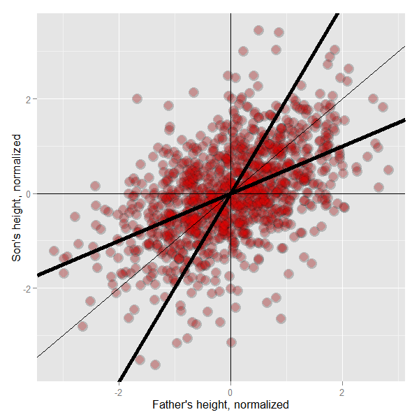

## A historically famous idea, Regression to the Mean
* Why is it that the children of tall parents tend to be tall, but not as tall as their parents? 
* Why do children of short parents tend to be short, but not as short as their parents?
* Why do parents of very short children, tend to be short, but not a short as their child? And the same with parents of very tall children?
* Why do the best performing athletes this year tend to do a little worse the following?

---
## Regression to the mean
* These phenomena are all examples of so-called regression to the mean
* Invented by Francis Galton in the paper "Regression towards mediocrity in hereditary stature" The Journal of the Anthropological Institute of Great Britain and Ireland , Vol. 15, (1886).
* Think of it this way, imagine if you simulated pairs of random normals
  * The largest first ones would be the largest by chance, and the probability that there are smaller for the second simulation is high.
  * In other words  $P(Y < x | X = x)$ gets bigger as $x$ heads into the very large values.
  * Similarly $P(Y > x | X = x)$ gets bigger as $x$ heads to very small values.
* Think of the regression line as the intrisic part.
  * Unless $Cor(Y, X) = 1$ the intrinsic part isn't perfect

---
## Regression to the mean
* Suppose that we normalize $X$ (child's height) and $Y$ (parent's height) so that they both have mean 0 and variance 1. 
* Then, recall, our regression line passes through $(0, 0)$ (the mean of the X and Y).
* If the slope of the regression line is $Cor(Y,X)$, regardless of which variable is the outcome (recall, both standard deviations are 1).
* Notice if $X$ is the outcome and you create a plot where $X$ is the horizontal axis, the slope of the least squares line that you plot is $1/Cor(Y, X)$. 

---
<<<<<<< HEAD

=======
## Plot of the results

>>>>>>> 3e5b14bbb8f101fc2a8573beb037d5f1b6f6fe47

---
## Discussion
* If you had to predict a son's normalized height, it would be
  $Cor(Y, X) * X_i$ 
* If you had to predict a father's normalized height, it would be
  $Cor(Y, X) * Y_i$
* Multiplication by this correlation shrinks toward 0 (regression toward the mean)
* If the correlation is 1 there is no regression to the mean (if father's height perfectly determine's child's height and vice versa)
* Note, regression to the mean has been thought about quite a bit and generalized 
