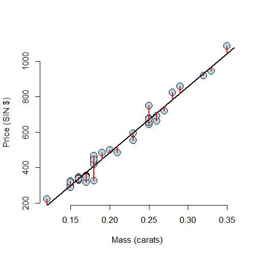
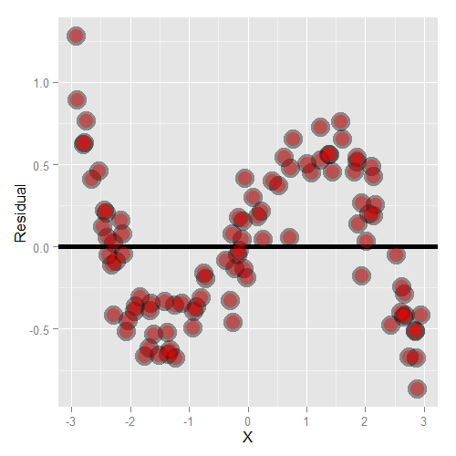
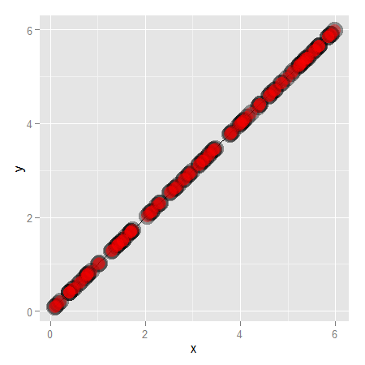

## Motivating example
### `diamond` data set from `UsingR` 
Data is diamond prices (Singapore dollars) and diamond weight
in carats (standard measure of diamond mass, 0.2 $g$). To get the data use `library(UsingR); data(diamond)`

---
<div class="rimage center"></div>

---

## Residuals
* Model $Y_i = \beta_0 + \beta_1 X_i + \epsilon_i$ where $\epsilon_i \sim N(0, \sigma^2)$.
* Observed outcome $i$ is $Y_i$ at predictor value $X_i$
* Predicted outcome $i$ is $\hat Y_i$ at predictor valuve $X_i$ is
  $$
  \hat Y_i = \hat \beta_0 + \hat \beta_1 X_i
  $$
* Residual, the between the observed and predicted outcome
  $$
  e_i = Y_i - \hat Y_i
  $$
  * The vertical distance between the observed data point and the regression line
* Least squares minimizes $\sum_{i=1}^n e_i^2$
* The $e_i$ can be thought of as estimates of the $\epsilon_i$.

---
## Properties of the residuals
* $E[e_i] = 0$.
* If an intercept is included, $\sum_{i=1}^n e_i = 0$
* If a regressor variable, $X_i$, is included in the model $\sum_{i=1}^n e_i X_i = 0$. 
* Residuals are useful for investigating poor model fit.
* Positive residuals are above the line, negative residuals are below.
* Residuals can be thought of as the outcome ($Y$) with the
  linear association of the predictor ($X$) removed.
* One differentiates residual variation (variation after removing
the predictor) from systematic variation (variation explained by the regression model).
* Residual plots highlight poor model fit.

---
## Code


```r
data(diamond)
y <- diamond$price; x <- diamond$carat; n <- length(y)
fit <- lm(y ~ x)
e <- resid(fit)
yhat <- predict(fit)
max(abs(e -(y - yhat)))
```

```
[1] 9.486e-13
```

```r
max(abs(e - (y - coef(fit)[1] - coef(fit)[2] * x)))
```

```
[1] 9.486e-13
```


---
## Residuals are the signed length of the red lines
<div class="rimage center"></div>


---
## Residuals versus X
<div class="rimage center"></div>


---
## Non-linear data
<div class="rimage center"></div>


---
## Residual plot
<div class="rimage center"></div>


---
## Heteroskedasticity
<div class="rimage center"></div>


---
## Getting rid of the blank space can be helpful
<div class="rimage center"></div>


---
## Diamond data residual plot

<div class="rimage center"></div>


---
## Diamond data residual plot

<div class="rimage center"></div>


---
## Estimating residual variation
* Model $Y_i = \beta_0 + \beta_1 X_i + \epsilon_i$ where $\epsilon_i \sim N(0, \sigma^2)$.
* The ML estimate of $\sigma^2$ is $\frac{1}{n}\sum_{i=1}^n e_i^2$,
the average squared residual. 
* Most people use
  $$
  \hat \sigma^2 = \frac{1}{n-2}\sum_{i=1}^n e_i^2.
  $$
* The $n-2$ instead of $n$ is so that $E[\hat \sigma^2] = \sigma^2$

---
## Diamond example

```r
y <- diamond$price; x <- diamond$carat; n <- length(y)
fit <- lm(y ~ x)
summary(fit)$sigma
```

```
[1] 31.84
```

```r
sqrt(sum(resid(fit)^2) / (n - 2))
```

```
[1] 31.84
```


---
## Summarizing variation

- The total variability in our response is the variability around an intercept
(think mean only regression) $\sum_{i=1}^n (Y_i - \bar Y)^2$
- The regression variability is the variability that is explained by adding the
predictor $\sum_{i=1}^n  (\hat Y_i - \bar Y)^2$
- The error variability is what's leftover around the regression line
$\sum_{i=1}^n (Y_i - \hat Y_i)^2$
- Neat fact
$$
\sum_{i=1}^n (Y_i - \bar Y)^2 
= \sum_{i=1}^n (Y_i - \hat Y_i)^2 + \sum_{i=1}^n  (\hat Y_i - \bar Y)^2 
$$

---
## R squared
- R squared is the percentage of the total variability that is explained
by the linear relationship with the predictor
$$
R^2 = \frac{\sum_{i=1}^n  (\hat Y_i - \bar Y)^2}{\sum_{i=1}^n (Y_i - \bar Y)^2}
$$

---
## Some facts about $R^2$
* $R^2$ is the percentage of variation explained by the regression model.
* $0 \leq R^2 \leq 1$
* $R^2$ is the sample correlation squared.
* $R^2$ can be a misleading summary of model fit. 
  * Deleting data can inflate $R^2$.
  * (For later.) Adding terms to a regression model always increases $R^2$.
* Do `example(anscombe)` to see the following data.
  * Basically same mean and variance of X and Y.
  * Identical correlations (hence same $R^2$ ).
  * Same linear regression relationship.

---
## `data(anscombe);example(anscombe)`
<div class="rimage center"></div>


---
## How to derive R squared (Not required!)
### For those that are interested
$$
\begin{align}
\sum_{i=1}^n (Y_i - \bar Y)^2 
& = \sum_{i=1}^n (Y_i - \hat Y_i + \hat Y_i - \bar Y)^2 \\
& = \sum_{i=1}^n (Y_i - \hat Y_i)^2 + 
2 \sum_{i=1}^n  (Y_i - \hat Y_i)(\hat Y_i - \bar Y) + 
\sum_{i=1}^n  (\hat Y_i - \bar Y)^2 \\
\end{align}
$$

****
### Scratch work
$(Y_i - \hat Y_i) = \{Y_i - (\bar Y - \hat \beta_1 \bar X) - \hat \beta_1 X_i\} = (Y_i - \bar Y) - \hat \beta_1 (X_i - \bar X)$

$(\hat Y_i - \bar Y) = (\bar Y - \hat \beta_1 \bar X - \hat \beta_1 X_i - \bar Y )
= \hat \beta_1  (X_i - \bar X)$

$\sum_{i=1}^n  (Y_i - \hat Y_i)(\hat Y_i - \bar Y) 
= \sum_{i=1}^n  \{(Y_i - \bar Y) - \hat \beta_1 (X_i - \bar X))\}\{\hat \beta_1  (X_i - \bar X)\}$

$=\hat \beta_1 \sum_{i=1}^n (Y_i - \bar Y)(X_i - \bar X) -\hat\beta_1^2\sum_{i=1}^n (X_i - \bar X)^2$

$= \hat \beta_1^2 \sum_{i=1}^n (X_i - \bar X)^2-\hat\beta_1^2\sum_{i=1}^n (X_i - \bar X)^2 = 0$


---
## The relation between R squared and r
### (Again not required)
Recall that $(\hat Y_i - \bar Y) = \hat \beta_1  (X_i - \bar X)$
so that
$$
R^2 = \frac{\sum_{i=1}^n  (\hat Y_i - \bar Y)^2}{\sum_{i=1}^n (Y_i - \bar Y)^2}
= \hat \beta_1^2  \frac{\sum_{i=1}^n(X_i - \bar X)^2}{\sum_{i=1}^n (Y_i - \bar Y)^2}
= Cor(Y, X)^2
$$
Since, recall, 
$$
\hat \beta_1 = Cor(Y, X)\frac{Sd(Y)}{Sd(X)}
$$
So, $R^2$ is literally $r$ squared.


