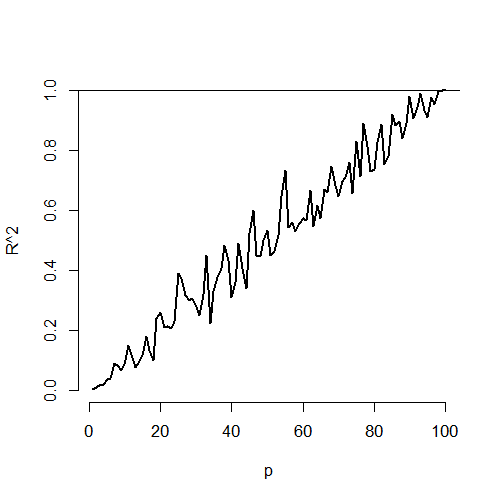

## Multivariable regression
* We have an entire class on prediction and machine learning, so we'll focus on modeling.
  * Prediction has a different set of criteria, needs for interpretability and standards for generalizability.
  * In modeling, our interest lies in parsimonious, interpretable representations of the data that enhance our understanding of the phenomena under study.
  * A model is a lense through which to look at your data. (I attribute this quote to Scott Zeger)
  * Under this philosophy, what's the right model? Whatever model connects the data to a true, parsimonious statement about what you're studying.
* There are nearly uncontable ways that a model can be wrong, in this lecture, we'll focus on variable inclusion and exclusion.
* Like nearly all aspects of statistics, good modeling decisions are context dependent.
  * A good model for prediction versus one for studying mechanisms versus one for trying to establish causal effects may not be the same.

---
## The Rumsfeldian triplet

*There are known knowns. These are things we know that we know. There are known unknowns. That is to say, there are things that we know we don't know. But there are also unknown unknowns. There are things we don't know we don't know.* Donald Rumsfeld

In our context
* (Known knowns) Regressors that we know we should check to include in the model and have.
* (Known Unknowns) Regressors that we would like to include in the model, but don't have.
* (Unknown Unknowns) Regressors that we don't even know about that we should have included in the model.

---
## General rules
* Omitting variables results in bias in the coeficients of interest - unless their regressors are uncorrelated with the omitted ones.
  * This is why we randomize treatments, it attempts to uncorrelate our treatment indicator with variables that we don't have to put in the model. 
  * (If there's too many unobserved confounding variables, even randomization won't help you.)
* Including variables that we shouldn't have increases standard errors of the regression variables.
  * Actually, including any new variables increasese (actual, not estimated) standard errors of other regressors. So we don't want to idly throw variables into the model.
* The model must tend toward perfect fit as the number of non-redundant regressors approaches $n$.
* $R^2$ increases monotonically as more regressors are included.
* The SSE decreases monotonically as more regressors are included.

---
## Plot of $R^2$ versus $n$
For simulations as the number of variables included equals increases to $n=100$. 
No actual regression relationship exist in any simulation
<div class="rimage center"></div>


---
## Variance inflation

```r
n <- 100; nosim <- 1000
x1 <- rnorm(n); x2 <- rnorm(n); x3 <- rnorm(n); 
betas <- sapply(1 : nosim, function(i){
  y <- x1 + rnorm(n, sd = .3)
  c(coef(lm(y ~ x1))[2], 
    coef(lm(y ~ x1 + x2))[2], 
    coef(lm(y ~ x1 + x2 + x3))[2])
})
round(apply(betas, 1, sd), 5)
```

```
     x1      x1      x1 
0.02839 0.02872 0.02884 
```


---
## Variance inflation

```r
n <- 100; nosim <- 1000
x1 <- rnorm(n); x2 <- x1/sqrt(2) + rnorm(n) /sqrt(2)
x3 <- x1 * 0.95 + rnorm(n) * sqrt(1 - 0.95^2); 
betas <- sapply(1 : nosim, function(i){
  y <- x1 + rnorm(n, sd = .3)
  c(coef(lm(y ~ x1))[2], 
    coef(lm(y ~ x1 + x2))[2], 
    coef(lm(y ~ x1 + x2 + x3))[2])
})
round(apply(betas, 1, sd), 5)
```

```
     x1      x1      x1 
0.03131 0.04270 0.09653 
```


---
## Variance inflation factors
* Notice variance inflation was much worse when we included a variable that
was highly related to `x1`. 
* We don't know $\sigma$, so we can only estimate the increase in the actual standard error of the coefficients for including a regressor.
* However, $\sigma$ drops out of the relative standard errors. If one sequentially adds variables, one can check the variance (or sd) inflation for including each one.
* When the other regressors are actually orthogonal to the regressor of interest, then there is no variance inflation.
* The variance inflation factor (VIF) is the increase in the variance for the ith regressor compared to the ideal setting where it is orthogonal to the other regressors.
  * (The square root of the VIF is the increase in the sd ...)
* Remember, variance inflation is only part of the picture. We want to include certain variables, even if they dramatically inflate our variance. 

---
## Revisting our previous simulation

```r
##doesn't depend on which y you use,
y <- x1 + rnorm(n, sd = .3)
a <- summary(lm(y ~ x1))$cov.unscaled[2,2]
c(summary(lm(y ~ x1 + x2))$cov.unscaled[2,2],
  summary(lm(y~ x1 + x2 + x3))$cov.unscaled[2,2]) / a
```

```
[1] 1.895 9.948
```

```r
temp <- apply(betas, 1, var); temp[2 : 3] / temp[1]
```

```
   x1    x1 
1.860 9.506 
```

---
## Swiss data

```r
data(swiss); 
fit1 <- lm(Fertility ~ Agriculture, data = swiss)
a <- summary(fit1)$cov.unscaled[2,2]
fit2 <- update(fit, Fertility ~ Agriculture + Examination)
fit3 <- update(fit, Fertility ~ Agriculture + Examination + Education)
  c(summary(fit2)$cov.unscaled[2,2],
    summary(fit3)$cov.unscaled[2,2]) / a 
```

```
[1] 1.892 2.089
```


---
## Swiss data VIFs, 

```r
library(car)
fit <- lm(Fertility ~ . , data = swiss)
vif(fit)
```

```
     Agriculture      Examination        Education         Catholic Infant.Mortality 
           2.284            3.675            2.775            1.937            1.108 
```

```r
sqrt(vif(fit)) #I prefer sd 
```

```
     Agriculture      Examination        Education         Catholic Infant.Mortality 
           1.511            1.917            1.666            1.392            1.052 
```


---
## What about residual variance estimation?
* Assuming that the model is linear with additive iid errors (with finite variance), we can mathematically describe the impact of omitting necessary variables or including unnecessary ones.
  * If we underfit the model, the variance estimate is biased. 
  * If we correctly or overfit the model, including all necessary covariates and/or unnecessary covariates, the variance estimate is unbiased.
    * However, the variance of the variance is larger if we include unnecessary variables.

---
## Covariate model selection
* Automated covariate selection is a difficult topic. It depends heavily on how rich of a covariate space one wants to explore. 
  * The space of models explodes quickly as you add interactions and polynomial terms. 
* In the prediction class, we'll cover many modern methods for traversing large model spaces for the purposes of prediction.
* Principal components or factor analytic models on covariates are often useful for reducing complex covariate spaces.
* Good design can often eliminate the need for complex model searches at analyses; though often control over the design is limited.
* If the models of interest are nested and without lots of parameters differentiating them, it's fairly uncontroversial to use nested likelihood ratio tests. (Example to follow.)
* My favoriate approach is as follows. Given a coefficient that I'm interested in, I like to use covariate adjustment and multiple models to probe that effect to evaluate it for robustness and to see what other covariates knock it out.  This isn't a terribly systematic approach, but it tends to teach you a lot about the the data as you get your hands dirty.

---
## How to do nested model testing in R

```r
fit1 <- lm(Fertility ~ Agriculture, data = swiss)
fit3 <- update(fit, Fertility ~ Agriculture + Examination + Education)
fit5 <- update(fit, Fertility ~ Agriculture + Examination + Education + Catholic + Infant.Mortality)
anova(fit1, fit3, fit5)
```

```
Analysis of Variance Table

Model 1: Fertility ~ Agriculture
Model 2: Fertility ~ Agriculture + Examination + Education
Model 3: Fertility ~ Agriculture + Examination + Education + Catholic + 
    Infant.Mortality
  Res.Df  RSS Df Sum of Sq    F  Pr(>F)    
1     45 6283                              
2     43 3181  2      3102 30.2 8.6e-09 ***
3     41 2105  2      1076 10.5 0.00021 ***
---
Signif. codes:  0 '***' 0.001 '**' 0.01 '*' 0.05 '.' 0.1 ' ' 1
```

