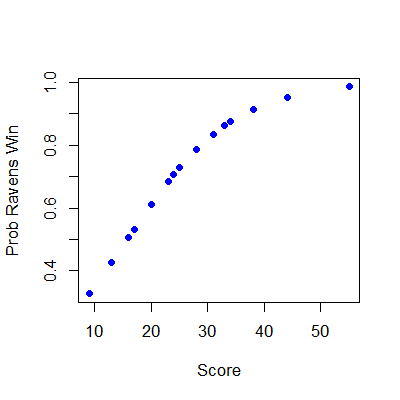

## Key ideas

* Frequently we care about outcomes that have two values
  * Alive/dead
  * Win/loss
  * Success/Failure
  * etc
* Called binary, Bernoulli or 0/1 outcomes 
* Collection of exchangeable binary outcomes for the same covariate data are called binomial outcomes.

---

## Example Baltimore Ravens win/loss
### Ravens Data


```r
download.file("https://dl.dropboxusercontent.com/u/7710864/data/ravensData.rda"
              , destfile="./data/ravensData.rda",method="curl")
load("./data/ravensData.rda")
head(ravensData)
```

```
  ravenWinNum ravenWin ravenScore opponentScore
1           1        W         24             9
2           1        W         38            35
3           1        W         28            13
4           1        W         34            31
5           1        W         44            13
6           0        L         23            24
```


---

## Linear regression

$$ RW_i = b_0 + b_1 RS_i + e_i $$

$RW_i$ - 1 if a Ravens win, 0 if not

$RS_i$ - Number of points Ravens scored

$b_0$ - probability of a Ravens win if they score 0 points

$b_1$ - increase in probability of a Ravens win for each additional point

$e_i$ - residual variation due 

---

## Linear regression in R


```r
lmRavens <- lm(ravensData$ravenWinNum ~ ravensData$ravenScore)
summary(lmRavens)$coef
```

```
                      Estimate Std. Error t value Pr(>|t|)
(Intercept)             0.2850   0.256643   1.111  0.28135
ravensData$ravenScore   0.0159   0.009059   1.755  0.09625
```

---

## Odds

__Binary Outcome 0/1__

$$RW_i$$  

__Probability (0,1)__

$$\rm{Pr}(RW_i | RS_i, b_0, b_1 )$$


__Odds $(0,\infty)$__
$$\frac{\rm{Pr}(RW_i | RS_i, b_0, b_1 )}{1-\rm{Pr}(RW_i | RS_i, b_0, b_1)}$$ 

__Log odds $(-\infty,\infty)$__

$$\log\left(\frac{\rm{Pr}(RW_i | RS_i, b_0, b_1 )}{1-\rm{Pr}(RW_i | RS_i, b_0, b_1)}\right)$$ 


---

## Linear vs. logistic regression

__Linear__

$$ RW_i = b_0 + b_1 RS_i + e_i $$

or

$$ E[RW_i | RS_i, b_0, b_1] = b_0 + b_1 RS_i$$

__Logistic__

$$ \rm{Pr}(RW_i | RS_i, b_0, b_1) = \frac{\exp(b_0 + b_1 RS_i)}{1 + \exp(b_0 + b_1 RS_i)}$$

or

$$ \log\left(\frac{\rm{Pr}(RW_i | RS_i, b_0, b_1 )}{1-\rm{Pr}(RW_i | RS_i, b_0, b_1)}\right) = b_0 + b_1 RS_i $$

---

## Interpreting Logistic Regression

$$ \log\left(\frac{\rm{Pr}(RW_i | RS_i, b_0, b_1 )}{1-\rm{Pr}(RW_i | RS_i, b_0, b_1)}\right) = b_0 + b_1 RS_i $$


$b_0$ - Log odds of a Ravens win if they score zero points

$b_1$ - Log odds ratio of win probability for each point scored (compared to zero points)

$\exp(b_1)$ - Odds ratio of win probability for each point scored (compared to zero points)

---
## Odds
- Imagine that you are playing a game where you flip a coin with success probability $p$.
- If it comes up heads, you win $X$. If it comes up tails, you lose $Y$.
- What should we set $X$ and $Y$ for the game to be fair?

    $$E[earnings]= X p - Y (1 - p) = 0$$
- Implies
    $$\frac{Y}{X} = \frac{p}{1 - p}$$    
- The odds can be said as "How much should you be willing to pay for a $p$ probability of winning a dollar?"
    - (If $p > 0.5$ you have to pay more if you lose than you get if you win.)
    - (If $p < 0.5$ you have to pay less if you lose than you get if you win.)

---
## Visualizing fitting logistic regression curves
```
x <- seq(-10, 10, length = 1000)
manipulate(
    plot(x, exp(beta0 + beta1 * x) / (1 + exp(beta0 + beta1 * x)), 
         type = "l", lwd = 3, frame = FALSE),
    beta1 = slider(-2, 2, step = .1, initial = 2),
    beta0 = slider(-2, 2, step = .1, initial = 0)
    )
```

---

## Ravens logistic regression


```r
logRegRavens <- glm(ravensData$ravenWinNum ~ ravensData$ravenScore,family="binomial")
summary(logRegRavens)
```

```

Call:
glm(formula = ravensData$ravenWinNum ~ ravensData$ravenScore, 
    family = "binomial")

Deviance Residuals: 
   Min      1Q  Median      3Q     Max  
-1.758  -1.100   0.530   0.806   1.495  

Coefficients:
                      Estimate Std. Error z value Pr(>|z|)
(Intercept)            -1.6800     1.5541   -1.08     0.28
ravensData$ravenScore   0.1066     0.0667    1.60     0.11

(Dispersion parameter for binomial family taken to be 1)

    Null deviance: 24.435  on 19  degrees of freedom
Residual deviance: 20.895  on 18  degrees of freedom
AIC: 24.89

Number of Fisher Scoring iterations: 5
```


---

## Ravens fitted values


```r
plot(ravensData$ravenScore,logRegRavens$fitted,pch=19,col="blue",xlab="Score",ylab="Prob Ravens Win")
```

<div class="rimage center"></div>


---

## Odds ratios and confidence intervals


```r
exp(logRegRavens$coeff)
```

```
          (Intercept) ravensData$ravenScore 
               0.1864                1.1125 
```

```r
exp(confint(logRegRavens))
```

```
                         2.5 % 97.5 %
(Intercept)           0.005675  3.106
ravensData$ravenScore 0.996230  1.303
```


---

## ANOVA for logistic regression


```r
anova(logRegRavens,test="Chisq")
```

```
Analysis of Deviance Table

Model: binomial, link: logit

Response: ravensData$ravenWinNum

Terms added sequentially (first to last)

                      Df Deviance Resid. Df Resid. Dev Pr(>Chi)  
NULL                                     19       24.4           
ravensData$ravenScore  1     3.54        18       20.9     0.06 .
---
Signif. codes:  0 '***' 0.001 '**' 0.01 '*' 0.05 '.' 0.1 ' ' 1
```


---

## Interpreting Odds Ratios

* Not probabilities 
* Odds ratio of 1 = no difference in odds
* Log odds ratio of 0 = no difference in odds
* Odds ratio < 0.5 or > 2 commonly a "moderate effect"
* Relative risk $\frac{\rm{Pr}(RW_i | RS_i = 10)}{\rm{Pr}(RW_i | RS_i = 0)}$ often easier to interpret, harder to estimate
* For small probabilities RR $\approx$ OR but __they are not the same__!

[Wikipedia on Odds Ratio](http://en.wikipedia.org/wiki/Odds_ratio)


---

## Further resources

* [Wikipedia on Logistic Regression](http://en.wikipedia.org/wiki/Logistic_regression)
* [Logistic regression and glms in R](http://data.princeton.edu/R/glms.html)
* Brian Caffo's lecture notes on: [Simpson's paradox](http://ocw.jhsph.edu/courses/MethodsInBiostatisticsII/PDFs/lecture23.pdf), [Case-control studies](http://ocw.jhsph.edu/courses/MethodsInBiostatisticsII/PDFs/lecture24.pdf)
* [Open Intro Chapter on Logistic Regression](http://www.openintro.org/stat/down/oiStat2_08.pdf)


