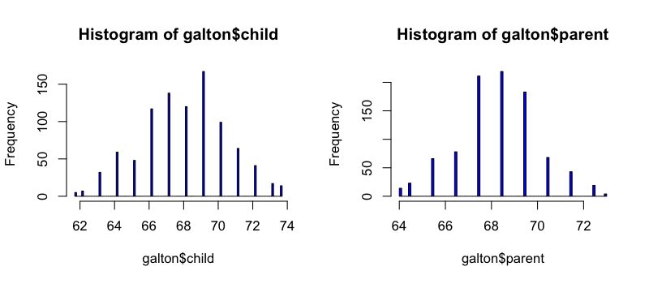
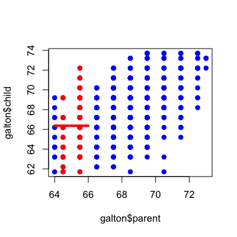
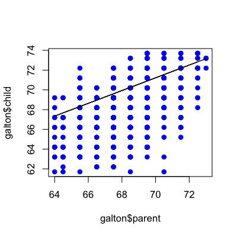
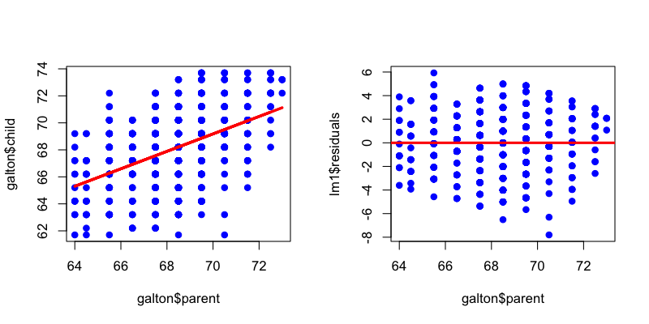

## Goals of statistical modeling

* Describe the distribution of variables
* Describe the relationship between variables
* Make inferences about distributions or relationships


---

## Example: Average parent and child heights


[http://www.nature.com/ejhg/journal/v17/n8/full/ejhg20095a.html](http://www.nature.com/ejhg/journal/v17/n8/full/ejhg20095a.html)


---


## Still relevant


[http://www.nature.com/ejhg/journal/v17/n8/full/ejhg20095a.html](http://www.nature.com/ejhg/journal/v17/n8/full/ejhg20095a.html)

[Predicting height: the Victorian approach beats modern genomics](http://www.wired.com/wiredscience/2009/03/predicting-height-the-victorian-approach-beats-modern-genomics/)


---

## Load Galton Data

You may need to run `install.packages("UsingR")` if the `UsingR` library is not installed


```r
library(UsingR); data(galton)
par(mfrow=c(1,2))
hist(galton$child,col="blue",breaks=100)
hist(galton$parent,col="blue",breaks=100)
```

<div class="rimage center"></div>


---

## The distribution of child heights


```r
hist(galton$child,col="blue",breaks=100)
```

<div class="rimage center"></div>


---

## Only know the child  - average height


```r
hist(galton$child,col="blue",breaks=100)
meanChild <- mean(galton$child)
lines(rep(meanChild,100),seq(0,150,length=100),col="red",lwd=5)
```

<div class="rimage center"></div>


---

## Only know the child  - why average?

If $C_i$ is the height of child $i$ then the average is the value of $\mu$ that minimizes:

$$ \sum_{i=1}^{928}(C_i - \mu)^2 $$

---

## What if we plot child versus average parent


```r
plot(galton$parent,galton$child,pch=19,col="blue")
```

<div class="rimage center"></div>


---

## Jittered plot


```r
set.seed(1234)
plot(jitter(galton$parent,factor=2),jitter(galton$child,factor=2),pch=19,col="blue")
```

<div class="rimage center"></div>


---

## Average parent = 65 inches tall


```r
plot(galton$parent,galton$child,pch=19,col="blue")
near65 <- galton[abs(galton$parent - 65)<1, ]
points(near65$parent,near65$child,pch=19,col="red")
lines(seq(64,66,length=100),rep(mean(near65$child),100),col="red",lwd=4)
```

<div class="rimage center"></div>


---

## Average parent = 71 inches tall


```r
plot(galton$parent,galton$child,pch=19,col="blue")
near71 <- galton[abs(galton$parent - 71)<1, ]
points(near71$parent,near71$child,pch=19,col="red")
lines(seq(70,72,length=100),rep(mean(near71$child),100),col="red",lwd=4)
```

<div class="rimage center"></div>


---

## Fitting a line


```r
plot(galton$parent,galton$child,pch=19,col="blue")
lm1 <- lm(galton$child ~ galton$parent)
lines(galton$parent,lm1$fitted,col="red",lwd=3)
```

<div class="rimage center"></div>


---

## Why not this line?


```r
plot(galton$parent,galton$child,pch=19,col="blue")
lines(galton$parent, 26 + 0.646*galton$parent)
```

<div class="rimage center"></div>


---

## The equation for a line

If $C_i$ is the height of child $i$ and $P_i$ is the height of the average parent, then we can imagine writing the equation for a line

$$C_i = b_0 + b_1 P_i$$


---

## Not all points are on the line


```r
plot(galton$parent,galton$child,pch=19,col="blue")
lines(galton$parent,lm1$fitted,col="red",lwd=3)
```

<div class="rimage center"></div>


---

## Allowing for variation

If $C_i$ is the height of child $i$ and $P_i$ is the height of the average parent, then we can imagine writing the equation for a line

$$C_i = b_0 + b_1 P_i + e_i$$

$e_i$ is everything we didn't measure (how much they eat, where they live, do they stretch in the morning...)

---

## How do we pick best?

If $C_i$ is the height of child $i$ and $P_i$ is the height of the average parent, pick the line that makes the child values $C_i$ and our guesses

$$ \sum_{i=1}^{928}(C_i - \{b_0 + b_1 P_i\})^2 $$


---

## Plot what is leftover


```r
par(mfrow=c(1,2))
plot(galton$parent,galton$child,pch=19,col="blue")
lines(galton$parent,lm1$fitted,col="red",lwd=3)
plot(galton$parent,lm1$residuals,col="blue",pch=19)
abline(c(0,0),col="red",lwd=3)
```

<div class="rimage center"></div>


