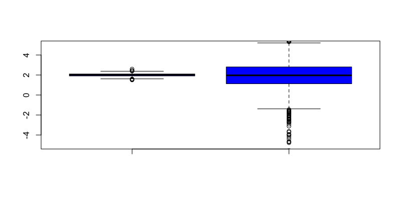
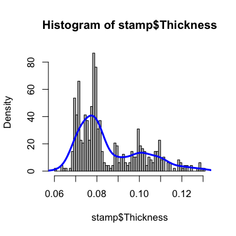
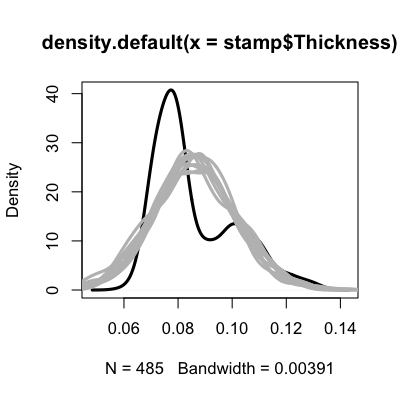
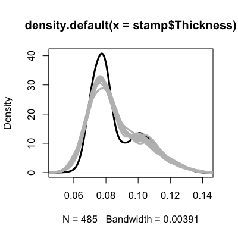

## Basic ideas

* Way back in the first week we talked about simulating data from distributions in R using the _rfoo_ functions. 
* In general simulations are way more flexible/useful
  * For bootstrapping as we saw in week 7
  * For evaluating models
  * For testing different hypotheses
  * For sensitivity analysis
* At minimum it is useful to simulate
  * A best case scenario
  * A few examples where you know your approach won't work
  * [The importance of simulating the extremes](http://simplystatistics.org/2013/03/06/the-importance-of-simulating-the-extremes/)
  


---

## Simulating data from a model

Suppose that you have a regression model

$$ Y_i = b_0 + b_1 X_i  + e_i$$

Here is an example of generating data from this model where $X_i$ and $e_i$ are normal:


```r
set.seed(44333)
x <- rnorm(50)
e <- rnorm(50)
b0 <- 1; b1 <- 2
y <- b0 + b1*x + e
```


---

## Violating assumptions


```r
set.seed(44333)
x <- rnorm(50)
e <- rnorm(50); e2 <- rcauchy(50)
b0 <- 1; b1 <- 2
y <- b0 + b1*x + e; y2 <-  b0 + b1*x + e2
```


---

## Violating assumptions


```r
par(mfrow=c(1,2))
plot(lm(y ~ x)$fitted,lm(y~x)$residuals,pch=19,xlab="fitted",ylab="residuals")
plot(lm(y2 ~ x)$fitted,lm(y2~x)$residuals,pch=19,xlab="fitted",ylab="residuals")
```

<div class="rimage center"></div>


---

## Repeated simulations


```r
set.seed(44333)
betaNorm <- betaCauch <- rep(NA,1000)
for(i in 1:1000){
  x <- rnorm(50); e <- rnorm(50); e2 <- rcauchy(50); b0 <- 1; b1 <- 2
  y <-  b0 + b1*x + e; y2 <- b0 + b1*x + e2
  betaNorm[i] <- lm(y ~ x)$coeff[2]; betaCauch[i] <- lm(y2 ~ x)$coeff[2]
}
quantile(betaNorm)
```

```
   0%   25%   50%   75%  100% 
1.500 1.906 2.013 2.100 2.596 
```

```r
quantile(betaCauch)
```

```
      0%      25%      50%      75%     100% 
-278.352    1.130    1.965    2.804  272.391 
```


---

## Monte Carlo Error


```r
boxplot(betaNorm,betaCauch,col="blue",ylim=c(-5,5))
```

<div class="rimage center"></div>


---

## Simulation based on a data set


```r
library(UsingR); data(galton); nobs <- dim(galton)[1]
par(mfrow=c(1,2))
hist(galton$child,col="blue",breaks=100)
hist(galton$parent,col="blue",breaks=100)
```

<div class="rimage center"></div>


---

## Calculating means,variances


```r
lm1 <- lm(galton$child ~ galton$parent)
parent0 <- rnorm(nobs,sd=sd(galton$parent),mean=mean(galton$parent))
child0 <- lm1$coeff[1] + lm1$coeff[2]*parent0 + rnorm(nobs,sd=summary(lm1)$sigma)
par(mfrow=c(1,2))
plot(galton$parent,galton$child,pch=19)
plot(parent0,child0,pch=19,col="blue")
```

<div class="rimage center"></div>


---

## Simulating more complicated scenarios


```r
library(bootstrap); data(stamp); nobs <- dim(stamp)[1]
hist(stamp$Thickness,col="grey",breaks=100,freq=F)
dens <- density(stamp$Thickness)
lines(dens,col="blue",lwd=3)
```

<div class="rimage center"></div>


---

## A simulation that is too simple


```r
plot(density(stamp$Thickness),col="black",lwd=3)
for(i in 1:10){
  newThick <- rnorm(nobs,mean=mean(stamp$Thickness),sd=sd(stamp$Thickness))
  lines(density(newThick),col="grey",lwd=3)
}
```

<div class="rimage center"></div>


---

## How density estimation works


[http://en.wikipedia.org/wiki/File:Comparison_of_1D_histogram_and_KDE.png](http://en.wikipedia.org/wiki/File:Comparison_of_1D_histogram_and_KDE.png)

---

## Simulating from the density estimate


```r
plot(density(stamp$Thickness),col="black",lwd=3)
for(i in 1:10){
  newThick <- rnorm(nobs,mean=stamp$Thickness,sd=dens$bw)
  lines(density(newThick),col="grey",lwd=3)
}
```

<div class="rimage center"></div>


---

## Increasing variability 


```r
plot(density(stamp$Thickness),col="black",lwd=3)
for(i in 1:10){
  newThick <- rnorm(nobs,mean=stamp$Thickness,sd=dens$bw*1.5)
  lines(density(newThick,bw=dens$bw),col="grey",lwd=3)
}
```

<div class="rimage center"></div>


---

## Notes and further resources

__Notes__

* Simulation can be applied to missing data problems - simulate what missing data might be
* Simulation values are often drawn from standard distributions, but this may not be appropriate
* Sensitivity analysis means trying different simulations with different assumptions and seeing how estimates change

__Further resources__

* [Advanced Data Analysis From An Elementary Point of View](http://www.stat.cmu.edu/~cshalizi/ADAfaEPoV/ADAfaEPoV.pdf)
* [The design of simulation studies in medical statistics](http://www.soph.uab.edu/ssg/files/Club_ssg/MPadilla_07.pdf)
* [Simulation studies in statistics](http://www4.stat.ncsu.edu/~davidian/st810a/simulation_handout.pdf)

