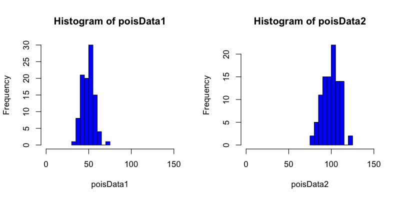
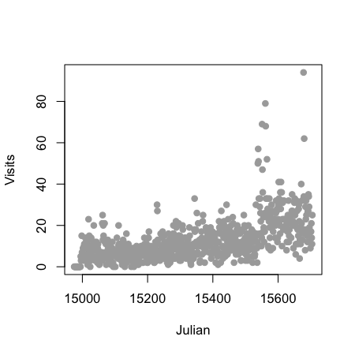
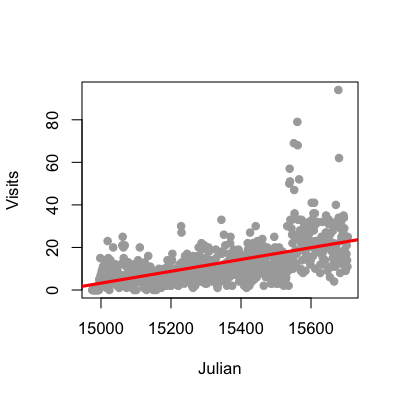
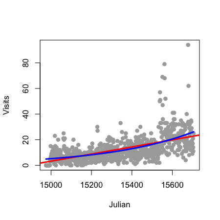
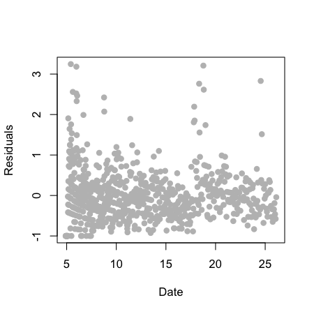
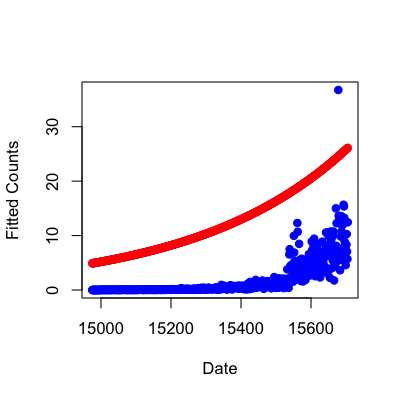
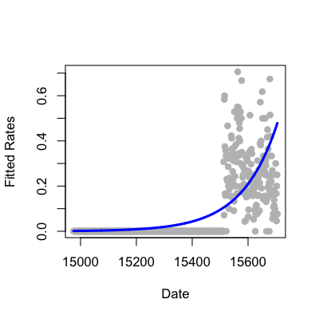

## Key ideas

* Many data take the form of counts
  * Calls to a call center
  * Number of flu cases in an area
  * Number of cars that cross a bridge
* Data may also be in the form of rates
  * Percent of children passing a test
  * Percent of hits to a website from a country
* Linear regression with transformation is an option

---

## Poisson distribution


```r
set.seed(3433); par(mfrow=c(1,2))
poisData2 <- rpois(100,lambda=100); poisData1 <- rpois(100,lambda=50)
hist(poisData1,col="blue",xlim=c(0,150)); hist(poisData2,col="blue",xlim=c(0,150))
```

<div class="rimage center"></div>


---

## Poisson distribution


```r
c(mean(poisData1),var(poisData1))
```

```
[1] 49.85 49.38
```

```r
c(mean(poisData2),var(poisData2))
```

```
[1] 100.12  95.26
```


---

## Example: Leek Group Website Traffic


[http://biostat.jhsph.edu/~jleek/](http://biostat.jhsph.edu/~jleek/)

---

## Website data


```r
download.file("https://dl.dropboxusercontent.com/u/7710864/data/gaData.rda",destfile="./data/gaData.rda",method="curl")
load("./data/gaData.rda")
gaData$julian <- julian(gaData$date)
head(gaData)
```

```
        date visits simplystats julian
1 2011-01-01      0           0  14975
2 2011-01-02      0           0  14976
3 2011-01-03      0           0  14977
4 2011-01-04      0           0  14978
5 2011-01-05      0           0  14979
6 2011-01-06      0           0  14980
```


[http://skardhamar.github.com/rga/](http://skardhamar.github.com/rga/)


---

## Plot data


```r
plot(gaData$julian,gaData$visits,pch=19,col="darkgrey",xlab="Julian",ylab="Visits")
```

<div class="rimage center"></div>


---

## Linear regression

$$ NH_i = b_0 + b_1 JD_i + e_i $$

$NH_i$ - number of hits to the website

$JD_i$ - day of the year (Julian day)

$b_0$ - number of hits on Julian day 0 (1970-01-01)

$b_1$ - increase in number of hits per unit day

$e_i$ - variation due to everything we didn't measure


---

## Linear regression line


```r
plot(gaData$julian,gaData$visits,pch=19,col="darkgrey",xlab="Julian",ylab="Visits")
lm1 <- lm(gaData$visits ~ gaData$julian)
abline(lm1,col="red",lwd=3)
```

<div class="rimage center"></div>


---

## Linear vs. Poisson regression

__Linear__

$$ NH_i = b_0 + b_1 JD_i + e_i $$

or

$$ E[NH_i | JD_i, b_0, b_1] = b_0 + b_1 JD_i$$

__Poisson/log-linear__

$$ \log\left(E[NH_i | JD_i, b_0, b_1]\right) = b_0 + b_1 JD_i $$

or

$$ E[NH_i | JD_i, b_0, b_1] = \exp\left(b_0 + b_1 JD_i\right) $$


---

## Multiplicative differences

<br><br>
$$ E[NH_i | JD_i, b_0, b_1] = \exp\left(b_0 + b_1 JD_i\right) $$

<br><br>

$$ E[NH_i | JD_i, b_0, b_1] = \exp\left(b_0 \right)\exp\left(b_1 JD_i\right) $$

<br><br>

If $JD_i$ is increased by one unit, $E[NH_i | JD_i, b_0, b_1]$ is multiplied by $\exp\left(b_1\right)$

---

## Poisson regression in R


```r
plot(gaData$julian,gaData$visits,pch=19,col="darkgrey",xlab="Julian",ylab="Visits")
glm1 <- glm(gaData$visits ~ gaData$julian,family="poisson")
abline(lm1,col="red",lwd=3); lines(gaData$julian,glm1$fitted,col="blue",lwd=3)
```

<div class="rimage center"></div>


---

## Mean-variance relationship?


```r
plot(glm1$fitted,glm1$residuals,pch=19,col="grey",ylab="Residuals",xlab="Date")
```

<div class="rimage center"></div>


---

## Model agnostic standard errors 


```r
library(sandwich)
confint.agnostic <- function (object, parm, level = 0.95, ...)
{
    cf <- coef(object); pnames <- names(cf)
    if (missing(parm))
        parm <- pnames
    else if (is.numeric(parm))
        parm <- pnames[parm]
    a <- (1 - level)/2; a <- c(a, 1 - a)
    pct <- stats:::format.perc(a, 3)
    fac <- qnorm(a)
    ci <- array(NA, dim = c(length(parm), 2L), dimnames = list(parm,
                                                               pct))
    ses <- sqrt(diag(sandwich::vcovHC(object)))[parm]
    ci[] <- cf[parm] + ses %o% fac
    ci
}
```

[http://stackoverflow.com/questions/3817182/vcovhc-and-confidence-interval](http://stackoverflow.com/questions/3817182/vcovhc-and-confidence-interval)

---

## Estimating confidence intervals


```r
confint(glm1)
```

```
                  2.5 %     97.5 %
(Intercept)   -34.34658 -31.159716
gaData$julian   0.00219   0.002396
```

```r
confint.agnostic(glm1)
```


---

## Rates 


<br><br>


$$ E[NHSS_i | JD_i, b_0, b_1]/NH_i = \exp\left(b_0 + b_1 JD_i\right) $$

<br><br>

$$ \log\left(E[NHSS_i | JD_i, b_0, b_1]\right) - \log(NH_i)  =  b_0 + b_1 JD_i $$

<br><br>

$$ \log\left(E[NHSS_i | JD_i, b_0, b_1]\right) = \log(NH_i) + b_0 + b_1 JD_i $$

---

## Fitting rates in R 


```r
glm2 <- glm(gaData$simplystats ~ julian(gaData$date),offset=log(visits+1),
            family="poisson",data=gaData)
plot(julian(gaData$date),glm2$fitted,col="blue",pch=19,xlab="Date",ylab="Fitted Counts")
points(julian(gaData$date),glm1$fitted,col="red",pch=19)
```

<div class="rimage center"></div>


---

## Fitting rates in R 


```r
glm2 <- glm(gaData$simplystats ~ julian(gaData$date),offset=log(visits+1),
            family="poisson",data=gaData)
plot(julian(gaData$date),gaData$simplystats/(gaData$visits+1),col="grey",xlab="Date",
     ylab="Fitted Rates",pch=19)
lines(julian(gaData$date),glm2$fitted/(gaData$visits+1),col="blue",lwd=3)
```

<div class="rimage center"></div>


---

## More information

* [Log-linear models and multiway tables](http://ww2.coastal.edu/kingw/statistics/R-tutorials/loglin.html)
* [Wikipedia on Poisson regression](http://en.wikipedia.org/wiki/Poisson_regression), [Wikipedia on overdispersion](http://en.wikipedia.org/wiki/Overdispersion)
* [Regression models for count data in R](http://cran.r-project.org/web/packages/pscl/vignettes/countreg.pdf)
* [pscl package](http://cran.r-project.org/web/packages/pscl/index.html) - the function _zeroinfl_ fits zero inflated models. 
