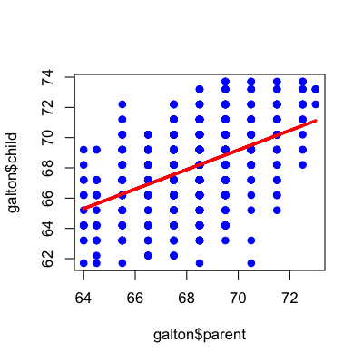
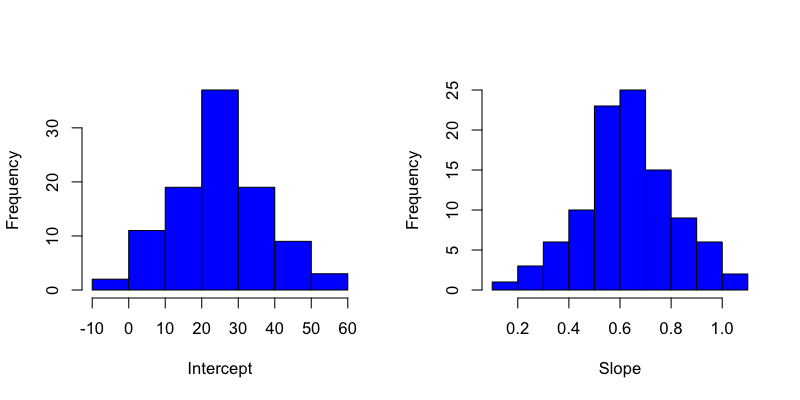
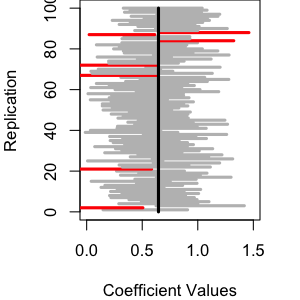

## Fit a line to the Galton Data


```r
library(UsingR); data(galton);
plot(galton$parent,galton$child,pch=19,col="blue")
lm1 <- lm(galton$child ~ galton$parent)
lines(galton$parent,lm1$fitted,col="red",lwd=3)
```

<div class="rimage center"></div>


---

## Fit a line to the Galton Data


```r
lm1
```

```

Call:
lm(formula = galton$child ~ galton$parent)

Coefficients:
  (Intercept)  galton$parent  
       23.942          0.646  
```


---

## Create a "population" of 1 million families


```r
newGalton <- data.frame(parent=rep(NA,1e6),child=rep(NA,1e6))
newGalton$parent <- rnorm(1e6,mean=mean(galton$parent),sd=sd(galton$parent))
newGalton$child <- lm1$coeff[1] + lm1$coeff[2]*newGalton$parent + rnorm(1e6,sd=sd(lm1$residuals))
smoothScatter(newGalton$parent,newGalton$child)
abline(lm1,col="red",lwd=3)
```

<div class="rimage center"></div>


---

## Let's take a sample


```r
set.seed(134325); sampleGalton1 <- newGalton[sample(1:1e6,size=50,replace=F),]
sampleLm1 <- lm(sampleGalton1$child ~ sampleGalton1$parent)
plot(sampleGalton1$parent,sampleGalton1$child,pch=19,col="blue")
lines(sampleGalton1$parent,sampleLm1$fitted,lwd=3,lty=2)
abline(lm1,col="red",lwd=3)
```

<div class="rimage center"></div>


---

## Let's take another sample


```r
sampleGalton2 <- newGalton[sample(1:1e6,size=50,replace=F),]
sampleLm2 <- lm(sampleGalton2$child ~ sampleGalton2$parent)
plot(sampleGalton2$parent,sampleGalton2$child,pch=19,col="blue")
lines(sampleGalton2$parent,sampleLm2$fitted,lwd=3,lty=2)
abline(lm1,col="red",lwd=3)
```

<div class="rimage center"></div>


---

## Let's take another sample


```r
sampleGalton3 <- newGalton[sample(1:1e6,size=50,replace=F),]
sampleLm3 <- lm(sampleGalton3$child ~ sampleGalton3$parent)
plot(sampleGalton3$parent,sampleGalton3$child,pch=19,col="blue")
lines(sampleGalton3$parent,sampleLm3$fitted,lwd=3,lty=2)
abline(lm1,col="red",lwd=3)
```

<div class="rimage center"></div>


---

## Many samples


```r
sampleLm <- vector(100,mode="list")
for(i in 1:100){
  sampleGalton <- newGalton[sample(1:1e6,size=50,replace=F),]
  sampleLm[[i]] <- lm(sampleGalton$child ~ sampleGalton$parent)
}
```


---

## Many samples


```r
smoothScatter(newGalton$parent,newGalton$child)
for(i in 1:100){abline(sampleLm[[i]],lwd=3,lty=2)}
abline(lm1,col="red",lwd=3)
```

<div class="rimage center"></div>


---

## Histogram of estimates


```r
par(mfrow=c(1,2))
hist(sapply(sampleLm,function(x){coef(x)[1]}),col="blue",xlab="Intercept",main="")
hist(sapply(sampleLm,function(x){coef(x)[2]}),col="blue",xlab="Slope",main="")
```

<div class="rimage center"></div>


---

## Distribution of coefficients

From the [central limit theorem](https://www.khanacademy.org/math/probability/statistics-inferential/sampling_distribution/v/central-limit-theorem) it turns out that in many cases:

$$\hat{b}_0 \sim N(b_0, Var(\hat{b}_0))$$
$$\hat{b}_1 \sim N(b_0, Var(\hat{b}_1))$$

which we can estimate with:

$$\hat{b}_0 \approx N(b_0, \hat{Var}(\hat{b}_0))$$
$$\hat{b}_1 \approx N(b_0, \hat{Var}(\hat{b}_1))$$

$\sqrt{\hat{Var}(\hat{b}_0)}$ is the "standard error" of the estimate $\hat{b}_0$ and is abbreviated $S.E.(\hat{b}_0)$


---

## Estimating the values in R


```r
sampleGalton4 <- newGalton[sample(1:1e6,size=50,replace=F),]
sampleLm4 <- lm(sampleGalton4$child ~ sampleGalton4$parent)
summary(sampleLm4)
```

```

Call:
lm(formula = sampleGalton4$child ~ sampleGalton4$parent)

Residuals:
   Min     1Q Median     3Q    Max 
-4.360 -1.610 -0.289  2.020  4.387 

Coefficients:
                     Estimate Std. Error t value Pr(>|t|)    
(Intercept)            15.863     11.773    1.35     0.18    
sampleGalton4$parent    0.770      0.174    4.43  5.4e-05 ***
---
Signif. codes:  0 '***' 0.001 '**' 0.01 '*' 0.05 '.' 0.1 ' ' 1

Residual standard error: 2.29 on 48 degrees of freedom
Multiple R-squared:  0.291,	Adjusted R-squared:  0.276 
F-statistic: 19.7 on 1 and 48 DF,  p-value: 5.36e-05
```


---

## Estimating the values in R


```r
hist(sapply(sampleLm,function(x){coef(x)[2]}),col="blue",xlab="Slope",main="",freq=F)
lines(seq(0,5,length=100),dnorm(seq(0,5,length=100),mean=coef(sampleLm4)[2],
      sd=summary(sampleLm4)$coeff[2,2]),lwd=3,col="red")
```

<div class="rimage center"></div>


---

## Why do we standardize?


$$K^{\circ} = C^{\circ} + 273.15 $$
$$K^{\circ} = \frac{F^{\circ} + 459.67}{1.8}$$
 
[http://en.wikipedia.org/wiki/Kelvin](http://en.wikipedia.org/wiki/Kelvin)


---

## Why do we standardize?


```r
par(mfrow=c(1,2))
hist(sapply(sampleLm,function(x){coef(x)[1]}),col="blue",xlab="Intercept",main="")
hist(sapply(sampleLm,function(x){coef(x)[2]}),col="blue",xlab="Slope",main="")
```

<div class="rimage center"></div>


---

## Standardized coefficients

$$\hat{b}_0 \approx N(b_0, \hat{Var}(\hat{b}_0))$$
$$\hat{b}_1 \approx N(b_0, \hat{Var}(\hat{b}_1))$$

and

$$\frac{\hat{b}_0 - b_0}{S.E.(\hat{b}_0)} \sim t_{n-2} $$
$$\frac{\hat{b}_1 - b_1}{S.E.(\hat{b}_1)} \sim t_{n-2}$$

Degrees of Freedom $\approx$ number of samples - number of things you estimated. 


---

## $t_{n-2}$ versus $N(0,1)$


```r
x <- seq(-5,5,length=100)
plot(x,dnorm(x),type="l",lwd=3)
lines(x,dt(x,df=3),lwd=3,col="red")
lines(x,dt(x,df=10),lwd=3,col="blue")
```

<div class="rimage center"></div>


---

## Confidence intervals

We have an estimate $\hat{b}_1$ and we want to know something about how good our estimate is. 

One way is to create a "level $\alpha$ confidence interval".

A confidence interval will include the real parameter $\alpha$ percent of the time in repeated studies. 


---

## Confidence intervals

$$(\hat{b}_1 + T_{\alpha/2}\times S.E.(\hat{b}_1),\hat{b}_1 - T_{\alpha/2} \times S.E.(\hat{b}_1))$$


```r
summary(sampleLm4)$coeff
```

```
                     Estimate Std. Error t value  Pr(>|t|)
(Intercept)           15.8632    11.7726   1.347 1.842e-01
sampleGalton4$parent   0.7698     0.1736   4.434 5.364e-05
```

```r
confint(sampleLm4,level=0.95)
```

```
                       2.5 % 97.5 %
(Intercept)          -7.8072 39.534
sampleGalton4$parent  0.4208  1.119
```


---

## Confidence intervals


```r
par(mar=c(4,4,0,2));plot(1:10,type="n",xlim=c(0,1.5),ylim=c(0,100),
                         xlab="Coefficient Values",ylab="Replication")
for(i in 1:100){
    ci <- confint(sampleLm[[i]]); color="red";
    if((ci[2,1] < lm1$coeff[2]) & (lm1$coeff[2] < ci[2,2])){color = "grey"}
    segments(ci[2,1],i,ci[2,2],i,col=color,lwd=3)
}
lines(rep(lm1$coeff[2],100),seq(0,100,length=100),lwd=3)
```

<div class="rimage center"></div>


---

## How you report the inference


```r
sampleLm4$coeff
```

```
         (Intercept) sampleGalton4$parent 
             15.8632               0.7698 
```

```r
confint(sampleLm4,level=0.95)
```

```
                       2.5 % 97.5 %
(Intercept)          -7.8072 39.534
sampleGalton4$parent  0.4208  1.119
```


A one inch increase in parental height is associated with a 0.77 inch increase in child's height (95% CI: 0.42-1.12 inches).
