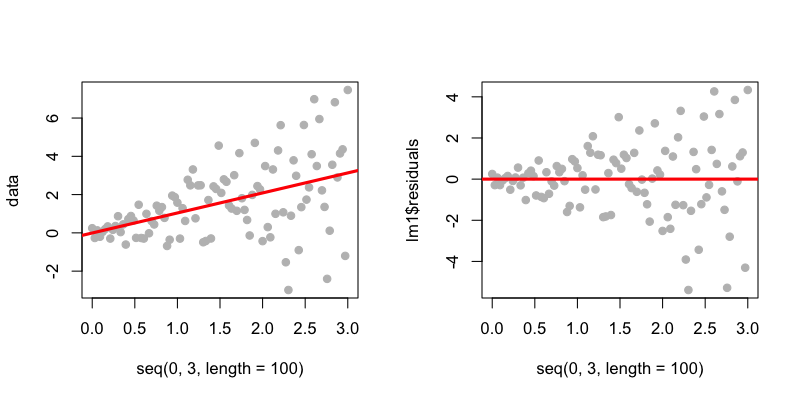
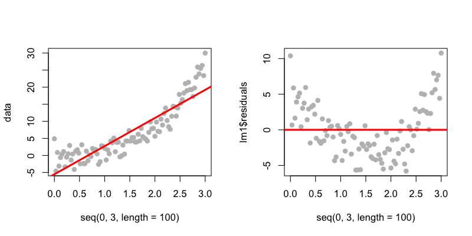
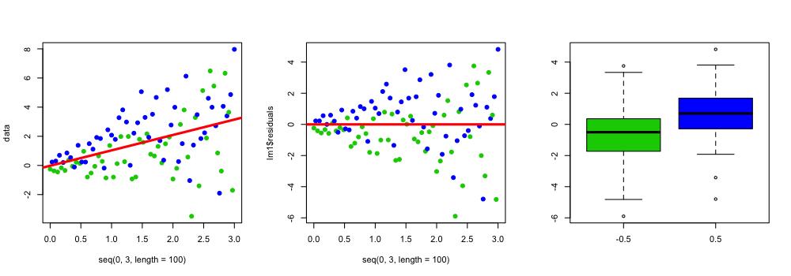
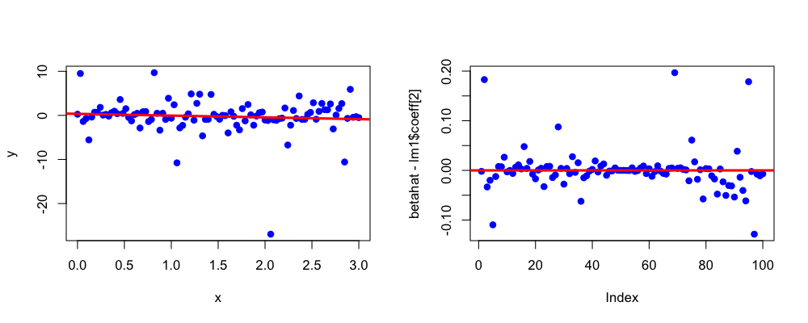
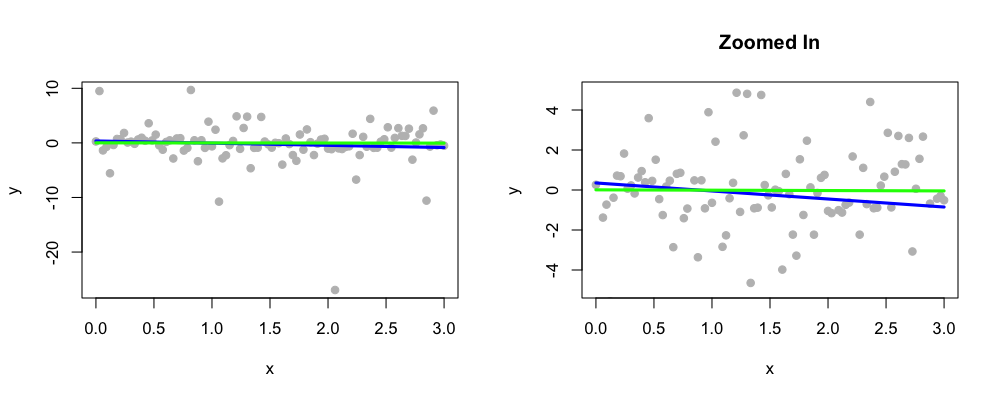
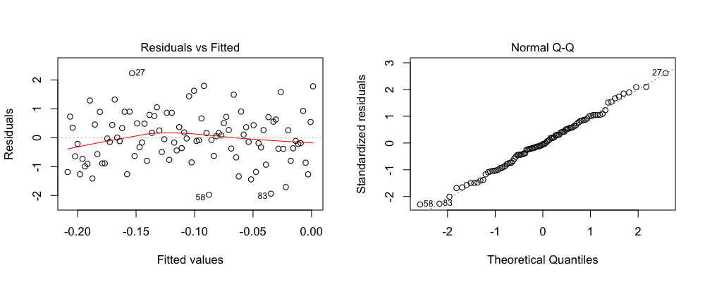
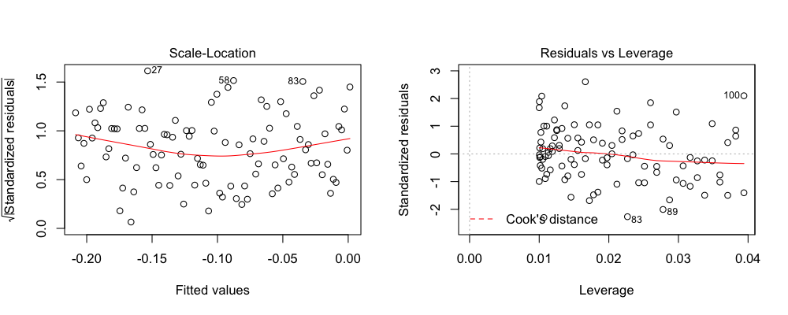
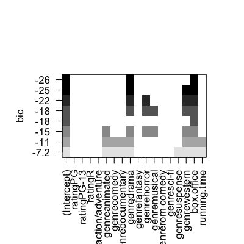

## Model checking and model selection

* Sometimes model checking/selection not allowed
* Often it can lead to problems
  * Overfitting
  * Overtesting
  * Biased inference
* _But_ you don't want to miss something obvious

---

## Linear regression - basic assumptions

* Variance is constant
* You are summarizing a linear trend
* You have all the right terms in the model
* There are no big outliers

---

## Model checking - constant variance


```r
set.seed(3433); par(mfrow=c(1,2)) 
data <- rnorm(100,mean=seq(0,3,length=100),sd=seq(0.1,3,length=100))
lm1 <- lm(data ~ seq(0,3,length=100))
plot(seq(0,3,length=100),data,pch=19,col="grey"); abline(lm1,col="red",lwd=3)
plot(seq(0,3,length=100),lm1$residuals,,pch=19,col="grey"); abline(c(0,0),col="red",lwd=3)
```

<div class="rimage center"></div>


---

## What to do

* See if another variable explains the increased variance
* Use the  _vcovHC_ {sandwich} variance estimators (if n is big)


---


## Using the sandwich estimate


```r
set.seed(3433); par(mfrow=c(1,2)); data <- rnorm(100,mean=seq(0,3,length=100),sd=seq(0.1,3,length=100))
lm1 <- lm(data ~ seq(0,3,length=100))
vcovHC(lm1)
summary(lm1)$cov.unscaled
```

```
                        (Intercept) seq(0, 3, length = 100)
(Intercept)                 0.03941                -0.01960
seq(0, 3, length = 100)    -0.01960                 0.01307
```


---

## Model checking - linear trend


```r
set.seed(3433); par(mfrow=c(1,2)) 
data <- rnorm(100,mean=seq(0,3,length=100)^3,sd=2)
lm1 <- lm(data ~ seq(0,3,length=100))
plot(seq(0,3,length=100),data,pch=19,col="grey"); abline(lm1,col="red",lwd=3)
plot(seq(0,3,length=100),lm1$residuals,,pch=19,col="grey"); abline(c(0,0),col="red",lwd=3)
```

<div class="rimage center"></div>


---

## What to do

* Use Poisson regression (if it looks exponential/multiplicative)
* Use a data transformation (e.g. take the log)
* Smooth the data/fit a nonlinear trend (next week's lectures)
* Use linear regression anyway
  * Interpret as the linear trend between the variables
  * Use the  _vcovHC_ {sandwich} variance estimators (if n is big)


---

## Model checking - missing covariate


```r
set.seed(3433); par(mfrow=c(1,3)); z <- rep(c(-0.5,0.5),50)
data <- rnorm(100,mean=(seq(0,3,length=100) + z),sd=seq(0.1,3,length=100))
lm1 <- lm(data ~ seq(0,3,length=100))
plot(seq(0,3,length=100),data,pch=19,col=((z>0)+3)); abline(lm1,col="red",lwd=3)
plot(seq(0,3,length=100),lm1$residuals,pch=19,col=((z>0)+3)); abline(c(0,0),col="red",lwd=3)
boxplot(lm1$residuals ~ z,col = ((z>0)+3) )
```

<div class="rimage center"></div>


---

## What to do

* Use exploratory analysis to identify other variables to include
* Use the  _vcovHC_ {sandwich} variance estimators (if n is big)
* Report unexplained patterns in the data

---

## Model checking - outliers


```r
set.seed(343); par(mfrow=c(1,2)); betahat <- rep(NA,100)
x <- seq(0,3,length=100); y <- rcauchy(100); lm1 <- lm(y ~ x)
plot(x,y,pch=19,col="blue"); abline(lm1,col="red",lwd=3)
for(i in 1:length(data)){betahat[i] <- lm(y[-i] ~ x[-i])$coeff[2]}
plot(betahat - lm1$coeff[2],col="blue",pch=19); abline(c(0,0),col="red",lwd=3)
```

<div class="rimage center"></div>


---

## What to do

* If outliers are experimental mistakes -remove and document them
* If they are real - consider reporting how sensitive your estimate is to the outliers
* Consider using a robust linear model fit like _rlm_ {MASS}


---

## Robust linear modeling


```r
set.seed(343); x <- seq(0,3,length=100); y <- rcauchy(100); 
lm1 <- lm(y ~ x); rlm1 <- rlm(y ~ x)
lm1$coeff
```

```
(Intercept)           x 
     0.3523     -0.4011 
```

```r
rlm1$coeff
```

```
(Intercept)           x 
   0.008527   -0.017892 
```


---

## Robust linear modeling


```r
par(mfrow=c(1,2))
plot(x,y,pch=19,col="grey")
lines(x,lm1$fitted,col="blue",lwd=3); lines(x,rlm1$fitted,col="green",lwd=3)
plot(x,y,pch=19,col="grey",ylim=c(-5,5),main="Zoomed In")
lines(x,lm1$fitted,col="blue",lwd=3); lines(x,rlm1$fitted,col="green",lwd=3)
```

<div class="rimage center"></div>


---

## Model checking - default plots


```r
set.seed(343); par(mfrow=c(1,2))
x <- seq(0,3,length=100); y <- rnorm(100); lm1 <- lm(y ~ x)
plot(lm1)
```

<div class="rimage center"></div>
<div class="rimage center"></div>


---

## Model checking - deviance

* Commonly reported for GLM's
* Usually compares the model where every point gets its own parameter to the model you are using
* On it's own it doesn't tell you what is wrong
* In large samples the deviance may be big even for "conservative" models
* You can not compare deviances for models with different sample sizes


---

## $R^2$ may be a bad summary


---

## Model selection 

* Many times you have multiple variables to evaluate
* Options for choosing variables
  * Domain-specific knowledge
  * Exploratory analysis
  * Statistical selection
* There are many statistical selection options
  * Step-wise
  * AIC
  * BIC 
  * Modern approaches: Lasso, Ridge-Regression, etc.
* Statistical selection may bias your inference
  * If possible, do selection on a held out sample


---

## Error measures

* $R^2$ alone isn't enough - more variables = bigger $R^2$
* [Adjusted $R^2$](http://en.wikipedia.org/wiki/Coefficient_of_determination#Adjusted_R2) is $R^2$ taking into account the number of estimated parameters
* [AIC](http://en.wikipedia.org/wiki/Akaike_information_criterion) also penalizes models with more parameters
* [BIC](http://en.wikipedia.org/wiki/Bayesian_information_criterion) does the same, but with a bigger penalty

---

## Movie Data


```r
download.file("http://www.rossmanchance.com/iscam2/data/movies03RT.txt",destfile="./data/movies.txt")
movies <- read.table("./data/movies.txt",sep="\t",header=T,quote="")
head(movies)
```

```
                 X score rating            genre box.office running.time
1 2 Fast 2 Furious  48.9  PG-13 action/adventure     127.15          107
2    28 Days Later  78.2      R           horror      45.06          113
3      A Guy Thing  39.5  PG-13       rom comedy      15.54          101
4      A Man Apart  42.9      R action/adventure      26.25          110
5    A Mighty Wind  79.9  PG-13           comedy      17.78           91
6 Agent Cody Banks  57.9     PG action/adventure      47.81          102
```


[http://www.rossmanchance.com/](http://www.rossmanchance.com/)


---

## Model selection  - step


```r
movies <- movies[,-1]
lm1 <- lm(score ~ .,data=movies)
aicFormula <- step(lm1)
```

```
Start:  AIC=727.5
score ~ rating + genre + box.office + running.time

               Df Sum of Sq   RSS AIC
- genre        12      2575 22132 721
- rating        3        40 19596 722
- running.time  1       237 19793 727
<none>                      19556 728
- box.office    1      3007 22563 746

Step:  AIC=720.8
score ~ rating + box.office + running.time

               Df Sum of Sq   RSS AIC
- rating        3       491 22623 718
<none>                      22132 721
- running.time  1      1192 23324 726
- box.office    1      2456 24588 734

Step:  AIC=717.9
score ~ box.office + running.time

               Df Sum of Sq   RSS AIC
<none>                      22623 718
- running.time  1       935 23557 722
- box.office    1      3337 25959 735
```


---

## Model selection  - step


```r
aicFormula
```

```

Call:
lm(formula = score ~ box.office + running.time, data = movies)

Coefficients:
 (Intercept)    box.office  running.time  
     37.2364        0.0824        0.1275  
```


---

## Model selection  - regsubsets


```r
library(leaps);
regSub <- regsubsets(score ~ .,data=movies)
plot(regSub)
```

<div class="rimage center"></div>

[http://cran.r-project.org/web/packages/leaps/leaps.pdf](http://cran.r-project.org/web/packages/leaps/leaps.pdf)

---

## Model selection  - bic.glm


```r
library(BMA)
bicglm1 <- bic.glm(score ~.,data=movies,glm.family="gaussian")
print(bicglm1)
```

```

Call:
bic.glm.formula(f = score ~ ., data = movies, glm.family = "gaussian")


 Posterior probabilities(%): 
 <NA>  <NA>  <NA>  <NA> 
  0.0 100.0 100.0  18.2 

 Coefficient posterior expected values: 
          (Intercept)               ratingPG            ratingPG-13                ratingR  
               45.263                  0.000                  0.000                  0.000  
genreaction/adventure          genreanimated            genrecomedy       genredocumentary  
               -0.120                  7.628                  2.077                  8.642  
           genredrama           genrefantasy            genrehorror           genremusical  
               13.041                  1.504                 -3.458                -12.255  
      genrerom comedy            genresci-fi          genresuspense           genrewestern  
                1.244                 -3.324                  3.815                 17.563  
           box.office           running.time  
                0.100                  0.016  
```


[http://cran.r-project.org/web/packages/BMA/BMA.pdf](http://cran.r-project.org/web/packages/BMA/BMA.pdf)


---

## Notes and further resources

* Exploratory/visual analysis is key
* Automatic selection produces an answer - but may bias inference
* You may think about separating the sample into two groups
* The goal is not to get the "causal" model


* [Lars package](http://cran.r-project.org/web/packages/lars/lars.pdf) 
* [Elements of machine learning](http://www-stat.stanford.edu/~tibs/ElemStatLearn/)
