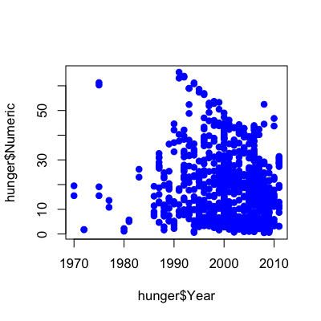
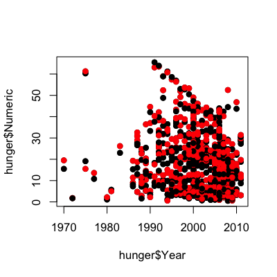
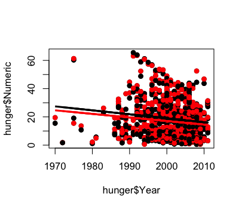
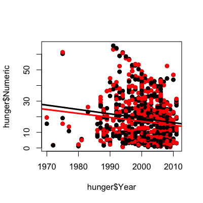

## Key ideas

* Regression with multiple covariates
* Still using least squares/central limit theorem
* Interpretation depends on all variables


---

## Example - Millenium Development Goal 1


[http://www.un.org/millenniumgoals/pdf/MDG_FS_1_EN.pdf](http://www.un.org/millenniumgoals/pdf/MDG_FS_1_EN.pdf)

[http://apps.who.int/gho/athena/data/GHO/WHOSIS_000008.csv?profile=text&filter=COUNTRY:*;SEX:*](http://apps.who.int/gho/athena/data/GHO/WHOSIS_000008.csv?profile=text&filter=COUNTRY:*;SEX:*)

---

## WHO childhood hunger data


```r
download.file("http://apps.who.int/gho/athena/data/GHO/WHOSIS_000008.csv?profile=text&filter=COUNTRY:*;SEX:*","./data/hunger.csv",method="curl")
hunger <- read.csv("./data/hunger.csv")
hunger <- hunger[hunger$Sex!="Both sexes",]
head(hunger)
```

```
                                Indicator Data.Source PUBLISH.STATES Year            WHO.region
2  Children aged <5 years underweight (%) NLIS_312819      Published 2004 Eastern Mediterranean
3  Children aged <5 years underweight (%) NLIS_312819      Published 2004 Eastern Mediterranean
6  Children aged <5 years underweight (%) NLIS_312361      Published 2000                Europe
7  Children aged <5 years underweight (%) NLIS_312361      Published 2000                Europe
9  Children aged <5 years underweight (%) NLIS_312879      Published 2005                Europe
10 Children aged <5 years underweight (%) NLIS_312879      Published 2005                Europe
       Country    Sex Display.Value Numeric Low High Comments
2  Afghanistan Female          33.0    33.0  NA   NA       NA
3  Afghanistan   Male          32.7    32.7  NA   NA       NA
6      Albania   Male          19.6    19.6  NA   NA       NA
7      Albania Female          14.2    14.2  NA   NA       NA
9      Albania   Male           7.3     7.3  NA   NA       NA
10     Albania Female           5.8     5.8  NA   NA       NA
```


---

## Plot percent hungry versus time


```r
lm1 <- lm(hunger$Numeric ~ hunger$Year)
plot(hunger$Year,hunger$Numeric,pch=19,col="blue")
```

<div class="rimage center"></div>


---

## Remember the linear model

$$Hu_i = b_0 + b_1 Y_i + e_i$$

$b_0$ = percent hungry at Year 0

$b_1$ = decrease in percent hungry per year

$e_i$ = everything we didn't measure

---

## Add the linear model


```r
lm1 <- lm(hunger$Numeric ~ hunger$Year)
plot(hunger$Year,hunger$Numeric,pch=19,col="blue")
lines(hunger$Year,lm1$fitted,lwd=3,col="darkgrey")
```

<div class="rimage center"></div>


---

## Color by male/female


```r
plot(hunger$Year,hunger$Numeric,pch=19)
points(hunger$Year,hunger$Numeric,pch=19,col=((hunger$Sex=="Male")*1+1))
```

<div class="rimage center"></div>


---

## Now two lines

$$HuF_i = bf_0 + bf_1 YF_i + ef_i$$

$bf_0$ = percent of girls hungry at Year 0

$bf_1$ = decrease in percent of girls hungry per year

$ef_i$ = everything we didn't measure 


$$HuM_i = bm_0 + bm_1 YM_i + em_i$$

$bm_0$ = percent of boys hungry at Year 0

$bm_1$ = decrease in percent of boys hungry per year

$em_i$ = everything we didn't measure 


---

## Color by male/female


```r
lmM <- lm(hunger$Numeric[hunger$Sex=="Male"] ~ hunger$Year[hunger$Sex=="Male"])
lmF <- lm(hunger$Numeric[hunger$Sex=="Female"] ~ hunger$Year[hunger$Sex=="Female"])
plot(hunger$Year,hunger$Numeric,pch=19)
points(hunger$Year,hunger$Numeric,pch=19,col=((hunger$Sex=="Male")*1+1))
lines(hunger$Year[hunger$Sex=="Male"],lmM$fitted,col="black",lwd=3)
lines(hunger$Year[hunger$Sex=="Female"],lmF$fitted,col="red",lwd=3)
```

<div class="rimage center"></div>


---

## Two lines, same slope

$$Hu_i = b_0 + b_1 \mathbb{1}(Sex_i="Male") + b_2 Y_i + e^*_i$$

$b_0$ - percent hungry at year zero for females

$b_0 + b_1$ - percent hungry at year zero for males

$b_2$ - change in percent hungry (for either males or females) in one year

$e^*_i$ - everything we didn't measure

---

## Two lines, same slope in R


```r
lmBoth <- lm(hunger$Numeric ~ hunger$Year + hunger$Sex)
plot(hunger$Year,hunger$Numeric,pch=19)
points(hunger$Year,hunger$Numeric,pch=19,col=((hunger$Sex=="Male")*1+1))
abline(c(lmBoth$coeff[1],lmBoth$coeff[2]),col="red",lwd=3)
abline(c(lmBoth$coeff[1] + lmBoth$coeff[3],lmBoth$coeff[2] ),col="black",lwd=3)
```

<div class="rimage center"></div>


---

## Two lines, different slopes (interactions)

$$Hu_i = b_0 + b_1 \mathbb{1}(Sex_i="Male") + b_2 Y_i + b_3 \mathbb{1}(Sex_i="Male")\times Y_i + e^+_i$$

$b_0$ - percent hungry at year zero for females

$b_0 + b_1$ - percent hungry at year zero for males

$b_2$ - change in percent hungry (females) in one year

$b_2 + b_3$ - change in percent hungry (males) in one year

$e^+_i$ - everything we didn't measure

---

## Two lines, different slopes in R


```r
lmBoth <- lm(hunger$Numeric ~ hunger$Year + hunger$Sex + hunger$Sex*hunger$Year)
plot(hunger$Year,hunger$Numeric,pch=19)
points(hunger$Year,hunger$Numeric,pch=19,col=((hunger$Sex=="Male")*1+1))
abline(c(lmBoth$coeff[1],lmBoth$coeff[2]),col="red",lwd=3)
abline(c(lmBoth$coeff[1] + lmBoth$coeff[3],lmBoth$coeff[2] +lmBoth$coeff[4]),col="black",lwd=3)
```

<div class="rimage center"></div>


---

## Two lines, different slopes in R


```r
summary(lmBoth)
```

```

Call:
lm(formula = hunger$Numeric ~ hunger$Year + hunger$Sex + hunger$Sex * 
    hunger$Year)

Residuals:
   Min     1Q Median     3Q    Max 
-25.09 -11.61  -2.15   7.29  46.15 

Coefficients:
                           Estimate Std. Error t value Pr(>|t|)   
(Intercept)                522.4721   191.8987    2.72   0.0066 **
hunger$Year                 -0.2527     0.0959   -2.63   0.0086 **
hunger$SexMale              58.3730   271.3858    0.22   0.8297   
hunger$Year:hunger$SexMale  -0.0282     0.1357   -0.21   0.8353   
---
Signif. codes:  0 '***' 0.001 '**' 0.01 '*' 0.05 '.' 0.1 ' ' 1

Residual standard error: 13.5 on 854 degrees of freedom
Multiple R-squared:  0.0228,	Adjusted R-squared:  0.0193 
F-statistic: 6.64 on 3 and 854 DF,  p-value: 0.000197
```


---

## Interactions for continuous variables

$$Hu_i = b_0 + b_1 In_i + b_2 Y_i + b_3 In_i \times Y_i + e^+_i$$

$b_0$ - percent hungry at year zero for children with whose parents have no income

$b_1$ - change in percent hungry for each dollar of income in year zero

$b_2$ - change in percent hungry in one year for children whose parents have no income

$b_3$ - increased change in percent hungry by year for each dollar of income  - e.g. if income is $10,000, then change in percent hungry in one year will be

$$b_2 + 1e4 \times b_3$$

$e^+_i$ - everything we didn't measure

__Lot's of care/caution needed!__


