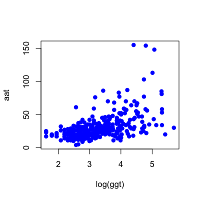

## Things to pay attention to

* Confounders
* Complicated interactions
* Skewness
* Outliers
* Non-linear patterns
* Variance changes
* Units/scale issues
* Overloading regression
* Correlation and causation


---

## The ideal data for regression


```r
library(UsingR); data(galton)
plot(galton$parent,galton$child,col="blue",pch=19)
```

<div class="rimage center"></div>


---

## Confounders

__Confounder__: A variable that is correlated with both the outcome and the covariates


* Confounders can change the regression line
* They can even change the sign of the line
* They can sometimes be detected by careful exploration

---

## Example - Millenium Development Goal 1


[http://www.un.org/millenniumgoals/pdf/MDG_FS_1_EN.pdf](http://www.un.org/millenniumgoals/pdf/MDG_FS_1_EN.pdf)

---

## WHO childhood hunger data


```r
download.file("http://apps.who.int/gho/athena/data/GHO/WHOSIS_000008.csv?profile=text&filt
              er=COUNTRY:*;SEX:*","./data/hunger.csv",method="curl")
hunger <- read.csv("./data/hunger.csv")
hunger <- hunger[hunger$Sex!="Both sexes",]
head(hunger)
```

```
                                Indicator Data.Source PUBLISH.STATES Year            WHO.region
2  Children aged <5 years underweight (%) NLIS_312819      Published 2004 Eastern Mediterranean
3  Children aged <5 years underweight (%) NLIS_312819      Published 2004 Eastern Mediterranean
6  Children aged <5 years underweight (%) NLIS_312361      Published 2000                Europe
7  Children aged <5 years underweight (%) NLIS_312361      Published 2000                Europe
9  Children aged <5 years underweight (%) NLIS_312879      Published 2005                Europe
10 Children aged <5 years underweight (%) NLIS_312879      Published 2005                Europe
       Country    Sex Display.Value Numeric Low High Comments
2  Afghanistan Female          33.0    33.0  NA   NA       NA
3  Afghanistan   Male          32.7    32.7  NA   NA       NA
6      Albania   Male          19.6    19.6  NA   NA       NA
7      Albania Female          14.2    14.2  NA   NA       NA
9      Albania   Male           7.3     7.3  NA   NA       NA
10     Albania Female           5.8     5.8  NA   NA       NA
```


---

## Hunger over time by region


```r
par(mfrow=c(1,2))
plot(hunger$Year,hunger$Numeric,col=as.numeric(hunger$WHO.region),pch=19)
plot(1:10,type="n",xaxt="n",yaxt="n",xlab="",ylab="")
legend(1,10,col=unique(as.numeric(hunger$WHO.region)),legend=unique(hunger$WHO.region),pch=19)
```

<div class="rimage center"></div>


---

## Region correlated with year


```r
anova(lm(hunger$Year ~ hunger$WHO.region))
```

```
Analysis of Variance Table

Response: hunger$Year
                   Df Sum Sq Mean Sq F value Pr(>F)  
hunger$WHO.region   5    538   107.5    2.33  0.041 *
Residuals         852  39316    46.1                 
---
Signif. codes:  0 '***' 0.001 '**' 0.01 '*' 0.05 '.' 0.1 ' ' 1
```


---

## Region correlated with hunger


```r
anova(lm(hunger$Numeric ~ hunger$WHO.region))
```

```
Analysis of Variance Table

Response: hunger$Numeric
                   Df Sum Sq Mean Sq F value Pr(>F)    
hunger$WHO.region   5  76032   15206     154 <2e-16 ***
Residuals         852  84211      99                   
---
Signif. codes:  0 '***' 0.001 '**' 0.01 '*' 0.05 '.' 0.1 ' ' 1
```


---

## Including region - a complicated interaction


```r
plot(hunger$Year,hunger$Numeric,pch=19,col=as.numeric(hunger$WHO.region))
lmRegion <- lm(hunger$Numeric ~ hunger$Year + hunger$WHO.region + hunger$Year*hunger$WHO.region )
abline(c(lmRegion$coeff[1] + lmRegion$coeff[6],lmRegion$coeff[2]+ lmRegion$coeff[12]),col=5,lwd=3)
```

<div class="rimage center"></div>


---

## Income data 


```r
download.file("http://archive.ics.uci.edu/ml/machine-learning-databases/adult/adult.data","./data/income.csv",method="curl")
incomeData <- read.csv("./data/income.csv",header=FALSE)
income <- incomeData[,3]
age <- incomeData[,1]
```


[http://archive.ics.uci.edu/ml/datasets/Census+Income](http://archive.ics.uci.edu/ml/datasets/Census+Income)

---

## Logs to address right-skew


```r
par(mfrow=c(1,4))
smoothScatter(age,income)
hist(income,col="blue",breaks=100)
hist(log(income+1),col="blue",breaks=100)
smoothScatter(age,log(income+1))
```

<div class="rimage center"></div>


([Data transforms](http://en.wikipedia.org/wiki/Data_transformation_(statistics))

---

## Outliers

<br><br><br><br>

<center> "outliers" ... are data points that do not appear to follow the pattern of the other data  points.</center>

<br><br><br><br>

[A dataset that is 44% outliers](http://www.amstat.org/publications/jse/v13n1/datasets.hayden.html)


---

## Example - extreme points


```r
set.seed(1235)
xVals <- rcauchy(50)
hist(xVals,col="blue")
```

<div class="rimage center"></div>


---

## Example - Outliers may be real


```r
# Add Tim Cook, CEO of Apple 2011 income
age <- c(age,52)
income <- c(income,378e6)
smoothScatter(age,income)
```

<div class="rimage center"></div>

[http://www.macworld.com/article/2023491/apple-gives-tim-cook-51-percent-salary-increase.html](http://www.macworld.com/article/2023491/apple-gives-tim-cook-51-percent-salary-increase.html)

---

## Example - Does not fit the trend


[A dataset that is 44% outliers](http://www.amstat.org/publications/jse/v13n1/datasets.hayden.html)


---

## Outliers - what you can do

* If you know they aren't real/of interest, remove them (but changes question!)
* Alternatively
  * Sensitivity analysis - is it a big difference if you leave it in/take it out?
  * Logs - if the data are right skewed (lots of outliers)
  * Robust methods - we've been doing averages, but there are more robust approaches ([Robust](http://cran.r-project.org/web/views/Robust.html),[rlm](http://stat.ethz.ch/R-manual/R-patched/library/MASS/html/rlm.html))
  


---

## A line isn't always the best summary


[http://en.wikipedia.org/wiki/Linear_regression](http://en.wikipedia.org/wiki/Linear_regression)


---

## You can end up saying some pretty silly stuff


[http://www.nature.com/nature/journal/v431/n7008/fig_tab/431525a_F1.html](http://www.nature.com/nature/journal/v431/n7008/fig_tab/431525a_F1.html)

"We are students aged 16–18 in a Texas high school. Our biology teacher Vidya Rajan asked us to comment on the paper by A. J. Tatem and colleagues (Nature 431, 525; 2004); we believe the projection on which it is based is riddled with flaws..."
[http://www.nature.com/nature/journal/v432/n7014/full/432147c.html](http://www.nature.com/nature/journal/v432/n7014/full/432147c.html)

"They omit to mention, however, that (according to their analysis) a far more interesting race should occur in about 2636, when times of less than zero seconds will be recorded"
[http://www.nature.com/nature/journal/v432/n7014/full/432147b.html](http://www.nature.com/nature/journal/v432/n7014/full/432147b.html)


---

## Variance changes 


```r
bupaData <- read.csv("ftp://ftp.ics.uci.edu/pub/machine-learning-databases/liver-disorders/bupa.data",header=F)
ggt <- bupaData[,5]; aat <- bupaData[,3]
plot(log(ggt),aat,col="blue",pch=19)
```

<div class="rimage center"></div>


---

## Plot the residuals


```r
lm1 <- lm(aat ~ log(ggt))
plot(log(ggt),lm1$residuals,col="blue",pch=19)
```

<div class="rimage center"></div>


[Power (a.k.a. Box-Cox) transform](http://en.wikipedia.org/wiki/Power_transform#cite_note-2)

---

## Changing variance - what you can do

* There is a long literature on this problem (heteroskedasticity)
* A few examples
  * [Box-Cox Transform](http://en.wikipedia.org/wiki/Power_transform#cite_note-2)
  * [Variance stabilizing transform](http://en.wikipedia.org/wiki/Variance-stabilizing_transformation)
  * [Weighted least squares](http://en.wikipedia.org/wiki/Weighted_least_squares#Weighted_least_squares)
  * [Huber-white standard errors](http://en.wikipedia.org/wiki/Heteroscedasticity-consistent_standard_errors)

---

## Variation in units


[All Deaths](http://www.gapminder.org/world/#$majorMode=chart$is;shi=t;ly=2003;lb=f;il=t;fs=11;al=30;stl=t;st=t;nsl=t;se=t$wst;tts=C$ts;sp=5.59290322580644;ti=2008$zpv;v=0$inc_x;mmid=XCOORDS;iid=phAwcNAVuyj1jiMAkmq1iMg;by=ind$inc_y;mmid=YCOORDS;iid=taYeez4Mkk8OvdH-q4QAxxQ;by=ind$inc_s;uniValue=8.21;iid=phAwcNAVuyj0XOoBL_n5tAQ;by=ind$inc_c;uniValue=255;gid=CATID0;by=grp$map_x;scale=log;dataMin=194;dataMax=96846$map_y;scale=lin;dataMin=4;dataMax=826060$map_s;sma=50;smi=2$cd;bd=0$inds=)

---

## Relative units 


[Per 1000 Deaths](http://www.gapminder.org/world/#$majorMode=chart$is;shi=t;ly=2003;lb=f;il=t;fs=11;al=30;stl=t;st=t;nsl=t;se=t$wst;tts=C$ts;sp=5.59290322580644;ti=2008$zpv;v=0$inc_x;mmid=XCOORDS;iid=phAwcNAVuyj1jiMAkmq1iMg;by=ind$inc_y;mmid=YCOORDS;iid=t9FP3_OPrE2ug_I_iNsbePg;by=ind$inc_s;uniValue=8.21;iid=phAwcNAVuyj0XOoBL_n5tAQ;by=ind$inc_c;uniValue=255;gid=CATID0;by=grp$map_x;scale=log;dataMin=194;dataMax=96846$map_y;scale=lin;dataMin=1.027;dataMax=195$map_s;sma=50;smi=2$cd;bd=0$inds=)


---

## When there is variation in units

* Standardize, but keep track
  * Affects model fits
  * Affects interpretation
  * Affects inference

---

## Overloading regression


[http://bit.ly/YiB5Um](http://bit.ly/YiB5Um)
[http://wmbriggs.com/blog/?p=7026](http://wmbriggs.com/blog/?p=7026)


---

## Correlation and Causation


[http://xkcd.com/552/](http://xkcd.com/552/)

---

## Even when looking for associations


[http://www.nejm.org/doi/full/10.1056/NEJMon1211064](ttp://www.nejm.org/doi/full/10.1056/NEJMon1211064)

---

## Again, it can get silly


[http://www.statschat.org.nz/2012/10/12/even-better-than-chocolate/](http://www.statschat.org.nz/2012/10/12/even-better-than-chocolate/)

---

## Correlation vs. Causation

* Use caution when interpreting regression results
* Be critical of surprising associations
* Consider alternative explanations

