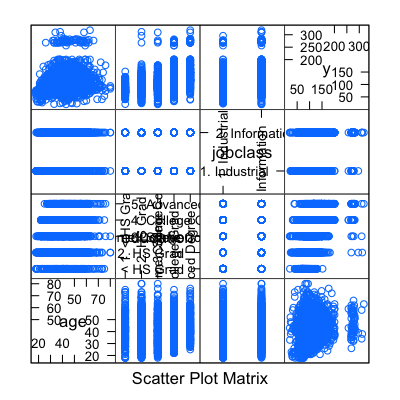
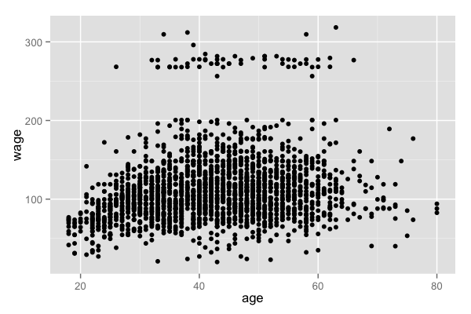
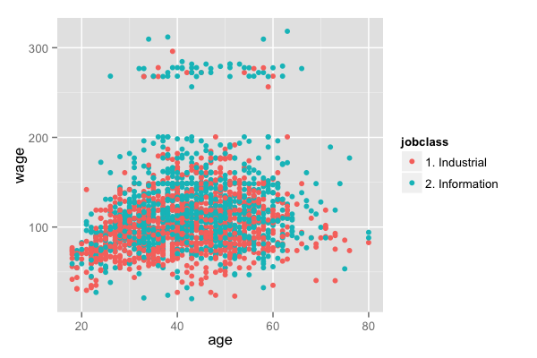
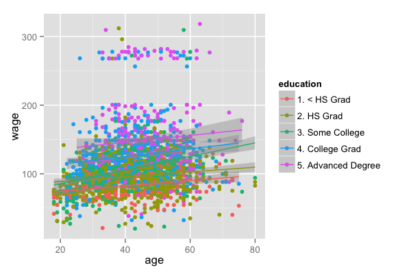
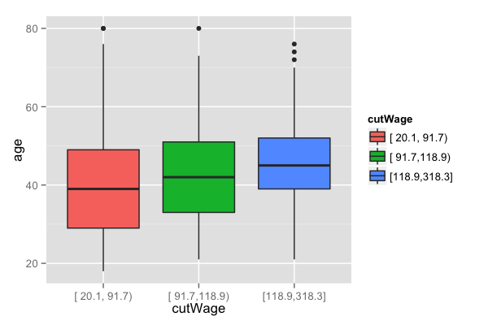
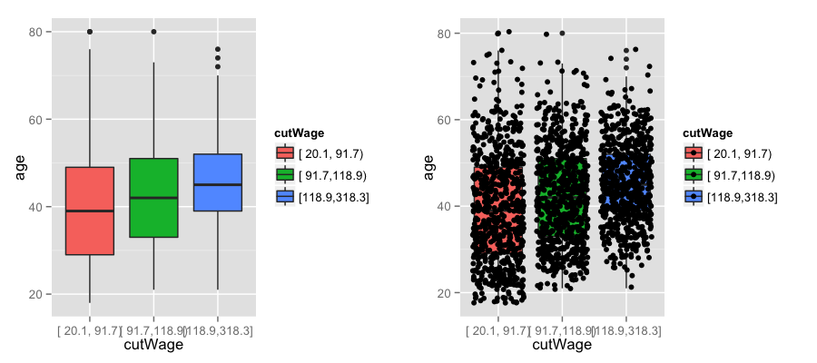
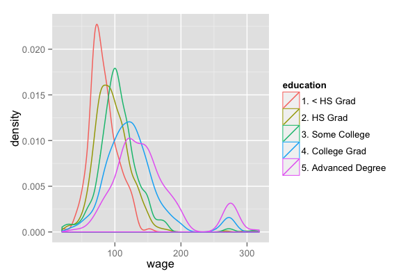

## Example: predicting wages


Image Credit [http://www.cahs-media.org/the-high-cost-of-low-wages](http://www.cahs-media.org/the-high-cost-of-low-wages)

Data from: [ISLR package](http://cran.r-project.org/web/packages/ISLR) from the book: [Introduction to statistical learning](http://www-bcf.usc.edu/~gareth/ISL/)  


---

## Example: Wage data


```r
library(ISLR); library(ggplot2); library(caret);
data(Wage)
summary(Wage)
```

```
      year           age              sex                    maritl           race     
 Min.   :2003   Min.   :18.0   1. Male  :3000   1. Never Married: 648   1. White:2480  
 1st Qu.:2004   1st Qu.:33.8   2. Female:   0   2. Married      :2074   2. Black: 293  
 Median :2006   Median :42.0                    3. Widowed      :  19   3. Asian: 190  
 Mean   :2006   Mean   :42.4                    4. Divorced     : 204   4. Other:  37  
 3rd Qu.:2008   3rd Qu.:51.0                    5. Separated    :  55                  
 Max.   :2009   Max.   :80.0                                                           
                                                                                       
              education                     region               jobclass               health    
 1. < HS Grad      :268   2. Middle Atlantic   :3000   1. Industrial :1544   1. <=Good     : 858  
 2. HS Grad        :971   1. New England       :   0   2. Information:1456   2. >=Very Good:2142  
 3. Some College   :650   3. East North Central:   0                                              
 4. College Grad   :685   4. West North Central:   0                                              
 5. Advanced Degree:426   5. South Atlantic    :   0                                              
                          6. East South Central:   0                                              
                          (Other)              :   0                                              
  health_ins      logwage          wage      
 1. Yes:2083   Min.   :3.00   Min.   : 20.1  
 2. No : 917   1st Qu.:4.45   1st Qu.: 85.4  
               Median :4.65   Median :104.9  
               Mean   :4.65   Mean   :111.7  
               3rd Qu.:4.86   3rd Qu.:128.7  
               Max.   :5.76   Max.   :318.3  
                                             
```


---

## Get training/test sets


```r
inTrain <- createDataPartition(y=Wage$wage,
                              p=0.7, list=FALSE)
training <- Wage[inTrain,]
testing <- Wage[-inTrain,]
dim(training); dim(testing)
```

```
[1] 898  12
```


---

## Feature plot (*caret* package)


```r
featurePlot(x=training[,c("age","education","jobclass")],
            y = training$wage,
            plot="pairs")
```

<div class="rimage center"></div>


---

## Qplot (*ggplot2* package)


```r
qplot(age,wage,data=training)
```

<div class="rimage center"></div>


---

## Qplot with color (*ggplot2* package)


```r
qplot(age,wage,colour=jobclass,data=training)
```

<div class="rimage center"></div>


---

## Add regression smoothers (*ggplot2* package)


```r
qq <- qplot(age,wage,colour=education,data=training)
qq +  geom_smooth(method='lm',formula=y~x)
```

<div class="rimage center"></div>


---

## cut2, making factors (*Hmisc* package)


```r
cutWage <- cut2(training$wage,g=3)
table(cutWage)
```

```
cutWage
[ 20.1, 91.7) [ 91.7,118.9) [118.9,318.3] 
          704           725           673 
```


---

## Boxplots with cut2


```r
p1 <- qplot(cutWage,age, data=training,fill=cutWage,
      geom=c("boxplot"))
p1
```

<div class="rimage center"></div>


---

## Boxplots with points overlayed


```r
p2 <- qplot(cutWage,age, data=training,fill=cutWage,
      geom=c("boxplot","jitter"))
grid.arrange(p1,p2,ncol=2)
```

<div class="rimage center"></div>


---

## Tables


```r
t1 <- table(cutWage,training$jobclass)
t1
```

```
               
cutWage         1. Industrial 2. Information
  [ 20.1, 91.7)           437            267
  [ 91.7,118.9)           365            360
  [118.9,318.3]           263            410
```

```r
prop.table(t1,1)
```

```
               
cutWage         1. Industrial 2. Information
  [ 20.1, 91.7)        0.6207         0.3793
  [ 91.7,118.9)        0.5034         0.4966
  [118.9,318.3]        0.3908         0.6092
```


---

## Density plots


```r
qplot(wage,colour=education,data=training,geom="density")
```

<div class="rimage center"></div>


---

## Notes and further reading

* Make your plots only in the training set 
  * Don't use the test set for exploration!
* Things you should be looking for
  * Imbalance in outcomes/predictors
  * Outliers 
  * Groups of points not explained by a predictor
  * Skewed variables 
* [ggplot2 tutorial](http://rstudio-pubs-static.s3.amazonaws.com/2176_75884214fc524dc0bc2a140573da38bb.html)
* [caret visualizations](http://caret.r-forge.r-project.org/visualizations.html)
