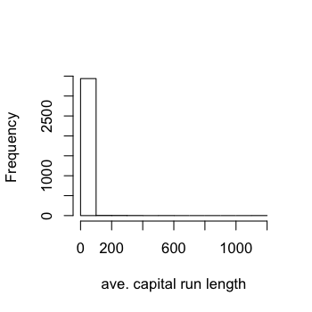
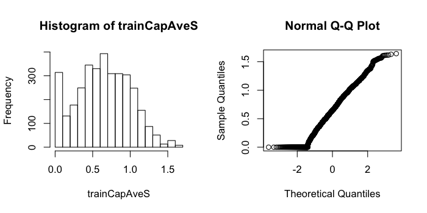

## Why preprocess?


```r
library(caret); library(kernlab); data(spam)
inTrain <- createDataPartition(y=spam$type,
                              p=0.75, list=FALSE)
training <- spam[inTrain,]
testing <- spam[-inTrain,]
hist(training$capitalAve,main="",xlab="ave. capital run length")
```

<div class="rimage center"></div>


---

## Why preprocess?


```r
mean(training$capitalAve)
```

```
[1] 4.709
```

```r
sd(training$capitalAve)
```

```
[1] 25.48
```


---

## Standardizing


```r
trainCapAve <- training$capitalAve
trainCapAveS <- (trainCapAve  - mean(trainCapAve))/sd(trainCapAve) 
mean(trainCapAveS)
```

```
[1] 5.862e-18
```

```r
sd(trainCapAveS)
```

```
[1] 1
```


---

## Standardizing - test set


```r
testCapAve <- testing$capitalAve
testCapAveS <- (testCapAve  - mean(trainCapAve))/sd(trainCapAve) 
mean(testCapAveS)
```

```
[1] 0.07579
```

```r
sd(testCapAveS)
```

```
[1] 1.79
```


---

## Standardizing - _preProcess_ function


```r
preObj <- preProcess(training[,-58],method=c("center","scale"))
trainCapAveS <- predict(preObj,training[,-58])$capitalAve
mean(trainCapAveS)
```

```
[1] 5.862e-18
```

```r
sd(trainCapAveS)
```

```
[1] 1
```


---

## Standardizing - _preProcess_ function


```r
testCapAveS <- predict(preObj,testing[,-58])$capitalAve
mean(testCapAveS)
```

```
[1] 0.07579
```

```r
sd(testCapAveS)
```

```
[1] 1.79
```


---

## Standardizing - _preProcess_ argument


```r
set.seed(32343)
modelFit <- train(type ~.,data=training,
                  preProcess=c("center","scale"),method="glm")
modelFit
```

```
3451 samples
  57 predictors
   2 classes: 'nonspam', 'spam' 

Pre-processing: centered, scaled 
Resampling: Bootstrap (25 reps) 

Summary of sample sizes: 3451, 3451, 3451, 3451, 3451, 3451, ... 

Resampling results

  Accuracy  Kappa  Accuracy SD  Kappa SD
  0.9       0.8    0.007        0.01    

 
```


---

## Standardizing - Box-Cox transforms


```r
preObj <- preProcess(training[,-58],method=c("BoxCox"))
trainCapAveS <- predict(preObj,training[,-58])$capitalAve
par(mfrow=c(1,2)); hist(trainCapAveS); qqnorm(trainCapAveS)
```

<div class="rimage center"></div>


---

## Standardizing - Imputing data


```r
set.seed(13343)

# Make some values NA
training$capAve <- training$capitalAve
selectNA <- rbinom(dim(training)[1],size=1,prob=0.05)==1
training$capAve[selectNA] <- NA

# Impute and standardize
preObj <- preProcess(training[,-58],method="knnImpute")
capAve <- predict(preObj,training[,-58])$capAve

# Standardize true values
capAveTruth <- training$capitalAve
capAveTruth <- (capAveTruth-mean(capAveTruth))/sd(capAveTruth)
```


---

## Standardizing - Imputing data


```r
quantile(capAve - capAveTruth)
```

```
        0%        25%        50%        75%       100% 
-1.1324388 -0.0030842 -0.0015074 -0.0007467  0.2155789 
```

```r
quantile((capAve - capAveTruth)[selectNA])
```

```
        0%        25%        50%        75%       100% 
-0.9243043 -0.0125489 -0.0001968  0.0194524  0.2155789 
```

```r
quantile((capAve - capAveTruth)[!selectNA])
```

```
        0%        25%        50%        75%       100% 
-1.1324388 -0.0030033 -0.0015115 -0.0007938 -0.0001968 
```


---

## Notes and further reading

* Training and test must be processed in the same way
* Test transformations will likely be imperfect
  * Especially if the test/training sets collected at different times
* Careful when transforming factor variables!
* [preprocessing with caret](http://caret.r-forge.r-project.org/preprocess.html)
