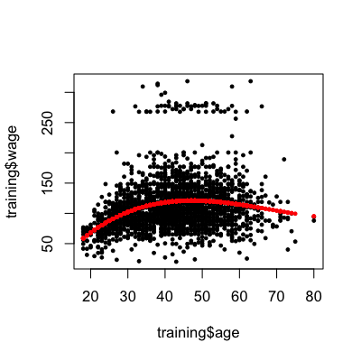

## Two levels of covariate creation

**Level 1: From raw data to covariate**


**Level 2: Transforming tidy covariates** 


```r
library(kernlab);data(spam)
spam$capitalAveSq <- spam$capitalAve^2
```


---

## Level 1, Raw data -> covariates

* Depends heavily on application
* The balancing act is summarization vs. information loss
* Examples:
  * Text files: frequency of words, frequency of phrases ([Google ngrams](https://books.google.com/ngrams)), frequency of capital letters.
  * Images: Edges, corners, blobs, ridges ([computer vision feature detection](http://en.wikipedia.org/wiki/Feature_detection_(computer_vision)))
  * Webpages: Number and type of images, position of elements, colors, videos ([A/B Testing](http://en.wikipedia.org/wiki/A/B_testing))
  * People: Height, weight, hair color, sex, country of origin. 
* The more knowledge of the system you have the better the job you will do. 
* When in doubt, err on the side of more features
* Can be automated, but use caution!


---

## Level 2, Tidy covariates -> new covariates

* More necessary for some methods (regression, svms) than for others (classification trees).
* Should be done _only on the training set_
* The best approach is through exploratory analysis (plotting/tables)
* New covariates should be added to data frames


---

## Load example data


```r
library(ISLR); library(caret); data(Wage);
inTrain <- createDataPartition(y=Wage$wage,
                              p=0.7, list=FALSE)
training <- Wage[inTrain,]; testing <- Wage[-inTrain,]
```


---

## Common covariates to add, dummy variables

__Basic idea - convert factor variables to [indicator variables](http://bit.ly/19ZhWB6)__


```r
table(training$jobclass)
```

```

 1. Industrial 2. Information 
          1090           1012 
```

```r
dummies <- dummyVars(wage ~ jobclass,data=training)
head(predict(dummies,newdata=training))
```

```
       jobclass.1. Industrial jobclass.2. Information
231655                      1                       0
86582                       0                       1
11141                       0                       1
229379                      1                       0
86064                       1                       0
377879                      1                       0
```


---

## Removing zero covariates


```r
nsv <- nearZeroVar(training,saveMetrics=TRUE)
nsv
```

```
           freqRatio percentUnique zeroVar   nzv
year           1.029       0.33302   FALSE FALSE
age            1.122       2.80685   FALSE FALSE
sex            0.000       0.04757    TRUE  TRUE
maritl         3.159       0.23787   FALSE FALSE
race           8.529       0.19029   FALSE FALSE
education      1.492       0.23787   FALSE FALSE
region         0.000       0.04757    TRUE  TRUE
jobclass       1.077       0.09515   FALSE FALSE
health         2.452       0.09515   FALSE FALSE
health_ins     2.269       0.09515   FALSE FALSE
logwage        1.198      17.26927   FALSE FALSE
wage           1.185      18.07802   FALSE FALSE
```


---

## Spline basis


```r
library(splines)
bsBasis <- bs(training$age,df=3) 
bsBasis
```

```
              1         2         3
   [1,] 0.00000 0.0000000 0.000e+00
   [2,] 0.23685 0.0253768 9.063e-04
   [3,] 0.44309 0.2436978 4.468e-02
   [4,] 0.43081 0.2910904 6.556e-02
   [5,] 0.42617 0.1482327 1.719e-02
   [6,] 0.41709 0.1331149 1.416e-02
   [7,] 0.31823 0.0540390 3.059e-03
   [8,] 0.36253 0.3866940 1.375e-01
   [9,] 0.44436 0.2275981 3.886e-02
  [10,] 0.20449 0.0179375 5.245e-04
  [11,] 0.07768 0.3601465 5.566e-01
  [12,] 0.13145 0.0066841 1.133e-04
  [13,] 0.39290 0.1042387 9.218e-03
  [14,] 0.26654 0.0339238 1.439e-03
  [15,] 0.20449 0.0179375 5.245e-04
  [16,] 0.29109 0.4308138 2.125e-01
  [17,] 0.23685 0.0253768 9.063e-04
  [18,] 0.43624 0.2755195 5.800e-02
  [19,] 0.26654 0.0339238 1.439e-03
  [20,] 0.32118 0.4163380 1.799e-01
  [21,] 0.41709 0.1331149 1.416e-02
  [22,] 0.16938 0.0116814 2.685e-04
  [23,] 0.42617 0.1482327 1.719e-02
  [24,] 0.16370 0.4333314 3.824e-01
  [25,] 0.11843 0.4060287 4.640e-01
  [26,] 0.44222 0.1953988 2.878e-02
  [27,] 0.43624 0.2755195 5.800e-02
  [28,] 0.26654 0.0339238 1.439e-03
  [29,] 0.19540 0.4422183 3.336e-01
  [30,] 0.13145 0.0066841 1.133e-04
  [31,] 0.29365 0.0435031 2.148e-03
  [32,] 0.16938 0.0116814 2.685e-04
  [33,] 0.43333 0.1637030 2.061e-02
  [34,] 0.43081 0.2910904 6.556e-02
  [35,] 0.41709 0.1331149 1.416e-02
  [36,] 0.32118 0.4163380 1.799e-01
  [37,] 0.14823 0.4261690 4.084e-01
  [38,] 0.30633 0.4241549 1.958e-01
  [39,] 0.40744 0.3355376 9.211e-02
  [40,] 0.40744 0.3355376 9.211e-02
  [41,] 0.29109 0.4308138 2.125e-01
  [42,] 0.37500 0.3750000 1.250e-01
  [43,] 0.31823 0.0540390 3.059e-03
  [44,] 0.41709 0.1331149 1.416e-02
  [45,] 0.26654 0.0339238 1.439e-03
  [46,] 0.44222 0.1953988 2.878e-02
  [47,] 0.24370 0.4430868 2.685e-01
  [48,] 0.36015 0.0776787 5.585e-03
  [49,] 0.17945 0.4386560 3.574e-01
  [50,] 0.31823 0.0540390 3.059e-03
  [51,] 0.20449 0.0179375 5.245e-04
  [52,] 0.42617 0.1482327 1.719e-02
  [53,] 0.29109 0.4308138 2.125e-01
  [54,] 0.21147 0.4440939 3.109e-01
  [55,] 0.37500 0.3750000 1.250e-01
  [56,] 0.16938 0.0116814 2.685e-04
  [57,] 0.44309 0.2436978 4.468e-02
  [58,] 0.37500 0.3750000 1.250e-01
  [59,] 0.36015 0.0776787 5.585e-03
  [60,] 0.43624 0.2755195 5.800e-02
  [61,] 0.33554 0.4074385 1.649e-01
  [62,] 0.16938 0.0116814 2.685e-04
  [63,] 0.40744 0.3355376 9.211e-02
  [64,] 0.39753 0.3493463 1.023e-01
  [65,] 0.33554 0.4074385 1.649e-01
  [66,] 0.31823 0.0540390 3.059e-03
  [67,] 0.24370 0.4430868 2.685e-01
  [68,] 0.16938 0.0116814 2.685e-04
  [69,] 0.26654 0.0339238 1.439e-03
  [70,] 0.43866 0.1794502 2.447e-02
  [71,] 0.44309 0.2436978 4.468e-02
  [72,] 0.23685 0.0253768 9.063e-04
  [73,] 0.34935 0.3975320 1.508e-01
  [74,] 0.20449 0.0179375 5.245e-04
  [75,] 0.23685 0.0253768 9.063e-04
  [76,] 0.31823 0.0540390 3.059e-03
  [77,] 0.38669 0.3625256 1.133e-01
  [78,] 0.22760 0.4443582 2.892e-01
  [79,] 0.24370 0.4430868 2.685e-01
  [80,] 0.37763 0.0906314 7.251e-03
  [81,] 0.20449 0.0179375 5.245e-04
  [82,] 0.41709 0.1331149 1.416e-02
  [83,] 0.37500 0.3750000 1.250e-01
  [84,] 0.44309 0.2436978 4.468e-02
  [85,] 0.42617 0.1482327 1.719e-02
  [86,] 0.34037 0.0654560 4.196e-03
  [87,] 0.22760 0.4443582 2.892e-01
  [88,] 0.44436 0.2275981 3.886e-02
  [89,] 0.39290 0.1042387 9.218e-03
  [90,] 0.20449 0.0179375 5.245e-04
  [91,] 0.42617 0.1482327 1.719e-02
  [92,] 0.19540 0.4422183 3.336e-01
  [93,] 0.44309 0.2436978 4.468e-02
  [94,] 0.43333 0.1637030 2.061e-02
  [95,] 0.19540 0.4422183 3.336e-01
  [96,] 0.41709 0.1331149 1.416e-02
  [97,] 0.43624 0.2755195 5.800e-02
  [98,] 0.39753 0.3493463 1.023e-01
  [99,] 0.00000 0.0000000 0.000e+00
 [100,] 0.36253 0.3866940 1.375e-01
 [101,] 0.31823 0.0540390 3.059e-03
 [102,] 0.36253 0.3866940 1.375e-01
 [103,] 0.37500 0.3750000 1.250e-01
 [104,] 0.41634 0.3211750 8.259e-02
 [105,] 0.19540 0.4422183 3.336e-01
 [106,] 0.40603 0.1184250 1.151e-02
 [107,] 0.42415 0.3063341 7.375e-02
 [108,] 0.39290 0.1042387 9.218e-03
 [109,] 0.01794 0.2044871 7.771e-01
 [110,] 0.34037 0.0654560 4.196e-03
 [111,] 0.20449 0.0179375 5.245e-04
 [112,] 0.44309 0.2436978 4.468e-02
 [113,] 0.42617 0.1482327 1.719e-02
 [114,] 0.30633 0.4241549 1.958e-01
 [115,] 0.04684 0.0007678 4.196e-06
 [116,] 0.40603 0.1184250 1.151e-02
 [117,] 0.00000 0.0000000 0.000e+00
 [118,] 0.34037 0.0654560 4.196e-03
 [119,] 0.09063 0.0030210 3.357e-05
 [120,] 0.42415 0.3063341 7.375e-02
 [121,] 0.20449 0.0179375 5.245e-04
 [122,] 0.43333 0.1637030 2.061e-02
 [123,] 0.32118 0.4163380 1.799e-01
 [124,] 0.43081 0.2910904 6.556e-02
 [125,] 0.30633 0.4241549 1.958e-01
 [126,] 0.23685 0.0253768 9.063e-04
 [127,] 0.42415 0.3063341 7.375e-02
 [128,] 0.43081 0.2910904 6.556e-02
 [129,] 0.43081 0.2910904 6.556e-02
 [130,] 0.41709 0.1331149 1.416e-02
 [131,] 0.23685 0.0253768 9.063e-04
 [132,] 0.23685 0.0253768 9.063e-04
 [133,] 0.43866 0.1794502 2.447e-02
 [134,] 0.38669 0.3625256 1.133e-01
 [135,] 0.43624 0.2755195 5.800e-02
 [136,] 0.20449 0.0179375 5.245e-04
 [137,] 0.34037 0.0654560 4.196e-03
 [138,] 0.23685 0.0253768 9.063e-04
 [139,] 0.06546 0.3403713 5.900e-01
 [140,] 0.44436 0.2275981 3.886e-02
 [141,] 0.33554 0.4074385 1.649e-01
 [142,] 0.24370 0.4430868 2.685e-01
 [143,] 0.16370 0.4333314 3.824e-01
 [144,] 0.00000 0.0000000 0.000e+00
 [145,] 0.34037 0.0654560 4.196e-03
 [146,] 0.44222 0.1953988 2.878e-02
 [147,] 0.13311 0.4170932 4.356e-01
 [148,] 0.04684 0.0007678 4.196e-06
 [149,] 0.16938 0.0116814 2.685e-04
 [150,] 0.43333 0.1637030 2.061e-02
 [151,] 0.39753 0.3493463 1.023e-01
 [152,] 0.29109 0.4308138 2.125e-01
 [153,] 0.27552 0.4362391 2.302e-01
 [154,] 0.27552 0.4362391 2.302e-01
 [155,] 0.19540 0.4422183 3.336e-01
 [156,] 0.39290 0.1042387 9.218e-03
 [157,] 0.44436 0.2275981 3.886e-02
 [158,] 0.43081 0.2910904 6.556e-02
 [159,] 0.42415 0.3063341 7.375e-02
 [160,] 0.43624 0.2755195 5.800e-02
 [161,] 0.43866 0.1794502 2.447e-02
 [162,] 0.43624 0.2755195 5.800e-02
 [163,] 0.37763 0.0906314 7.251e-03
 [164,] 0.41709 0.1331149 1.416e-02
 [165,] 0.34037 0.0654560 4.196e-03
 [166,] 0.37763 0.0906314 7.251e-03
 [167,] 0.33554 0.4074385 1.649e-01
 [168,] 0.29365 0.0435031 2.148e-03
 [169,] 0.21147 0.4440939 3.109e-01
 [170,] 0.36253 0.3866940 1.375e-01
 [171,] 0.43866 0.1794502 2.447e-02
 [172,] 0.38669 0.3625256 1.133e-01
 [173,] 0.21147 0.4440939 3.109e-01
 [174,] 0.26654 0.0339238 1.439e-03
 [175,] 0.43081 0.2910904 6.556e-02
 [176,] 0.21147 0.4440939 3.109e-01
 [177,] 0.37763 0.0906314 7.251e-03
 [178,] 0.13145 0.0066841 1.133e-04
 [179,] 0.34037 0.0654560 4.196e-03
 [180,] 0.31823 0.0540390 3.059e-03
 [181,] 0.34037 0.0654560 4.196e-03
 [182,] 0.22760 0.4443582 2.892e-01
 [183,] 0.42617 0.1482327 1.719e-02
 [184,] 0.26654 0.0339238 1.439e-03
 [185,] 0.43081 0.2910904 6.556e-02
 [186,] 0.36253 0.3866940 1.375e-01
 [187,] 0.44309 0.2436978 4.468e-02
 [188,] 0.10424 0.3928997 4.936e-01
 [189,] 0.39753 0.3493463 1.023e-01
 [190,] 0.13145 0.0066841 1.133e-04
 [191,] 0.16938 0.0116814 2.685e-04
 [192,] 0.39753 0.3493463 1.023e-01
 [193,] 0.16938 0.0116814 2.685e-04
 [194,] 0.44222 0.1953988 2.878e-02
 [195,] 0.37500 0.3750000 1.250e-01
 [196,] 0.17945 0.4386560 3.574e-01
 [197,] 0.38669 0.3625256 1.133e-01
 [198,] 0.39290 0.1042387 9.218e-03
 [199,] 0.39290 0.1042387 9.218e-03
 [200,] 0.23685 0.0253768 9.063e-04
 [201,] 0.37763 0.0906314 7.251e-03
 [202,] 0.39753 0.3493463 1.023e-01
 [203,] 0.44036 0.2596967 5.105e-02
 [204,] 0.09063 0.0030210 3.357e-05
 [205,] 0.30633 0.4241549 1.958e-01
 [206,] 0.17945 0.4386560 3.574e-01
 [207,] 0.42415 0.3063341 7.375e-02
 [208,] 0.24370 0.4430868 2.685e-01
 [209,] 0.22760 0.4443582 2.892e-01
 [210,] 0.43624 0.2755195 5.800e-02
 [211,] 0.36015 0.0776787 5.585e-03
 [212,] 0.00000 0.0000000 0.000e+00
 [213,] 0.09063 0.0030210 3.357e-05
 [214,] 0.41634 0.3211750 8.259e-02
 [215,] 0.42415 0.3063341 7.375e-02
 [216,] 0.29365 0.0435031 2.148e-03
 [217,] 0.16938 0.0116814 2.685e-04
 [218,] 0.42415 0.3063341 7.375e-02
 [219,] 0.40603 0.1184250 1.151e-02
 [220,] 0.44309 0.2436978 4.468e-02
 [221,] 0.04684 0.0007678 4.196e-06
 [222,] 0.39753 0.3493463 1.023e-01
 [223,] 0.40603 0.1184250 1.151e-02
 [224,] 0.20449 0.0179375 5.245e-04
 [225,] 0.39290 0.1042387 9.218e-03
 [226,] 0.33554 0.4074385 1.649e-01
 [227,] 0.09063 0.0030210 3.357e-05
 [228,] 0.41709 0.1331149 1.416e-02
 [229,] 0.16938 0.0116814 2.685e-04
 [230,] 0.04684 0.0007678 4.196e-06
 [231,] 0.41634 0.3211750 8.259e-02
 [232,] 0.34037 0.0654560 4.196e-03
 [233,] 0.42415 0.3063341 7.375e-02
 [234,] 0.41634 0.3211750 8.259e-02
 [235,] 0.40744 0.3355376 9.211e-02
 [236,] 0.24370 0.4430868 2.685e-01
 [237,] 0.29365 0.0435031 2.148e-03
 [238,] 0.43333 0.1637030 2.061e-02
 [239,] 0.00000 0.0000000 0.000e+00
 [240,] 0.36015 0.0776787 5.585e-03
 [241,] 0.20449 0.0179375 5.245e-04
 [242,] 0.09063 0.0030210 3.357e-05
 [243,] 0.29109 0.4308138 2.125e-01
 [244,] 0.40603 0.1184250 1.151e-02
 [245,] 0.33554 0.4074385 1.649e-01
 [246,] 0.37500 0.3750000 1.250e-01
 [247,] 0.44436 0.2275981 3.886e-02
 [248,] 0.29365 0.0435031 2.148e-03
 [249,] 0.36253 0.3866940 1.375e-01
 [250,] 0.16938 0.0116814 2.685e-04
 [251,] 0.16370 0.4333314 3.824e-01
 [252,] 0.24370 0.4430868 2.685e-01
 [253,] 0.17945 0.4386560 3.574e-01
 [254,] 0.16938 0.0116814 2.685e-04
 [255,] 0.40744 0.3355376 9.211e-02
 [256,] 0.43081 0.2910904 6.556e-02
 [257,] 0.44309 0.2436978 4.468e-02
 [258,] 0.13145 0.0066841 1.133e-04
 [259,] 0.34935 0.3975320 1.508e-01
 [260,] 0.43333 0.1637030 2.061e-02
 [261,] 0.13145 0.0066841 1.133e-04
 [262,] 0.27552 0.4362391 2.302e-01
 [263,] 0.41709 0.1331149 1.416e-02
 [264,] 0.42415 0.3063341 7.375e-02
 [265,] 0.40744 0.3355376 9.211e-02
 [266,] 0.31823 0.0540390 3.059e-03
 [267,] 0.43081 0.2910904 6.556e-02
 [268,] 0.32118 0.4163380 1.799e-01
 [269,] 0.43333 0.1637030 2.061e-02
 [270,] 0.21147 0.4440939 3.109e-01
 [271,] 0.44436 0.2275981 3.886e-02
 [272,] 0.41634 0.3211750 8.259e-02
 [273,] 0.44436 0.2275981 3.886e-02
 [274,] 0.44222 0.1953988 2.878e-02
 [275,] 0.20449 0.0179375 5.245e-04
 [276,] 0.41709 0.1331149 1.416e-02
 [277,] 0.26654 0.0339238 1.439e-03
 [278,] 0.23685 0.0253768 9.063e-04
 [279,] 0.20449 0.0179375 5.245e-04
 [280,] 0.43081 0.2910904 6.556e-02
 [281,] 0.43866 0.1794502 2.447e-02
 [282,] 0.38669 0.3625256 1.133e-01
 [283,] 0.43333 0.1637030 2.061e-02
 [284,] 0.26654 0.0339238 1.439e-03
 [285,] 0.40603 0.1184250 1.151e-02
 [286,] 0.43081 0.2910904 6.556e-02
 [287,] 0.17945 0.4386560 3.574e-01
 [288,] 0.30633 0.4241549 1.958e-01
 [289,] 0.43081 0.2910904 6.556e-02
 [290,] 0.20449 0.0179375 5.245e-04
 [291,] 0.09063 0.0030210 3.357e-05
 [292,] 0.23685 0.0253768 9.063e-04
 [293,] 0.43866 0.1794502 2.447e-02
 [294,] 0.39753 0.3493463 1.023e-01
 [295,] 0.44309 0.2436978 4.468e-02
 [296,] 0.44036 0.2596967 5.105e-02
 [297,] 0.36253 0.3866940 1.375e-01
 [298,] 0.04684 0.0007678 4.196e-06
 [299,] 0.39290 0.1042387 9.218e-03
 [300,] 0.38669 0.3625256 1.133e-01
 [301,] 0.38669 0.3625256 1.133e-01
 [302,] 0.33554 0.4074385 1.649e-01
 [303,] 0.38669 0.3625256 1.133e-01
 [304,] 0.09063 0.0030210 3.357e-05
 [305,] 0.24370 0.4430868 2.685e-01
 [306,] 0.43333 0.1637030 2.061e-02
 [307,] 0.23685 0.0253768 9.063e-04
 [308,] 0.16938 0.0116814 2.685e-04
 [309,] 0.44036 0.2596967 5.105e-02
 [310,] 0.40603 0.1184250 1.151e-02
 [311,] 0.42415 0.3063341 7.375e-02
 [312,] 0.34935 0.3975320 1.508e-01
 [313,] 0.20449 0.0179375 5.245e-04
 [314,] 0.44309 0.2436978 4.468e-02
 [315,] 0.29365 0.0435031 2.148e-03
 [316,] 0.39753 0.3493463 1.023e-01
 [317,] 0.34935 0.3975320 1.508e-01
 [318,] 0.39290 0.1042387 9.218e-03
 [319,] 0.16938 0.0116814 2.685e-04
 [320,] 0.43081 0.2910904 6.556e-02
 [321,] 0.43333 0.1637030 2.061e-02
 [322,] 0.41634 0.3211750 8.259e-02
 [323,] 0.44036 0.2596967 5.105e-02
 [324,] 0.34935 0.3975320 1.508e-01
 [325,] 0.34935 0.3975320 1.508e-01
 [326,] 0.37500 0.3750000 1.250e-01
 [327,] 0.39290 0.1042387 9.218e-03
 [328,] 0.09063 0.0030210 3.357e-05
 [329,] 0.04684 0.0007678 4.196e-06
 [330,] 0.27552 0.4362391 2.302e-01
 [331,] 0.20449 0.0179375 5.245e-04
 [332,] 0.40603 0.1184250 1.151e-02
 [333,] 0.13145 0.0066841 1.133e-04
 [334,] 0.25970 0.4403553 2.489e-01
 [335,] 0.37763 0.0906314 7.251e-03
 [336,] 0.44222 0.1953988 2.878e-02
 [337,] 0.00000 0.0000000 0.000e+00
 [338,] 0.44222 0.1953988 2.878e-02
 [339,] 0.39753 0.3493463 1.023e-01
 [340,] 0.42617 0.1482327 1.719e-02
 [341,] 0.29109 0.4308138 2.125e-01
 [342,] 0.36253 0.3866940 1.375e-01
 [343,] 0.42617 0.1482327 1.719e-02
 [344,] 0.24370 0.4430868 2.685e-01
 [345,] 0.27552 0.4362391 2.302e-01
 [346,] 0.42617 0.1482327 1.719e-02
 [347,] 0.44222 0.1953988 2.878e-02
 [348,] 0.20449 0.0179375 5.245e-04
 [349,] 0.16938 0.0116814 2.685e-04
 [350,] 0.37763 0.0906314 7.251e-03
 [351,] 0.37500 0.3750000 1.250e-01
 [352,] 0.41634 0.3211750 8.259e-02
 [353,] 0.22760 0.4443582 2.892e-01
 [354,] 0.39753 0.3493463 1.023e-01
 [355,] 0.37763 0.0906314 7.251e-03
 [356,] 0.36253 0.3866940 1.375e-01
 [357,] 0.44222 0.1953988 2.878e-02
 [358,] 0.23685 0.0253768 9.063e-04
 [359,] 0.32118 0.4163380 1.799e-01
 [360,] 0.21147 0.4440939 3.109e-01
 [361,] 0.09063 0.0030210 3.357e-05
 [362,] 0.43333 0.1637030 2.061e-02
 [363,] 0.20449 0.0179375 5.245e-04
 [364,] 0.30633 0.4241549 1.958e-01
 [365,] 0.37500 0.3750000 1.250e-01
 [366,] 0.38669 0.3625256 1.133e-01
 [367,] 0.25970 0.4403553 2.489e-01
 [368,] 0.29109 0.4308138 2.125e-01
 [369,] 0.44436 0.2275981 3.886e-02
 [370,] 0.38669 0.3625256 1.133e-01
 [371,] 0.44222 0.1953988 2.878e-02
 [372,] 0.39290 0.1042387 9.218e-03
 [373,] 0.44036 0.2596967 5.105e-02
 [374,] 0.44436 0.2275981 3.886e-02
 [375,] 0.43081 0.2910904 6.556e-02
 [376,] 0.44436 0.2275981 3.886e-02
 [377,] 0.34935 0.3975320 1.508e-01
 [378,] 0.41709 0.1331149 1.416e-02
 [379,] 0.44436 0.2275981 3.886e-02
 [380,] 0.19540 0.4422183 3.336e-01
 [381,] 0.44436 0.2275981 3.886e-02
 [382,] 0.26654 0.0339238 1.439e-03
 [383,] 0.22760 0.4443582 2.892e-01
 [384,] 0.44436 0.2275981 3.886e-02
 [385,] 0.32118 0.4163380 1.799e-01
 [386,] 0.20449 0.0179375 5.245e-04
 [387,] 0.04684 0.0007678 4.196e-06
 [388,] 0.41634 0.3211750 8.259e-02
 [389,] 0.40603 0.1184250 1.151e-02
 [390,] 0.16938 0.0116814 2.685e-04
 [391,] 0.41709 0.1331149 1.416e-02
 [392,] 0.41634 0.3211750 8.259e-02
 [393,] 0.39753 0.3493463 1.023e-01
 [394,] 0.36015 0.0776787 5.585e-03
 [395,] 0.44036 0.2596967 5.105e-02
 [396,] 0.29365 0.0435031 2.148e-03
 [397,] 0.31823 0.0540390 3.059e-03
 [398,] 0.20449 0.0179375 5.245e-04
 [399,] 0.36253 0.3866940 1.375e-01
 [400,] 0.16938 0.0116814 2.685e-04
 [401,] 0.43624 0.2755195 5.800e-02
 [402,] 0.38669 0.3625256 1.133e-01
 [403,] 0.34037 0.0654560 4.196e-03
 [404,] 0.34935 0.3975320 1.508e-01
 [405,] 0.23685 0.0253768 9.063e-04
 [406,] 0.03392 0.2665444 6.981e-01
 [407,] 0.37763 0.0906314 7.251e-03
 [408,] 0.16370 0.4333314 3.824e-01
 [409,] 0.36015 0.0776787 5.585e-03
 [410,] 0.04684 0.0007678 4.196e-06
 [411,] 0.31823 0.0540390 3.059e-03
 [412,] 0.42617 0.1482327 1.719e-02
 [413,] 0.39753 0.3493463 1.023e-01
 [414,] 0.26654 0.0339238 1.439e-03
 [415,] 0.16938 0.0116814 2.685e-04
 [416,] 0.44222 0.1953988 2.878e-02
 [417,] 0.34935 0.3975320 1.508e-01
 [418,] 0.40603 0.1184250 1.151e-02
 [419,] 0.38669 0.3625256 1.133e-01
 [420,] 0.41709 0.1331149 1.416e-02
 [421,] 0.33554 0.4074385 1.649e-01
 [422,] 0.16938 0.0116814 2.685e-04
 [423,] 0.40603 0.1184250 1.151e-02
 [424,] 0.41634 0.3211750 8.259e-02
 [425,] 0.32118 0.4163380 1.799e-01
 [426,] 0.11843 0.4060287 4.640e-01
 [427,] 0.41709 0.1331149 1.416e-02
 [428,] 0.44036 0.2596967 5.105e-02
 [429,] 0.23685 0.0253768 9.063e-04
 [430,] 0.38669 0.3625256 1.133e-01
 [431,] 0.29365 0.0435031 2.148e-03
 [432,] 0.42415 0.3063341 7.375e-02
 [433,] 0.44222 0.1953988 2.878e-02
 [434,] 0.40744 0.3355376 9.211e-02
 [435,] 0.24370 0.4430868 2.685e-01
 [436,] 0.41709 0.1331149 1.416e-02
 [437,] 0.36253 0.3866940 1.375e-01
 [438,] 0.43624 0.2755195 5.800e-02
 [439,] 0.39753 0.3493463 1.023e-01
 [440,] 0.42415 0.3063341 7.375e-02
 [441,] 0.43866 0.1794502 2.447e-02
 [442,] 0.44436 0.2275981 3.886e-02
 [443,] 0.09063 0.0030210 3.357e-05
 [444,] 0.39290 0.1042387 9.218e-03
 [445,] 0.04684 0.0007678 4.196e-06
 [446,] 0.29365 0.0435031 2.148e-03
 [447,] 0.32118 0.4163380 1.799e-01
 [448,] 0.26654 0.0339238 1.439e-03
 [449,] 0.40744 0.3355376 9.211e-02
 [450,] 0.33554 0.4074385 1.649e-01
 [451,] 0.44309 0.2436978 4.468e-02
 [452,] 0.43081 0.2910904 6.556e-02
 [453,] 0.43624 0.2755195 5.800e-02
 [454,] 0.27552 0.4362391 2.302e-01
 [455,] 0.07768 0.3601465 5.566e-01
 [456,] 0.43081 0.2910904 6.556e-02
 [457,] 0.00000 0.0000000 0.000e+00
 [458,] 0.44436 0.2275981 3.886e-02
 [459,] 0.31823 0.0540390 3.059e-03
 [460,] 0.44309 0.2436978 4.468e-02
 [461,] 0.31823 0.0540390 3.059e-03
 [462,] 0.39290 0.1042387 9.218e-03
 [463,] 0.42415 0.3063341 7.375e-02
 [464,] 0.09063 0.0030210 3.357e-05
 [465,] 0.41709 0.1331149 1.416e-02
 [466,] 0.23685 0.0253768 9.063e-04
 [467,] 0.44309 0.2436978 4.468e-02
 [468,] 0.43624 0.2755195 5.800e-02
 [469,] 0.04684 0.0007678 4.196e-06
 [470,] 0.29365 0.0435031 2.148e-03
 [471,] 0.43333 0.1637030 2.061e-02
 [472,] 0.42617 0.1482327 1.719e-02
 [473,] 0.20449 0.0179375 5.245e-04
 [474,] 0.30633 0.4241549 1.958e-01
 [475,] 0.38669 0.3625256 1.133e-01
 [476,] 0.31823 0.0540390 3.059e-03
 [477,] 0.33554 0.4074385 1.649e-01
 [478,] 0.39753 0.3493463 1.023e-01
 [479,] 0.29365 0.0435031 2.148e-03
 [480,] 0.16938 0.0116814 2.685e-04
 [481,] 0.20449 0.0179375 5.245e-04
 [482,] 0.00000 0.0000000 0.000e+00
 [483,] 0.20449 0.0179375 5.245e-04
 [484,] 0.25970 0.4403553 2.489e-01
 [485,] 0.37763 0.0906314 7.251e-03
 [486,] 0.36015 0.0776787 5.585e-03
 [487,] 0.42617 0.1482327 1.719e-02
 [488,] 0.43624 0.2755195 5.800e-02
 [489,] 0.40603 0.1184250 1.151e-02
 [490,] 0.34037 0.0654560 4.196e-03
 [491,] 0.42415 0.3063341 7.375e-02
 [492,] 0.43866 0.1794502 2.447e-02
 [493,] 0.16938 0.0116814 2.685e-04
 [494,] 0.44036 0.2596967 5.105e-02
 [495,] 0.42415 0.3063341 7.375e-02
 [496,] 0.20449 0.0179375 5.245e-04
 [497,] 0.34935 0.3975320 1.508e-01
 [498,] 0.40603 0.1184250 1.151e-02
 [499,] 0.44436 0.2275981 3.886e-02
 [500,] 0.37763 0.0906314 7.251e-03
 [501,] 0.27552 0.4362391 2.302e-01
 [502,] 0.02538 0.2368501 7.369e-01
 [503,] 0.26654 0.0339238 1.439e-03
 [504,] 0.41634 0.3211750 8.259e-02
 [505,] 0.26654 0.0339238 1.439e-03
 [506,] 0.29365 0.0435031 2.148e-03
 [507,] 0.41634 0.3211750 8.259e-02
 [508,] 0.42617 0.1482327 1.719e-02
 [509,] 0.34935 0.3975320 1.508e-01
 [510,] 0.26654 0.0339238 1.439e-03
 [511,] 0.31823 0.0540390 3.059e-03
 [512,] 0.32118 0.4163380 1.799e-01
 [513,] 0.41709 0.1331149 1.416e-02
 [514,] 0.43866 0.1794502 2.447e-02
 [515,] 0.44409 0.2114733 3.357e-02
 [516,] 0.23685 0.0253768 9.063e-04
 [517,] 0.40603 0.1184250 1.151e-02
 [518,] 0.41709 0.1331149 1.416e-02
 [519,] 0.31823 0.0540390 3.059e-03
 [520,] 0.37763 0.0906314 7.251e-03
 [521,] 0.39290 0.1042387 9.218e-03
 [522,] 0.36015 0.0776787 5.585e-03
 [523,] 0.30633 0.4241549 1.958e-01
 [524,] 0.16938 0.0116814 2.685e-04
 [525,] 0.37500 0.3750000 1.250e-01
 [526,] 0.42415 0.3063341 7.375e-02
 [527,] 0.44409 0.2114733 3.357e-02
 [528,] 0.31823 0.0540390 3.059e-03
 [529,] 0.44222 0.1953988 2.878e-02
 [530,] 0.26654 0.0339238 1.439e-03
 [531,] 0.42617 0.1482327 1.719e-02
 [532,] 0.25970 0.4403553 2.489e-01
 [533,] 0.37763 0.0906314 7.251e-03
 [534,] 0.36253 0.3866940 1.375e-01
 [535,] 0.29365 0.0435031 2.148e-03
 [536,] 0.43333 0.1637030 2.061e-02
 [537,] 0.33554 0.4074385 1.649e-01
 [538,] 0.31823 0.0540390 3.059e-03
 [539,] 0.34935 0.3975320 1.508e-01
 [540,] 0.43866 0.1794502 2.447e-02
 [541,] 0.27552 0.4362391 2.302e-01
 [542,] 0.26654 0.0339238 1.439e-03
 [543,] 0.05404 0.3182295 6.247e-01
 [544,] 0.19540 0.4422183 3.336e-01
 [545,] 0.44036 0.2596967 5.105e-02
 [546,] 0.29109 0.4308138 2.125e-01
 [547,] 0.24370 0.4430868 2.685e-01
 [548,] 0.44309 0.2436978 4.468e-02
 [549,] 0.42415 0.3063341 7.375e-02
 [550,] 0.42415 0.3063341 7.375e-02
 [551,] 0.42617 0.1482327 1.719e-02
 [552,] 0.02538 0.2368501 7.369e-01
 [553,] 0.44309 0.2436978 4.468e-02
 [554,] 0.40744 0.3355376 9.211e-02
 [555,] 0.44036 0.2596967 5.105e-02
 [556,] 0.34935 0.3975320 1.508e-01
 [557,] 0.37500 0.3750000 1.250e-01
 [558,] 0.43624 0.2755195 5.800e-02
 [559,] 0.43081 0.2910904 6.556e-02
 [560,] 0.25970 0.4403553 2.489e-01
 [561,] 0.37500 0.3750000 1.250e-01
 [562,] 0.40603 0.1184250 1.151e-02
 [563,] 0.43333 0.1637030 2.061e-02
 [564,] 0.44222 0.1953988 2.878e-02
 [565,] 0.33554 0.4074385 1.649e-01
 [566,] 0.44436 0.2275981 3.886e-02
 [567,] 0.33554 0.4074385 1.649e-01
 [568,] 0.29365 0.0435031 2.148e-03
 [569,] 0.44436 0.2275981 3.886e-02
 [570,] 0.26654 0.0339238 1.439e-03
 [571,] 0.39290 0.1042387 9.218e-03
 [572,] 0.37763 0.0906314 7.251e-03
 [573,] 0.44309 0.2436978 4.468e-02
 [574,] 0.26654 0.0339238 1.439e-03
 [575,] 0.40744 0.3355376 9.211e-02
 [576,] 0.43081 0.2910904 6.556e-02
 [577,] 0.17945 0.4386560 3.574e-01
 [578,] 0.43866 0.1794502 2.447e-02
 [579,] 0.38669 0.3625256 1.133e-01
 [580,] 0.40603 0.1184250 1.151e-02
 [581,] 0.03392 0.2665444 6.981e-01
 [582,] 0.36015 0.0776787 5.585e-03
 [583,] 0.43866 0.1794502 2.447e-02
 [584,] 0.38669 0.3625256 1.133e-01
 [585,] 0.41634 0.3211750 8.259e-02
 [586,] 0.31823 0.0540390 3.059e-03
 [587,] 0.43624 0.2755195 5.800e-02
 [588,] 0.26654 0.0339238 1.439e-03
 [589,] 0.33554 0.4074385 1.649e-01
 [590,] 0.39290 0.1042387 9.218e-03
 [591,] 0.37763 0.0906314 7.251e-03
 [592,] 0.32118 0.4163380 1.799e-01
 [593,] 0.37763 0.0906314 7.251e-03
 [594,] 0.09063 0.3776308 5.245e-01
 [595,] 0.44436 0.2275981 3.886e-02
 [596,] 0.41634 0.3211750 8.259e-02
 [597,] 0.20449 0.0179375 5.245e-04
 [598,] 0.27552 0.4362391 2.302e-01
 [599,] 0.44222 0.1953988 2.878e-02
 [600,] 0.36015 0.0776787 5.585e-03
 [601,] 0.44409 0.2114733 3.357e-02
 [602,] 0.41709 0.1331149 1.416e-02
 [603,] 0.31823 0.0540390 3.059e-03
 [604,] 0.44409 0.2114733 3.357e-02
 [605,] 0.24370 0.4430868 2.685e-01
 [606,] 0.40744 0.3355376 9.211e-02
 [607,] 0.38669 0.3625256 1.133e-01
 [608,] 0.44036 0.2596967 5.105e-02
 [609,] 0.36253 0.3866940 1.375e-01
 [610,] 0.42415 0.3063341 7.375e-02
 [611,] 0.43333 0.1637030 2.061e-02
 [612,] 0.41634 0.3211750 8.259e-02
 [613,] 0.37500 0.3750000 1.250e-01
 [614,] 0.36253 0.3866940 1.375e-01
 [615,] 0.43866 0.1794502 2.447e-02
 [616,] 0.43081 0.2910904 6.556e-02
 [617,] 0.41709 0.1331149 1.416e-02
 [618,] 0.44036 0.2596967 5.105e-02
 [619,] 0.37763 0.0906314 7.251e-03
 [620,] 0.42415 0.3063341 7.375e-02
 [621,] 0.40744 0.3355376 9.211e-02
 [622,] 0.37763 0.0906314 7.251e-03
 [623,] 0.39753 0.3493463 1.023e-01
 [624,] 0.36253 0.3866940 1.375e-01
 [625,] 0.33554 0.4074385 1.649e-01
 [626,] 0.32118 0.4163380 1.799e-01
 [627,] 0.44409 0.2114733 3.357e-02
 [628,] 0.33554 0.4074385 1.649e-01
 [629,] 0.26654 0.0339238 1.439e-03
 [630,] 0.42617 0.1482327 1.719e-02
 [631,] 0.43624 0.2755195 5.800e-02
 [632,] 0.26654 0.0339238 1.439e-03
 [633,] 0.34037 0.0654560 4.196e-03
 [634,] 0.43866 0.1794502 2.447e-02
 [635,] 0.43333 0.1637030 2.061e-02
 [636,] 0.40744 0.3355376 9.211e-02
 [637,] 0.44222 0.1953988 2.878e-02
 [638,] 0.26654 0.0339238 1.439e-03
 [639,] 0.33554 0.4074385 1.649e-01
 [640,] 0.41709 0.1331149 1.416e-02
 [641,] 0.43624 0.2755195 5.800e-02
 [642,] 0.29365 0.0435031 2.148e-03
 [643,] 0.43081 0.2910904 6.556e-02
 [644,] 0.39753 0.3493463 1.023e-01
 [645,] 0.31823 0.0540390 3.059e-03
 [646,] 0.16938 0.0116814 2.685e-04
 [647,] 0.36015 0.0776787 5.585e-03
 [648,] 0.42415 0.3063341 7.375e-02
 [649,] 0.33554 0.4074385 1.649e-01
 [650,] 0.13311 0.4170932 4.356e-01
 [651,] 0.32118 0.4163380 1.799e-01
 [652,] 0.31823 0.0540390 3.059e-03
 [653,] 0.44309 0.2436978 4.468e-02
 [654,] 0.37763 0.0906314 7.251e-03
 [655,] 0.41634 0.3211750 8.259e-02
 [656,] 0.43081 0.2910904 6.556e-02
 [657,] 0.40744 0.3355376 9.211e-02
 [658,] 0.43866 0.1794502 2.447e-02
 [659,] 0.26654 0.0339238 1.439e-03
 [660,] 0.44436 0.2275981 3.886e-02
 [661,] 0.39290 0.1042387 9.218e-03
 [662,] 0.43081 0.2910904 6.556e-02
 [663,] 0.43333 0.1637030 2.061e-02
 [664,] 0.41709 0.1331149 1.416e-02
 [665,] 0.36015 0.0776787 5.585e-03
 [666,] 0.24370 0.4430868 2.685e-01
 [667,] 0.37500 0.3750000 1.250e-01
 [668,] 0.44036 0.2596967 5.105e-02
 [669,] 0.05404 0.3182295 6.247e-01
 [670,] 0.20449 0.0179375 5.245e-04
 [671,] 0.36253 0.3866940 1.375e-01
 [672,] 0.43081 0.2910904 6.556e-02
 [673,] 0.44222 0.1953988 2.878e-02
 [674,] 0.44409 0.2114733 3.357e-02
 [675,] 0.44409 0.2114733 3.357e-02
 [676,] 0.39290 0.1042387 9.218e-03
 [677,] 0.13145 0.0066841 1.133e-04
 [678,] 0.34037 0.0654560 4.196e-03
 [679,] 0.40603 0.1184250 1.151e-02
 [680,] 0.36015 0.0776787 5.585e-03
 [681,] 0.44309 0.2436978 4.468e-02
 [682,] 0.42415 0.3063341 7.375e-02
 [683,] 0.44036 0.2596967 5.105e-02
 [684,] 0.41709 0.1331149 1.416e-02
 [685,] 0.27552 0.4362391 2.302e-01
 [686,] 0.36015 0.0776787 5.585e-03
 [687,] 0.26654 0.0339238 1.439e-03
 [688,] 0.38669 0.3625256 1.133e-01
 [689,] 0.42415 0.3063341 7.375e-02
 [690,] 0.37763 0.0906314 7.251e-03
 [691,] 0.34037 0.0654560 4.196e-03
 [692,] 0.44309 0.2436978 4.468e-02
 [693,] 0.44309 0.2436978 4.468e-02
 [694,] 0.42415 0.3063341 7.375e-02
 [695,] 0.41709 0.1331149 1.416e-02
 [696,] 0.24370 0.4430868 2.685e-01
 [697,] 0.36015 0.0776787 5.585e-03
 [698,] 0.37763 0.0906314 7.251e-03
 [699,] 0.36253 0.3866940 1.375e-01
 [700,] 0.42415 0.3063341 7.375e-02
 [701,] 0.43866 0.1794502 2.447e-02
 [702,] 0.39290 0.1042387 9.218e-03
 [703,] 0.36253 0.3866940 1.375e-01
 [704,] 0.41709 0.1331149 1.416e-02
 [705,] 0.34935 0.3975320 1.508e-01
 [706,] 0.41709 0.1331149 1.416e-02
 [707,] 0.34037 0.0654560 4.196e-03
 [708,] 0.44309 0.2436978 4.468e-02
 [709,] 0.36015 0.0776787 5.585e-03
 [710,] 0.42617 0.1482327 1.719e-02
 [711,] 0.11843 0.4060287 4.640e-01
 [712,] 0.41634 0.3211750 8.259e-02
 [713,] 0.40744 0.3355376 9.211e-02
 [714,] 0.21147 0.4440939 3.109e-01
 [715,] 0.23685 0.0253768 9.063e-04
 [716,] 0.39290 0.1042387 9.218e-03
 [717,] 0.04350 0.2936457 6.607e-01
 [718,] 0.36253 0.3866940 1.375e-01
 [719,] 0.31823 0.0540390 3.059e-03
 [720,] 0.44036 0.2596967 5.105e-02
 [721,] 0.32118 0.4163380 1.799e-01
 [722,] 0.21147 0.4440939 3.109e-01
 [723,] 0.17945 0.4386560 3.574e-01
 [724,] 0.44409 0.2114733 3.357e-02
 [725,] 0.44222 0.1953988 2.878e-02
 [726,] 0.44036 0.2596967 5.105e-02
 [727,] 0.29365 0.0435031 2.148e-03
 [728,] 0.43866 0.1794502 2.447e-02
 [729,] 0.30633 0.4241549 1.958e-01
 [730,] 0.21147 0.4440939 3.109e-01
 [731,] 0.43624 0.2755195 5.800e-02
 [732,] 0.22760 0.4443582 2.892e-01
 [733,] 0.41709 0.1331149 1.416e-02
 [734,] 0.44036 0.2596967 5.105e-02
 [735,] 0.41634 0.3211750 8.259e-02
 [736,] 0.34037 0.0654560 4.196e-03
 [737,] 0.13311 0.4170932 4.356e-01
 [738,] 0.36253 0.3866940 1.375e-01
 [739,] 0.38669 0.3625256 1.133e-01
 [740,] 0.44222 0.1953988 2.878e-02
 [741,] 0.43333 0.1637030 2.061e-02
 [742,] 0.42617 0.1482327 1.719e-02
 [743,] 0.41709 0.1331149 1.416e-02
 [744,] 0.43081 0.2910904 6.556e-02
 [745,] 0.36015 0.0776787 5.585e-03
 [746,] 0.40744 0.3355376 9.211e-02
 [747,] 0.44309 0.2436978 4.468e-02
 [748,] 0.38669 0.3625256 1.133e-01
 [749,] 0.13311 0.4170932 4.356e-01
 [750,] 0.29365 0.0435031 2.148e-03
 [751,] 0.44222 0.1953988 2.878e-02
 [752,] 0.40603 0.1184250 1.151e-02
 [753,] 0.30633 0.4241549 1.958e-01
 [754,] 0.40603 0.1184250 1.151e-02
 [755,] 0.44309 0.2436978 4.468e-02
 [756,] 0.44409 0.2114733 3.357e-02
 [757,] 0.42617 0.1482327 1.719e-02
 [758,] 0.43624 0.2755195 5.800e-02
 [759,] 0.26654 0.0339238 1.439e-03
 [760,] 0.22760 0.4443582 2.892e-01
 [761,] 0.21147 0.4440939 3.109e-01
 [762,] 0.29365 0.0435031 2.148e-03
 [763,] 0.34037 0.0654560 4.196e-03
 [764,] 0.42617 0.1482327 1.719e-02
 [765,] 0.34935 0.3975320 1.508e-01
 [766,] 0.20449 0.0179375 5.245e-04
 [767,] 0.39753 0.3493463 1.023e-01
 [768,] 0.29365 0.0435031 2.148e-03
 [769,] 0.36015 0.0776787 5.585e-03
 [770,] 0.42617 0.1482327 1.719e-02
 [771,] 0.44436 0.2275981 3.886e-02
 [772,] 0.38669 0.3625256 1.133e-01
 [773,] 0.27552 0.4362391 2.302e-01
 [774,] 0.37500 0.3750000 1.250e-01
 [775,] 0.34037 0.0654560 4.196e-03
 [776,] 0.44309 0.2436978 4.468e-02
 [777,] 0.37500 0.3750000 1.250e-01
 [778,] 0.19540 0.4422183 3.336e-01
 [779,] 0.39753 0.3493463 1.023e-01
 [780,] 0.41634 0.3211750 8.259e-02
 [781,] 0.34037 0.0654560 4.196e-03
 [782,] 0.40744 0.3355376 9.211e-02
 [783,] 0.32118 0.4163380 1.799e-01
 [784,] 0.41709 0.1331149 1.416e-02
 [785,] 0.41634 0.3211750 8.259e-02
 [786,] 0.30633 0.4241549 1.958e-01
 [787,] 0.39290 0.1042387 9.218e-03
 [788,] 0.36253 0.3866940 1.375e-01
 [789,] 0.26654 0.0339238 1.439e-03
 [790,] 0.34935 0.3975320 1.508e-01
 [791,] 0.39290 0.1042387 9.218e-03
 [792,] 0.39290 0.1042387 9.218e-03
 [793,] 0.44436 0.2275981 3.886e-02
 [794,] 0.30633 0.4241549 1.958e-01
 [795,] 0.39290 0.1042387 9.218e-03
 [796,] 0.40744 0.3355376 9.211e-02
 [797,] 0.42415 0.3063341 7.375e-02
 [798,] 0.21147 0.4440939 3.109e-01
 [799,] 0.41634 0.3211750 8.259e-02
 [800,] 0.27552 0.4362391 2.302e-01
 [801,] 0.05404 0.3182295 6.247e-01
 [802,] 0.44036 0.2596967 5.105e-02
 [803,] 0.22760 0.4443582 2.892e-01
 [804,] 0.29365 0.0435031 2.148e-03
 [805,] 0.40744 0.3355376 9.211e-02
 [806,] 0.43624 0.2755195 5.800e-02
 [807,] 0.37763 0.0906314 7.251e-03
 [808,] 0.44222 0.1953988 2.878e-02
 [809,] 0.39753 0.3493463 1.023e-01
 [810,] 0.44409 0.2114733 3.357e-02
 [811,] 0.00000 0.0000000 1.000e+00
 [812,] 0.43624 0.2755195 5.800e-02
 [813,] 0.39290 0.1042387 9.218e-03
 [814,] 0.39753 0.3493463 1.023e-01
 [815,] 0.44436 0.2275981 3.886e-02
 [816,] 0.44036 0.2596967 5.105e-02
 [817,] 0.17945 0.4386560 3.574e-01
 [818,] 0.36015 0.0776787 5.585e-03
 [819,] 0.36015 0.0776787 5.585e-03
 [820,] 0.44036 0.2596967 5.105e-02
 [821,] 0.16370 0.4333314 3.824e-01
 [822,] 0.11843 0.4060287 4.640e-01
 [823,] 0.42617 0.1482327 1.719e-02
 [824,] 0.16938 0.0116814 2.685e-04
 [825,] 0.41709 0.1331149 1.416e-02
 [826,] 0.44309 0.2436978 4.468e-02
 [827,] 0.36015 0.0776787 5.585e-03
 [828,] 0.43333 0.1637030 2.061e-02
 [829,] 0.36253 0.3866940 1.375e-01
 [830,] 0.31823 0.0540390 3.059e-03
 [831,] 0.38669 0.3625256 1.133e-01
 [832,] 0.22760 0.4443582 2.892e-01
 [833,] 0.43081 0.2910904 6.556e-02
 [834,] 0.34935 0.3975320 1.508e-01
 [835,] 0.20449 0.0179375 5.245e-04
 [836,] 0.36015 0.0776787 5.585e-03
 [837,] 0.44409 0.2114733 3.357e-02
 [838,] 0.37763 0.0906314 7.251e-03
 [839,] 0.43333 0.1637030 2.061e-02
 [840,] 0.43624 0.2755195 5.800e-02
 [841,] 0.16938 0.0116814 2.685e-04
 [842,] 0.37500 0.3750000 1.250e-01
 [843,] 0.40744 0.3355376 9.211e-02
 [844,] 0.24370 0.4430868 2.685e-01
 [845,] 0.36253 0.3866940 1.375e-01
 [846,] 0.44409 0.2114733 3.357e-02
 [847,] 0.44222 0.1953988 2.878e-02
 [848,] 0.43624 0.2755195 5.800e-02
 [849,] 0.44409 0.2114733 3.357e-02
 [850,] 0.11843 0.4060287 4.640e-01
 [851,] 0.43333 0.1637030 2.061e-02
 [852,] 0.43081 0.2910904 6.556e-02
 [853,] 0.29365 0.0435031 2.148e-03
 [854,] 0.05404 0.3182295 6.247e-01
 [855,] 0.40744 0.3355376 9.211e-02
 [856,] 0.29109 0.4308138 2.125e-01
 [857,] 0.25970 0.4403553 2.489e-01
 [858,] 0.40603 0.1184250 1.151e-02
 [859,] 0.44036 0.2596967 5.105e-02
 [860,] 0.29109 0.4308138 2.125e-01
 [861,] 0.40744 0.3355376 9.211e-02
 [862,] 0.17945 0.4386560 3.574e-01
 [863,] 0.42415 0.3063341 7.375e-02
 [864,] 0.31823 0.0540390 3.059e-03
 [865,] 0.43866 0.1794502 2.447e-02
 [866,] 0.29109 0.4308138 2.125e-01
 [867,] 0.25970 0.4403553 2.489e-01
 [868,] 0.26654 0.0339238 1.439e-03
 [869,] 0.31823 0.0540390 3.059e-03
 [870,] 0.41709 0.1331149 1.416e-02
 [871,] 0.16938 0.0116814 2.685e-04
 [872,] 0.40744 0.3355376 9.211e-02
 [873,] 0.38669 0.3625256 1.133e-01
 [874,] 0.41709 0.1331149 1.416e-02
 [875,] 0.41709 0.1331149 1.416e-02
 [876,] 0.24370 0.4430868 2.685e-01
 [877,] 0.17945 0.4386560 3.574e-01
 [878,] 0.44309 0.2436978 4.468e-02
 [879,] 0.31823 0.0540390 3.059e-03
 [880,] 0.44436 0.2275981 3.886e-02
 [881,] 0.20449 0.0179375 5.245e-04
 [882,] 0.29109 0.4308138 2.125e-01
 [883,] 0.36253 0.3866940 1.375e-01
 [884,] 0.42415 0.3063341 7.375e-02
 [885,] 0.43624 0.2755195 5.800e-02
 [886,] 0.37500 0.3750000 1.250e-01
 [887,] 0.43333 0.1637030 2.061e-02
 [888,] 0.44436 0.2275981 3.886e-02
 [889,] 0.41709 0.1331149 1.416e-02
 [890,] 0.43866 0.1794502 2.447e-02
 [891,] 0.30633 0.4241549 1.958e-01
 [892,] 0.23685 0.0253768 9.063e-04
 [893,] 0.38669 0.3625256 1.133e-01
 [894,] 0.41709 0.1331149 1.416e-02
 [895,] 0.27552 0.4362391 2.302e-01
 [896,] 0.34037 0.0654560 4.196e-03
 [897,] 0.37500 0.3750000 1.250e-01
 [898,] 0.42415 0.3063341 7.375e-02
 [899,] 0.43624 0.2755195 5.800e-02
 [900,] 0.36253 0.3866940 1.375e-01
 [901,] 0.42415 0.3063341 7.375e-02
 [902,] 0.32118 0.4163380 1.799e-01
 [903,] 0.44309 0.2436978 4.468e-02
 [904,] 0.30633 0.4241549 1.958e-01
 [905,] 0.00000 0.0000000 1.000e+00
 [906,] 0.41634 0.3211750 8.259e-02
 [907,] 0.34935 0.3975320 1.508e-01
 [908,] 0.41709 0.1331149 1.416e-02
 [909,] 0.34037 0.0654560 4.196e-03
 [910,] 0.27552 0.4362391 2.302e-01
 [911,] 0.43866 0.1794502 2.447e-02
 [912,] 0.44222 0.1953988 2.878e-02
 [913,] 0.27552 0.4362391 2.302e-01
 [914,] 0.44409 0.2114733 3.357e-02
 [915,] 0.29109 0.4308138 2.125e-01
 [916,] 0.20449 0.0179375 5.245e-04
 [917,] 0.30633 0.4241549 1.958e-01
 [918,] 0.40744 0.3355376 9.211e-02
 [919,] 0.25970 0.4403553 2.489e-01
 [920,] 0.40744 0.3355376 9.211e-02
 [921,] 0.39753 0.3493463 1.023e-01
 [922,] 0.44436 0.2275981 3.886e-02
 [923,] 0.43081 0.2910904 6.556e-02
 [924,] 0.34935 0.3975320 1.508e-01
 [925,] 0.42415 0.3063341 7.375e-02
 [926,] 0.44222 0.1953988 2.878e-02
 [927,] 0.44309 0.2436978 4.468e-02
 [928,] 0.34037 0.0654560 4.196e-03
 [929,] 0.39290 0.1042387 9.218e-03
 [930,] 0.36015 0.0776787 5.585e-03
 [931,] 0.41634 0.3211750 8.259e-02
 [932,] 0.13145 0.0066841 1.133e-04
 [933,] 0.22760 0.4443582 2.892e-01
 [934,] 0.41709 0.1331149 1.416e-02
 [935,] 0.25970 0.4403553 2.489e-01
 [936,] 0.44409 0.2114733 3.357e-02
 [937,] 0.37500 0.3750000 1.250e-01
 [938,] 0.29365 0.0435031 2.148e-03
 [939,] 0.40603 0.1184250 1.151e-02
 [940,] 0.14823 0.4261690 4.084e-01
 [941,] 0.37500 0.3750000 1.250e-01
 [942,] 0.44309 0.2436978 4.468e-02
 [943,] 0.32118 0.4163380 1.799e-01
 [944,] 0.26654 0.0339238 1.439e-03
 [945,] 0.39753 0.3493463 1.023e-01
 [946,] 0.42415 0.3063341 7.375e-02
 [947,] 0.39290 0.1042387 9.218e-03
 [948,] 0.44036 0.2596967 5.105e-02
 [949,] 0.39753 0.3493463 1.023e-01
 [950,] 0.33554 0.4074385 1.649e-01
 [951,] 0.42617 0.1482327 1.719e-02
 [952,] 0.25970 0.4403553 2.489e-01
 [953,] 0.40603 0.1184250 1.151e-02
 [954,] 0.29109 0.4308138 2.125e-01
 [955,] 0.38669 0.3625256 1.133e-01
 [956,] 0.37500 0.3750000 1.250e-01
 [957,] 0.40744 0.3355376 9.211e-02
 [958,] 0.26654 0.0339238 1.439e-03
 [959,] 0.03392 0.2665444 6.981e-01
 [960,] 0.36015 0.0776787 5.585e-03
 [961,] 0.17945 0.4386560 3.574e-01
 [962,] 0.38669 0.3625256 1.133e-01
 [963,] 0.39290 0.1042387 9.218e-03
 [964,] 0.39290 0.1042387 9.218e-03
 [965,] 0.29109 0.4308138 2.125e-01
 [966,] 0.37500 0.3750000 1.250e-01
 [967,] 0.41709 0.1331149 1.416e-02
 [968,] 0.42415 0.3063341 7.375e-02
 [969,] 0.31823 0.0540390 3.059e-03
 [970,] 0.32118 0.4163380 1.799e-01
 [971,] 0.44309 0.2436978 4.468e-02
 [972,] 0.36253 0.3866940 1.375e-01
 [973,] 0.40744 0.3355376 9.211e-02
 [974,] 0.37500 0.3750000 1.250e-01
 [975,] 0.23685 0.0253768 9.063e-04
 [976,] 0.27552 0.4362391 2.302e-01
 [977,] 0.44309 0.2436978 4.468e-02
 [978,] 0.24370 0.4430868 2.685e-01
 [979,] 0.29365 0.0435031 2.148e-03
 [980,] 0.20449 0.0179375 5.245e-04
 [981,] 0.36015 0.0776787 5.585e-03
 [982,] 0.37763 0.0906314 7.251e-03
 [983,] 0.33554 0.4074385 1.649e-01
 [984,] 0.34935 0.3975320 1.508e-01
 [985,] 0.43866 0.1794502 2.447e-02
 [986,] 0.39290 0.1042387 9.218e-03
 [987,] 0.37763 0.0906314 7.251e-03
 [988,] 0.33554 0.4074385 1.649e-01
 [989,] 0.20449 0.0179375 5.245e-04
 [990,] 0.25970 0.4403553 2.489e-01
 [991,] 0.26654 0.0339238 1.439e-03
 [992,] 0.39290 0.1042387 9.218e-03
 [993,] 0.20449 0.0179375 5.245e-04
 [994,] 0.36015 0.0776787 5.585e-03
 [995,] 0.44036 0.2596967 5.105e-02
 [996,] 0.44036 0.2596967 5.105e-02
 [997,] 0.09063 0.3776308 5.245e-01
 [998,] 0.40744 0.3355376 9.211e-02
 [999,] 0.44222 0.1953988 2.878e-02
[1000,] 0.23685 0.0253768 9.063e-04
[1001,] 0.40744 0.3355376 9.211e-02
[1002,] 0.43624 0.2755195 5.800e-02
[1003,] 0.44222 0.1953988 2.878e-02
[1004,] 0.44409 0.2114733 3.357e-02
[1005,] 0.29109 0.4308138 2.125e-01
[1006,] 0.29109 0.4308138 2.125e-01
[1007,] 0.26654 0.0339238 1.439e-03
[1008,] 0.30633 0.4241549 1.958e-01
[1009,] 0.40603 0.1184250 1.151e-02
[1010,] 0.14823 0.4261690 4.084e-01
[1011,] 0.41709 0.1331149 1.416e-02
[1012,] 0.24370 0.4430868 2.685e-01
[1013,] 0.44036 0.2596967 5.105e-02
[1014,] 0.44309 0.2436978 4.468e-02
[1015,] 0.44222 0.1953988 2.878e-02
[1016,] 0.44436 0.2275981 3.886e-02
[1017,] 0.39753 0.3493463 1.023e-01
[1018,] 0.44309 0.2436978 4.468e-02
[1019,] 0.42415 0.3063341 7.375e-02
[1020,] 0.44309 0.2436978 4.468e-02
[1021,] 0.29365 0.0435031 2.148e-03
[1022,] 0.34935 0.3975320 1.508e-01
[1023,] 0.43624 0.2755195 5.800e-02
[1024,] 0.36015 0.0776787 5.585e-03
[1025,] 0.43081 0.2910904 6.556e-02
[1026,] 0.22760 0.4443582 2.892e-01
[1027,] 0.44409 0.2114733 3.357e-02
[1028,] 0.33554 0.4074385 1.649e-01
[1029,] 0.43081 0.2910904 6.556e-02
[1030,] 0.40603 0.1184250 1.151e-02
[1031,] 0.44436 0.2275981 3.886e-02
[1032,] 0.34037 0.0654560 4.196e-03
[1033,] 0.29365 0.0435031 2.148e-03
[1034,] 0.10424 0.3928997 4.936e-01
[1035,] 0.36015 0.0776787 5.585e-03
[1036,] 0.31823 0.0540390 3.059e-03
[1037,] 0.44409 0.2114733 3.357e-02
[1038,] 0.05404 0.3182295 6.247e-01
[1039,] 0.43866 0.1794502 2.447e-02
[1040,] 0.22760 0.4443582 2.892e-01
[1041,] 0.44036 0.2596967 5.105e-02
[1042,] 0.30633 0.4241549 1.958e-01
[1043,] 0.24370 0.4430868 2.685e-01
[1044,] 0.27552 0.4362391 2.302e-01
[1045,] 0.37763 0.0906314 7.251e-03
[1046,] 0.39753 0.3493463 1.023e-01
[1047,] 0.39753 0.3493463 1.023e-01
[1048,] 0.13311 0.4170932 4.356e-01
[1049,] 0.24370 0.4430868 2.685e-01
[1050,] 0.40603 0.1184250 1.151e-02
[1051,] 0.43624 0.2755195 5.800e-02
[1052,] 0.39290 0.1042387 9.218e-03
[1053,] 0.42415 0.3063341 7.375e-02
[1054,] 0.34935 0.3975320 1.508e-01
[1055,] 0.36253 0.3866940 1.375e-01
[1056,] 0.37763 0.0906314 7.251e-03
[1057,] 0.43624 0.2755195 5.800e-02
[1058,] 0.16938 0.0116814 2.685e-04
[1059,] 0.32118 0.4163380 1.799e-01
[1060,] 0.44436 0.2275981 3.886e-02
[1061,] 0.39290 0.1042387 9.218e-03
[1062,] 0.31823 0.0540390 3.059e-03
[1063,] 0.29109 0.4308138 2.125e-01
[1064,] 0.30633 0.4241549 1.958e-01
[1065,] 0.37763 0.0906314 7.251e-03
[1066,] 0.44036 0.2596967 5.105e-02
[1067,] 0.33554 0.4074385 1.649e-01
[1068,] 0.41634 0.3211750 8.259e-02
[1069,] 0.40603 0.1184250 1.151e-02
[1070,] 0.31823 0.0540390 3.059e-03
[1071,] 0.41709 0.1331149 1.416e-02
[1072,] 0.42617 0.1482327 1.719e-02
[1073,] 0.38669 0.3625256 1.133e-01
[1074,] 0.37500 0.3750000 1.250e-01
[1075,] 0.16370 0.4333314 3.824e-01
[1076,] 0.39753 0.3493463 1.023e-01
[1077,] 0.19540 0.4422183 3.336e-01
[1078,] 0.06546 0.3403713 5.900e-01
[1079,] 0.17945 0.4386560 3.574e-01
[1080,] 0.44222 0.1953988 2.878e-02
[1081,] 0.30633 0.4241549 1.958e-01
[1082,] 0.44409 0.2114733 3.357e-02
[1083,] 0.36015 0.0776787 5.585e-03
[1084,] 0.21147 0.4440939 3.109e-01
[1085,] 0.19540 0.4422183 3.336e-01
[1086,] 0.40603 0.1184250 1.151e-02
[1087,] 0.44222 0.1953988 2.878e-02
[1088,] 0.43333 0.1637030 2.061e-02
[1089,] 0.38669 0.3625256 1.133e-01
[1090,] 0.34935 0.3975320 1.508e-01
[1091,] 0.31823 0.0540390 3.059e-03
[1092,] 0.42415 0.3063341 7.375e-02
[1093,] 0.37500 0.3750000 1.250e-01
[1094,] 0.44222 0.1953988 2.878e-02
[1095,] 0.43866 0.1794502 2.447e-02
[1096,] 0.44309 0.2436978 4.468e-02
[1097,] 0.29365 0.0435031 2.148e-03
[1098,] 0.43333 0.1637030 2.061e-02
[1099,] 0.44309 0.2436978 4.468e-02
[1100,] 0.24370 0.4430868 2.685e-01
[1101,] 0.38669 0.3625256 1.133e-01
[1102,] 0.41634 0.3211750 8.259e-02
[1103,] 0.44036 0.2596967 5.105e-02
[1104,] 0.42415 0.3063341 7.375e-02
[1105,] 0.40603 0.1184250 1.151e-02
[1106,] 0.40744 0.3355376 9.211e-02
[1107,] 0.32118 0.4163380 1.799e-01
[1108,] 0.42617 0.1482327 1.719e-02
[1109,] 0.29109 0.4308138 2.125e-01
[1110,] 0.27552 0.4362391 2.302e-01
[1111,] 0.44036 0.2596967 5.105e-02
[1112,] 0.41634 0.3211750 8.259e-02
[1113,] 0.44036 0.2596967 5.105e-02
[1114,] 0.23685 0.0253768 9.063e-04
[1115,] 0.44036 0.2596967 5.105e-02
[1116,] 0.43624 0.2755195 5.800e-02
[1117,] 0.44036 0.2596967 5.105e-02
[1118,] 0.30633 0.4241549 1.958e-01
[1119,] 0.42617 0.1482327 1.719e-02
[1120,] 0.44222 0.1953988 2.878e-02
[1121,] 0.36253 0.3866940 1.375e-01
[1122,] 0.25970 0.4403553 2.489e-01
[1123,] 0.39290 0.1042387 9.218e-03
[1124,] 0.38669 0.3625256 1.133e-01
[1125,] 0.33554 0.4074385 1.649e-01
[1126,] 0.44409 0.2114733 3.357e-02
[1127,] 0.33554 0.4074385 1.649e-01
[1128,] 0.31823 0.0540390 3.059e-03
[1129,] 0.38669 0.3625256 1.133e-01
[1130,] 0.44309 0.2436978 4.468e-02
[1131,] 0.26654 0.0339238 1.439e-03
[1132,] 0.37500 0.3750000 1.250e-01
[1133,] 0.42415 0.3063341 7.375e-02
[1134,] 0.24370 0.4430868 2.685e-01
[1135,] 0.41709 0.1331149 1.416e-02
[1136,] 0.36253 0.3866940 1.375e-01
[1137,] 0.34935 0.3975320 1.508e-01
[1138,] 0.43624 0.2755195 5.800e-02
[1139,] 0.42415 0.3063341 7.375e-02
[1140,] 0.34935 0.3975320 1.508e-01
[1141,] 0.44036 0.2596967 5.105e-02
[1142,] 0.36253 0.3866940 1.375e-01
[1143,] 0.41634 0.3211750 8.259e-02
[1144,] 0.22760 0.4443582 2.892e-01
[1145,] 0.37763 0.0906314 7.251e-03
[1146,] 0.30633 0.4241549 1.958e-01
[1147,] 0.44436 0.2275981 3.886e-02
[1148,] 0.42415 0.3063341 7.375e-02
[1149,] 0.27552 0.4362391 2.302e-01
[1150,] 0.36253 0.3866940 1.375e-01
[1151,] 0.39753 0.3493463 1.023e-01
[1152,] 0.43624 0.2755195 5.800e-02
[1153,] 0.44436 0.2275981 3.886e-02
[1154,] 0.44222 0.1953988 2.878e-02
[1155,] 0.41709 0.1331149 1.416e-02
[1156,] 0.44222 0.1953988 2.878e-02
[1157,] 0.25970 0.4403553 2.489e-01
[1158,] 0.24370 0.4430868 2.685e-01
[1159,] 0.39753 0.3493463 1.023e-01
[1160,] 0.44036 0.2596967 5.105e-02
[1161,] 0.43624 0.2755195 5.800e-02
[1162,] 0.39753 0.3493463 1.023e-01
[1163,] 0.38669 0.3625256 1.133e-01
[1164,] 0.39290 0.1042387 9.218e-03
[1165,] 0.29365 0.0435031 2.148e-03
[1166,] 0.32118 0.4163380 1.799e-01
[1167,] 0.44222 0.1953988 2.878e-02
[1168,] 0.44036 0.2596967 5.105e-02
[1169,] 0.43624 0.2755195 5.800e-02
[1170,] 0.32118 0.4163380 1.799e-01
[1171,] 0.44036 0.2596967 5.105e-02
[1172,] 0.42415 0.3063341 7.375e-02
[1173,] 0.44309 0.2436978 4.468e-02
[1174,] 0.26654 0.0339238 1.439e-03
[1175,] 0.31823 0.0540390 3.059e-03
[1176,] 0.21147 0.4440939 3.109e-01
[1177,] 0.41634 0.3211750 8.259e-02
[1178,] 0.41634 0.3211750 8.259e-02
[1179,] 0.44409 0.2114733 3.357e-02
[1180,] 0.36253 0.3866940 1.375e-01
[1181,] 0.36015 0.0776787 5.585e-03
[1182,] 0.17945 0.4386560 3.574e-01
[1183,] 0.41634 0.3211750 8.259e-02
[1184,] 0.39753 0.3493463 1.023e-01
[1185,] 0.27552 0.4362391 2.302e-01
[1186,] 0.41709 0.1331149 1.416e-02
[1187,] 0.29109 0.4308138 2.125e-01
[1188,] 0.34037 0.0654560 4.196e-03
[1189,] 0.27552 0.4362391 2.302e-01
[1190,] 0.37763 0.0906314 7.251e-03
[1191,] 0.42415 0.3063341 7.375e-02
[1192,] 0.41634 0.3211750 8.259e-02
[1193,] 0.41709 0.1331149 1.416e-02
[1194,] 0.43624 0.2755195 5.800e-02
[1195,] 0.09063 0.3776308 5.245e-01
[1196,] 0.44222 0.1953988 2.878e-02
[1197,] 0.41634 0.3211750 8.259e-02
[1198,] 0.43866 0.1794502 2.447e-02
[1199,] 0.44436 0.2275981 3.886e-02
[1200,] 0.44222 0.1953988 2.878e-02
[1201,] 0.38669 0.3625256 1.133e-01
[1202,] 0.21147 0.4440939 3.109e-01
[1203,] 0.34037 0.0654560 4.196e-03
[1204,] 0.43866 0.1794502 2.447e-02
[1205,] 0.44036 0.2596967 5.105e-02
[1206,] 0.27552 0.4362391 2.302e-01
[1207,] 0.44436 0.2275981 3.886e-02
[1208,] 0.39753 0.3493463 1.023e-01
[1209,] 0.43624 0.2755195 5.800e-02
[1210,] 0.44436 0.2275981 3.886e-02
[1211,] 0.26654 0.0339238 1.439e-03
[1212,] 0.44309 0.2436978 4.468e-02
[1213,] 0.37500 0.3750000 1.250e-01
[1214,] 0.29109 0.4308138 2.125e-01
[1215,] 0.40603 0.1184250 1.151e-02
[1216,] 0.31823 0.0540390 3.059e-03
[1217,] 0.16370 0.4333314 3.824e-01
[1218,] 0.40744 0.3355376 9.211e-02
[1219,] 0.30633 0.4241549 1.958e-01
[1220,] 0.36015 0.0776787 5.585e-03
[1221,] 0.40744 0.3355376 9.211e-02
[1222,] 0.43333 0.1637030 2.061e-02
[1223,] 0.42617 0.1482327 1.719e-02
[1224,] 0.43333 0.1637030 2.061e-02
[1225,] 0.43081 0.2910904 6.556e-02
[1226,] 0.40603 0.1184250 1.151e-02
[1227,] 0.41634 0.3211750 8.259e-02
[1228,] 0.38669 0.3625256 1.133e-01
[1229,] 0.44036 0.2596967 5.105e-02
[1230,] 0.41634 0.3211750 8.259e-02
[1231,] 0.40744 0.3355376 9.211e-02
[1232,] 0.16370 0.4333314 3.824e-01
[1233,] 0.39290 0.1042387 9.218e-03
[1234,] 0.36015 0.0776787 5.585e-03
[1235,] 0.43866 0.1794502 2.447e-02
[1236,] 0.40744 0.3355376 9.211e-02
[1237,] 0.34935 0.3975320 1.508e-01
[1238,] 0.43866 0.1794502 2.447e-02
[1239,] 0.40603 0.1184250 1.151e-02
[1240,] 0.16370 0.4333314 3.824e-01
[1241,] 0.44409 0.2114733 3.357e-02
[1242,] 0.44436 0.2275981 3.886e-02
[1243,] 0.44036 0.2596967 5.105e-02
[1244,] 0.19540 0.4422183 3.336e-01
[1245,] 0.32118 0.4163380 1.799e-01
[1246,] 0.43866 0.1794502 2.447e-02
[1247,] 0.43624 0.2755195 5.800e-02
[1248,] 0.37500 0.3750000 1.250e-01
[1249,] 0.16370 0.4333314 3.824e-01
[1250,] 0.44309 0.2436978 4.468e-02
[1251,] 0.41709 0.1331149 1.416e-02
[1252,] 0.39290 0.1042387 9.218e-03
[1253,] 0.44409 0.2114733 3.357e-02
[1254,] 0.36253 0.3866940 1.375e-01
[1255,] 0.39753 0.3493463 1.023e-01
[1256,] 0.34037 0.0654560 4.196e-03
[1257,] 0.38669 0.3625256 1.133e-01
[1258,] 0.44436 0.2275981 3.886e-02
[1259,] 0.36253 0.3866940 1.375e-01
[1260,] 0.39753 0.3493463 1.023e-01
[1261,] 0.21147 0.4440939 3.109e-01
[1262,] 0.40744 0.3355376 9.211e-02
[1263,] 0.37500 0.3750000 1.250e-01
[1264,] 0.34037 0.0654560 4.196e-03
[1265,] 0.39290 0.1042387 9.218e-03
[1266,] 0.21147 0.4440939 3.109e-01
[1267,] 0.44436 0.2275981 3.886e-02
[1268,] 0.44309 0.2436978 4.468e-02
[1269,] 0.24370 0.4430868 2.685e-01
[1270,] 0.31823 0.0540390 3.059e-03
[1271,] 0.44309 0.2436978 4.468e-02
[1272,] 0.30633 0.4241549 1.958e-01
[1273,] 0.37763 0.0906314 7.251e-03
[1274,] 0.38669 0.3625256 1.133e-01
[1275,] 0.37763 0.0906314 7.251e-03
[1276,] 0.44409 0.2114733 3.357e-02
[1277,] 0.44309 0.2436978 4.468e-02
[1278,] 0.34037 0.0654560 4.196e-03
[1279,] 0.34935 0.3975320 1.508e-01
[1280,] 0.26654 0.0339238 1.439e-03
[1281,] 0.21147 0.4440939 3.109e-01
[1282,] 0.32118 0.4163380 1.799e-01
[1283,] 0.40603 0.1184250 1.151e-02
[1284,] 0.32118 0.4163380 1.799e-01
[1285,] 0.43333 0.1637030 2.061e-02
[1286,] 0.44222 0.1953988 2.878e-02
[1287,] 0.42415 0.3063341 7.375e-02
[1288,] 0.41634 0.3211750 8.259e-02
[1289,] 0.31823 0.0540390 3.059e-03
[1290,] 0.14823 0.4261690 4.084e-01
[1291,] 0.44036 0.2596967 5.105e-02
[1292,] 0.39753 0.3493463 1.023e-01
[1293,] 0.38669 0.3625256 1.133e-01
[1294,] 0.39753 0.3493463 1.023e-01
[1295,] 0.44436 0.2275981 3.886e-02
[1296,] 0.34935 0.3975320 1.508e-01
[1297,] 0.38669 0.3625256 1.133e-01
[1298,] 0.39753 0.3493463 1.023e-01
[1299,] 0.37500 0.3750000 1.250e-01
[1300,] 0.25970 0.4403553 2.489e-01
[1301,] 0.42415 0.3063341 7.375e-02
[1302,] 0.40744 0.3355376 9.211e-02
[1303,] 0.44436 0.2275981 3.886e-02
[1304,] 0.44309 0.2436978 4.468e-02
[1305,] 0.36253 0.3866940 1.375e-01
[1306,] 0.43333 0.1637030 2.061e-02
[1307,] 0.37500 0.3750000 1.250e-01
[1308,] 0.43866 0.1794502 2.447e-02
[1309,] 0.14823 0.4261690 4.084e-01
[1310,] 0.43624 0.2755195 5.800e-02
[1311,] 0.40603 0.1184250 1.151e-02
[1312,] 0.43333 0.1637030 2.061e-02
[1313,] 0.37500 0.3750000 1.250e-01
[1314,] 0.44309 0.2436978 4.468e-02
[1315,] 0.36015 0.0776787 5.585e-03
[1316,] 0.43333 0.1637030 2.061e-02
[1317,] 0.34037 0.0654560 4.196e-03
[1318,] 0.43081 0.2910904 6.556e-02
[1319,] 0.29365 0.0435031 2.148e-03
[1320,] 0.42415 0.3063341 7.375e-02
[1321,] 0.44036 0.2596967 5.105e-02
[1322,] 0.19540 0.4422183 3.336e-01
[1323,] 0.36015 0.0776787 5.585e-03
[1324,] 0.29365 0.0435031 2.148e-03
[1325,] 0.44409 0.2114733 3.357e-02
[1326,] 0.41634 0.3211750 8.259e-02
[1327,] 0.44309 0.2436978 4.468e-02
[1328,] 0.37763 0.0906314 7.251e-03
[1329,] 0.44309 0.2436978 4.468e-02
[1330,] 0.30633 0.4241549 1.958e-01
[1331,] 0.13145 0.0066841 1.133e-04
[1332,] 0.19540 0.4422183 3.336e-01
[1333,] 0.40744 0.3355376 9.211e-02
[1334,] 0.34935 0.3975320 1.508e-01
[1335,] 0.37500 0.3750000 1.250e-01
[1336,] 0.14823 0.4261690 4.084e-01
[1337,] 0.37500 0.3750000 1.250e-01
[1338,] 0.23685 0.0253768 9.063e-04
[1339,] 0.37500 0.3750000 1.250e-01
[1340,] 0.43333 0.1637030 2.061e-02
[1341,] 0.39753 0.3493463 1.023e-01
[1342,] 0.27552 0.4362391 2.302e-01
[1343,] 0.24370 0.4430868 2.685e-01
[1344,] 0.42415 0.3063341 7.375e-02
[1345,] 0.29109 0.4308138 2.125e-01
[1346,] 0.44436 0.2275981 3.886e-02
[1347,] 0.32118 0.4163380 1.799e-01
[1348,] 0.23685 0.0253768 9.063e-04
[1349,] 0.25970 0.4403553 2.489e-01
[1350,] 0.29109 0.4308138 2.125e-01
[1351,] 0.42617 0.1482327 1.719e-02
[1352,] 0.19540 0.4422183 3.336e-01
[1353,] 0.43081 0.2910904 6.556e-02
[1354,] 0.13311 0.4170932 4.356e-01
[1355,] 0.44222 0.1953988 2.878e-02
[1356,] 0.40603 0.1184250 1.151e-02
[1357,] 0.41634 0.3211750 8.259e-02
[1358,] 0.34935 0.3975320 1.508e-01
[1359,] 0.34935 0.3975320 1.508e-01
[1360,] 0.40603 0.1184250 1.151e-02
[1361,] 0.36253 0.3866940 1.375e-01
[1362,] 0.41709 0.1331149 1.416e-02
[1363,] 0.25970 0.4403553 2.489e-01
[1364,] 0.44222 0.1953988 2.878e-02
[1365,] 0.43081 0.2910904 6.556e-02
[1366,] 0.30633 0.4241549 1.958e-01
[1367,] 0.30633 0.4241549 1.958e-01
[1368,] 0.29109 0.4308138 2.125e-01
[1369,] 0.38669 0.3625256 1.133e-01
[1370,] 0.43081 0.2910904 6.556e-02
[1371,] 0.30633 0.4241549 1.958e-01
[1372,] 0.43333 0.1637030 2.061e-02
[1373,] 0.11843 0.4060287 4.640e-01
[1374,] 0.36253 0.3866940 1.375e-01
[1375,] 0.38669 0.3625256 1.133e-01
[1376,] 0.43333 0.1637030 2.061e-02
[1377,] 0.34935 0.3975320 1.508e-01
[1378,] 0.43866 0.1794502 2.447e-02
[1379,] 0.43866 0.1794502 2.447e-02
[1380,] 0.16938 0.0116814 2.685e-04
[1381,] 0.25970 0.4403553 2.489e-01
[1382,] 0.29109 0.4308138 2.125e-01
[1383,] 0.40603 0.1184250 1.151e-02
[1384,] 0.34037 0.0654560 4.196e-03
[1385,] 0.43624 0.2755195 5.800e-02
[1386,] 0.41709 0.1331149 1.416e-02
[1387,] 0.39753 0.3493463 1.023e-01
[1388,] 0.39753 0.3493463 1.023e-01
[1389,] 0.39290 0.1042387 9.218e-03
[1390,] 0.30633 0.4241549 1.958e-01
[1391,] 0.19540 0.4422183 3.336e-01
[1392,] 0.36253 0.3866940 1.375e-01
[1393,] 0.44409 0.2114733 3.357e-02
[1394,] 0.44036 0.2596967 5.105e-02
[1395,] 0.39753 0.3493463 1.023e-01
[1396,] 0.37763 0.0906314 7.251e-03
[1397,] 0.42415 0.3063341 7.375e-02
[1398,] 0.40744 0.3355376 9.211e-02
[1399,] 0.43866 0.1794502 2.447e-02
[1400,] 0.19540 0.4422183 3.336e-01
[1401,] 0.32118 0.4163380 1.799e-01
[1402,] 0.43081 0.2910904 6.556e-02
[1403,] 0.40744 0.3355376 9.211e-02
[1404,] 0.40603 0.1184250 1.151e-02
[1405,] 0.29365 0.0435031 2.148e-03
[1406,] 0.44036 0.2596967 5.105e-02
[1407,] 0.43081 0.2910904 6.556e-02
[1408,] 0.41634 0.3211750 8.259e-02
[1409,] 0.37763 0.0906314 7.251e-03
[1410,] 0.34037 0.0654560 4.196e-03
[1411,] 0.39290 0.1042387 9.218e-03
[1412,] 0.29365 0.0435031 2.148e-03
[1413,] 0.40603 0.1184250 1.151e-02
[1414,] 0.43624 0.2755195 5.800e-02
[1415,] 0.34935 0.3975320 1.508e-01
[1416,] 0.43866 0.1794502 2.447e-02
[1417,] 0.41709 0.1331149 1.416e-02
[1418,] 0.44222 0.1953988 2.878e-02
[1419,] 0.38669 0.3625256 1.133e-01
[1420,] 0.41709 0.1331149 1.416e-02
[1421,] 0.41709 0.1331149 1.416e-02
[1422,] 0.32118 0.4163380 1.799e-01
[1423,] 0.44036 0.2596967 5.105e-02
[1424,] 0.43081 0.2910904 6.556e-02
[1425,] 0.38669 0.3625256 1.133e-01
[1426,] 0.36253 0.3866940 1.375e-01
[1427,] 0.43081 0.2910904 6.556e-02
[1428,] 0.19540 0.4422183 3.336e-01
[1429,] 0.44309 0.2436978 4.468e-02
[1430,] 0.30633 0.4241549 1.958e-01
[1431,] 0.44036 0.2596967 5.105e-02
[1432,] 0.19540 0.4422183 3.336e-01
[1433,] 0.32118 0.4163380 1.799e-01
[1434,] 0.30633 0.4241549 1.958e-01
[1435,] 0.44436 0.2275981 3.886e-02
[1436,] 0.25970 0.4403553 2.489e-01
[1437,] 0.24370 0.4430868 2.685e-01
[1438,] 0.33554 0.4074385 1.649e-01
[1439,] 0.43624 0.2755195 5.800e-02
[1440,] 0.37763 0.0906314 7.251e-03
[1441,] 0.25970 0.4403553 2.489e-01
[1442,] 0.42617 0.1482327 1.719e-02
[1443,] 0.43624 0.2755195 5.800e-02
[1444,] 0.43624 0.2755195 5.800e-02
[1445,] 0.43624 0.2755195 5.800e-02
[1446,] 0.22760 0.4443582 2.892e-01
[1447,] 0.41709 0.1331149 1.416e-02
[1448,] 0.43866 0.1794502 2.447e-02
[1449,] 0.39753 0.3493463 1.023e-01
[1450,] 0.22760 0.4443582 2.892e-01
[1451,] 0.44036 0.2596967 5.105e-02
[1452,] 0.41634 0.3211750 8.259e-02
[1453,] 0.16370 0.4333314 3.824e-01
[1454,] 0.44036 0.2596967 5.105e-02
[1455,] 0.44436 0.2275981 3.886e-02
[1456,] 0.16370 0.4333314 3.824e-01
[1457,] 0.43333 0.1637030 2.061e-02
[1458,] 0.38669 0.3625256 1.133e-01
[1459,] 0.29109 0.4308138 2.125e-01
[1460,] 0.14823 0.4261690 4.084e-01
[1461,] 0.37500 0.3750000 1.250e-01
[1462,] 0.39753 0.3493463 1.023e-01
[1463,] 0.42617 0.1482327 1.719e-02
[1464,] 0.44036 0.2596967 5.105e-02
[1465,] 0.39753 0.3493463 1.023e-01
[1466,] 0.43333 0.1637030 2.061e-02
[1467,] 0.34037 0.0654560 4.196e-03
[1468,] 0.34935 0.3975320 1.508e-01
[1469,] 0.40603 0.1184250 1.151e-02
[1470,] 0.33554 0.4074385 1.649e-01
[1471,] 0.38669 0.3625256 1.133e-01
[1472,] 0.07768 0.3601465 5.566e-01
[1473,] 0.43081 0.2910904 6.556e-02
[1474,] 0.22760 0.4443582 2.892e-01
[1475,] 0.43624 0.2755195 5.800e-02
[1476,] 0.44309 0.2436978 4.468e-02
[1477,] 0.30633 0.4241549 1.958e-01
[1478,] 0.44409 0.2114733 3.357e-02
[1479,] 0.43866 0.1794502 2.447e-02
[1480,] 0.41709 0.1331149 1.416e-02
[1481,] 0.33554 0.4074385 1.649e-01
[1482,] 0.41709 0.1331149 1.416e-02
[1483,] 0.27552 0.4362391 2.302e-01
[1484,] 0.40603 0.1184250 1.151e-02
[1485,] 0.44222 0.1953988 2.878e-02
[1486,] 0.32118 0.4163380 1.799e-01
[1487,] 0.42617 0.1482327 1.719e-02
[1488,] 0.44309 0.2436978 4.468e-02
[1489,] 0.40744 0.3355376 9.211e-02
[1490,] 0.11843 0.4060287 4.640e-01
[1491,] 0.29365 0.0435031 2.148e-03
[1492,] 0.41634 0.3211750 8.259e-02
[1493,] 0.39290 0.1042387 9.218e-03
[1494,] 0.16370 0.4333314 3.824e-01
[1495,] 0.42415 0.3063341 7.375e-02
[1496,] 0.44222 0.1953988 2.878e-02
[1497,] 0.44309 0.2436978 4.468e-02
[1498,] 0.13311 0.4170932 4.356e-01
[1499,] 0.36015 0.0776787 5.585e-03
[1500,] 0.44309 0.2436978 4.468e-02
[1501,] 0.40603 0.1184250 1.151e-02
[1502,] 0.44036 0.2596967 5.105e-02
[1503,] 0.43624 0.2755195 5.800e-02
[1504,] 0.44222 0.1953988 2.878e-02
[1505,] 0.23685 0.0253768 9.063e-04
[1506,] 0.42415 0.3063341 7.375e-02
[1507,] 0.43624 0.2755195 5.800e-02
[1508,] 0.37763 0.0906314 7.251e-03
[1509,] 0.36253 0.3866940 1.375e-01
[1510,] 0.36253 0.3866940 1.375e-01
[1511,] 0.05404 0.3182295 6.247e-01
[1512,] 0.31823 0.0540390 3.059e-03
[1513,] 0.43624 0.2755195 5.800e-02
[1514,] 0.40744 0.3355376 9.211e-02
[1515,] 0.43081 0.2910904 6.556e-02
[1516,] 0.33554 0.4074385 1.649e-01
[1517,] 0.37763 0.0906314 7.251e-03
[1518,] 0.37763 0.0906314 7.251e-03
[1519,] 0.39290 0.1042387 9.218e-03
[1520,] 0.44409 0.2114733 3.357e-02
[1521,] 0.44222 0.1953988 2.878e-02
[1522,] 0.42415 0.3063341 7.375e-02
[1523,] 0.21147 0.4440939 3.109e-01
[1524,] 0.38669 0.3625256 1.133e-01
[1525,] 0.43333 0.1637030 2.061e-02
[1526,] 0.44036 0.2596967 5.105e-02
[1527,] 0.40744 0.3355376 9.211e-02
[1528,] 0.44436 0.2275981 3.886e-02
[1529,] 0.37500 0.3750000 1.250e-01
[1530,] 0.40744 0.3355376 9.211e-02
[1531,] 0.43081 0.2910904 6.556e-02
[1532,] 0.43081 0.2910904 6.556e-02
[1533,] 0.32118 0.4163380 1.799e-01
[1534,] 0.43333 0.1637030 2.061e-02
[1535,] 0.36253 0.3866940 1.375e-01
[1536,] 0.34935 0.3975320 1.508e-01
[1537,] 0.30633 0.4241549 1.958e-01
[1538,] 0.29109 0.4308138 2.125e-01
[1539,] 0.37500 0.3750000 1.250e-01
[1540,] 0.21147 0.4440939 3.109e-01
[1541,] 0.39753 0.3493463 1.023e-01
[1542,] 0.27552 0.4362391 2.302e-01
[1543,] 0.37500 0.3750000 1.250e-01
[1544,] 0.41634 0.3211750 8.259e-02
[1545,] 0.33554 0.4074385 1.649e-01
[1546,] 0.38669 0.3625256 1.133e-01
[1547,] 0.42415 0.3063341 7.375e-02
[1548,] 0.17945 0.4386560 3.574e-01
[1549,] 0.34935 0.3975320 1.508e-01
[1550,] 0.38669 0.3625256 1.133e-01
[1551,] 0.27552 0.4362391 2.302e-01
[1552,] 0.44309 0.2436978 4.468e-02
[1553,] 0.36015 0.0776787 5.585e-03
[1554,] 0.36253 0.3866940 1.375e-01
[1555,] 0.34935 0.3975320 1.508e-01
[1556,] 0.29109 0.4308138 2.125e-01
[1557,] 0.41634 0.3211750 8.259e-02
[1558,] 0.20449 0.0179375 5.245e-04
[1559,] 0.33554 0.4074385 1.649e-01
[1560,] 0.29109 0.4308138 2.125e-01
[1561,] 0.43866 0.1794502 2.447e-02
[1562,] 0.44222 0.1953988 2.878e-02
[1563,] 0.33554 0.4074385 1.649e-01
[1564,] 0.03392 0.2665444 6.981e-01
[1565,] 0.39290 0.1042387 9.218e-03
[1566,] 0.44309 0.2436978 4.468e-02
[1567,] 0.27552 0.4362391 2.302e-01
[1568,] 0.42617 0.1482327 1.719e-02
[1569,] 0.29109 0.4308138 2.125e-01
[1570,] 0.32118 0.4163380 1.799e-01
[1571,] 0.44309 0.2436978 4.468e-02
[1572,] 0.17945 0.4386560 3.574e-01
[1573,] 0.34037 0.0654560 4.196e-03
[1574,] 0.43624 0.2755195 5.800e-02
[1575,] 0.39753 0.3493463 1.023e-01
[1576,] 0.42617 0.1482327 1.719e-02
[1577,] 0.40744 0.3355376 9.211e-02
[1578,] 0.34935 0.3975320 1.508e-01
[1579,] 0.43333 0.1637030 2.061e-02
[1580,] 0.43081 0.2910904 6.556e-02
[1581,] 0.42415 0.3063341 7.375e-02
[1582,] 0.30633 0.4241549 1.958e-01
[1583,] 0.36253 0.3866940 1.375e-01
[1584,] 0.27552 0.4362391 2.302e-01
[1585,] 0.44409 0.2114733 3.357e-02
[1586,] 0.44309 0.2436978 4.468e-02
[1587,] 0.37500 0.3750000 1.250e-01
[1588,] 0.33554 0.4074385 1.649e-01
[1589,] 0.43333 0.1637030 2.061e-02
[1590,] 0.25970 0.4403553 2.489e-01
[1591,] 0.25970 0.4403553 2.489e-01
[1592,] 0.43081 0.2910904 6.556e-02
[1593,] 0.22760 0.4443582 2.892e-01
[1594,] 0.34037 0.0654560 4.196e-03
[1595,] 0.43081 0.2910904 6.556e-02
[1596,] 0.32118 0.4163380 1.799e-01
[1597,] 0.39753 0.3493463 1.023e-01
[1598,] 0.41634 0.3211750 8.259e-02
[1599,] 0.43081 0.2910904 6.556e-02
[1600,] 0.41709 0.1331149 1.416e-02
[1601,] 0.34935 0.3975320 1.508e-01
[1602,] 0.44409 0.2114733 3.357e-02
[1603,] 0.22760 0.4443582 2.892e-01
[1604,] 0.37500 0.3750000 1.250e-01
[1605,] 0.33554 0.4074385 1.649e-01
[1606,] 0.43081 0.2910904 6.556e-02
[1607,] 0.40744 0.3355376 9.211e-02
[1608,] 0.43333 0.1637030 2.061e-02
[1609,] 0.21147 0.4440939 3.109e-01
[1610,] 0.44309 0.2436978 4.468e-02
[1611,] 0.21147 0.4440939 3.109e-01
[1612,] 0.44409 0.2114733 3.357e-02
[1613,] 0.29109 0.4308138 2.125e-01
[1614,] 0.24370 0.4430868 2.685e-01
[1615,] 0.44309 0.2436978 4.468e-02
[1616,] 0.44436 0.2275981 3.886e-02
[1617,] 0.39753 0.3493463 1.023e-01
[1618,] 0.44222 0.1953988 2.878e-02
[1619,] 0.24370 0.4430868 2.685e-01
[1620,] 0.29109 0.4308138 2.125e-01
[1621,] 0.43333 0.1637030 2.061e-02
[1622,] 0.36015 0.0776787 5.585e-03
[1623,] 0.16370 0.4333314 3.824e-01
[1624,] 0.37500 0.3750000 1.250e-01
[1625,] 0.44436 0.2275981 3.886e-02
[1626,] 0.36015 0.0776787 5.585e-03
[1627,] 0.43333 0.1637030 2.061e-02
[1628,] 0.43866 0.1794502 2.447e-02
[1629,] 0.38669 0.3625256 1.133e-01
[1630,] 0.37500 0.3750000 1.250e-01
[1631,] 0.44436 0.2275981 3.886e-02
[1632,] 0.44409 0.2114733 3.357e-02
[1633,] 0.34037 0.0654560 4.196e-03
[1634,] 0.19540 0.4422183 3.336e-01
[1635,] 0.31823 0.0540390 3.059e-03
[1636,] 0.30633 0.4241549 1.958e-01
[1637,] 0.44309 0.2436978 4.468e-02
[1638,] 0.43333 0.1637030 2.061e-02
[1639,] 0.41634 0.3211750 8.259e-02
[1640,] 0.43081 0.2910904 6.556e-02
[1641,] 0.37763 0.0906314 7.251e-03
[1642,] 0.25970 0.4403553 2.489e-01
[1643,] 0.43081 0.2910904 6.556e-02
[1644,] 0.43081 0.2910904 6.556e-02
[1645,] 0.39753 0.3493463 1.023e-01
[1646,] 0.30633 0.4241549 1.958e-01
[1647,] 0.34935 0.3975320 1.508e-01
[1648,] 0.39753 0.3493463 1.023e-01
[1649,] 0.36253 0.3866940 1.375e-01
[1650,] 0.37500 0.3750000 1.250e-01
[1651,] 0.41634 0.3211750 8.259e-02
[1652,] 0.34935 0.3975320 1.508e-01
[1653,] 0.41634 0.3211750 8.259e-02
[1654,] 0.36253 0.3866940 1.375e-01
[1655,] 0.19540 0.4422183 3.336e-01
[1656,] 0.41634 0.3211750 8.259e-02
[1657,] 0.39290 0.1042387 9.218e-03
[1658,] 0.41634 0.3211750 8.259e-02
[1659,] 0.37500 0.3750000 1.250e-01
[1660,] 0.40744 0.3355376 9.211e-02
[1661,] 0.44222 0.1953988 2.878e-02
[1662,] 0.24370 0.4430868 2.685e-01
[1663,] 0.44036 0.2596967 5.105e-02
[1664,] 0.44409 0.2114733 3.357e-02
[1665,] 0.36253 0.3866940 1.375e-01
[1666,] 0.44409 0.2114733 3.357e-02
[1667,] 0.27552 0.4362391 2.302e-01
[1668,] 0.36253 0.3866940 1.375e-01
[1669,] 0.32118 0.4163380 1.799e-01
[1670,] 0.34037 0.0654560 4.196e-03
[1671,] 0.19540 0.4422183 3.336e-01
[1672,] 0.41634 0.3211750 8.259e-02
[1673,] 0.14823 0.4261690 4.084e-01
[1674,] 0.43081 0.2910904 6.556e-02
[1675,] 0.39753 0.3493463 1.023e-01
[1676,] 0.34935 0.3975320 1.508e-01
[1677,] 0.44309 0.2436978 4.468e-02
[1678,] 0.40744 0.3355376 9.211e-02
[1679,] 0.42415 0.3063341 7.375e-02
[1680,] 0.44309 0.2436978 4.468e-02
[1681,] 0.33554 0.4074385 1.649e-01
[1682,] 0.44036 0.2596967 5.105e-02
[1683,] 0.22760 0.4443582 2.892e-01
[1684,] 0.44436 0.2275981 3.886e-02
[1685,] 0.34935 0.3975320 1.508e-01
[1686,] 0.44436 0.2275981 3.886e-02
[1687,] 0.43624 0.2755195 5.800e-02
[1688,] 0.44409 0.2114733 3.357e-02
[1689,] 0.24370 0.4430868 2.685e-01
[1690,] 0.30633 0.4241549 1.958e-01
[1691,] 0.33554 0.4074385 1.649e-01
[1692,] 0.25970 0.4403553 2.489e-01
[1693,] 0.34935 0.3975320 1.508e-01
[1694,] 0.29109 0.4308138 2.125e-01
[1695,] 0.41634 0.3211750 8.259e-02
[1696,] 0.29109 0.4308138 2.125e-01
[1697,] 0.31823 0.0540390 3.059e-03
[1698,] 0.38669 0.3625256 1.133e-01
[1699,] 0.33554 0.4074385 1.649e-01
[1700,] 0.36253 0.3866940 1.375e-01
[1701,] 0.44309 0.2436978 4.468e-02
[1702,] 0.42415 0.3063341 7.375e-02
[1703,] 0.34935 0.3975320 1.508e-01
[1704,] 0.44309 0.2436978 4.468e-02
[1705,] 0.34935 0.3975320 1.508e-01
[1706,] 0.39753 0.3493463 1.023e-01
[1707,] 0.33554 0.4074385 1.649e-01
[1708,] 0.39290 0.1042387 9.218e-03
[1709,] 0.44436 0.2275981 3.886e-02
[1710,] 0.44409 0.2114733 3.357e-02
[1711,] 0.42415 0.3063341 7.375e-02
[1712,] 0.43624 0.2755195 5.800e-02
[1713,] 0.26654 0.0339238 1.439e-03
[1714,] 0.38669 0.3625256 1.133e-01
[1715,] 0.39753 0.3493463 1.023e-01
[1716,] 0.27552 0.4362391 2.302e-01
[1717,] 0.27552 0.4362391 2.302e-01
[1718,] 0.41634 0.3211750 8.259e-02
[1719,] 0.24370 0.4430868 2.685e-01
[1720,] 0.38669 0.3625256 1.133e-01
[1721,] 0.37500 0.3750000 1.250e-01
[1722,] 0.39290 0.1042387 9.218e-03
[1723,] 0.33554 0.4074385 1.649e-01
[1724,] 0.42617 0.1482327 1.719e-02
[1725,] 0.44409 0.2114733 3.357e-02
[1726,] 0.42617 0.1482327 1.719e-02
[1727,] 0.32118 0.4163380 1.799e-01
[1728,] 0.44409 0.2114733 3.357e-02
[1729,] 0.39753 0.3493463 1.023e-01
[1730,] 0.32118 0.4163380 1.799e-01
[1731,] 0.38669 0.3625256 1.133e-01
[1732,] 0.41709 0.1331149 1.416e-02
[1733,] 0.17945 0.4386560 3.574e-01
[1734,] 0.39753 0.3493463 1.023e-01
[1735,] 0.41634 0.3211750 8.259e-02
[1736,] 0.42415 0.3063341 7.375e-02
[1737,] 0.44309 0.2436978 4.468e-02
[1738,] 0.27552 0.4362391 2.302e-01
[1739,] 0.39753 0.3493463 1.023e-01
[1740,] 0.41709 0.1331149 1.416e-02
[1741,] 0.38669 0.3625256 1.133e-01
[1742,] 0.43624 0.2755195 5.800e-02
[1743,] 0.42415 0.3063341 7.375e-02
[1744,] 0.43081 0.2910904 6.556e-02
[1745,] 0.40744 0.3355376 9.211e-02
[1746,] 0.44409 0.2114733 3.357e-02
[1747,] 0.41709 0.1331149 1.416e-02
[1748,] 0.30633 0.4241549 1.958e-01
[1749,] 0.25970 0.4403553 2.489e-01
[1750,] 0.40603 0.1184250 1.151e-02
[1751,] 0.38669 0.3625256 1.133e-01
[1752,] 0.44309 0.2436978 4.468e-02
[1753,] 0.42415 0.3063341 7.375e-02
[1754,] 0.25970 0.4403553 2.489e-01
[1755,] 0.39290 0.1042387 9.218e-03
[1756,] 0.29109 0.4308138 2.125e-01
[1757,] 0.42415 0.3063341 7.375e-02
[1758,] 0.43624 0.2755195 5.800e-02
[1759,] 0.33554 0.4074385 1.649e-01
[1760,] 0.32118 0.4163380 1.799e-01
[1761,] 0.25970 0.4403553 2.489e-01
[1762,] 0.34935 0.3975320 1.508e-01
[1763,] 0.22760 0.4443582 2.892e-01
[1764,] 0.21147 0.4440939 3.109e-01
[1765,] 0.34935 0.3975320 1.508e-01
[1766,] 0.40744 0.3355376 9.211e-02
[1767,] 0.39753 0.3493463 1.023e-01
[1768,] 0.39290 0.1042387 9.218e-03
[1769,] 0.36253 0.3866940 1.375e-01
[1770,] 0.42617 0.1482327 1.719e-02
[1771,] 0.19540 0.4422183 3.336e-01
[1772,] 0.43866 0.1794502 2.447e-02
[1773,] 0.43333 0.1637030 2.061e-02
[1774,] 0.42617 0.1482327 1.719e-02
[1775,] 0.40744 0.3355376 9.211e-02
[1776,] 0.38669 0.3625256 1.133e-01
[1777,] 0.29109 0.4308138 2.125e-01
[1778,] 0.44036 0.2596967 5.105e-02
[1779,] 0.43081 0.2910904 6.556e-02
[1780,] 0.36253 0.3866940 1.375e-01
[1781,] 0.34037 0.0654560 4.196e-03
[1782,] 0.41709 0.1331149 1.416e-02
[1783,] 0.42415 0.3063341 7.375e-02
[1784,] 0.41634 0.3211750 8.259e-02
[1785,] 0.43333 0.1637030 2.061e-02
[1786,] 0.40744 0.3355376 9.211e-02
[1787,] 0.44436 0.2275981 3.886e-02
[1788,] 0.41709 0.1331149 1.416e-02
[1789,] 0.42617 0.1482327 1.719e-02
[1790,] 0.34935 0.3975320 1.508e-01
[1791,] 0.29109 0.4308138 2.125e-01
[1792,] 0.44436 0.2275981 3.886e-02
[1793,] 0.42617 0.1482327 1.719e-02
[1794,] 0.21147 0.4440939 3.109e-01
[1795,] 0.40744 0.3355376 9.211e-02
[1796,] 0.34935 0.3975320 1.508e-01
[1797,] 0.34037 0.0654560 4.196e-03
[1798,] 0.19540 0.4422183 3.336e-01
[1799,] 0.43624 0.2755195 5.800e-02
[1800,] 0.40744 0.3355376 9.211e-02
[1801,] 0.43081 0.2910904 6.556e-02
[1802,] 0.41634 0.3211750 8.259e-02
[1803,] 0.39753 0.3493463 1.023e-01
[1804,] 0.44409 0.2114733 3.357e-02
[1805,] 0.43333 0.1637030 2.061e-02
[1806,] 0.30633 0.4241549 1.958e-01
[1807,] 0.44309 0.2436978 4.468e-02
[1808,] 0.43081 0.2910904 6.556e-02
[1809,] 0.32118 0.4163380 1.799e-01
[1810,] 0.29109 0.4308138 2.125e-01
[1811,] 0.38669 0.3625256 1.133e-01
[1812,] 0.44309 0.2436978 4.468e-02
[1813,] 0.43866 0.1794502 2.447e-02
[1814,] 0.42617 0.1482327 1.719e-02
[1815,] 0.44436 0.2275981 3.886e-02
[1816,] 0.44409 0.2114733 3.357e-02
[1817,] 0.43624 0.2755195 5.800e-02
[1818,] 0.36253 0.3866940 1.375e-01
[1819,] 0.17945 0.4386560 3.574e-01
[1820,] 0.44436 0.2275981 3.886e-02
[1821,] 0.39753 0.3493463 1.023e-01
[1822,] 0.43624 0.2755195 5.800e-02
[1823,] 0.44222 0.1953988 2.878e-02
[1824,] 0.43624 0.2755195 5.800e-02
[1825,] 0.33554 0.4074385 1.649e-01
[1826,] 0.40744 0.3355376 9.211e-02
[1827,] 0.44409 0.2114733 3.357e-02
[1828,] 0.32118 0.4163380 1.799e-01
[1829,] 0.33554 0.4074385 1.649e-01
[1830,] 0.39753 0.3493463 1.023e-01
[1831,] 0.25970 0.4403553 2.489e-01
[1832,] 0.41634 0.3211750 8.259e-02
[1833,] 0.44409 0.2114733 3.357e-02
[1834,] 0.44222 0.1953988 2.878e-02
[1835,] 0.41634 0.3211750 8.259e-02
[1836,] 0.41634 0.3211750 8.259e-02
[1837,] 0.29109 0.4308138 2.125e-01
[1838,] 0.43624 0.2755195 5.800e-02
[1839,] 0.41634 0.3211750 8.259e-02
[1840,] 0.40603 0.1184250 1.151e-02
[1841,] 0.43624 0.2755195 5.800e-02
[1842,] 0.17945 0.4386560 3.574e-01
[1843,] 0.44409 0.2114733 3.357e-02
[1844,] 0.40744 0.3355376 9.211e-02
[1845,] 0.24370 0.4430868 2.685e-01
[1846,] 0.24370 0.4430868 2.685e-01
[1847,] 0.16370 0.4333314 3.824e-01
[1848,] 0.10424 0.3928997 4.936e-01
[1849,] 0.41634 0.3211750 8.259e-02
[1850,] 0.41709 0.1331149 1.416e-02
[1851,] 0.39753 0.3493463 1.023e-01
[1852,] 0.42415 0.3063341 7.375e-02
[1853,] 0.41634 0.3211750 8.259e-02
[1854,] 0.40744 0.3355376 9.211e-02
[1855,] 0.33554 0.4074385 1.649e-01
[1856,] 0.04350 0.2936457 6.607e-01
[1857,] 0.33554 0.4074385 1.649e-01
[1858,] 0.43081 0.2910904 6.556e-02
[1859,] 0.42415 0.3063341 7.375e-02
[1860,] 0.30633 0.4241549 1.958e-01
[1861,] 0.42415 0.3063341 7.375e-02
[1862,] 0.40603 0.1184250 1.151e-02
[1863,] 0.23685 0.0253768 9.063e-04
[1864,] 0.25970 0.4403553 2.489e-01
[1865,] 0.44036 0.2596967 5.105e-02
[1866,] 0.33554 0.4074385 1.649e-01
[1867,] 0.44309 0.2436978 4.468e-02
[1868,] 0.41634 0.3211750 8.259e-02
[1869,] 0.34935 0.3975320 1.508e-01
[1870,] 0.34935 0.3975320 1.508e-01
[1871,] 0.41634 0.3211750 8.259e-02
[1872,] 0.41709 0.1331149 1.416e-02
[1873,] 0.44222 0.1953988 2.878e-02
[1874,] 0.19540 0.4422183 3.336e-01
[1875,] 0.25970 0.4403553 2.489e-01
[1876,] 0.39290 0.1042387 9.218e-03
[1877,] 0.44409 0.2114733 3.357e-02
[1878,] 0.21147 0.4440939 3.109e-01
[1879,] 0.44036 0.2596967 5.105e-02
[1880,] 0.32118 0.4163380 1.799e-01
[1881,] 0.43081 0.2910904 6.556e-02
[1882,] 0.44036 0.2596967 5.105e-02
[1883,] 0.36015 0.0776787 5.585e-03
[1884,] 0.43866 0.1794502 2.447e-02
[1885,] 0.43081 0.2910904 6.556e-02
[1886,] 0.44036 0.2596967 5.105e-02
[1887,] 0.43081 0.2910904 6.556e-02
[1888,] 0.39753 0.3493463 1.023e-01
[1889,] 0.44436 0.2275981 3.886e-02
[1890,] 0.44309 0.2436978 4.468e-02
[1891,] 0.30633 0.4241549 1.958e-01
[1892,] 0.36015 0.0776787 5.585e-03
[1893,] 0.27552 0.4362391 2.302e-01
[1894,] 0.21147 0.4440939 3.109e-01
[1895,] 0.44036 0.2596967 5.105e-02
[1896,] 0.34935 0.3975320 1.508e-01
[1897,] 0.43866 0.1794502 2.447e-02
[1898,] 0.43081 0.2910904 6.556e-02
[1899,] 0.44436 0.2275981 3.886e-02
[1900,] 0.42617 0.1482327 1.719e-02
[1901,] 0.27552 0.4362391 2.302e-01
[1902,] 0.21147 0.4440939 3.109e-01
[1903,] 0.37763 0.0906314 7.251e-03
[1904,] 0.44309 0.2436978 4.468e-02
[1905,] 0.43624 0.2755195 5.800e-02
[1906,] 0.24370 0.4430868 2.685e-01
[1907,] 0.39753 0.3493463 1.023e-01
[1908,] 0.33554 0.4074385 1.649e-01
[1909,] 0.32118 0.4163380 1.799e-01
[1910,] 0.25970 0.4403553 2.489e-01
[1911,] 0.32118 0.4163380 1.799e-01
[1912,] 0.44436 0.2275981 3.886e-02
[1913,] 0.39753 0.3493463 1.023e-01
[1914,] 0.44036 0.2596967 5.105e-02
[1915,] 0.42415 0.3063341 7.375e-02
[1916,] 0.44036 0.2596967 5.105e-02
[1917,] 0.43081 0.2910904 6.556e-02
[1918,] 0.43866 0.1794502 2.447e-02
[1919,] 0.33554 0.4074385 1.649e-01
[1920,] 0.17945 0.4386560 3.574e-01
[1921,] 0.43333 0.1637030 2.061e-02
[1922,] 0.36253 0.3866940 1.375e-01
[1923,] 0.42415 0.3063341 7.375e-02
[1924,] 0.43866 0.1794502 2.447e-02
[1925,] 0.22760 0.4443582 2.892e-01
[1926,] 0.41634 0.3211750 8.259e-02
[1927,] 0.43624 0.2755195 5.800e-02
[1928,] 0.44036 0.2596967 5.105e-02
[1929,] 0.42617 0.1482327 1.719e-02
[1930,] 0.33554 0.4074385 1.649e-01
[1931,] 0.38669 0.3625256 1.133e-01
[1932,] 0.39753 0.3493463 1.023e-01
[1933,] 0.42617 0.1482327 1.719e-02
[1934,] 0.31823 0.0540390 3.059e-03
[1935,] 0.24370 0.4430868 2.685e-01
[1936,] 0.34935 0.3975320 1.508e-01
[1937,] 0.42617 0.1482327 1.719e-02
[1938,] 0.22760 0.4443582 2.892e-01
[1939,] 0.29109 0.4308138 2.125e-01
[1940,] 0.11843 0.4060287 4.640e-01
[1941,] 0.21147 0.4440939 3.109e-01
[1942,] 0.41634 0.3211750 8.259e-02
[1943,] 0.39753 0.3493463 1.023e-01
[1944,] 0.29365 0.0435031 2.148e-03
[1945,] 0.16370 0.4333314 3.824e-01
[1946,] 0.44409 0.2114733 3.357e-02
[1947,] 0.43624 0.2755195 5.800e-02
[1948,] 0.43081 0.2910904 6.556e-02
[1949,] 0.30633 0.4241549 1.958e-01
[1950,] 0.44436 0.2275981 3.886e-02
[1951,] 0.36015 0.0776787 5.585e-03
[1952,] 0.41634 0.3211750 8.259e-02
[1953,] 0.27552 0.4362391 2.302e-01
[1954,] 0.37763 0.0906314 7.251e-03
[1955,] 0.39753 0.3493463 1.023e-01
[1956,] 0.43866 0.1794502 2.447e-02
[1957,] 0.33554 0.4074385 1.649e-01
[1958,] 0.22760 0.4443582 2.892e-01
[1959,] 0.37500 0.3750000 1.250e-01
[1960,] 0.24370 0.4430868 2.685e-01
[1961,] 0.44309 0.2436978 4.468e-02
[1962,] 0.41634 0.3211750 8.259e-02
[1963,] 0.11843 0.4060287 4.640e-01
[1964,] 0.44309 0.2436978 4.468e-02
[1965,] 0.44036 0.2596967 5.105e-02
[1966,] 0.40603 0.1184250 1.151e-02
[1967,] 0.24370 0.4430868 2.685e-01
[1968,] 0.43081 0.2910904 6.556e-02
[1969,] 0.40744 0.3355376 9.211e-02
[1970,] 0.41634 0.3211750 8.259e-02
[1971,] 0.42617 0.1482327 1.719e-02
[1972,] 0.37500 0.3750000 1.250e-01
[1973,] 0.29109 0.4308138 2.125e-01
[1974,] 0.41634 0.3211750 8.259e-02
[1975,] 0.39753 0.3493463 1.023e-01
[1976,] 0.39753 0.3493463 1.023e-01
[1977,] 0.24370 0.4430868 2.685e-01
[1978,] 0.42415 0.3063341 7.375e-02
[1979,] 0.42415 0.3063341 7.375e-02
[1980,] 0.30633 0.4241549 1.958e-01
[1981,] 0.43624 0.2755195 5.800e-02
[1982,] 0.40744 0.3355376 9.211e-02
[1983,] 0.44309 0.2436978 4.468e-02
[1984,] 0.39753 0.3493463 1.023e-01
[1985,] 0.43333 0.1637030 2.061e-02
[1986,] 0.43333 0.1637030 2.061e-02
[1987,] 0.41634 0.3211750 8.259e-02
[1988,] 0.42415 0.3063341 7.375e-02
[1989,] 0.40744 0.3355376 9.211e-02
[1990,] 0.27552 0.4362391 2.302e-01
[1991,] 0.44309 0.2436978 4.468e-02
[1992,] 0.37500 0.3750000 1.250e-01
[1993,] 0.38669 0.3625256 1.133e-01
[1994,] 0.27552 0.4362391 2.302e-01
[1995,] 0.44309 0.2436978 4.468e-02
[1996,] 0.42617 0.1482327 1.719e-02
[1997,] 0.32118 0.4163380 1.799e-01
[1998,] 0.44309 0.2436978 4.468e-02
[1999,] 0.39753 0.3493463 1.023e-01
[2000,] 0.37500 0.3750000 1.250e-01
[2001,] 0.30633 0.4241549 1.958e-01
[2002,] 0.17945 0.4386560 3.574e-01
[2003,] 0.16370 0.4333314 3.824e-01
[2004,] 0.41634 0.3211750 8.259e-02
[2005,] 0.38669 0.3625256 1.133e-01
[2006,] 0.44409 0.2114733 3.357e-02
[2007,] 0.39290 0.1042387 9.218e-03
[2008,] 0.43333 0.1637030 2.061e-02
[2009,] 0.27552 0.4362391 2.302e-01
[2010,] 0.41634 0.3211750 8.259e-02
[2011,] 0.34037 0.0654560 4.196e-03
[2012,] 0.22760 0.4443582 2.892e-01
[2013,] 0.38669 0.3625256 1.133e-01
[2014,] 0.42415 0.3063341 7.375e-02
[2015,] 0.40744 0.3355376 9.211e-02
[2016,] 0.19540 0.4422183 3.336e-01
[2017,] 0.43081 0.2910904 6.556e-02
[2018,] 0.34935 0.3975320 1.508e-01
[2019,] 0.43866 0.1794502 2.447e-02
[2020,] 0.43866 0.1794502 2.447e-02
[2021,] 0.43081 0.2910904 6.556e-02
[2022,] 0.44036 0.2596967 5.105e-02
[2023,] 0.37500 0.3750000 1.250e-01
[2024,] 0.44409 0.2114733 3.357e-02
[2025,] 0.29109 0.4308138 2.125e-01
[2026,] 0.37500 0.3750000 1.250e-01
[2027,] 0.38669 0.3625256 1.133e-01
[2028,] 0.40744 0.3355376 9.211e-02
[2029,] 0.32118 0.4163380 1.799e-01
[2030,] 0.37500 0.3750000 1.250e-01
[2031,] 0.43333 0.1637030 2.061e-02
[2032,] 0.42415 0.3063341 7.375e-02
[2033,] 0.44436 0.2275981 3.886e-02
[2034,] 0.44309 0.2436978 4.468e-02
[2035,] 0.42617 0.1482327 1.719e-02
[2036,] 0.44036 0.2596967 5.105e-02
[2037,] 0.43624 0.2755195 5.800e-02
[2038,] 0.41634 0.3211750 8.259e-02
[2039,] 0.37500 0.3750000 1.250e-01
[2040,] 0.39753 0.3493463 1.023e-01
[2041,] 0.44436 0.2275981 3.886e-02
[2042,] 0.43081 0.2910904 6.556e-02
[2043,] 0.17945 0.4386560 3.574e-01
[2044,] 0.44409 0.2114733 3.357e-02
[2045,] 0.40744 0.3355376 9.211e-02
[2046,] 0.44409 0.2114733 3.357e-02
[2047,] 0.40603 0.1184250 1.151e-02
[2048,] 0.27552 0.4362391 2.302e-01
[2049,] 0.24370 0.4430868 2.685e-01
[2050,] 0.42415 0.3063341 7.375e-02
[2051,] 0.10424 0.3928997 4.936e-01
[2052,] 0.29109 0.4308138 2.125e-01
[2053,] 0.44436 0.2275981 3.886e-02
[2054,] 0.30633 0.4241549 1.958e-01
[2055,] 0.29109 0.4308138 2.125e-01
[2056,] 0.37500 0.3750000 1.250e-01
[2057,] 0.36253 0.3866940 1.375e-01
[2058,] 0.43081 0.2910904 6.556e-02
[2059,] 0.42617 0.1482327 1.719e-02
[2060,] 0.43866 0.1794502 2.447e-02
[2061,] 0.21147 0.4440939 3.109e-01
[2062,] 0.37763 0.0906314 7.251e-03
[2063,] 0.43866 0.1794502 2.447e-02
[2064,] 0.44309 0.2436978 4.468e-02
[2065,] 0.44222 0.1953988 2.878e-02
[2066,] 0.29109 0.4308138 2.125e-01
[2067,] 0.41634 0.3211750 8.259e-02
[2068,] 0.36253 0.3866940 1.375e-01
[2069,] 0.30633 0.4241549 1.958e-01
[2070,] 0.44222 0.1953988 2.878e-02
[2071,] 0.11843 0.4060287 4.640e-01
[2072,] 0.43081 0.2910904 6.556e-02
[2073,] 0.41634 0.3211750 8.259e-02
[2074,] 0.44309 0.2436978 4.468e-02
[2075,] 0.34935 0.3975320 1.508e-01
[2076,] 0.36253 0.3866940 1.375e-01
[2077,] 0.34037 0.0654560 4.196e-03
[2078,] 0.44309 0.2436978 4.468e-02
[2079,] 0.43624 0.2755195 5.800e-02
[2080,] 0.39753 0.3493463 1.023e-01
[2081,] 0.37763 0.0906314 7.251e-03
[2082,] 0.44309 0.2436978 4.468e-02
[2083,] 0.40744 0.3355376 9.211e-02
[2084,] 0.37500 0.3750000 1.250e-01
[2085,] 0.43624 0.2755195 5.800e-02
[2086,] 0.42617 0.1482327 1.719e-02
[2087,] 0.44309 0.2436978 4.468e-02
[2088,] 0.33554 0.4074385 1.649e-01
[2089,] 0.43333 0.1637030 2.061e-02
[2090,] 0.44222 0.1953988 2.878e-02
[2091,] 0.44436 0.2275981 3.886e-02
[2092,] 0.34935 0.3975320 1.508e-01
[2093,] 0.42617 0.1482327 1.719e-02
[2094,] 0.44436 0.2275981 3.886e-02
[2095,] 0.32118 0.4163380 1.799e-01
[2096,] 0.22760 0.4443582 2.892e-01
[2097,] 0.36015 0.0776787 5.585e-03
[2098,] 0.19540 0.4422183 3.336e-01
[2099,] 0.41709 0.1331149 1.416e-02
[2100,] 0.40603 0.1184250 1.151e-02
[2101,] 0.39290 0.1042387 9.218e-03
[2102,] 0.42415 0.3063341 7.375e-02
attr(,"degree")
[1] 3
attr(,"knots")
numeric(0)
attr(,"Boundary.knots")
[1] 18 80
attr(,"intercept")
[1] FALSE
attr(,"class")
[1] "bs"     "basis"  "matrix"
```


_See also_: ns(),poly()

---

## Fitting curves with splines


```r
lm1 <- lm(wage ~ bsBasis,data=training)
plot(training$age,training$wage,pch=19,cex=0.5)
points(training$age,predict(lm1,newdata=training),col="red",pch=19,cex=0.5)
```

<div class="rimage center"></div>


---

## Splines on the test set


```r
predict(bsBasis,age=testing$age)
```

```
              1         2         3
   [1,] 0.00000 0.0000000 0.000e+00
   [2,] 0.23685 0.0253768 9.063e-04
   [3,] 0.44309 0.2436978 4.468e-02
   [4,] 0.43081 0.2910904 6.556e-02
   [5,] 0.42617 0.1482327 1.719e-02
   [6,] 0.41709 0.1331149 1.416e-02
   [7,] 0.31823 0.0540390 3.059e-03
   [8,] 0.36253 0.3866940 1.375e-01
   [9,] 0.44436 0.2275981 3.886e-02
  [10,] 0.20449 0.0179375 5.245e-04
  [11,] 0.07768 0.3601465 5.566e-01
  [12,] 0.13145 0.0066841 1.133e-04
  [13,] 0.39290 0.1042387 9.218e-03
  [14,] 0.26654 0.0339238 1.439e-03
  [15,] 0.20449 0.0179375 5.245e-04
  [16,] 0.29109 0.4308138 2.125e-01
  [17,] 0.23685 0.0253768 9.063e-04
  [18,] 0.43624 0.2755195 5.800e-02
  [19,] 0.26654 0.0339238 1.439e-03
  [20,] 0.32118 0.4163380 1.799e-01
  [21,] 0.41709 0.1331149 1.416e-02
  [22,] 0.16938 0.0116814 2.685e-04
  [23,] 0.42617 0.1482327 1.719e-02
  [24,] 0.16370 0.4333314 3.824e-01
  [25,] 0.11843 0.4060287 4.640e-01
  [26,] 0.44222 0.1953988 2.878e-02
  [27,] 0.43624 0.2755195 5.800e-02
  [28,] 0.26654 0.0339238 1.439e-03
  [29,] 0.19540 0.4422183 3.336e-01
  [30,] 0.13145 0.0066841 1.133e-04
  [31,] 0.29365 0.0435031 2.148e-03
  [32,] 0.16938 0.0116814 2.685e-04
  [33,] 0.43333 0.1637030 2.061e-02
  [34,] 0.43081 0.2910904 6.556e-02
  [35,] 0.41709 0.1331149 1.416e-02
  [36,] 0.32118 0.4163380 1.799e-01
  [37,] 0.14823 0.4261690 4.084e-01
  [38,] 0.30633 0.4241549 1.958e-01
  [39,] 0.40744 0.3355376 9.211e-02
  [40,] 0.40744 0.3355376 9.211e-02
  [41,] 0.29109 0.4308138 2.125e-01
  [42,] 0.37500 0.3750000 1.250e-01
  [43,] 0.31823 0.0540390 3.059e-03
  [44,] 0.41709 0.1331149 1.416e-02
  [45,] 0.26654 0.0339238 1.439e-03
  [46,] 0.44222 0.1953988 2.878e-02
  [47,] 0.24370 0.4430868 2.685e-01
  [48,] 0.36015 0.0776787 5.585e-03
  [49,] 0.17945 0.4386560 3.574e-01
  [50,] 0.31823 0.0540390 3.059e-03
  [51,] 0.20449 0.0179375 5.245e-04
  [52,] 0.42617 0.1482327 1.719e-02
  [53,] 0.29109 0.4308138 2.125e-01
  [54,] 0.21147 0.4440939 3.109e-01
  [55,] 0.37500 0.3750000 1.250e-01
  [56,] 0.16938 0.0116814 2.685e-04
  [57,] 0.44309 0.2436978 4.468e-02
  [58,] 0.37500 0.3750000 1.250e-01
  [59,] 0.36015 0.0776787 5.585e-03
  [60,] 0.43624 0.2755195 5.800e-02
  [61,] 0.33554 0.4074385 1.649e-01
  [62,] 0.16938 0.0116814 2.685e-04
  [63,] 0.40744 0.3355376 9.211e-02
  [64,] 0.39753 0.3493463 1.023e-01
  [65,] 0.33554 0.4074385 1.649e-01
  [66,] 0.31823 0.0540390 3.059e-03
  [67,] 0.24370 0.4430868 2.685e-01
  [68,] 0.16938 0.0116814 2.685e-04
  [69,] 0.26654 0.0339238 1.439e-03
  [70,] 0.43866 0.1794502 2.447e-02
  [71,] 0.44309 0.2436978 4.468e-02
  [72,] 0.23685 0.0253768 9.063e-04
  [73,] 0.34935 0.3975320 1.508e-01
  [74,] 0.20449 0.0179375 5.245e-04
  [75,] 0.23685 0.0253768 9.063e-04
  [76,] 0.31823 0.0540390 3.059e-03
  [77,] 0.38669 0.3625256 1.133e-01
  [78,] 0.22760 0.4443582 2.892e-01
  [79,] 0.24370 0.4430868 2.685e-01
  [80,] 0.37763 0.0906314 7.251e-03
  [81,] 0.20449 0.0179375 5.245e-04
  [82,] 0.41709 0.1331149 1.416e-02
  [83,] 0.37500 0.3750000 1.250e-01
  [84,] 0.44309 0.2436978 4.468e-02
  [85,] 0.42617 0.1482327 1.719e-02
  [86,] 0.34037 0.0654560 4.196e-03
  [87,] 0.22760 0.4443582 2.892e-01
  [88,] 0.44436 0.2275981 3.886e-02
  [89,] 0.39290 0.1042387 9.218e-03
  [90,] 0.20449 0.0179375 5.245e-04
  [91,] 0.42617 0.1482327 1.719e-02
  [92,] 0.19540 0.4422183 3.336e-01
  [93,] 0.44309 0.2436978 4.468e-02
  [94,] 0.43333 0.1637030 2.061e-02
  [95,] 0.19540 0.4422183 3.336e-01
  [96,] 0.41709 0.1331149 1.416e-02
  [97,] 0.43624 0.2755195 5.800e-02
  [98,] 0.39753 0.3493463 1.023e-01
  [99,] 0.00000 0.0000000 0.000e+00
 [100,] 0.36253 0.3866940 1.375e-01
 [101,] 0.31823 0.0540390 3.059e-03
 [102,] 0.36253 0.3866940 1.375e-01
 [103,] 0.37500 0.3750000 1.250e-01
 [104,] 0.41634 0.3211750 8.259e-02
 [105,] 0.19540 0.4422183 3.336e-01
 [106,] 0.40603 0.1184250 1.151e-02
 [107,] 0.42415 0.3063341 7.375e-02
 [108,] 0.39290 0.1042387 9.218e-03
 [109,] 0.01794 0.2044871 7.771e-01
 [110,] 0.34037 0.0654560 4.196e-03
 [111,] 0.20449 0.0179375 5.245e-04
 [112,] 0.44309 0.2436978 4.468e-02
 [113,] 0.42617 0.1482327 1.719e-02
 [114,] 0.30633 0.4241549 1.958e-01
 [115,] 0.04684 0.0007678 4.196e-06
 [116,] 0.40603 0.1184250 1.151e-02
 [117,] 0.00000 0.0000000 0.000e+00
 [118,] 0.34037 0.0654560 4.196e-03
 [119,] 0.09063 0.0030210 3.357e-05
 [120,] 0.42415 0.3063341 7.375e-02
 [121,] 0.20449 0.0179375 5.245e-04
 [122,] 0.43333 0.1637030 2.061e-02
 [123,] 0.32118 0.4163380 1.799e-01
 [124,] 0.43081 0.2910904 6.556e-02
 [125,] 0.30633 0.4241549 1.958e-01
 [126,] 0.23685 0.0253768 9.063e-04
 [127,] 0.42415 0.3063341 7.375e-02
 [128,] 0.43081 0.2910904 6.556e-02
 [129,] 0.43081 0.2910904 6.556e-02
 [130,] 0.41709 0.1331149 1.416e-02
 [131,] 0.23685 0.0253768 9.063e-04
 [132,] 0.23685 0.0253768 9.063e-04
 [133,] 0.43866 0.1794502 2.447e-02
 [134,] 0.38669 0.3625256 1.133e-01
 [135,] 0.43624 0.2755195 5.800e-02
 [136,] 0.20449 0.0179375 5.245e-04
 [137,] 0.34037 0.0654560 4.196e-03
 [138,] 0.23685 0.0253768 9.063e-04
 [139,] 0.06546 0.3403713 5.900e-01
 [140,] 0.44436 0.2275981 3.886e-02
 [141,] 0.33554 0.4074385 1.649e-01
 [142,] 0.24370 0.4430868 2.685e-01
 [143,] 0.16370 0.4333314 3.824e-01
 [144,] 0.00000 0.0000000 0.000e+00
 [145,] 0.34037 0.0654560 4.196e-03
 [146,] 0.44222 0.1953988 2.878e-02
 [147,] 0.13311 0.4170932 4.356e-01
 [148,] 0.04684 0.0007678 4.196e-06
 [149,] 0.16938 0.0116814 2.685e-04
 [150,] 0.43333 0.1637030 2.061e-02
 [151,] 0.39753 0.3493463 1.023e-01
 [152,] 0.29109 0.4308138 2.125e-01
 [153,] 0.27552 0.4362391 2.302e-01
 [154,] 0.27552 0.4362391 2.302e-01
 [155,] 0.19540 0.4422183 3.336e-01
 [156,] 0.39290 0.1042387 9.218e-03
 [157,] 0.44436 0.2275981 3.886e-02
 [158,] 0.43081 0.2910904 6.556e-02
 [159,] 0.42415 0.3063341 7.375e-02
 [160,] 0.43624 0.2755195 5.800e-02
 [161,] 0.43866 0.1794502 2.447e-02
 [162,] 0.43624 0.2755195 5.800e-02
 [163,] 0.37763 0.0906314 7.251e-03
 [164,] 0.41709 0.1331149 1.416e-02
 [165,] 0.34037 0.0654560 4.196e-03
 [166,] 0.37763 0.0906314 7.251e-03
 [167,] 0.33554 0.4074385 1.649e-01
 [168,] 0.29365 0.0435031 2.148e-03
 [169,] 0.21147 0.4440939 3.109e-01
 [170,] 0.36253 0.3866940 1.375e-01
 [171,] 0.43866 0.1794502 2.447e-02
 [172,] 0.38669 0.3625256 1.133e-01
 [173,] 0.21147 0.4440939 3.109e-01
 [174,] 0.26654 0.0339238 1.439e-03
 [175,] 0.43081 0.2910904 6.556e-02
 [176,] 0.21147 0.4440939 3.109e-01
 [177,] 0.37763 0.0906314 7.251e-03
 [178,] 0.13145 0.0066841 1.133e-04
 [179,] 0.34037 0.0654560 4.196e-03
 [180,] 0.31823 0.0540390 3.059e-03
 [181,] 0.34037 0.0654560 4.196e-03
 [182,] 0.22760 0.4443582 2.892e-01
 [183,] 0.42617 0.1482327 1.719e-02
 [184,] 0.26654 0.0339238 1.439e-03
 [185,] 0.43081 0.2910904 6.556e-02
 [186,] 0.36253 0.3866940 1.375e-01
 [187,] 0.44309 0.2436978 4.468e-02
 [188,] 0.10424 0.3928997 4.936e-01
 [189,] 0.39753 0.3493463 1.023e-01
 [190,] 0.13145 0.0066841 1.133e-04
 [191,] 0.16938 0.0116814 2.685e-04
 [192,] 0.39753 0.3493463 1.023e-01
 [193,] 0.16938 0.0116814 2.685e-04
 [194,] 0.44222 0.1953988 2.878e-02
 [195,] 0.37500 0.3750000 1.250e-01
 [196,] 0.17945 0.4386560 3.574e-01
 [197,] 0.38669 0.3625256 1.133e-01
 [198,] 0.39290 0.1042387 9.218e-03
 [199,] 0.39290 0.1042387 9.218e-03
 [200,] 0.23685 0.0253768 9.063e-04
 [201,] 0.37763 0.0906314 7.251e-03
 [202,] 0.39753 0.3493463 1.023e-01
 [203,] 0.44036 0.2596967 5.105e-02
 [204,] 0.09063 0.0030210 3.357e-05
 [205,] 0.30633 0.4241549 1.958e-01
 [206,] 0.17945 0.4386560 3.574e-01
 [207,] 0.42415 0.3063341 7.375e-02
 [208,] 0.24370 0.4430868 2.685e-01
 [209,] 0.22760 0.4443582 2.892e-01
 [210,] 0.43624 0.2755195 5.800e-02
 [211,] 0.36015 0.0776787 5.585e-03
 [212,] 0.00000 0.0000000 0.000e+00
 [213,] 0.09063 0.0030210 3.357e-05
 [214,] 0.41634 0.3211750 8.259e-02
 [215,] 0.42415 0.3063341 7.375e-02
 [216,] 0.29365 0.0435031 2.148e-03
 [217,] 0.16938 0.0116814 2.685e-04
 [218,] 0.42415 0.3063341 7.375e-02
 [219,] 0.40603 0.1184250 1.151e-02
 [220,] 0.44309 0.2436978 4.468e-02
 [221,] 0.04684 0.0007678 4.196e-06
 [222,] 0.39753 0.3493463 1.023e-01
 [223,] 0.40603 0.1184250 1.151e-02
 [224,] 0.20449 0.0179375 5.245e-04
 [225,] 0.39290 0.1042387 9.218e-03
 [226,] 0.33554 0.4074385 1.649e-01
 [227,] 0.09063 0.0030210 3.357e-05
 [228,] 0.41709 0.1331149 1.416e-02
 [229,] 0.16938 0.0116814 2.685e-04
 [230,] 0.04684 0.0007678 4.196e-06
 [231,] 0.41634 0.3211750 8.259e-02
 [232,] 0.34037 0.0654560 4.196e-03
 [233,] 0.42415 0.3063341 7.375e-02
 [234,] 0.41634 0.3211750 8.259e-02
 [235,] 0.40744 0.3355376 9.211e-02
 [236,] 0.24370 0.4430868 2.685e-01
 [237,] 0.29365 0.0435031 2.148e-03
 [238,] 0.43333 0.1637030 2.061e-02
 [239,] 0.00000 0.0000000 0.000e+00
 [240,] 0.36015 0.0776787 5.585e-03
 [241,] 0.20449 0.0179375 5.245e-04
 [242,] 0.09063 0.0030210 3.357e-05
 [243,] 0.29109 0.4308138 2.125e-01
 [244,] 0.40603 0.1184250 1.151e-02
 [245,] 0.33554 0.4074385 1.649e-01
 [246,] 0.37500 0.3750000 1.250e-01
 [247,] 0.44436 0.2275981 3.886e-02
 [248,] 0.29365 0.0435031 2.148e-03
 [249,] 0.36253 0.3866940 1.375e-01
 [250,] 0.16938 0.0116814 2.685e-04
 [251,] 0.16370 0.4333314 3.824e-01
 [252,] 0.24370 0.4430868 2.685e-01
 [253,] 0.17945 0.4386560 3.574e-01
 [254,] 0.16938 0.0116814 2.685e-04
 [255,] 0.40744 0.3355376 9.211e-02
 [256,] 0.43081 0.2910904 6.556e-02
 [257,] 0.44309 0.2436978 4.468e-02
 [258,] 0.13145 0.0066841 1.133e-04
 [259,] 0.34935 0.3975320 1.508e-01
 [260,] 0.43333 0.1637030 2.061e-02
 [261,] 0.13145 0.0066841 1.133e-04
 [262,] 0.27552 0.4362391 2.302e-01
 [263,] 0.41709 0.1331149 1.416e-02
 [264,] 0.42415 0.3063341 7.375e-02
 [265,] 0.40744 0.3355376 9.211e-02
 [266,] 0.31823 0.0540390 3.059e-03
 [267,] 0.43081 0.2910904 6.556e-02
 [268,] 0.32118 0.4163380 1.799e-01
 [269,] 0.43333 0.1637030 2.061e-02
 [270,] 0.21147 0.4440939 3.109e-01
 [271,] 0.44436 0.2275981 3.886e-02
 [272,] 0.41634 0.3211750 8.259e-02
 [273,] 0.44436 0.2275981 3.886e-02
 [274,] 0.44222 0.1953988 2.878e-02
 [275,] 0.20449 0.0179375 5.245e-04
 [276,] 0.41709 0.1331149 1.416e-02
 [277,] 0.26654 0.0339238 1.439e-03
 [278,] 0.23685 0.0253768 9.063e-04
 [279,] 0.20449 0.0179375 5.245e-04
 [280,] 0.43081 0.2910904 6.556e-02
 [281,] 0.43866 0.1794502 2.447e-02
 [282,] 0.38669 0.3625256 1.133e-01
 [283,] 0.43333 0.1637030 2.061e-02
 [284,] 0.26654 0.0339238 1.439e-03
 [285,] 0.40603 0.1184250 1.151e-02
 [286,] 0.43081 0.2910904 6.556e-02
 [287,] 0.17945 0.4386560 3.574e-01
 [288,] 0.30633 0.4241549 1.958e-01
 [289,] 0.43081 0.2910904 6.556e-02
 [290,] 0.20449 0.0179375 5.245e-04
 [291,] 0.09063 0.0030210 3.357e-05
 [292,] 0.23685 0.0253768 9.063e-04
 [293,] 0.43866 0.1794502 2.447e-02
 [294,] 0.39753 0.3493463 1.023e-01
 [295,] 0.44309 0.2436978 4.468e-02
 [296,] 0.44036 0.2596967 5.105e-02
 [297,] 0.36253 0.3866940 1.375e-01
 [298,] 0.04684 0.0007678 4.196e-06
 [299,] 0.39290 0.1042387 9.218e-03
 [300,] 0.38669 0.3625256 1.133e-01
 [301,] 0.38669 0.3625256 1.133e-01
 [302,] 0.33554 0.4074385 1.649e-01
 [303,] 0.38669 0.3625256 1.133e-01
 [304,] 0.09063 0.0030210 3.357e-05
 [305,] 0.24370 0.4430868 2.685e-01
 [306,] 0.43333 0.1637030 2.061e-02
 [307,] 0.23685 0.0253768 9.063e-04
 [308,] 0.16938 0.0116814 2.685e-04
 [309,] 0.44036 0.2596967 5.105e-02
 [310,] 0.40603 0.1184250 1.151e-02
 [311,] 0.42415 0.3063341 7.375e-02
 [312,] 0.34935 0.3975320 1.508e-01
 [313,] 0.20449 0.0179375 5.245e-04
 [314,] 0.44309 0.2436978 4.468e-02
 [315,] 0.29365 0.0435031 2.148e-03
 [316,] 0.39753 0.3493463 1.023e-01
 [317,] 0.34935 0.3975320 1.508e-01
 [318,] 0.39290 0.1042387 9.218e-03
 [319,] 0.16938 0.0116814 2.685e-04
 [320,] 0.43081 0.2910904 6.556e-02
 [321,] 0.43333 0.1637030 2.061e-02
 [322,] 0.41634 0.3211750 8.259e-02
 [323,] 0.44036 0.2596967 5.105e-02
 [324,] 0.34935 0.3975320 1.508e-01
 [325,] 0.34935 0.3975320 1.508e-01
 [326,] 0.37500 0.3750000 1.250e-01
 [327,] 0.39290 0.1042387 9.218e-03
 [328,] 0.09063 0.0030210 3.357e-05
 [329,] 0.04684 0.0007678 4.196e-06
 [330,] 0.27552 0.4362391 2.302e-01
 [331,] 0.20449 0.0179375 5.245e-04
 [332,] 0.40603 0.1184250 1.151e-02
 [333,] 0.13145 0.0066841 1.133e-04
 [334,] 0.25970 0.4403553 2.489e-01
 [335,] 0.37763 0.0906314 7.251e-03
 [336,] 0.44222 0.1953988 2.878e-02
 [337,] 0.00000 0.0000000 0.000e+00
 [338,] 0.44222 0.1953988 2.878e-02
 [339,] 0.39753 0.3493463 1.023e-01
 [340,] 0.42617 0.1482327 1.719e-02
 [341,] 0.29109 0.4308138 2.125e-01
 [342,] 0.36253 0.3866940 1.375e-01
 [343,] 0.42617 0.1482327 1.719e-02
 [344,] 0.24370 0.4430868 2.685e-01
 [345,] 0.27552 0.4362391 2.302e-01
 [346,] 0.42617 0.1482327 1.719e-02
 [347,] 0.44222 0.1953988 2.878e-02
 [348,] 0.20449 0.0179375 5.245e-04
 [349,] 0.16938 0.0116814 2.685e-04
 [350,] 0.37763 0.0906314 7.251e-03
 [351,] 0.37500 0.3750000 1.250e-01
 [352,] 0.41634 0.3211750 8.259e-02
 [353,] 0.22760 0.4443582 2.892e-01
 [354,] 0.39753 0.3493463 1.023e-01
 [355,] 0.37763 0.0906314 7.251e-03
 [356,] 0.36253 0.3866940 1.375e-01
 [357,] 0.44222 0.1953988 2.878e-02
 [358,] 0.23685 0.0253768 9.063e-04
 [359,] 0.32118 0.4163380 1.799e-01
 [360,] 0.21147 0.4440939 3.109e-01
 [361,] 0.09063 0.0030210 3.357e-05
 [362,] 0.43333 0.1637030 2.061e-02
 [363,] 0.20449 0.0179375 5.245e-04
 [364,] 0.30633 0.4241549 1.958e-01
 [365,] 0.37500 0.3750000 1.250e-01
 [366,] 0.38669 0.3625256 1.133e-01
 [367,] 0.25970 0.4403553 2.489e-01
 [368,] 0.29109 0.4308138 2.125e-01
 [369,] 0.44436 0.2275981 3.886e-02
 [370,] 0.38669 0.3625256 1.133e-01
 [371,] 0.44222 0.1953988 2.878e-02
 [372,] 0.39290 0.1042387 9.218e-03
 [373,] 0.44036 0.2596967 5.105e-02
 [374,] 0.44436 0.2275981 3.886e-02
 [375,] 0.43081 0.2910904 6.556e-02
 [376,] 0.44436 0.2275981 3.886e-02
 [377,] 0.34935 0.3975320 1.508e-01
 [378,] 0.41709 0.1331149 1.416e-02
 [379,] 0.44436 0.2275981 3.886e-02
 [380,] 0.19540 0.4422183 3.336e-01
 [381,] 0.44436 0.2275981 3.886e-02
 [382,] 0.26654 0.0339238 1.439e-03
 [383,] 0.22760 0.4443582 2.892e-01
 [384,] 0.44436 0.2275981 3.886e-02
 [385,] 0.32118 0.4163380 1.799e-01
 [386,] 0.20449 0.0179375 5.245e-04
 [387,] 0.04684 0.0007678 4.196e-06
 [388,] 0.41634 0.3211750 8.259e-02
 [389,] 0.40603 0.1184250 1.151e-02
 [390,] 0.16938 0.0116814 2.685e-04
 [391,] 0.41709 0.1331149 1.416e-02
 [392,] 0.41634 0.3211750 8.259e-02
 [393,] 0.39753 0.3493463 1.023e-01
 [394,] 0.36015 0.0776787 5.585e-03
 [395,] 0.44036 0.2596967 5.105e-02
 [396,] 0.29365 0.0435031 2.148e-03
 [397,] 0.31823 0.0540390 3.059e-03
 [398,] 0.20449 0.0179375 5.245e-04
 [399,] 0.36253 0.3866940 1.375e-01
 [400,] 0.16938 0.0116814 2.685e-04
 [401,] 0.43624 0.2755195 5.800e-02
 [402,] 0.38669 0.3625256 1.133e-01
 [403,] 0.34037 0.0654560 4.196e-03
 [404,] 0.34935 0.3975320 1.508e-01
 [405,] 0.23685 0.0253768 9.063e-04
 [406,] 0.03392 0.2665444 6.981e-01
 [407,] 0.37763 0.0906314 7.251e-03
 [408,] 0.16370 0.4333314 3.824e-01
 [409,] 0.36015 0.0776787 5.585e-03
 [410,] 0.04684 0.0007678 4.196e-06
 [411,] 0.31823 0.0540390 3.059e-03
 [412,] 0.42617 0.1482327 1.719e-02
 [413,] 0.39753 0.3493463 1.023e-01
 [414,] 0.26654 0.0339238 1.439e-03
 [415,] 0.16938 0.0116814 2.685e-04
 [416,] 0.44222 0.1953988 2.878e-02
 [417,] 0.34935 0.3975320 1.508e-01
 [418,] 0.40603 0.1184250 1.151e-02
 [419,] 0.38669 0.3625256 1.133e-01
 [420,] 0.41709 0.1331149 1.416e-02
 [421,] 0.33554 0.4074385 1.649e-01
 [422,] 0.16938 0.0116814 2.685e-04
 [423,] 0.40603 0.1184250 1.151e-02
 [424,] 0.41634 0.3211750 8.259e-02
 [425,] 0.32118 0.4163380 1.799e-01
 [426,] 0.11843 0.4060287 4.640e-01
 [427,] 0.41709 0.1331149 1.416e-02
 [428,] 0.44036 0.2596967 5.105e-02
 [429,] 0.23685 0.0253768 9.063e-04
 [430,] 0.38669 0.3625256 1.133e-01
 [431,] 0.29365 0.0435031 2.148e-03
 [432,] 0.42415 0.3063341 7.375e-02
 [433,] 0.44222 0.1953988 2.878e-02
 [434,] 0.40744 0.3355376 9.211e-02
 [435,] 0.24370 0.4430868 2.685e-01
 [436,] 0.41709 0.1331149 1.416e-02
 [437,] 0.36253 0.3866940 1.375e-01
 [438,] 0.43624 0.2755195 5.800e-02
 [439,] 0.39753 0.3493463 1.023e-01
 [440,] 0.42415 0.3063341 7.375e-02
 [441,] 0.43866 0.1794502 2.447e-02
 [442,] 0.44436 0.2275981 3.886e-02
 [443,] 0.09063 0.0030210 3.357e-05
 [444,] 0.39290 0.1042387 9.218e-03
 [445,] 0.04684 0.0007678 4.196e-06
 [446,] 0.29365 0.0435031 2.148e-03
 [447,] 0.32118 0.4163380 1.799e-01
 [448,] 0.26654 0.0339238 1.439e-03
 [449,] 0.40744 0.3355376 9.211e-02
 [450,] 0.33554 0.4074385 1.649e-01
 [451,] 0.44309 0.2436978 4.468e-02
 [452,] 0.43081 0.2910904 6.556e-02
 [453,] 0.43624 0.2755195 5.800e-02
 [454,] 0.27552 0.4362391 2.302e-01
 [455,] 0.07768 0.3601465 5.566e-01
 [456,] 0.43081 0.2910904 6.556e-02
 [457,] 0.00000 0.0000000 0.000e+00
 [458,] 0.44436 0.2275981 3.886e-02
 [459,] 0.31823 0.0540390 3.059e-03
 [460,] 0.44309 0.2436978 4.468e-02
 [461,] 0.31823 0.0540390 3.059e-03
 [462,] 0.39290 0.1042387 9.218e-03
 [463,] 0.42415 0.3063341 7.375e-02
 [464,] 0.09063 0.0030210 3.357e-05
 [465,] 0.41709 0.1331149 1.416e-02
 [466,] 0.23685 0.0253768 9.063e-04
 [467,] 0.44309 0.2436978 4.468e-02
 [468,] 0.43624 0.2755195 5.800e-02
 [469,] 0.04684 0.0007678 4.196e-06
 [470,] 0.29365 0.0435031 2.148e-03
 [471,] 0.43333 0.1637030 2.061e-02
 [472,] 0.42617 0.1482327 1.719e-02
 [473,] 0.20449 0.0179375 5.245e-04
 [474,] 0.30633 0.4241549 1.958e-01
 [475,] 0.38669 0.3625256 1.133e-01
 [476,] 0.31823 0.0540390 3.059e-03
 [477,] 0.33554 0.4074385 1.649e-01
 [478,] 0.39753 0.3493463 1.023e-01
 [479,] 0.29365 0.0435031 2.148e-03
 [480,] 0.16938 0.0116814 2.685e-04
 [481,] 0.20449 0.0179375 5.245e-04
 [482,] 0.00000 0.0000000 0.000e+00
 [483,] 0.20449 0.0179375 5.245e-04
 [484,] 0.25970 0.4403553 2.489e-01
 [485,] 0.37763 0.0906314 7.251e-03
 [486,] 0.36015 0.0776787 5.585e-03
 [487,] 0.42617 0.1482327 1.719e-02
 [488,] 0.43624 0.2755195 5.800e-02
 [489,] 0.40603 0.1184250 1.151e-02
 [490,] 0.34037 0.0654560 4.196e-03
 [491,] 0.42415 0.3063341 7.375e-02
 [492,] 0.43866 0.1794502 2.447e-02
 [493,] 0.16938 0.0116814 2.685e-04
 [494,] 0.44036 0.2596967 5.105e-02
 [495,] 0.42415 0.3063341 7.375e-02
 [496,] 0.20449 0.0179375 5.245e-04
 [497,] 0.34935 0.3975320 1.508e-01
 [498,] 0.40603 0.1184250 1.151e-02
 [499,] 0.44436 0.2275981 3.886e-02
 [500,] 0.37763 0.0906314 7.251e-03
 [501,] 0.27552 0.4362391 2.302e-01
 [502,] 0.02538 0.2368501 7.369e-01
 [503,] 0.26654 0.0339238 1.439e-03
 [504,] 0.41634 0.3211750 8.259e-02
 [505,] 0.26654 0.0339238 1.439e-03
 [506,] 0.29365 0.0435031 2.148e-03
 [507,] 0.41634 0.3211750 8.259e-02
 [508,] 0.42617 0.1482327 1.719e-02
 [509,] 0.34935 0.3975320 1.508e-01
 [510,] 0.26654 0.0339238 1.439e-03
 [511,] 0.31823 0.0540390 3.059e-03
 [512,] 0.32118 0.4163380 1.799e-01
 [513,] 0.41709 0.1331149 1.416e-02
 [514,] 0.43866 0.1794502 2.447e-02
 [515,] 0.44409 0.2114733 3.357e-02
 [516,] 0.23685 0.0253768 9.063e-04
 [517,] 0.40603 0.1184250 1.151e-02
 [518,] 0.41709 0.1331149 1.416e-02
 [519,] 0.31823 0.0540390 3.059e-03
 [520,] 0.37763 0.0906314 7.251e-03
 [521,] 0.39290 0.1042387 9.218e-03
 [522,] 0.36015 0.0776787 5.585e-03
 [523,] 0.30633 0.4241549 1.958e-01
 [524,] 0.16938 0.0116814 2.685e-04
 [525,] 0.37500 0.3750000 1.250e-01
 [526,] 0.42415 0.3063341 7.375e-02
 [527,] 0.44409 0.2114733 3.357e-02
 [528,] 0.31823 0.0540390 3.059e-03
 [529,] 0.44222 0.1953988 2.878e-02
 [530,] 0.26654 0.0339238 1.439e-03
 [531,] 0.42617 0.1482327 1.719e-02
 [532,] 0.25970 0.4403553 2.489e-01
 [533,] 0.37763 0.0906314 7.251e-03
 [534,] 0.36253 0.3866940 1.375e-01
 [535,] 0.29365 0.0435031 2.148e-03
 [536,] 0.43333 0.1637030 2.061e-02
 [537,] 0.33554 0.4074385 1.649e-01
 [538,] 0.31823 0.0540390 3.059e-03
 [539,] 0.34935 0.3975320 1.508e-01
 [540,] 0.43866 0.1794502 2.447e-02
 [541,] 0.27552 0.4362391 2.302e-01
 [542,] 0.26654 0.0339238 1.439e-03
 [543,] 0.05404 0.3182295 6.247e-01
 [544,] 0.19540 0.4422183 3.336e-01
 [545,] 0.44036 0.2596967 5.105e-02
 [546,] 0.29109 0.4308138 2.125e-01
 [547,] 0.24370 0.4430868 2.685e-01
 [548,] 0.44309 0.2436978 4.468e-02
 [549,] 0.42415 0.3063341 7.375e-02
 [550,] 0.42415 0.3063341 7.375e-02
 [551,] 0.42617 0.1482327 1.719e-02
 [552,] 0.02538 0.2368501 7.369e-01
 [553,] 0.44309 0.2436978 4.468e-02
 [554,] 0.40744 0.3355376 9.211e-02
 [555,] 0.44036 0.2596967 5.105e-02
 [556,] 0.34935 0.3975320 1.508e-01
 [557,] 0.37500 0.3750000 1.250e-01
 [558,] 0.43624 0.2755195 5.800e-02
 [559,] 0.43081 0.2910904 6.556e-02
 [560,] 0.25970 0.4403553 2.489e-01
 [561,] 0.37500 0.3750000 1.250e-01
 [562,] 0.40603 0.1184250 1.151e-02
 [563,] 0.43333 0.1637030 2.061e-02
 [564,] 0.44222 0.1953988 2.878e-02
 [565,] 0.33554 0.4074385 1.649e-01
 [566,] 0.44436 0.2275981 3.886e-02
 [567,] 0.33554 0.4074385 1.649e-01
 [568,] 0.29365 0.0435031 2.148e-03
 [569,] 0.44436 0.2275981 3.886e-02
 [570,] 0.26654 0.0339238 1.439e-03
 [571,] 0.39290 0.1042387 9.218e-03
 [572,] 0.37763 0.0906314 7.251e-03
 [573,] 0.44309 0.2436978 4.468e-02
 [574,] 0.26654 0.0339238 1.439e-03
 [575,] 0.40744 0.3355376 9.211e-02
 [576,] 0.43081 0.2910904 6.556e-02
 [577,] 0.17945 0.4386560 3.574e-01
 [578,] 0.43866 0.1794502 2.447e-02
 [579,] 0.38669 0.3625256 1.133e-01
 [580,] 0.40603 0.1184250 1.151e-02
 [581,] 0.03392 0.2665444 6.981e-01
 [582,] 0.36015 0.0776787 5.585e-03
 [583,] 0.43866 0.1794502 2.447e-02
 [584,] 0.38669 0.3625256 1.133e-01
 [585,] 0.41634 0.3211750 8.259e-02
 [586,] 0.31823 0.0540390 3.059e-03
 [587,] 0.43624 0.2755195 5.800e-02
 [588,] 0.26654 0.0339238 1.439e-03
 [589,] 0.33554 0.4074385 1.649e-01
 [590,] 0.39290 0.1042387 9.218e-03
 [591,] 0.37763 0.0906314 7.251e-03
 [592,] 0.32118 0.4163380 1.799e-01
 [593,] 0.37763 0.0906314 7.251e-03
 [594,] 0.09063 0.3776308 5.245e-01
 [595,] 0.44436 0.2275981 3.886e-02
 [596,] 0.41634 0.3211750 8.259e-02
 [597,] 0.20449 0.0179375 5.245e-04
 [598,] 0.27552 0.4362391 2.302e-01
 [599,] 0.44222 0.1953988 2.878e-02
 [600,] 0.36015 0.0776787 5.585e-03
 [601,] 0.44409 0.2114733 3.357e-02
 [602,] 0.41709 0.1331149 1.416e-02
 [603,] 0.31823 0.0540390 3.059e-03
 [604,] 0.44409 0.2114733 3.357e-02
 [605,] 0.24370 0.4430868 2.685e-01
 [606,] 0.40744 0.3355376 9.211e-02
 [607,] 0.38669 0.3625256 1.133e-01
 [608,] 0.44036 0.2596967 5.105e-02
 [609,] 0.36253 0.3866940 1.375e-01
 [610,] 0.42415 0.3063341 7.375e-02
 [611,] 0.43333 0.1637030 2.061e-02
 [612,] 0.41634 0.3211750 8.259e-02
 [613,] 0.37500 0.3750000 1.250e-01
 [614,] 0.36253 0.3866940 1.375e-01
 [615,] 0.43866 0.1794502 2.447e-02
 [616,] 0.43081 0.2910904 6.556e-02
 [617,] 0.41709 0.1331149 1.416e-02
 [618,] 0.44036 0.2596967 5.105e-02
 [619,] 0.37763 0.0906314 7.251e-03
 [620,] 0.42415 0.3063341 7.375e-02
 [621,] 0.40744 0.3355376 9.211e-02
 [622,] 0.37763 0.0906314 7.251e-03
 [623,] 0.39753 0.3493463 1.023e-01
 [624,] 0.36253 0.3866940 1.375e-01
 [625,] 0.33554 0.4074385 1.649e-01
 [626,] 0.32118 0.4163380 1.799e-01
 [627,] 0.44409 0.2114733 3.357e-02
 [628,] 0.33554 0.4074385 1.649e-01
 [629,] 0.26654 0.0339238 1.439e-03
 [630,] 0.42617 0.1482327 1.719e-02
 [631,] 0.43624 0.2755195 5.800e-02
 [632,] 0.26654 0.0339238 1.439e-03
 [633,] 0.34037 0.0654560 4.196e-03
 [634,] 0.43866 0.1794502 2.447e-02
 [635,] 0.43333 0.1637030 2.061e-02
 [636,] 0.40744 0.3355376 9.211e-02
 [637,] 0.44222 0.1953988 2.878e-02
 [638,] 0.26654 0.0339238 1.439e-03
 [639,] 0.33554 0.4074385 1.649e-01
 [640,] 0.41709 0.1331149 1.416e-02
 [641,] 0.43624 0.2755195 5.800e-02
 [642,] 0.29365 0.0435031 2.148e-03
 [643,] 0.43081 0.2910904 6.556e-02
 [644,] 0.39753 0.3493463 1.023e-01
 [645,] 0.31823 0.0540390 3.059e-03
 [646,] 0.16938 0.0116814 2.685e-04
 [647,] 0.36015 0.0776787 5.585e-03
 [648,] 0.42415 0.3063341 7.375e-02
 [649,] 0.33554 0.4074385 1.649e-01
 [650,] 0.13311 0.4170932 4.356e-01
 [651,] 0.32118 0.4163380 1.799e-01
 [652,] 0.31823 0.0540390 3.059e-03
 [653,] 0.44309 0.2436978 4.468e-02
 [654,] 0.37763 0.0906314 7.251e-03
 [655,] 0.41634 0.3211750 8.259e-02
 [656,] 0.43081 0.2910904 6.556e-02
 [657,] 0.40744 0.3355376 9.211e-02
 [658,] 0.43866 0.1794502 2.447e-02
 [659,] 0.26654 0.0339238 1.439e-03
 [660,] 0.44436 0.2275981 3.886e-02
 [661,] 0.39290 0.1042387 9.218e-03
 [662,] 0.43081 0.2910904 6.556e-02
 [663,] 0.43333 0.1637030 2.061e-02
 [664,] 0.41709 0.1331149 1.416e-02
 [665,] 0.36015 0.0776787 5.585e-03
 [666,] 0.24370 0.4430868 2.685e-01
 [667,] 0.37500 0.3750000 1.250e-01
 [668,] 0.44036 0.2596967 5.105e-02
 [669,] 0.05404 0.3182295 6.247e-01
 [670,] 0.20449 0.0179375 5.245e-04
 [671,] 0.36253 0.3866940 1.375e-01
 [672,] 0.43081 0.2910904 6.556e-02
 [673,] 0.44222 0.1953988 2.878e-02
 [674,] 0.44409 0.2114733 3.357e-02
 [675,] 0.44409 0.2114733 3.357e-02
 [676,] 0.39290 0.1042387 9.218e-03
 [677,] 0.13145 0.0066841 1.133e-04
 [678,] 0.34037 0.0654560 4.196e-03
 [679,] 0.40603 0.1184250 1.151e-02
 [680,] 0.36015 0.0776787 5.585e-03
 [681,] 0.44309 0.2436978 4.468e-02
 [682,] 0.42415 0.3063341 7.375e-02
 [683,] 0.44036 0.2596967 5.105e-02
 [684,] 0.41709 0.1331149 1.416e-02
 [685,] 0.27552 0.4362391 2.302e-01
 [686,] 0.36015 0.0776787 5.585e-03
 [687,] 0.26654 0.0339238 1.439e-03
 [688,] 0.38669 0.3625256 1.133e-01
 [689,] 0.42415 0.3063341 7.375e-02
 [690,] 0.37763 0.0906314 7.251e-03
 [691,] 0.34037 0.0654560 4.196e-03
 [692,] 0.44309 0.2436978 4.468e-02
 [693,] 0.44309 0.2436978 4.468e-02
 [694,] 0.42415 0.3063341 7.375e-02
 [695,] 0.41709 0.1331149 1.416e-02
 [696,] 0.24370 0.4430868 2.685e-01
 [697,] 0.36015 0.0776787 5.585e-03
 [698,] 0.37763 0.0906314 7.251e-03
 [699,] 0.36253 0.3866940 1.375e-01
 [700,] 0.42415 0.3063341 7.375e-02
 [701,] 0.43866 0.1794502 2.447e-02
 [702,] 0.39290 0.1042387 9.218e-03
 [703,] 0.36253 0.3866940 1.375e-01
 [704,] 0.41709 0.1331149 1.416e-02
 [705,] 0.34935 0.3975320 1.508e-01
 [706,] 0.41709 0.1331149 1.416e-02
 [707,] 0.34037 0.0654560 4.196e-03
 [708,] 0.44309 0.2436978 4.468e-02
 [709,] 0.36015 0.0776787 5.585e-03
 [710,] 0.42617 0.1482327 1.719e-02
 [711,] 0.11843 0.4060287 4.640e-01
 [712,] 0.41634 0.3211750 8.259e-02
 [713,] 0.40744 0.3355376 9.211e-02
 [714,] 0.21147 0.4440939 3.109e-01
 [715,] 0.23685 0.0253768 9.063e-04
 [716,] 0.39290 0.1042387 9.218e-03
 [717,] 0.04350 0.2936457 6.607e-01
 [718,] 0.36253 0.3866940 1.375e-01
 [719,] 0.31823 0.0540390 3.059e-03
 [720,] 0.44036 0.2596967 5.105e-02
 [721,] 0.32118 0.4163380 1.799e-01
 [722,] 0.21147 0.4440939 3.109e-01
 [723,] 0.17945 0.4386560 3.574e-01
 [724,] 0.44409 0.2114733 3.357e-02
 [725,] 0.44222 0.1953988 2.878e-02
 [726,] 0.44036 0.2596967 5.105e-02
 [727,] 0.29365 0.0435031 2.148e-03
 [728,] 0.43866 0.1794502 2.447e-02
 [729,] 0.30633 0.4241549 1.958e-01
 [730,] 0.21147 0.4440939 3.109e-01
 [731,] 0.43624 0.2755195 5.800e-02
 [732,] 0.22760 0.4443582 2.892e-01
 [733,] 0.41709 0.1331149 1.416e-02
 [734,] 0.44036 0.2596967 5.105e-02
 [735,] 0.41634 0.3211750 8.259e-02
 [736,] 0.34037 0.0654560 4.196e-03
 [737,] 0.13311 0.4170932 4.356e-01
 [738,] 0.36253 0.3866940 1.375e-01
 [739,] 0.38669 0.3625256 1.133e-01
 [740,] 0.44222 0.1953988 2.878e-02
 [741,] 0.43333 0.1637030 2.061e-02
 [742,] 0.42617 0.1482327 1.719e-02
 [743,] 0.41709 0.1331149 1.416e-02
 [744,] 0.43081 0.2910904 6.556e-02
 [745,] 0.36015 0.0776787 5.585e-03
 [746,] 0.40744 0.3355376 9.211e-02
 [747,] 0.44309 0.2436978 4.468e-02
 [748,] 0.38669 0.3625256 1.133e-01
 [749,] 0.13311 0.4170932 4.356e-01
 [750,] 0.29365 0.0435031 2.148e-03
 [751,] 0.44222 0.1953988 2.878e-02
 [752,] 0.40603 0.1184250 1.151e-02
 [753,] 0.30633 0.4241549 1.958e-01
 [754,] 0.40603 0.1184250 1.151e-02
 [755,] 0.44309 0.2436978 4.468e-02
 [756,] 0.44409 0.2114733 3.357e-02
 [757,] 0.42617 0.1482327 1.719e-02
 [758,] 0.43624 0.2755195 5.800e-02
 [759,] 0.26654 0.0339238 1.439e-03
 [760,] 0.22760 0.4443582 2.892e-01
 [761,] 0.21147 0.4440939 3.109e-01
 [762,] 0.29365 0.0435031 2.148e-03
 [763,] 0.34037 0.0654560 4.196e-03
 [764,] 0.42617 0.1482327 1.719e-02
 [765,] 0.34935 0.3975320 1.508e-01
 [766,] 0.20449 0.0179375 5.245e-04
 [767,] 0.39753 0.3493463 1.023e-01
 [768,] 0.29365 0.0435031 2.148e-03
 [769,] 0.36015 0.0776787 5.585e-03
 [770,] 0.42617 0.1482327 1.719e-02
 [771,] 0.44436 0.2275981 3.886e-02
 [772,] 0.38669 0.3625256 1.133e-01
 [773,] 0.27552 0.4362391 2.302e-01
 [774,] 0.37500 0.3750000 1.250e-01
 [775,] 0.34037 0.0654560 4.196e-03
 [776,] 0.44309 0.2436978 4.468e-02
 [777,] 0.37500 0.3750000 1.250e-01
 [778,] 0.19540 0.4422183 3.336e-01
 [779,] 0.39753 0.3493463 1.023e-01
 [780,] 0.41634 0.3211750 8.259e-02
 [781,] 0.34037 0.0654560 4.196e-03
 [782,] 0.40744 0.3355376 9.211e-02
 [783,] 0.32118 0.4163380 1.799e-01
 [784,] 0.41709 0.1331149 1.416e-02
 [785,] 0.41634 0.3211750 8.259e-02
 [786,] 0.30633 0.4241549 1.958e-01
 [787,] 0.39290 0.1042387 9.218e-03
 [788,] 0.36253 0.3866940 1.375e-01
 [789,] 0.26654 0.0339238 1.439e-03
 [790,] 0.34935 0.3975320 1.508e-01
 [791,] 0.39290 0.1042387 9.218e-03
 [792,] 0.39290 0.1042387 9.218e-03
 [793,] 0.44436 0.2275981 3.886e-02
 [794,] 0.30633 0.4241549 1.958e-01
 [795,] 0.39290 0.1042387 9.218e-03
 [796,] 0.40744 0.3355376 9.211e-02
 [797,] 0.42415 0.3063341 7.375e-02
 [798,] 0.21147 0.4440939 3.109e-01
 [799,] 0.41634 0.3211750 8.259e-02
 [800,] 0.27552 0.4362391 2.302e-01
 [801,] 0.05404 0.3182295 6.247e-01
 [802,] 0.44036 0.2596967 5.105e-02
 [803,] 0.22760 0.4443582 2.892e-01
 [804,] 0.29365 0.0435031 2.148e-03
 [805,] 0.40744 0.3355376 9.211e-02
 [806,] 0.43624 0.2755195 5.800e-02
 [807,] 0.37763 0.0906314 7.251e-03
 [808,] 0.44222 0.1953988 2.878e-02
 [809,] 0.39753 0.3493463 1.023e-01
 [810,] 0.44409 0.2114733 3.357e-02
 [811,] 0.00000 0.0000000 1.000e+00
 [812,] 0.43624 0.2755195 5.800e-02
 [813,] 0.39290 0.1042387 9.218e-03
 [814,] 0.39753 0.3493463 1.023e-01
 [815,] 0.44436 0.2275981 3.886e-02
 [816,] 0.44036 0.2596967 5.105e-02
 [817,] 0.17945 0.4386560 3.574e-01
 [818,] 0.36015 0.0776787 5.585e-03
 [819,] 0.36015 0.0776787 5.585e-03
 [820,] 0.44036 0.2596967 5.105e-02
 [821,] 0.16370 0.4333314 3.824e-01
 [822,] 0.11843 0.4060287 4.640e-01
 [823,] 0.42617 0.1482327 1.719e-02
 [824,] 0.16938 0.0116814 2.685e-04
 [825,] 0.41709 0.1331149 1.416e-02
 [826,] 0.44309 0.2436978 4.468e-02
 [827,] 0.36015 0.0776787 5.585e-03
 [828,] 0.43333 0.1637030 2.061e-02
 [829,] 0.36253 0.3866940 1.375e-01
 [830,] 0.31823 0.0540390 3.059e-03
 [831,] 0.38669 0.3625256 1.133e-01
 [832,] 0.22760 0.4443582 2.892e-01
 [833,] 0.43081 0.2910904 6.556e-02
 [834,] 0.34935 0.3975320 1.508e-01
 [835,] 0.20449 0.0179375 5.245e-04
 [836,] 0.36015 0.0776787 5.585e-03
 [837,] 0.44409 0.2114733 3.357e-02
 [838,] 0.37763 0.0906314 7.251e-03
 [839,] 0.43333 0.1637030 2.061e-02
 [840,] 0.43624 0.2755195 5.800e-02
 [841,] 0.16938 0.0116814 2.685e-04
 [842,] 0.37500 0.3750000 1.250e-01
 [843,] 0.40744 0.3355376 9.211e-02
 [844,] 0.24370 0.4430868 2.685e-01
 [845,] 0.36253 0.3866940 1.375e-01
 [846,] 0.44409 0.2114733 3.357e-02
 [847,] 0.44222 0.1953988 2.878e-02
 [848,] 0.43624 0.2755195 5.800e-02
 [849,] 0.44409 0.2114733 3.357e-02
 [850,] 0.11843 0.4060287 4.640e-01
 [851,] 0.43333 0.1637030 2.061e-02
 [852,] 0.43081 0.2910904 6.556e-02
 [853,] 0.29365 0.0435031 2.148e-03
 [854,] 0.05404 0.3182295 6.247e-01
 [855,] 0.40744 0.3355376 9.211e-02
 [856,] 0.29109 0.4308138 2.125e-01
 [857,] 0.25970 0.4403553 2.489e-01
 [858,] 0.40603 0.1184250 1.151e-02
 [859,] 0.44036 0.2596967 5.105e-02
 [860,] 0.29109 0.4308138 2.125e-01
 [861,] 0.40744 0.3355376 9.211e-02
 [862,] 0.17945 0.4386560 3.574e-01
 [863,] 0.42415 0.3063341 7.375e-02
 [864,] 0.31823 0.0540390 3.059e-03
 [865,] 0.43866 0.1794502 2.447e-02
 [866,] 0.29109 0.4308138 2.125e-01
 [867,] 0.25970 0.4403553 2.489e-01
 [868,] 0.26654 0.0339238 1.439e-03
 [869,] 0.31823 0.0540390 3.059e-03
 [870,] 0.41709 0.1331149 1.416e-02
 [871,] 0.16938 0.0116814 2.685e-04
 [872,] 0.40744 0.3355376 9.211e-02
 [873,] 0.38669 0.3625256 1.133e-01
 [874,] 0.41709 0.1331149 1.416e-02
 [875,] 0.41709 0.1331149 1.416e-02
 [876,] 0.24370 0.4430868 2.685e-01
 [877,] 0.17945 0.4386560 3.574e-01
 [878,] 0.44309 0.2436978 4.468e-02
 [879,] 0.31823 0.0540390 3.059e-03
 [880,] 0.44436 0.2275981 3.886e-02
 [881,] 0.20449 0.0179375 5.245e-04
 [882,] 0.29109 0.4308138 2.125e-01
 [883,] 0.36253 0.3866940 1.375e-01
 [884,] 0.42415 0.3063341 7.375e-02
 [885,] 0.43624 0.2755195 5.800e-02
 [886,] 0.37500 0.3750000 1.250e-01
 [887,] 0.43333 0.1637030 2.061e-02
 [888,] 0.44436 0.2275981 3.886e-02
 [889,] 0.41709 0.1331149 1.416e-02
 [890,] 0.43866 0.1794502 2.447e-02
 [891,] 0.30633 0.4241549 1.958e-01
 [892,] 0.23685 0.0253768 9.063e-04
 [893,] 0.38669 0.3625256 1.133e-01
 [894,] 0.41709 0.1331149 1.416e-02
 [895,] 0.27552 0.4362391 2.302e-01
 [896,] 0.34037 0.0654560 4.196e-03
 [897,] 0.37500 0.3750000 1.250e-01
 [898,] 0.42415 0.3063341 7.375e-02
 [899,] 0.43624 0.2755195 5.800e-02
 [900,] 0.36253 0.3866940 1.375e-01
 [901,] 0.42415 0.3063341 7.375e-02
 [902,] 0.32118 0.4163380 1.799e-01
 [903,] 0.44309 0.2436978 4.468e-02
 [904,] 0.30633 0.4241549 1.958e-01
 [905,] 0.00000 0.0000000 1.000e+00
 [906,] 0.41634 0.3211750 8.259e-02
 [907,] 0.34935 0.3975320 1.508e-01
 [908,] 0.41709 0.1331149 1.416e-02
 [909,] 0.34037 0.0654560 4.196e-03
 [910,] 0.27552 0.4362391 2.302e-01
 [911,] 0.43866 0.1794502 2.447e-02
 [912,] 0.44222 0.1953988 2.878e-02
 [913,] 0.27552 0.4362391 2.302e-01
 [914,] 0.44409 0.2114733 3.357e-02
 [915,] 0.29109 0.4308138 2.125e-01
 [916,] 0.20449 0.0179375 5.245e-04
 [917,] 0.30633 0.4241549 1.958e-01
 [918,] 0.40744 0.3355376 9.211e-02
 [919,] 0.25970 0.4403553 2.489e-01
 [920,] 0.40744 0.3355376 9.211e-02
 [921,] 0.39753 0.3493463 1.023e-01
 [922,] 0.44436 0.2275981 3.886e-02
 [923,] 0.43081 0.2910904 6.556e-02
 [924,] 0.34935 0.3975320 1.508e-01
 [925,] 0.42415 0.3063341 7.375e-02
 [926,] 0.44222 0.1953988 2.878e-02
 [927,] 0.44309 0.2436978 4.468e-02
 [928,] 0.34037 0.0654560 4.196e-03
 [929,] 0.39290 0.1042387 9.218e-03
 [930,] 0.36015 0.0776787 5.585e-03
 [931,] 0.41634 0.3211750 8.259e-02
 [932,] 0.13145 0.0066841 1.133e-04
 [933,] 0.22760 0.4443582 2.892e-01
 [934,] 0.41709 0.1331149 1.416e-02
 [935,] 0.25970 0.4403553 2.489e-01
 [936,] 0.44409 0.2114733 3.357e-02
 [937,] 0.37500 0.3750000 1.250e-01
 [938,] 0.29365 0.0435031 2.148e-03
 [939,] 0.40603 0.1184250 1.151e-02
 [940,] 0.14823 0.4261690 4.084e-01
 [941,] 0.37500 0.3750000 1.250e-01
 [942,] 0.44309 0.2436978 4.468e-02
 [943,] 0.32118 0.4163380 1.799e-01
 [944,] 0.26654 0.0339238 1.439e-03
 [945,] 0.39753 0.3493463 1.023e-01
 [946,] 0.42415 0.3063341 7.375e-02
 [947,] 0.39290 0.1042387 9.218e-03
 [948,] 0.44036 0.2596967 5.105e-02
 [949,] 0.39753 0.3493463 1.023e-01
 [950,] 0.33554 0.4074385 1.649e-01
 [951,] 0.42617 0.1482327 1.719e-02
 [952,] 0.25970 0.4403553 2.489e-01
 [953,] 0.40603 0.1184250 1.151e-02
 [954,] 0.29109 0.4308138 2.125e-01
 [955,] 0.38669 0.3625256 1.133e-01
 [956,] 0.37500 0.3750000 1.250e-01
 [957,] 0.40744 0.3355376 9.211e-02
 [958,] 0.26654 0.0339238 1.439e-03
 [959,] 0.03392 0.2665444 6.981e-01
 [960,] 0.36015 0.0776787 5.585e-03
 [961,] 0.17945 0.4386560 3.574e-01
 [962,] 0.38669 0.3625256 1.133e-01
 [963,] 0.39290 0.1042387 9.218e-03
 [964,] 0.39290 0.1042387 9.218e-03
 [965,] 0.29109 0.4308138 2.125e-01
 [966,] 0.37500 0.3750000 1.250e-01
 [967,] 0.41709 0.1331149 1.416e-02
 [968,] 0.42415 0.3063341 7.375e-02
 [969,] 0.31823 0.0540390 3.059e-03
 [970,] 0.32118 0.4163380 1.799e-01
 [971,] 0.44309 0.2436978 4.468e-02
 [972,] 0.36253 0.3866940 1.375e-01
 [973,] 0.40744 0.3355376 9.211e-02
 [974,] 0.37500 0.3750000 1.250e-01
 [975,] 0.23685 0.0253768 9.063e-04
 [976,] 0.27552 0.4362391 2.302e-01
 [977,] 0.44309 0.2436978 4.468e-02
 [978,] 0.24370 0.4430868 2.685e-01
 [979,] 0.29365 0.0435031 2.148e-03
 [980,] 0.20449 0.0179375 5.245e-04
 [981,] 0.36015 0.0776787 5.585e-03
 [982,] 0.37763 0.0906314 7.251e-03
 [983,] 0.33554 0.4074385 1.649e-01
 [984,] 0.34935 0.3975320 1.508e-01
 [985,] 0.43866 0.1794502 2.447e-02
 [986,] 0.39290 0.1042387 9.218e-03
 [987,] 0.37763 0.0906314 7.251e-03
 [988,] 0.33554 0.4074385 1.649e-01
 [989,] 0.20449 0.0179375 5.245e-04
 [990,] 0.25970 0.4403553 2.489e-01
 [991,] 0.26654 0.0339238 1.439e-03
 [992,] 0.39290 0.1042387 9.218e-03
 [993,] 0.20449 0.0179375 5.245e-04
 [994,] 0.36015 0.0776787 5.585e-03
 [995,] 0.44036 0.2596967 5.105e-02
 [996,] 0.44036 0.2596967 5.105e-02
 [997,] 0.09063 0.3776308 5.245e-01
 [998,] 0.40744 0.3355376 9.211e-02
 [999,] 0.44222 0.1953988 2.878e-02
[1000,] 0.23685 0.0253768 9.063e-04
[1001,] 0.40744 0.3355376 9.211e-02
[1002,] 0.43624 0.2755195 5.800e-02
[1003,] 0.44222 0.1953988 2.878e-02
[1004,] 0.44409 0.2114733 3.357e-02
[1005,] 0.29109 0.4308138 2.125e-01
[1006,] 0.29109 0.4308138 2.125e-01
[1007,] 0.26654 0.0339238 1.439e-03
[1008,] 0.30633 0.4241549 1.958e-01
[1009,] 0.40603 0.1184250 1.151e-02
[1010,] 0.14823 0.4261690 4.084e-01
[1011,] 0.41709 0.1331149 1.416e-02
[1012,] 0.24370 0.4430868 2.685e-01
[1013,] 0.44036 0.2596967 5.105e-02
[1014,] 0.44309 0.2436978 4.468e-02
[1015,] 0.44222 0.1953988 2.878e-02
[1016,] 0.44436 0.2275981 3.886e-02
[1017,] 0.39753 0.3493463 1.023e-01
[1018,] 0.44309 0.2436978 4.468e-02
[1019,] 0.42415 0.3063341 7.375e-02
[1020,] 0.44309 0.2436978 4.468e-02
[1021,] 0.29365 0.0435031 2.148e-03
[1022,] 0.34935 0.3975320 1.508e-01
[1023,] 0.43624 0.2755195 5.800e-02
[1024,] 0.36015 0.0776787 5.585e-03
[1025,] 0.43081 0.2910904 6.556e-02
[1026,] 0.22760 0.4443582 2.892e-01
[1027,] 0.44409 0.2114733 3.357e-02
[1028,] 0.33554 0.4074385 1.649e-01
[1029,] 0.43081 0.2910904 6.556e-02
[1030,] 0.40603 0.1184250 1.151e-02
[1031,] 0.44436 0.2275981 3.886e-02
[1032,] 0.34037 0.0654560 4.196e-03
[1033,] 0.29365 0.0435031 2.148e-03
[1034,] 0.10424 0.3928997 4.936e-01
[1035,] 0.36015 0.0776787 5.585e-03
[1036,] 0.31823 0.0540390 3.059e-03
[1037,] 0.44409 0.2114733 3.357e-02
[1038,] 0.05404 0.3182295 6.247e-01
[1039,] 0.43866 0.1794502 2.447e-02
[1040,] 0.22760 0.4443582 2.892e-01
[1041,] 0.44036 0.2596967 5.105e-02
[1042,] 0.30633 0.4241549 1.958e-01
[1043,] 0.24370 0.4430868 2.685e-01
[1044,] 0.27552 0.4362391 2.302e-01
[1045,] 0.37763 0.0906314 7.251e-03
[1046,] 0.39753 0.3493463 1.023e-01
[1047,] 0.39753 0.3493463 1.023e-01
[1048,] 0.13311 0.4170932 4.356e-01
[1049,] 0.24370 0.4430868 2.685e-01
[1050,] 0.40603 0.1184250 1.151e-02
[1051,] 0.43624 0.2755195 5.800e-02
[1052,] 0.39290 0.1042387 9.218e-03
[1053,] 0.42415 0.3063341 7.375e-02
[1054,] 0.34935 0.3975320 1.508e-01
[1055,] 0.36253 0.3866940 1.375e-01
[1056,] 0.37763 0.0906314 7.251e-03
[1057,] 0.43624 0.2755195 5.800e-02
[1058,] 0.16938 0.0116814 2.685e-04
[1059,] 0.32118 0.4163380 1.799e-01
[1060,] 0.44436 0.2275981 3.886e-02
[1061,] 0.39290 0.1042387 9.218e-03
[1062,] 0.31823 0.0540390 3.059e-03
[1063,] 0.29109 0.4308138 2.125e-01
[1064,] 0.30633 0.4241549 1.958e-01
[1065,] 0.37763 0.0906314 7.251e-03
[1066,] 0.44036 0.2596967 5.105e-02
[1067,] 0.33554 0.4074385 1.649e-01
[1068,] 0.41634 0.3211750 8.259e-02
[1069,] 0.40603 0.1184250 1.151e-02
[1070,] 0.31823 0.0540390 3.059e-03
[1071,] 0.41709 0.1331149 1.416e-02
[1072,] 0.42617 0.1482327 1.719e-02
[1073,] 0.38669 0.3625256 1.133e-01
[1074,] 0.37500 0.3750000 1.250e-01
[1075,] 0.16370 0.4333314 3.824e-01
[1076,] 0.39753 0.3493463 1.023e-01
[1077,] 0.19540 0.4422183 3.336e-01
[1078,] 0.06546 0.3403713 5.900e-01
[1079,] 0.17945 0.4386560 3.574e-01
[1080,] 0.44222 0.1953988 2.878e-02
[1081,] 0.30633 0.4241549 1.958e-01
[1082,] 0.44409 0.2114733 3.357e-02
[1083,] 0.36015 0.0776787 5.585e-03
[1084,] 0.21147 0.4440939 3.109e-01
[1085,] 0.19540 0.4422183 3.336e-01
[1086,] 0.40603 0.1184250 1.151e-02
[1087,] 0.44222 0.1953988 2.878e-02
[1088,] 0.43333 0.1637030 2.061e-02
[1089,] 0.38669 0.3625256 1.133e-01
[1090,] 0.34935 0.3975320 1.508e-01
[1091,] 0.31823 0.0540390 3.059e-03
[1092,] 0.42415 0.3063341 7.375e-02
[1093,] 0.37500 0.3750000 1.250e-01
[1094,] 0.44222 0.1953988 2.878e-02
[1095,] 0.43866 0.1794502 2.447e-02
[1096,] 0.44309 0.2436978 4.468e-02
[1097,] 0.29365 0.0435031 2.148e-03
[1098,] 0.43333 0.1637030 2.061e-02
[1099,] 0.44309 0.2436978 4.468e-02
[1100,] 0.24370 0.4430868 2.685e-01
[1101,] 0.38669 0.3625256 1.133e-01
[1102,] 0.41634 0.3211750 8.259e-02
[1103,] 0.44036 0.2596967 5.105e-02
[1104,] 0.42415 0.3063341 7.375e-02
[1105,] 0.40603 0.1184250 1.151e-02
[1106,] 0.40744 0.3355376 9.211e-02
[1107,] 0.32118 0.4163380 1.799e-01
[1108,] 0.42617 0.1482327 1.719e-02
[1109,] 0.29109 0.4308138 2.125e-01
[1110,] 0.27552 0.4362391 2.302e-01
[1111,] 0.44036 0.2596967 5.105e-02
[1112,] 0.41634 0.3211750 8.259e-02
[1113,] 0.44036 0.2596967 5.105e-02
[1114,] 0.23685 0.0253768 9.063e-04
[1115,] 0.44036 0.2596967 5.105e-02
[1116,] 0.43624 0.2755195 5.800e-02
[1117,] 0.44036 0.2596967 5.105e-02
[1118,] 0.30633 0.4241549 1.958e-01
[1119,] 0.42617 0.1482327 1.719e-02
[1120,] 0.44222 0.1953988 2.878e-02
[1121,] 0.36253 0.3866940 1.375e-01
[1122,] 0.25970 0.4403553 2.489e-01
[1123,] 0.39290 0.1042387 9.218e-03
[1124,] 0.38669 0.3625256 1.133e-01
[1125,] 0.33554 0.4074385 1.649e-01
[1126,] 0.44409 0.2114733 3.357e-02
[1127,] 0.33554 0.4074385 1.649e-01
[1128,] 0.31823 0.0540390 3.059e-03
[1129,] 0.38669 0.3625256 1.133e-01
[1130,] 0.44309 0.2436978 4.468e-02
[1131,] 0.26654 0.0339238 1.439e-03
[1132,] 0.37500 0.3750000 1.250e-01
[1133,] 0.42415 0.3063341 7.375e-02
[1134,] 0.24370 0.4430868 2.685e-01
[1135,] 0.41709 0.1331149 1.416e-02
[1136,] 0.36253 0.3866940 1.375e-01
[1137,] 0.34935 0.3975320 1.508e-01
[1138,] 0.43624 0.2755195 5.800e-02
[1139,] 0.42415 0.3063341 7.375e-02
[1140,] 0.34935 0.3975320 1.508e-01
[1141,] 0.44036 0.2596967 5.105e-02
[1142,] 0.36253 0.3866940 1.375e-01
[1143,] 0.41634 0.3211750 8.259e-02
[1144,] 0.22760 0.4443582 2.892e-01
[1145,] 0.37763 0.0906314 7.251e-03
[1146,] 0.30633 0.4241549 1.958e-01
[1147,] 0.44436 0.2275981 3.886e-02
[1148,] 0.42415 0.3063341 7.375e-02
[1149,] 0.27552 0.4362391 2.302e-01
[1150,] 0.36253 0.3866940 1.375e-01
[1151,] 0.39753 0.3493463 1.023e-01
[1152,] 0.43624 0.2755195 5.800e-02
[1153,] 0.44436 0.2275981 3.886e-02
[1154,] 0.44222 0.1953988 2.878e-02
[1155,] 0.41709 0.1331149 1.416e-02
[1156,] 0.44222 0.1953988 2.878e-02
[1157,] 0.25970 0.4403553 2.489e-01
[1158,] 0.24370 0.4430868 2.685e-01
[1159,] 0.39753 0.3493463 1.023e-01
[1160,] 0.44036 0.2596967 5.105e-02
[1161,] 0.43624 0.2755195 5.800e-02
[1162,] 0.39753 0.3493463 1.023e-01
[1163,] 0.38669 0.3625256 1.133e-01
[1164,] 0.39290 0.1042387 9.218e-03
[1165,] 0.29365 0.0435031 2.148e-03
[1166,] 0.32118 0.4163380 1.799e-01
[1167,] 0.44222 0.1953988 2.878e-02
[1168,] 0.44036 0.2596967 5.105e-02
[1169,] 0.43624 0.2755195 5.800e-02
[1170,] 0.32118 0.4163380 1.799e-01
[1171,] 0.44036 0.2596967 5.105e-02
[1172,] 0.42415 0.3063341 7.375e-02
[1173,] 0.44309 0.2436978 4.468e-02
[1174,] 0.26654 0.0339238 1.439e-03
[1175,] 0.31823 0.0540390 3.059e-03
[1176,] 0.21147 0.4440939 3.109e-01
[1177,] 0.41634 0.3211750 8.259e-02
[1178,] 0.41634 0.3211750 8.259e-02
[1179,] 0.44409 0.2114733 3.357e-02
[1180,] 0.36253 0.3866940 1.375e-01
[1181,] 0.36015 0.0776787 5.585e-03
[1182,] 0.17945 0.4386560 3.574e-01
[1183,] 0.41634 0.3211750 8.259e-02
[1184,] 0.39753 0.3493463 1.023e-01
[1185,] 0.27552 0.4362391 2.302e-01
[1186,] 0.41709 0.1331149 1.416e-02
[1187,] 0.29109 0.4308138 2.125e-01
[1188,] 0.34037 0.0654560 4.196e-03
[1189,] 0.27552 0.4362391 2.302e-01
[1190,] 0.37763 0.0906314 7.251e-03
[1191,] 0.42415 0.3063341 7.375e-02
[1192,] 0.41634 0.3211750 8.259e-02
[1193,] 0.41709 0.1331149 1.416e-02
[1194,] 0.43624 0.2755195 5.800e-02
[1195,] 0.09063 0.3776308 5.245e-01
[1196,] 0.44222 0.1953988 2.878e-02
[1197,] 0.41634 0.3211750 8.259e-02
[1198,] 0.43866 0.1794502 2.447e-02
[1199,] 0.44436 0.2275981 3.886e-02
[1200,] 0.44222 0.1953988 2.878e-02
[1201,] 0.38669 0.3625256 1.133e-01
[1202,] 0.21147 0.4440939 3.109e-01
[1203,] 0.34037 0.0654560 4.196e-03
[1204,] 0.43866 0.1794502 2.447e-02
[1205,] 0.44036 0.2596967 5.105e-02
[1206,] 0.27552 0.4362391 2.302e-01
[1207,] 0.44436 0.2275981 3.886e-02
[1208,] 0.39753 0.3493463 1.023e-01
[1209,] 0.43624 0.2755195 5.800e-02
[1210,] 0.44436 0.2275981 3.886e-02
[1211,] 0.26654 0.0339238 1.439e-03
[1212,] 0.44309 0.2436978 4.468e-02
[1213,] 0.37500 0.3750000 1.250e-01
[1214,] 0.29109 0.4308138 2.125e-01
[1215,] 0.40603 0.1184250 1.151e-02
[1216,] 0.31823 0.0540390 3.059e-03
[1217,] 0.16370 0.4333314 3.824e-01
[1218,] 0.40744 0.3355376 9.211e-02
[1219,] 0.30633 0.4241549 1.958e-01
[1220,] 0.36015 0.0776787 5.585e-03
[1221,] 0.40744 0.3355376 9.211e-02
[1222,] 0.43333 0.1637030 2.061e-02
[1223,] 0.42617 0.1482327 1.719e-02
[1224,] 0.43333 0.1637030 2.061e-02
[1225,] 0.43081 0.2910904 6.556e-02
[1226,] 0.40603 0.1184250 1.151e-02
[1227,] 0.41634 0.3211750 8.259e-02
[1228,] 0.38669 0.3625256 1.133e-01
[1229,] 0.44036 0.2596967 5.105e-02
[1230,] 0.41634 0.3211750 8.259e-02
[1231,] 0.40744 0.3355376 9.211e-02
[1232,] 0.16370 0.4333314 3.824e-01
[1233,] 0.39290 0.1042387 9.218e-03
[1234,] 0.36015 0.0776787 5.585e-03
[1235,] 0.43866 0.1794502 2.447e-02
[1236,] 0.40744 0.3355376 9.211e-02
[1237,] 0.34935 0.3975320 1.508e-01
[1238,] 0.43866 0.1794502 2.447e-02
[1239,] 0.40603 0.1184250 1.151e-02
[1240,] 0.16370 0.4333314 3.824e-01
[1241,] 0.44409 0.2114733 3.357e-02
[1242,] 0.44436 0.2275981 3.886e-02
[1243,] 0.44036 0.2596967 5.105e-02
[1244,] 0.19540 0.4422183 3.336e-01
[1245,] 0.32118 0.4163380 1.799e-01
[1246,] 0.43866 0.1794502 2.447e-02
[1247,] 0.43624 0.2755195 5.800e-02
[1248,] 0.37500 0.3750000 1.250e-01
[1249,] 0.16370 0.4333314 3.824e-01
[1250,] 0.44309 0.2436978 4.468e-02
[1251,] 0.41709 0.1331149 1.416e-02
[1252,] 0.39290 0.1042387 9.218e-03
[1253,] 0.44409 0.2114733 3.357e-02
[1254,] 0.36253 0.3866940 1.375e-01
[1255,] 0.39753 0.3493463 1.023e-01
[1256,] 0.34037 0.0654560 4.196e-03
[1257,] 0.38669 0.3625256 1.133e-01
[1258,] 0.44436 0.2275981 3.886e-02
[1259,] 0.36253 0.3866940 1.375e-01
[1260,] 0.39753 0.3493463 1.023e-01
[1261,] 0.21147 0.4440939 3.109e-01
[1262,] 0.40744 0.3355376 9.211e-02
[1263,] 0.37500 0.3750000 1.250e-01
[1264,] 0.34037 0.0654560 4.196e-03
[1265,] 0.39290 0.1042387 9.218e-03
[1266,] 0.21147 0.4440939 3.109e-01
[1267,] 0.44436 0.2275981 3.886e-02
[1268,] 0.44309 0.2436978 4.468e-02
[1269,] 0.24370 0.4430868 2.685e-01
[1270,] 0.31823 0.0540390 3.059e-03
[1271,] 0.44309 0.2436978 4.468e-02
[1272,] 0.30633 0.4241549 1.958e-01
[1273,] 0.37763 0.0906314 7.251e-03
[1274,] 0.38669 0.3625256 1.133e-01
[1275,] 0.37763 0.0906314 7.251e-03
[1276,] 0.44409 0.2114733 3.357e-02
[1277,] 0.44309 0.2436978 4.468e-02
[1278,] 0.34037 0.0654560 4.196e-03
[1279,] 0.34935 0.3975320 1.508e-01
[1280,] 0.26654 0.0339238 1.439e-03
[1281,] 0.21147 0.4440939 3.109e-01
[1282,] 0.32118 0.4163380 1.799e-01
[1283,] 0.40603 0.1184250 1.151e-02
[1284,] 0.32118 0.4163380 1.799e-01
[1285,] 0.43333 0.1637030 2.061e-02
[1286,] 0.44222 0.1953988 2.878e-02
[1287,] 0.42415 0.3063341 7.375e-02
[1288,] 0.41634 0.3211750 8.259e-02
[1289,] 0.31823 0.0540390 3.059e-03
[1290,] 0.14823 0.4261690 4.084e-01
[1291,] 0.44036 0.2596967 5.105e-02
[1292,] 0.39753 0.3493463 1.023e-01
[1293,] 0.38669 0.3625256 1.133e-01
[1294,] 0.39753 0.3493463 1.023e-01
[1295,] 0.44436 0.2275981 3.886e-02
[1296,] 0.34935 0.3975320 1.508e-01
[1297,] 0.38669 0.3625256 1.133e-01
[1298,] 0.39753 0.3493463 1.023e-01
[1299,] 0.37500 0.3750000 1.250e-01
[1300,] 0.25970 0.4403553 2.489e-01
[1301,] 0.42415 0.3063341 7.375e-02
[1302,] 0.40744 0.3355376 9.211e-02
[1303,] 0.44436 0.2275981 3.886e-02
[1304,] 0.44309 0.2436978 4.468e-02
[1305,] 0.36253 0.3866940 1.375e-01
[1306,] 0.43333 0.1637030 2.061e-02
[1307,] 0.37500 0.3750000 1.250e-01
[1308,] 0.43866 0.1794502 2.447e-02
[1309,] 0.14823 0.4261690 4.084e-01
[1310,] 0.43624 0.2755195 5.800e-02
[1311,] 0.40603 0.1184250 1.151e-02
[1312,] 0.43333 0.1637030 2.061e-02
[1313,] 0.37500 0.3750000 1.250e-01
[1314,] 0.44309 0.2436978 4.468e-02
[1315,] 0.36015 0.0776787 5.585e-03
[1316,] 0.43333 0.1637030 2.061e-02
[1317,] 0.34037 0.0654560 4.196e-03
[1318,] 0.43081 0.2910904 6.556e-02
[1319,] 0.29365 0.0435031 2.148e-03
[1320,] 0.42415 0.3063341 7.375e-02
[1321,] 0.44036 0.2596967 5.105e-02
[1322,] 0.19540 0.4422183 3.336e-01
[1323,] 0.36015 0.0776787 5.585e-03
[1324,] 0.29365 0.0435031 2.148e-03
[1325,] 0.44409 0.2114733 3.357e-02
[1326,] 0.41634 0.3211750 8.259e-02
[1327,] 0.44309 0.2436978 4.468e-02
[1328,] 0.37763 0.0906314 7.251e-03
[1329,] 0.44309 0.2436978 4.468e-02
[1330,] 0.30633 0.4241549 1.958e-01
[1331,] 0.13145 0.0066841 1.133e-04
[1332,] 0.19540 0.4422183 3.336e-01
[1333,] 0.40744 0.3355376 9.211e-02
[1334,] 0.34935 0.3975320 1.508e-01
[1335,] 0.37500 0.3750000 1.250e-01
[1336,] 0.14823 0.4261690 4.084e-01
[1337,] 0.37500 0.3750000 1.250e-01
[1338,] 0.23685 0.0253768 9.063e-04
[1339,] 0.37500 0.3750000 1.250e-01
[1340,] 0.43333 0.1637030 2.061e-02
[1341,] 0.39753 0.3493463 1.023e-01
[1342,] 0.27552 0.4362391 2.302e-01
[1343,] 0.24370 0.4430868 2.685e-01
[1344,] 0.42415 0.3063341 7.375e-02
[1345,] 0.29109 0.4308138 2.125e-01
[1346,] 0.44436 0.2275981 3.886e-02
[1347,] 0.32118 0.4163380 1.799e-01
[1348,] 0.23685 0.0253768 9.063e-04
[1349,] 0.25970 0.4403553 2.489e-01
[1350,] 0.29109 0.4308138 2.125e-01
[1351,] 0.42617 0.1482327 1.719e-02
[1352,] 0.19540 0.4422183 3.336e-01
[1353,] 0.43081 0.2910904 6.556e-02
[1354,] 0.13311 0.4170932 4.356e-01
[1355,] 0.44222 0.1953988 2.878e-02
[1356,] 0.40603 0.1184250 1.151e-02
[1357,] 0.41634 0.3211750 8.259e-02
[1358,] 0.34935 0.3975320 1.508e-01
[1359,] 0.34935 0.3975320 1.508e-01
[1360,] 0.40603 0.1184250 1.151e-02
[1361,] 0.36253 0.3866940 1.375e-01
[1362,] 0.41709 0.1331149 1.416e-02
[1363,] 0.25970 0.4403553 2.489e-01
[1364,] 0.44222 0.1953988 2.878e-02
[1365,] 0.43081 0.2910904 6.556e-02
[1366,] 0.30633 0.4241549 1.958e-01
[1367,] 0.30633 0.4241549 1.958e-01
[1368,] 0.29109 0.4308138 2.125e-01
[1369,] 0.38669 0.3625256 1.133e-01
[1370,] 0.43081 0.2910904 6.556e-02
[1371,] 0.30633 0.4241549 1.958e-01
[1372,] 0.43333 0.1637030 2.061e-02
[1373,] 0.11843 0.4060287 4.640e-01
[1374,] 0.36253 0.3866940 1.375e-01
[1375,] 0.38669 0.3625256 1.133e-01
[1376,] 0.43333 0.1637030 2.061e-02
[1377,] 0.34935 0.3975320 1.508e-01
[1378,] 0.43866 0.1794502 2.447e-02
[1379,] 0.43866 0.1794502 2.447e-02
[1380,] 0.16938 0.0116814 2.685e-04
[1381,] 0.25970 0.4403553 2.489e-01
[1382,] 0.29109 0.4308138 2.125e-01
[1383,] 0.40603 0.1184250 1.151e-02
[1384,] 0.34037 0.0654560 4.196e-03
[1385,] 0.43624 0.2755195 5.800e-02
[1386,] 0.41709 0.1331149 1.416e-02
[1387,] 0.39753 0.3493463 1.023e-01
[1388,] 0.39753 0.3493463 1.023e-01
[1389,] 0.39290 0.1042387 9.218e-03
[1390,] 0.30633 0.4241549 1.958e-01
[1391,] 0.19540 0.4422183 3.336e-01
[1392,] 0.36253 0.3866940 1.375e-01
[1393,] 0.44409 0.2114733 3.357e-02
[1394,] 0.44036 0.2596967 5.105e-02
[1395,] 0.39753 0.3493463 1.023e-01
[1396,] 0.37763 0.0906314 7.251e-03
[1397,] 0.42415 0.3063341 7.375e-02
[1398,] 0.40744 0.3355376 9.211e-02
[1399,] 0.43866 0.1794502 2.447e-02
[1400,] 0.19540 0.4422183 3.336e-01
[1401,] 0.32118 0.4163380 1.799e-01
[1402,] 0.43081 0.2910904 6.556e-02
[1403,] 0.40744 0.3355376 9.211e-02
[1404,] 0.40603 0.1184250 1.151e-02
[1405,] 0.29365 0.0435031 2.148e-03
[1406,] 0.44036 0.2596967 5.105e-02
[1407,] 0.43081 0.2910904 6.556e-02
[1408,] 0.41634 0.3211750 8.259e-02
[1409,] 0.37763 0.0906314 7.251e-03
[1410,] 0.34037 0.0654560 4.196e-03
[1411,] 0.39290 0.1042387 9.218e-03
[1412,] 0.29365 0.0435031 2.148e-03
[1413,] 0.40603 0.1184250 1.151e-02
[1414,] 0.43624 0.2755195 5.800e-02
[1415,] 0.34935 0.3975320 1.508e-01
[1416,] 0.43866 0.1794502 2.447e-02
[1417,] 0.41709 0.1331149 1.416e-02
[1418,] 0.44222 0.1953988 2.878e-02
[1419,] 0.38669 0.3625256 1.133e-01
[1420,] 0.41709 0.1331149 1.416e-02
[1421,] 0.41709 0.1331149 1.416e-02
[1422,] 0.32118 0.4163380 1.799e-01
[1423,] 0.44036 0.2596967 5.105e-02
[1424,] 0.43081 0.2910904 6.556e-02
[1425,] 0.38669 0.3625256 1.133e-01
[1426,] 0.36253 0.3866940 1.375e-01
[1427,] 0.43081 0.2910904 6.556e-02
[1428,] 0.19540 0.4422183 3.336e-01
[1429,] 0.44309 0.2436978 4.468e-02
[1430,] 0.30633 0.4241549 1.958e-01
[1431,] 0.44036 0.2596967 5.105e-02
[1432,] 0.19540 0.4422183 3.336e-01
[1433,] 0.32118 0.4163380 1.799e-01
[1434,] 0.30633 0.4241549 1.958e-01
[1435,] 0.44436 0.2275981 3.886e-02
[1436,] 0.25970 0.4403553 2.489e-01
[1437,] 0.24370 0.4430868 2.685e-01
[1438,] 0.33554 0.4074385 1.649e-01
[1439,] 0.43624 0.2755195 5.800e-02
[1440,] 0.37763 0.0906314 7.251e-03
[1441,] 0.25970 0.4403553 2.489e-01
[1442,] 0.42617 0.1482327 1.719e-02
[1443,] 0.43624 0.2755195 5.800e-02
[1444,] 0.43624 0.2755195 5.800e-02
[1445,] 0.43624 0.2755195 5.800e-02
[1446,] 0.22760 0.4443582 2.892e-01
[1447,] 0.41709 0.1331149 1.416e-02
[1448,] 0.43866 0.1794502 2.447e-02
[1449,] 0.39753 0.3493463 1.023e-01
[1450,] 0.22760 0.4443582 2.892e-01
[1451,] 0.44036 0.2596967 5.105e-02
[1452,] 0.41634 0.3211750 8.259e-02
[1453,] 0.16370 0.4333314 3.824e-01
[1454,] 0.44036 0.2596967 5.105e-02
[1455,] 0.44436 0.2275981 3.886e-02
[1456,] 0.16370 0.4333314 3.824e-01
[1457,] 0.43333 0.1637030 2.061e-02
[1458,] 0.38669 0.3625256 1.133e-01
[1459,] 0.29109 0.4308138 2.125e-01
[1460,] 0.14823 0.4261690 4.084e-01
[1461,] 0.37500 0.3750000 1.250e-01
[1462,] 0.39753 0.3493463 1.023e-01
[1463,] 0.42617 0.1482327 1.719e-02
[1464,] 0.44036 0.2596967 5.105e-02
[1465,] 0.39753 0.3493463 1.023e-01
[1466,] 0.43333 0.1637030 2.061e-02
[1467,] 0.34037 0.0654560 4.196e-03
[1468,] 0.34935 0.3975320 1.508e-01
[1469,] 0.40603 0.1184250 1.151e-02
[1470,] 0.33554 0.4074385 1.649e-01
[1471,] 0.38669 0.3625256 1.133e-01
[1472,] 0.07768 0.3601465 5.566e-01
[1473,] 0.43081 0.2910904 6.556e-02
[1474,] 0.22760 0.4443582 2.892e-01
[1475,] 0.43624 0.2755195 5.800e-02
[1476,] 0.44309 0.2436978 4.468e-02
[1477,] 0.30633 0.4241549 1.958e-01
[1478,] 0.44409 0.2114733 3.357e-02
[1479,] 0.43866 0.1794502 2.447e-02
[1480,] 0.41709 0.1331149 1.416e-02
[1481,] 0.33554 0.4074385 1.649e-01
[1482,] 0.41709 0.1331149 1.416e-02
[1483,] 0.27552 0.4362391 2.302e-01
[1484,] 0.40603 0.1184250 1.151e-02
[1485,] 0.44222 0.1953988 2.878e-02
[1486,] 0.32118 0.4163380 1.799e-01
[1487,] 0.42617 0.1482327 1.719e-02
[1488,] 0.44309 0.2436978 4.468e-02
[1489,] 0.40744 0.3355376 9.211e-02
[1490,] 0.11843 0.4060287 4.640e-01
[1491,] 0.29365 0.0435031 2.148e-03
[1492,] 0.41634 0.3211750 8.259e-02
[1493,] 0.39290 0.1042387 9.218e-03
[1494,] 0.16370 0.4333314 3.824e-01
[1495,] 0.42415 0.3063341 7.375e-02
[1496,] 0.44222 0.1953988 2.878e-02
[1497,] 0.44309 0.2436978 4.468e-02
[1498,] 0.13311 0.4170932 4.356e-01
[1499,] 0.36015 0.0776787 5.585e-03
[1500,] 0.44309 0.2436978 4.468e-02
[1501,] 0.40603 0.1184250 1.151e-02
[1502,] 0.44036 0.2596967 5.105e-02
[1503,] 0.43624 0.2755195 5.800e-02
[1504,] 0.44222 0.1953988 2.878e-02
[1505,] 0.23685 0.0253768 9.063e-04
[1506,] 0.42415 0.3063341 7.375e-02
[1507,] 0.43624 0.2755195 5.800e-02
[1508,] 0.37763 0.0906314 7.251e-03
[1509,] 0.36253 0.3866940 1.375e-01
[1510,] 0.36253 0.3866940 1.375e-01
[1511,] 0.05404 0.3182295 6.247e-01
[1512,] 0.31823 0.0540390 3.059e-03
[1513,] 0.43624 0.2755195 5.800e-02
[1514,] 0.40744 0.3355376 9.211e-02
[1515,] 0.43081 0.2910904 6.556e-02
[1516,] 0.33554 0.4074385 1.649e-01
[1517,] 0.37763 0.0906314 7.251e-03
[1518,] 0.37763 0.0906314 7.251e-03
[1519,] 0.39290 0.1042387 9.218e-03
[1520,] 0.44409 0.2114733 3.357e-02
[1521,] 0.44222 0.1953988 2.878e-02
[1522,] 0.42415 0.3063341 7.375e-02
[1523,] 0.21147 0.4440939 3.109e-01
[1524,] 0.38669 0.3625256 1.133e-01
[1525,] 0.43333 0.1637030 2.061e-02
[1526,] 0.44036 0.2596967 5.105e-02
[1527,] 0.40744 0.3355376 9.211e-02
[1528,] 0.44436 0.2275981 3.886e-02
[1529,] 0.37500 0.3750000 1.250e-01
[1530,] 0.40744 0.3355376 9.211e-02
[1531,] 0.43081 0.2910904 6.556e-02
[1532,] 0.43081 0.2910904 6.556e-02
[1533,] 0.32118 0.4163380 1.799e-01
[1534,] 0.43333 0.1637030 2.061e-02
[1535,] 0.36253 0.3866940 1.375e-01
[1536,] 0.34935 0.3975320 1.508e-01
[1537,] 0.30633 0.4241549 1.958e-01
[1538,] 0.29109 0.4308138 2.125e-01
[1539,] 0.37500 0.3750000 1.250e-01
[1540,] 0.21147 0.4440939 3.109e-01
[1541,] 0.39753 0.3493463 1.023e-01
[1542,] 0.27552 0.4362391 2.302e-01
[1543,] 0.37500 0.3750000 1.250e-01
[1544,] 0.41634 0.3211750 8.259e-02
[1545,] 0.33554 0.4074385 1.649e-01
[1546,] 0.38669 0.3625256 1.133e-01
[1547,] 0.42415 0.3063341 7.375e-02
[1548,] 0.17945 0.4386560 3.574e-01
[1549,] 0.34935 0.3975320 1.508e-01
[1550,] 0.38669 0.3625256 1.133e-01
[1551,] 0.27552 0.4362391 2.302e-01
[1552,] 0.44309 0.2436978 4.468e-02
[1553,] 0.36015 0.0776787 5.585e-03
[1554,] 0.36253 0.3866940 1.375e-01
[1555,] 0.34935 0.3975320 1.508e-01
[1556,] 0.29109 0.4308138 2.125e-01
[1557,] 0.41634 0.3211750 8.259e-02
[1558,] 0.20449 0.0179375 5.245e-04
[1559,] 0.33554 0.4074385 1.649e-01
[1560,] 0.29109 0.4308138 2.125e-01
[1561,] 0.43866 0.1794502 2.447e-02
[1562,] 0.44222 0.1953988 2.878e-02
[1563,] 0.33554 0.4074385 1.649e-01
[1564,] 0.03392 0.2665444 6.981e-01
[1565,] 0.39290 0.1042387 9.218e-03
[1566,] 0.44309 0.2436978 4.468e-02
[1567,] 0.27552 0.4362391 2.302e-01
[1568,] 0.42617 0.1482327 1.719e-02
[1569,] 0.29109 0.4308138 2.125e-01
[1570,] 0.32118 0.4163380 1.799e-01
[1571,] 0.44309 0.2436978 4.468e-02
[1572,] 0.17945 0.4386560 3.574e-01
[1573,] 0.34037 0.0654560 4.196e-03
[1574,] 0.43624 0.2755195 5.800e-02
[1575,] 0.39753 0.3493463 1.023e-01
[1576,] 0.42617 0.1482327 1.719e-02
[1577,] 0.40744 0.3355376 9.211e-02
[1578,] 0.34935 0.3975320 1.508e-01
[1579,] 0.43333 0.1637030 2.061e-02
[1580,] 0.43081 0.2910904 6.556e-02
[1581,] 0.42415 0.3063341 7.375e-02
[1582,] 0.30633 0.4241549 1.958e-01
[1583,] 0.36253 0.3866940 1.375e-01
[1584,] 0.27552 0.4362391 2.302e-01
[1585,] 0.44409 0.2114733 3.357e-02
[1586,] 0.44309 0.2436978 4.468e-02
[1587,] 0.37500 0.3750000 1.250e-01
[1588,] 0.33554 0.4074385 1.649e-01
[1589,] 0.43333 0.1637030 2.061e-02
[1590,] 0.25970 0.4403553 2.489e-01
[1591,] 0.25970 0.4403553 2.489e-01
[1592,] 0.43081 0.2910904 6.556e-02
[1593,] 0.22760 0.4443582 2.892e-01
[1594,] 0.34037 0.0654560 4.196e-03
[1595,] 0.43081 0.2910904 6.556e-02
[1596,] 0.32118 0.4163380 1.799e-01
[1597,] 0.39753 0.3493463 1.023e-01
[1598,] 0.41634 0.3211750 8.259e-02
[1599,] 0.43081 0.2910904 6.556e-02
[1600,] 0.41709 0.1331149 1.416e-02
[1601,] 0.34935 0.3975320 1.508e-01
[1602,] 0.44409 0.2114733 3.357e-02
[1603,] 0.22760 0.4443582 2.892e-01
[1604,] 0.37500 0.3750000 1.250e-01
[1605,] 0.33554 0.4074385 1.649e-01
[1606,] 0.43081 0.2910904 6.556e-02
[1607,] 0.40744 0.3355376 9.211e-02
[1608,] 0.43333 0.1637030 2.061e-02
[1609,] 0.21147 0.4440939 3.109e-01
[1610,] 0.44309 0.2436978 4.468e-02
[1611,] 0.21147 0.4440939 3.109e-01
[1612,] 0.44409 0.2114733 3.357e-02
[1613,] 0.29109 0.4308138 2.125e-01
[1614,] 0.24370 0.4430868 2.685e-01
[1615,] 0.44309 0.2436978 4.468e-02
[1616,] 0.44436 0.2275981 3.886e-02
[1617,] 0.39753 0.3493463 1.023e-01
[1618,] 0.44222 0.1953988 2.878e-02
[1619,] 0.24370 0.4430868 2.685e-01
[1620,] 0.29109 0.4308138 2.125e-01
[1621,] 0.43333 0.1637030 2.061e-02
[1622,] 0.36015 0.0776787 5.585e-03
[1623,] 0.16370 0.4333314 3.824e-01
[1624,] 0.37500 0.3750000 1.250e-01
[1625,] 0.44436 0.2275981 3.886e-02
[1626,] 0.36015 0.0776787 5.585e-03
[1627,] 0.43333 0.1637030 2.061e-02
[1628,] 0.43866 0.1794502 2.447e-02
[1629,] 0.38669 0.3625256 1.133e-01
[1630,] 0.37500 0.3750000 1.250e-01
[1631,] 0.44436 0.2275981 3.886e-02
[1632,] 0.44409 0.2114733 3.357e-02
[1633,] 0.34037 0.0654560 4.196e-03
[1634,] 0.19540 0.4422183 3.336e-01
[1635,] 0.31823 0.0540390 3.059e-03
[1636,] 0.30633 0.4241549 1.958e-01
[1637,] 0.44309 0.2436978 4.468e-02
[1638,] 0.43333 0.1637030 2.061e-02
[1639,] 0.41634 0.3211750 8.259e-02
[1640,] 0.43081 0.2910904 6.556e-02
[1641,] 0.37763 0.0906314 7.251e-03
[1642,] 0.25970 0.4403553 2.489e-01
[1643,] 0.43081 0.2910904 6.556e-02
[1644,] 0.43081 0.2910904 6.556e-02
[1645,] 0.39753 0.3493463 1.023e-01
[1646,] 0.30633 0.4241549 1.958e-01
[1647,] 0.34935 0.3975320 1.508e-01
[1648,] 0.39753 0.3493463 1.023e-01
[1649,] 0.36253 0.3866940 1.375e-01
[1650,] 0.37500 0.3750000 1.250e-01
[1651,] 0.41634 0.3211750 8.259e-02
[1652,] 0.34935 0.3975320 1.508e-01
[1653,] 0.41634 0.3211750 8.259e-02
[1654,] 0.36253 0.3866940 1.375e-01
[1655,] 0.19540 0.4422183 3.336e-01
[1656,] 0.41634 0.3211750 8.259e-02
[1657,] 0.39290 0.1042387 9.218e-03
[1658,] 0.41634 0.3211750 8.259e-02
[1659,] 0.37500 0.3750000 1.250e-01
[1660,] 0.40744 0.3355376 9.211e-02
[1661,] 0.44222 0.1953988 2.878e-02
[1662,] 0.24370 0.4430868 2.685e-01
[1663,] 0.44036 0.2596967 5.105e-02
[1664,] 0.44409 0.2114733 3.357e-02
[1665,] 0.36253 0.3866940 1.375e-01
[1666,] 0.44409 0.2114733 3.357e-02
[1667,] 0.27552 0.4362391 2.302e-01
[1668,] 0.36253 0.3866940 1.375e-01
[1669,] 0.32118 0.4163380 1.799e-01
[1670,] 0.34037 0.0654560 4.196e-03
[1671,] 0.19540 0.4422183 3.336e-01
[1672,] 0.41634 0.3211750 8.259e-02
[1673,] 0.14823 0.4261690 4.084e-01
[1674,] 0.43081 0.2910904 6.556e-02
[1675,] 0.39753 0.3493463 1.023e-01
[1676,] 0.34935 0.3975320 1.508e-01
[1677,] 0.44309 0.2436978 4.468e-02
[1678,] 0.40744 0.3355376 9.211e-02
[1679,] 0.42415 0.3063341 7.375e-02
[1680,] 0.44309 0.2436978 4.468e-02
[1681,] 0.33554 0.4074385 1.649e-01
[1682,] 0.44036 0.2596967 5.105e-02
[1683,] 0.22760 0.4443582 2.892e-01
[1684,] 0.44436 0.2275981 3.886e-02
[1685,] 0.34935 0.3975320 1.508e-01
[1686,] 0.44436 0.2275981 3.886e-02
[1687,] 0.43624 0.2755195 5.800e-02
[1688,] 0.44409 0.2114733 3.357e-02
[1689,] 0.24370 0.4430868 2.685e-01
[1690,] 0.30633 0.4241549 1.958e-01
[1691,] 0.33554 0.4074385 1.649e-01
[1692,] 0.25970 0.4403553 2.489e-01
[1693,] 0.34935 0.3975320 1.508e-01
[1694,] 0.29109 0.4308138 2.125e-01
[1695,] 0.41634 0.3211750 8.259e-02
[1696,] 0.29109 0.4308138 2.125e-01
[1697,] 0.31823 0.0540390 3.059e-03
[1698,] 0.38669 0.3625256 1.133e-01
[1699,] 0.33554 0.4074385 1.649e-01
[1700,] 0.36253 0.3866940 1.375e-01
[1701,] 0.44309 0.2436978 4.468e-02
[1702,] 0.42415 0.3063341 7.375e-02
[1703,] 0.34935 0.3975320 1.508e-01
[1704,] 0.44309 0.2436978 4.468e-02
[1705,] 0.34935 0.3975320 1.508e-01
[1706,] 0.39753 0.3493463 1.023e-01
[1707,] 0.33554 0.4074385 1.649e-01
[1708,] 0.39290 0.1042387 9.218e-03
[1709,] 0.44436 0.2275981 3.886e-02
[1710,] 0.44409 0.2114733 3.357e-02
[1711,] 0.42415 0.3063341 7.375e-02
[1712,] 0.43624 0.2755195 5.800e-02
[1713,] 0.26654 0.0339238 1.439e-03
[1714,] 0.38669 0.3625256 1.133e-01
[1715,] 0.39753 0.3493463 1.023e-01
[1716,] 0.27552 0.4362391 2.302e-01
[1717,] 0.27552 0.4362391 2.302e-01
[1718,] 0.41634 0.3211750 8.259e-02
[1719,] 0.24370 0.4430868 2.685e-01
[1720,] 0.38669 0.3625256 1.133e-01
[1721,] 0.37500 0.3750000 1.250e-01
[1722,] 0.39290 0.1042387 9.218e-03
[1723,] 0.33554 0.4074385 1.649e-01
[1724,] 0.42617 0.1482327 1.719e-02
[1725,] 0.44409 0.2114733 3.357e-02
[1726,] 0.42617 0.1482327 1.719e-02
[1727,] 0.32118 0.4163380 1.799e-01
[1728,] 0.44409 0.2114733 3.357e-02
[1729,] 0.39753 0.3493463 1.023e-01
[1730,] 0.32118 0.4163380 1.799e-01
[1731,] 0.38669 0.3625256 1.133e-01
[1732,] 0.41709 0.1331149 1.416e-02
[1733,] 0.17945 0.4386560 3.574e-01
[1734,] 0.39753 0.3493463 1.023e-01
[1735,] 0.41634 0.3211750 8.259e-02
[1736,] 0.42415 0.3063341 7.375e-02
[1737,] 0.44309 0.2436978 4.468e-02
[1738,] 0.27552 0.4362391 2.302e-01
[1739,] 0.39753 0.3493463 1.023e-01
[1740,] 0.41709 0.1331149 1.416e-02
[1741,] 0.38669 0.3625256 1.133e-01
[1742,] 0.43624 0.2755195 5.800e-02
[1743,] 0.42415 0.3063341 7.375e-02
[1744,] 0.43081 0.2910904 6.556e-02
[1745,] 0.40744 0.3355376 9.211e-02
[1746,] 0.44409 0.2114733 3.357e-02
[1747,] 0.41709 0.1331149 1.416e-02
[1748,] 0.30633 0.4241549 1.958e-01
[1749,] 0.25970 0.4403553 2.489e-01
[1750,] 0.40603 0.1184250 1.151e-02
[1751,] 0.38669 0.3625256 1.133e-01
[1752,] 0.44309 0.2436978 4.468e-02
[1753,] 0.42415 0.3063341 7.375e-02
[1754,] 0.25970 0.4403553 2.489e-01
[1755,] 0.39290 0.1042387 9.218e-03
[1756,] 0.29109 0.4308138 2.125e-01
[1757,] 0.42415 0.3063341 7.375e-02
[1758,] 0.43624 0.2755195 5.800e-02
[1759,] 0.33554 0.4074385 1.649e-01
[1760,] 0.32118 0.4163380 1.799e-01
[1761,] 0.25970 0.4403553 2.489e-01
[1762,] 0.34935 0.3975320 1.508e-01
[1763,] 0.22760 0.4443582 2.892e-01
[1764,] 0.21147 0.4440939 3.109e-01
[1765,] 0.34935 0.3975320 1.508e-01
[1766,] 0.40744 0.3355376 9.211e-02
[1767,] 0.39753 0.3493463 1.023e-01
[1768,] 0.39290 0.1042387 9.218e-03
[1769,] 0.36253 0.3866940 1.375e-01
[1770,] 0.42617 0.1482327 1.719e-02
[1771,] 0.19540 0.4422183 3.336e-01
[1772,] 0.43866 0.1794502 2.447e-02
[1773,] 0.43333 0.1637030 2.061e-02
[1774,] 0.42617 0.1482327 1.719e-02
[1775,] 0.40744 0.3355376 9.211e-02
[1776,] 0.38669 0.3625256 1.133e-01
[1777,] 0.29109 0.4308138 2.125e-01
[1778,] 0.44036 0.2596967 5.105e-02
[1779,] 0.43081 0.2910904 6.556e-02
[1780,] 0.36253 0.3866940 1.375e-01
[1781,] 0.34037 0.0654560 4.196e-03
[1782,] 0.41709 0.1331149 1.416e-02
[1783,] 0.42415 0.3063341 7.375e-02
[1784,] 0.41634 0.3211750 8.259e-02
[1785,] 0.43333 0.1637030 2.061e-02
[1786,] 0.40744 0.3355376 9.211e-02
[1787,] 0.44436 0.2275981 3.886e-02
[1788,] 0.41709 0.1331149 1.416e-02
[1789,] 0.42617 0.1482327 1.719e-02
[1790,] 0.34935 0.3975320 1.508e-01
[1791,] 0.29109 0.4308138 2.125e-01
[1792,] 0.44436 0.2275981 3.886e-02
[1793,] 0.42617 0.1482327 1.719e-02
[1794,] 0.21147 0.4440939 3.109e-01
[1795,] 0.40744 0.3355376 9.211e-02
[1796,] 0.34935 0.3975320 1.508e-01
[1797,] 0.34037 0.0654560 4.196e-03
[1798,] 0.19540 0.4422183 3.336e-01
[1799,] 0.43624 0.2755195 5.800e-02
[1800,] 0.40744 0.3355376 9.211e-02
[1801,] 0.43081 0.2910904 6.556e-02
[1802,] 0.41634 0.3211750 8.259e-02
[1803,] 0.39753 0.3493463 1.023e-01
[1804,] 0.44409 0.2114733 3.357e-02
[1805,] 0.43333 0.1637030 2.061e-02
[1806,] 0.30633 0.4241549 1.958e-01
[1807,] 0.44309 0.2436978 4.468e-02
[1808,] 0.43081 0.2910904 6.556e-02
[1809,] 0.32118 0.4163380 1.799e-01
[1810,] 0.29109 0.4308138 2.125e-01
[1811,] 0.38669 0.3625256 1.133e-01
[1812,] 0.44309 0.2436978 4.468e-02
[1813,] 0.43866 0.1794502 2.447e-02
[1814,] 0.42617 0.1482327 1.719e-02
[1815,] 0.44436 0.2275981 3.886e-02
[1816,] 0.44409 0.2114733 3.357e-02
[1817,] 0.43624 0.2755195 5.800e-02
[1818,] 0.36253 0.3866940 1.375e-01
[1819,] 0.17945 0.4386560 3.574e-01
[1820,] 0.44436 0.2275981 3.886e-02
[1821,] 0.39753 0.3493463 1.023e-01
[1822,] 0.43624 0.2755195 5.800e-02
[1823,] 0.44222 0.1953988 2.878e-02
[1824,] 0.43624 0.2755195 5.800e-02
[1825,] 0.33554 0.4074385 1.649e-01
[1826,] 0.40744 0.3355376 9.211e-02
[1827,] 0.44409 0.2114733 3.357e-02
[1828,] 0.32118 0.4163380 1.799e-01
[1829,] 0.33554 0.4074385 1.649e-01
[1830,] 0.39753 0.3493463 1.023e-01
[1831,] 0.25970 0.4403553 2.489e-01
[1832,] 0.41634 0.3211750 8.259e-02
[1833,] 0.44409 0.2114733 3.357e-02
[1834,] 0.44222 0.1953988 2.878e-02
[1835,] 0.41634 0.3211750 8.259e-02
[1836,] 0.41634 0.3211750 8.259e-02
[1837,] 0.29109 0.4308138 2.125e-01
[1838,] 0.43624 0.2755195 5.800e-02
[1839,] 0.41634 0.3211750 8.259e-02
[1840,] 0.40603 0.1184250 1.151e-02
[1841,] 0.43624 0.2755195 5.800e-02
[1842,] 0.17945 0.4386560 3.574e-01
[1843,] 0.44409 0.2114733 3.357e-02
[1844,] 0.40744 0.3355376 9.211e-02
[1845,] 0.24370 0.4430868 2.685e-01
[1846,] 0.24370 0.4430868 2.685e-01
[1847,] 0.16370 0.4333314 3.824e-01
[1848,] 0.10424 0.3928997 4.936e-01
[1849,] 0.41634 0.3211750 8.259e-02
[1850,] 0.41709 0.1331149 1.416e-02
[1851,] 0.39753 0.3493463 1.023e-01
[1852,] 0.42415 0.3063341 7.375e-02
[1853,] 0.41634 0.3211750 8.259e-02
[1854,] 0.40744 0.3355376 9.211e-02
[1855,] 0.33554 0.4074385 1.649e-01
[1856,] 0.04350 0.2936457 6.607e-01
[1857,] 0.33554 0.4074385 1.649e-01
[1858,] 0.43081 0.2910904 6.556e-02
[1859,] 0.42415 0.3063341 7.375e-02
[1860,] 0.30633 0.4241549 1.958e-01
[1861,] 0.42415 0.3063341 7.375e-02
[1862,] 0.40603 0.1184250 1.151e-02
[1863,] 0.23685 0.0253768 9.063e-04
[1864,] 0.25970 0.4403553 2.489e-01
[1865,] 0.44036 0.2596967 5.105e-02
[1866,] 0.33554 0.4074385 1.649e-01
[1867,] 0.44309 0.2436978 4.468e-02
[1868,] 0.41634 0.3211750 8.259e-02
[1869,] 0.34935 0.3975320 1.508e-01
[1870,] 0.34935 0.3975320 1.508e-01
[1871,] 0.41634 0.3211750 8.259e-02
[1872,] 0.41709 0.1331149 1.416e-02
[1873,] 0.44222 0.1953988 2.878e-02
[1874,] 0.19540 0.4422183 3.336e-01
[1875,] 0.25970 0.4403553 2.489e-01
[1876,] 0.39290 0.1042387 9.218e-03
[1877,] 0.44409 0.2114733 3.357e-02
[1878,] 0.21147 0.4440939 3.109e-01
[1879,] 0.44036 0.2596967 5.105e-02
[1880,] 0.32118 0.4163380 1.799e-01
[1881,] 0.43081 0.2910904 6.556e-02
[1882,] 0.44036 0.2596967 5.105e-02
[1883,] 0.36015 0.0776787 5.585e-03
[1884,] 0.43866 0.1794502 2.447e-02
[1885,] 0.43081 0.2910904 6.556e-02
[1886,] 0.44036 0.2596967 5.105e-02
[1887,] 0.43081 0.2910904 6.556e-02
[1888,] 0.39753 0.3493463 1.023e-01
[1889,] 0.44436 0.2275981 3.886e-02
[1890,] 0.44309 0.2436978 4.468e-02
[1891,] 0.30633 0.4241549 1.958e-01
[1892,] 0.36015 0.0776787 5.585e-03
[1893,] 0.27552 0.4362391 2.302e-01
[1894,] 0.21147 0.4440939 3.109e-01
[1895,] 0.44036 0.2596967 5.105e-02
[1896,] 0.34935 0.3975320 1.508e-01
[1897,] 0.43866 0.1794502 2.447e-02
[1898,] 0.43081 0.2910904 6.556e-02
[1899,] 0.44436 0.2275981 3.886e-02
[1900,] 0.42617 0.1482327 1.719e-02
[1901,] 0.27552 0.4362391 2.302e-01
[1902,] 0.21147 0.4440939 3.109e-01
[1903,] 0.37763 0.0906314 7.251e-03
[1904,] 0.44309 0.2436978 4.468e-02
[1905,] 0.43624 0.2755195 5.800e-02
[1906,] 0.24370 0.4430868 2.685e-01
[1907,] 0.39753 0.3493463 1.023e-01
[1908,] 0.33554 0.4074385 1.649e-01
[1909,] 0.32118 0.4163380 1.799e-01
[1910,] 0.25970 0.4403553 2.489e-01
[1911,] 0.32118 0.4163380 1.799e-01
[1912,] 0.44436 0.2275981 3.886e-02
[1913,] 0.39753 0.3493463 1.023e-01
[1914,] 0.44036 0.2596967 5.105e-02
[1915,] 0.42415 0.3063341 7.375e-02
[1916,] 0.44036 0.2596967 5.105e-02
[1917,] 0.43081 0.2910904 6.556e-02
[1918,] 0.43866 0.1794502 2.447e-02
[1919,] 0.33554 0.4074385 1.649e-01
[1920,] 0.17945 0.4386560 3.574e-01
[1921,] 0.43333 0.1637030 2.061e-02
[1922,] 0.36253 0.3866940 1.375e-01
[1923,] 0.42415 0.3063341 7.375e-02
[1924,] 0.43866 0.1794502 2.447e-02
[1925,] 0.22760 0.4443582 2.892e-01
[1926,] 0.41634 0.3211750 8.259e-02
[1927,] 0.43624 0.2755195 5.800e-02
[1928,] 0.44036 0.2596967 5.105e-02
[1929,] 0.42617 0.1482327 1.719e-02
[1930,] 0.33554 0.4074385 1.649e-01
[1931,] 0.38669 0.3625256 1.133e-01
[1932,] 0.39753 0.3493463 1.023e-01
[1933,] 0.42617 0.1482327 1.719e-02
[1934,] 0.31823 0.0540390 3.059e-03
[1935,] 0.24370 0.4430868 2.685e-01
[1936,] 0.34935 0.3975320 1.508e-01
[1937,] 0.42617 0.1482327 1.719e-02
[1938,] 0.22760 0.4443582 2.892e-01
[1939,] 0.29109 0.4308138 2.125e-01
[1940,] 0.11843 0.4060287 4.640e-01
[1941,] 0.21147 0.4440939 3.109e-01
[1942,] 0.41634 0.3211750 8.259e-02
[1943,] 0.39753 0.3493463 1.023e-01
[1944,] 0.29365 0.0435031 2.148e-03
[1945,] 0.16370 0.4333314 3.824e-01
[1946,] 0.44409 0.2114733 3.357e-02
[1947,] 0.43624 0.2755195 5.800e-02
[1948,] 0.43081 0.2910904 6.556e-02
[1949,] 0.30633 0.4241549 1.958e-01
[1950,] 0.44436 0.2275981 3.886e-02
[1951,] 0.36015 0.0776787 5.585e-03
[1952,] 0.41634 0.3211750 8.259e-02
[1953,] 0.27552 0.4362391 2.302e-01
[1954,] 0.37763 0.0906314 7.251e-03
[1955,] 0.39753 0.3493463 1.023e-01
[1956,] 0.43866 0.1794502 2.447e-02
[1957,] 0.33554 0.4074385 1.649e-01
[1958,] 0.22760 0.4443582 2.892e-01
[1959,] 0.37500 0.3750000 1.250e-01
[1960,] 0.24370 0.4430868 2.685e-01
[1961,] 0.44309 0.2436978 4.468e-02
[1962,] 0.41634 0.3211750 8.259e-02
[1963,] 0.11843 0.4060287 4.640e-01
[1964,] 0.44309 0.2436978 4.468e-02
[1965,] 0.44036 0.2596967 5.105e-02
[1966,] 0.40603 0.1184250 1.151e-02
[1967,] 0.24370 0.4430868 2.685e-01
[1968,] 0.43081 0.2910904 6.556e-02
[1969,] 0.40744 0.3355376 9.211e-02
[1970,] 0.41634 0.3211750 8.259e-02
[1971,] 0.42617 0.1482327 1.719e-02
[1972,] 0.37500 0.3750000 1.250e-01
[1973,] 0.29109 0.4308138 2.125e-01
[1974,] 0.41634 0.3211750 8.259e-02
[1975,] 0.39753 0.3493463 1.023e-01
[1976,] 0.39753 0.3493463 1.023e-01
[1977,] 0.24370 0.4430868 2.685e-01
[1978,] 0.42415 0.3063341 7.375e-02
[1979,] 0.42415 0.3063341 7.375e-02
[1980,] 0.30633 0.4241549 1.958e-01
[1981,] 0.43624 0.2755195 5.800e-02
[1982,] 0.40744 0.3355376 9.211e-02
[1983,] 0.44309 0.2436978 4.468e-02
[1984,] 0.39753 0.3493463 1.023e-01
[1985,] 0.43333 0.1637030 2.061e-02
[1986,] 0.43333 0.1637030 2.061e-02
[1987,] 0.41634 0.3211750 8.259e-02
[1988,] 0.42415 0.3063341 7.375e-02
[1989,] 0.40744 0.3355376 9.211e-02
[1990,] 0.27552 0.4362391 2.302e-01
[1991,] 0.44309 0.2436978 4.468e-02
[1992,] 0.37500 0.3750000 1.250e-01
[1993,] 0.38669 0.3625256 1.133e-01
[1994,] 0.27552 0.4362391 2.302e-01
[1995,] 0.44309 0.2436978 4.468e-02
[1996,] 0.42617 0.1482327 1.719e-02
[1997,] 0.32118 0.4163380 1.799e-01
[1998,] 0.44309 0.2436978 4.468e-02
[1999,] 0.39753 0.3493463 1.023e-01
[2000,] 0.37500 0.3750000 1.250e-01
[2001,] 0.30633 0.4241549 1.958e-01
[2002,] 0.17945 0.4386560 3.574e-01
[2003,] 0.16370 0.4333314 3.824e-01
[2004,] 0.41634 0.3211750 8.259e-02
[2005,] 0.38669 0.3625256 1.133e-01
[2006,] 0.44409 0.2114733 3.357e-02
[2007,] 0.39290 0.1042387 9.218e-03
[2008,] 0.43333 0.1637030 2.061e-02
[2009,] 0.27552 0.4362391 2.302e-01
[2010,] 0.41634 0.3211750 8.259e-02
[2011,] 0.34037 0.0654560 4.196e-03
[2012,] 0.22760 0.4443582 2.892e-01
[2013,] 0.38669 0.3625256 1.133e-01
[2014,] 0.42415 0.3063341 7.375e-02
[2015,] 0.40744 0.3355376 9.211e-02
[2016,] 0.19540 0.4422183 3.336e-01
[2017,] 0.43081 0.2910904 6.556e-02
[2018,] 0.34935 0.3975320 1.508e-01
[2019,] 0.43866 0.1794502 2.447e-02
[2020,] 0.43866 0.1794502 2.447e-02
[2021,] 0.43081 0.2910904 6.556e-02
[2022,] 0.44036 0.2596967 5.105e-02
[2023,] 0.37500 0.3750000 1.250e-01
[2024,] 0.44409 0.2114733 3.357e-02
[2025,] 0.29109 0.4308138 2.125e-01
[2026,] 0.37500 0.3750000 1.250e-01
[2027,] 0.38669 0.3625256 1.133e-01
[2028,] 0.40744 0.3355376 9.211e-02
[2029,] 0.32118 0.4163380 1.799e-01
[2030,] 0.37500 0.3750000 1.250e-01
[2031,] 0.43333 0.1637030 2.061e-02
[2032,] 0.42415 0.3063341 7.375e-02
[2033,] 0.44436 0.2275981 3.886e-02
[2034,] 0.44309 0.2436978 4.468e-02
[2035,] 0.42617 0.1482327 1.719e-02
[2036,] 0.44036 0.2596967 5.105e-02
[2037,] 0.43624 0.2755195 5.800e-02
[2038,] 0.41634 0.3211750 8.259e-02
[2039,] 0.37500 0.3750000 1.250e-01
[2040,] 0.39753 0.3493463 1.023e-01
[2041,] 0.44436 0.2275981 3.886e-02
[2042,] 0.43081 0.2910904 6.556e-02
[2043,] 0.17945 0.4386560 3.574e-01
[2044,] 0.44409 0.2114733 3.357e-02
[2045,] 0.40744 0.3355376 9.211e-02
[2046,] 0.44409 0.2114733 3.357e-02
[2047,] 0.40603 0.1184250 1.151e-02
[2048,] 0.27552 0.4362391 2.302e-01
[2049,] 0.24370 0.4430868 2.685e-01
[2050,] 0.42415 0.3063341 7.375e-02
[2051,] 0.10424 0.3928997 4.936e-01
[2052,] 0.29109 0.4308138 2.125e-01
[2053,] 0.44436 0.2275981 3.886e-02
[2054,] 0.30633 0.4241549 1.958e-01
[2055,] 0.29109 0.4308138 2.125e-01
[2056,] 0.37500 0.3750000 1.250e-01
[2057,] 0.36253 0.3866940 1.375e-01
[2058,] 0.43081 0.2910904 6.556e-02
[2059,] 0.42617 0.1482327 1.719e-02
[2060,] 0.43866 0.1794502 2.447e-02
[2061,] 0.21147 0.4440939 3.109e-01
[2062,] 0.37763 0.0906314 7.251e-03
[2063,] 0.43866 0.1794502 2.447e-02
[2064,] 0.44309 0.2436978 4.468e-02
[2065,] 0.44222 0.1953988 2.878e-02
[2066,] 0.29109 0.4308138 2.125e-01
[2067,] 0.41634 0.3211750 8.259e-02
[2068,] 0.36253 0.3866940 1.375e-01
[2069,] 0.30633 0.4241549 1.958e-01
[2070,] 0.44222 0.1953988 2.878e-02
[2071,] 0.11843 0.4060287 4.640e-01
[2072,] 0.43081 0.2910904 6.556e-02
[2073,] 0.41634 0.3211750 8.259e-02
[2074,] 0.44309 0.2436978 4.468e-02
[2075,] 0.34935 0.3975320 1.508e-01
[2076,] 0.36253 0.3866940 1.375e-01
[2077,] 0.34037 0.0654560 4.196e-03
[2078,] 0.44309 0.2436978 4.468e-02
[2079,] 0.43624 0.2755195 5.800e-02
[2080,] 0.39753 0.3493463 1.023e-01
[2081,] 0.37763 0.0906314 7.251e-03
[2082,] 0.44309 0.2436978 4.468e-02
[2083,] 0.40744 0.3355376 9.211e-02
[2084,] 0.37500 0.3750000 1.250e-01
[2085,] 0.43624 0.2755195 5.800e-02
[2086,] 0.42617 0.1482327 1.719e-02
[2087,] 0.44309 0.2436978 4.468e-02
[2088,] 0.33554 0.4074385 1.649e-01
[2089,] 0.43333 0.1637030 2.061e-02
[2090,] 0.44222 0.1953988 2.878e-02
[2091,] 0.44436 0.2275981 3.886e-02
[2092,] 0.34935 0.3975320 1.508e-01
[2093,] 0.42617 0.1482327 1.719e-02
[2094,] 0.44436 0.2275981 3.886e-02
[2095,] 0.32118 0.4163380 1.799e-01
[2096,] 0.22760 0.4443582 2.892e-01
[2097,] 0.36015 0.0776787 5.585e-03
[2098,] 0.19540 0.4422183 3.336e-01
[2099,] 0.41709 0.1331149 1.416e-02
[2100,] 0.40603 0.1184250 1.151e-02
[2101,] 0.39290 0.1042387 9.218e-03
[2102,] 0.42415 0.3063341 7.375e-02
attr(,"degree")
[1] 3
attr(,"knots")
numeric(0)
attr(,"Boundary.knots")
[1] 18 80
attr(,"intercept")
[1] FALSE
attr(,"class")
[1] "bs"     "basis"  "matrix"
```


---

## Notes and further reading

* Level 1 feature creation (raw data to covariates)
  * Science is key. Google "feature extraction for [data type]"
  * Err on overcreation of features
  * In some applications (images, voices) automated feature creation is possible/necessary
    * http://www.cs.nyu.edu/~yann/talks/lecun-ranzato-icml2013.pdf
* Level 2 feature creation (covariates to new covariates)
  * The function _preProcess_ in _caret_ will handle some preprocessing.
  * Create new covariates if you think they will improve fit
  * Use exploratory analysis on the training set for creating them
  * Be careful about overfitting!
* [preprocessing with caret](http://caret.r-forge.r-project.org/preprocess.html)
* If you want to fit spline models, use the _gam_ method in the _caret_ package which allows smoothing of multiple variables.
* More on feature creation/data tidying in the Obtaining Data course from the Data Science course track. 
