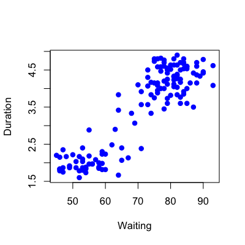
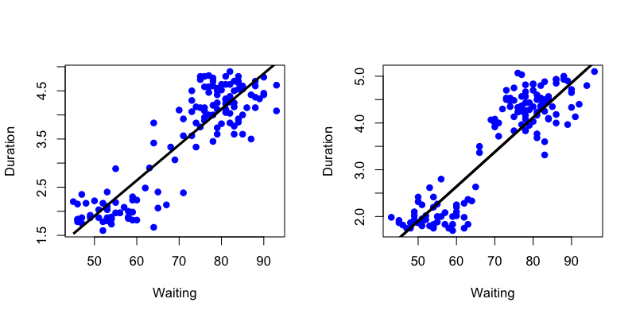

## Key ideas

* Fit a simple regression model
* Plug in new covariates and multiply by the coefficients
* Useful when the linear model is (nearly) correct

__Pros__:
* Easy to implement
* Easy to interpret

__Cons__:
* Often poor performance in nonlinear settings


---

## Example: Old faithful eruptions


Image Credit/Copyright Wally Pacholka [http://www.astropics.com/](http://www.astropics.com/)

---

## Example: Old faithful eruptions


```r
library(caret);data(faithful); set.seed(333)
inTrain <- createDataPartition(y=faithful$waiting,
                              p=0.5, list=FALSE)
trainFaith <- faithful[inTrain,]; testFaith <- faithful[-inTrain,]
head(trainFaith)
```

```
   eruptions waiting
6      2.883      55
11     1.833      54
16     2.167      52
19     1.600      52
22     1.750      47
27     1.967      55
```


---

## Eruption duration versus waiting time


```r
plot(trainFaith$waiting,trainFaith$eruptions,pch=19,col="blue",xlab="Waiting",ylab="Duration")
```

<div class="rimage center"></div>


---

## Fit a linear model 

$$ ED_i = b_0 + b_1 WT_i + e_i $$


```r
lm1 <- lm(eruptions ~ waiting,data=trainFaith)
summary(lm1)
```

```

Call:
lm(formula = eruptions ~ waiting, data = trainFaith)

Residuals:
    Min      1Q  Median      3Q     Max 
-1.2699 -0.3479  0.0398  0.3659  1.0502 

Coefficients:
            Estimate Std. Error t value Pr(>|t|)    
(Intercept) -1.79274    0.22787   -7.87    1e-12 ***
waiting      0.07390    0.00315   23.47   <2e-16 ***
---
Signif. codes:  0 '***' 0.001 '**' 0.01 '*' 0.05 '.' 0.1 ' ' 1

Residual standard error: 0.495 on 135 degrees of freedom
Multiple R-squared:  0.803,	Adjusted R-squared:  0.802 
F-statistic:  551 on 1 and 135 DF,  p-value: <2e-16
```


---
## Model fit


```r
plot(trainFaith$waiting,trainFaith$eruptions,pch=19,col="blue",xlab="Waiting",ylab="Duration")
lines(trainFaith$waiting,lm1$fitted,lwd=3)
```

<div class="rimage center"></div>


---

## Predict a new value

$$\hat{ED} = \hat{b}_0 + \hat{b}_1 WT$$


```r
coef(lm1)[1] + coef(lm1)[2]*80
```

```
(Intercept) 
      4.119 
```

```r
newdata <- data.frame(waiting=80)
predict(lm1,newdata)
```

```
    1 
4.119 
```


---

## Plot predictions - training and test


```r
par(mfrow=c(1,2))
plot(trainFaith$waiting,trainFaith$eruptions,pch=19,col="blue",xlab="Waiting",ylab="Duration")
lines(trainFaith$waiting,predict(lm1),lwd=3)
plot(testFaith$waiting,testFaith$eruptions,pch=19,col="blue",xlab="Waiting",ylab="Duration")
lines(testFaith$waiting,predict(lm1,newdata=testFaith),lwd=3)
```

<div class="rimage center"></div>


---

## Get training set/test set errors


```r
# Calculate RMSE on training
sqrt(sum((lm1$fitted-trainFaith$eruptions)^2))
```

```
[1] 5.752
```

```r

# Calculate RMSE on test
sqrt(sum((predict(lm1,newdata=testFaith)-testFaith$eruptions)^2))
```

```
[1] 5.839
```


---

## Prediction intervals


```r
pred1 <- predict(lm1,newdata=testFaith,interval="prediction")
ord <- order(testFaith$waiting)
plot(testFaith$waiting,testFaith$eruptions,pch=19,col="blue")
matlines(testFaith$waiting[ord],pred1[ord,],type="l",,col=c(1,2,2),lty = c(1,1,1), lwd=3)
```

<div class="rimage center"></div>


---

## Same process with caret


```r
modFit <- train(eruptions ~ waiting,data=trainFaith,method="lm")
summary(modFit$finalModel)
```

```

Call:
lm(formula = modFormula, data = data)

Residuals:
    Min      1Q  Median      3Q     Max 
-1.2699 -0.3479  0.0398  0.3659  1.0502 

Coefficients:
            Estimate Std. Error t value Pr(>|t|)    
(Intercept) -1.79274    0.22787   -7.87    1e-12 ***
waiting      0.07390    0.00315   23.47   <2e-16 ***
---
Signif. codes:  0 '***' 0.001 '**' 0.01 '*' 0.05 '.' 0.1 ' ' 1

Residual standard error: 0.495 on 135 degrees of freedom
Multiple R-squared:  0.803,	Adjusted R-squared:  0.802 
F-statistic:  551 on 1 and 135 DF,  p-value: <2e-16
```


---

## Notes and further reading

* Regression models with multiple covariates can be included
* Often useful in combination with other models 
* [Elements of statistical learning](http://www-stat.stanford.edu/~tibs/ElemStatLearn/)
* [Modern applied statistics with S](http://www.amazon.com/Modern-Applied-Statistics-W-N-Venables/dp/0387954570)
* [Introduction to statistical learning](http://www-bcf.usc.edu/~gareth/ISL/)


