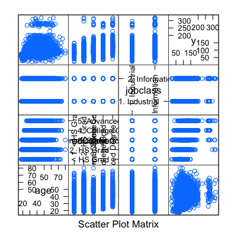
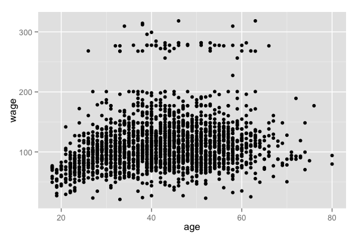
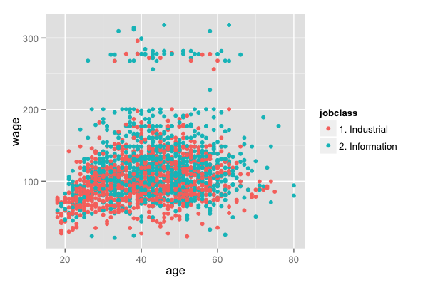
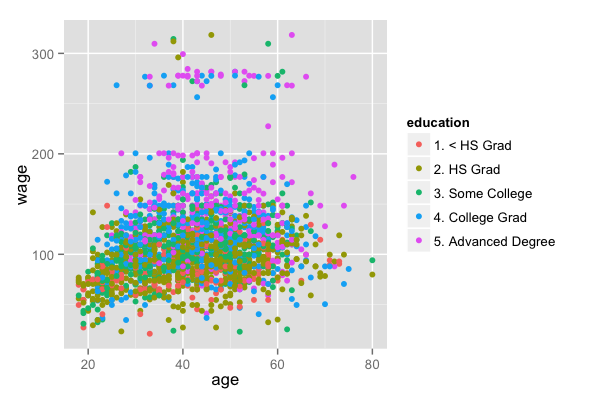
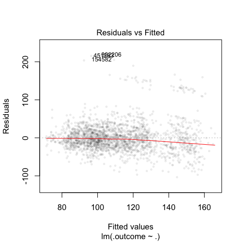
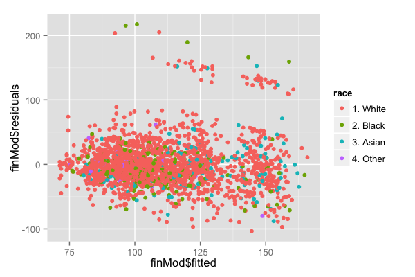
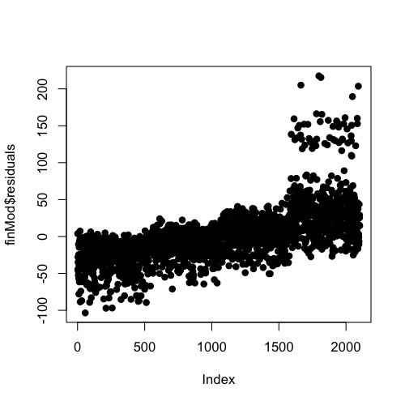
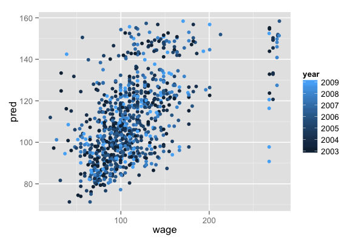
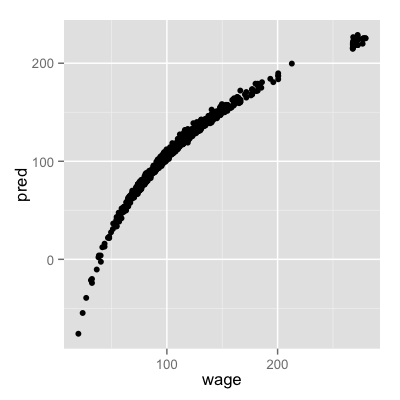

## Example: predicting wages


Image Credit [http://www.cahs-media.org/the-high-cost-of-low-wages](http://www.cahs-media.org/the-high-cost-of-low-wages)

Data from: [ISLR package](http://cran.r-project.org/web/packages/ISLR) from the book: [Introduction to statistical learning](http://www-bcf.usc.edu/~gareth/ISL/)


---

## Example: Wage data


```r
library(ISLR); library(ggplot2); library(caret);
data(Wage); Wage <- subset(Wage,select=-c(logwage))
summary(Wage)
```

```
      year           age              sex                    maritl           race     
 Min.   :2003   Min.   :18.0   1. Male  :3000   1. Never Married: 648   1. White:2480  
 1st Qu.:2004   1st Qu.:33.8   2. Female:   0   2. Married      :2074   2. Black: 293  
 Median :2006   Median :42.0                    3. Widowed      :  19   3. Asian: 190  
 Mean   :2006   Mean   :42.4                    4. Divorced     : 204   4. Other:  37  
 3rd Qu.:2008   3rd Qu.:51.0                    5. Separated    :  55                  
 Max.   :2009   Max.   :80.0                                                           
                                                                                       
              education                     region               jobclass               health    
 1. < HS Grad      :268   2. Middle Atlantic   :3000   1. Industrial :1544   1. <=Good     : 858  
 2. HS Grad        :971   1. New England       :   0   2. Information:1456   2. >=Very Good:2142  
 3. Some College   :650   3. East North Central:   0                                              
 4. College Grad   :685   4. West North Central:   0                                              
 5. Advanced Degree:426   5. South Atlantic    :   0                                              
                          6. East South Central:   0                                              
                          (Other)              :   0                                              
  health_ins        wage      
 1. Yes:2083   Min.   : 20.1  
 2. No : 917   1st Qu.: 85.4  
               Median :104.9  
               Mean   :111.7  
               3rd Qu.:128.7  
               Max.   :318.3  
                              
```


---

## Get training/test sets


```r
inTrain <- createDataPartition(y=Wage$wage,
                              p=0.7, list=FALSE)
training <- Wage[inTrain,]; testing <- Wage[-inTrain,]
dim(training); dim(testing)
```

```
[1] 898  12
```


---

## Feature plot


```r
featurePlot(x=training[,c("age","education","jobclass")],
            y = training$wage,
            plot="pairs")
```

<div class="rimage center"></div>


---

## Plot age versus wage


```r
qplot(age,wage,data=training)
```

<div class="rimage center"></div>


---

## Plot age versus wage colour by jobclass


```r
qplot(age,wage,colour=jobclass,data=training)
```

<div class="rimage center"></div>


---

## Plot age versus wage colour by education


```r
qplot(age,wage,colour=education,data=training)
```

<div class="rimage center"></div>


---

## Fit a linear model 

$$ ED_i = b_0 + b_1 age + b_2 I(Jobclass_i="Information") + \sum_{k=1}^4 \gamma_k I(education_i= level k) $$


```r
modFit<- train(wage ~ age + jobclass + education,
               method = "lm",data=training)
finMod <- modFit$finalModel
print(modFit)
```

```
Linear Regression 

2102 samples
  11 predictors

No pre-processing
Resampling: Bootstrapped (25 reps) 

Summary of sample sizes: 2102, 2102, 2102, 2102, 2102, 2102, ... 

Resampling results

  RMSE  Rsquared  RMSE SD  Rsquared SD
  40    0.2       1        0.02       

 
```


Education levels: 1 = HS Grad, 2 = Some College, 3 = College Grad, 4 = Advanced Degree

---

## Diagnostics


```r
plot(finMod,1,pch=19,cex=0.5,col="#00000010")
```

<div class="rimage center"></div>


---

## Color by variables not used in the model 


```r
qplot(finMod$fitted,finMod$residuals,colour=race,data=training)
```

<div class="rimage center"></div>


---

## Plot by index


```r
plot(finMod$residuals,pch=19)
```

<div class="rimage center"></div>


---

## Predicted versus truth in test set


```r
pred <- predict(modFit, testing)
qplot(wage,pred,colour=year,data=testing)
```

<div class="rimage center"></div>


---

## If you want to use all covariates


```r
modFitAll<- train(wage ~ .,data=training,method="lm")
pred <- predict(modFitAll, testing)
qplot(wage,pred,data=testing)
```

<div class="rimage center"></div>


---

## Notes and further reading

* Often useful in combination with other models 
* [Elements of statistical learning](http://www-stat.stanford.edu/~tibs/ElemStatLearn/)
* [Modern applied statistics with S](http://www.amazon.com/Modern-Applied-Statistics-W-N-Venables/dp/0387954570)
* [Introduction to statistical learning](http://www-bcf.usc.edu/~gareth/ISL/)
