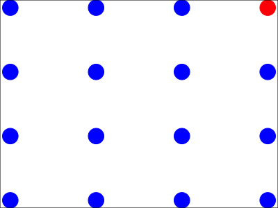
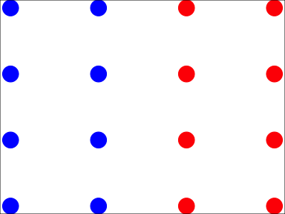
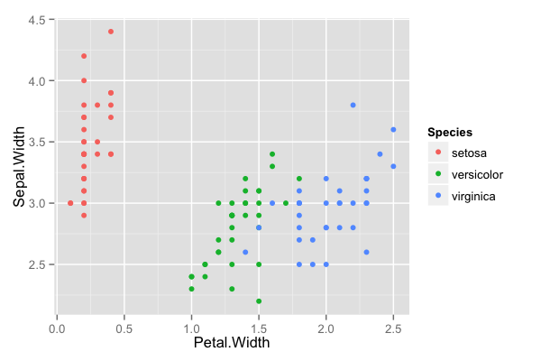
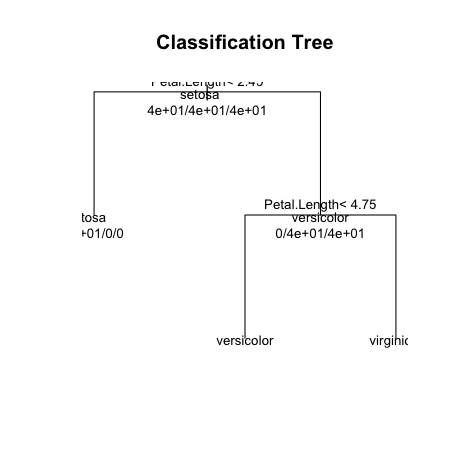
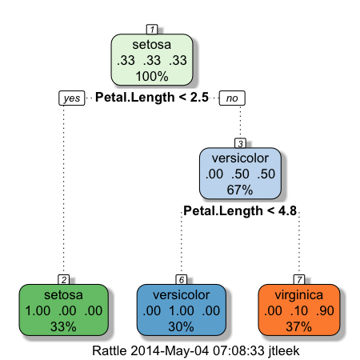

## Key ideas

* Iteratively split variables into groups
* Evaluate "homogeneity" within each group
* Split again if necessary

__Pros__:

* Easy to interpret
* Better performance in nonlinear settings

__Cons__:

* Without pruning/cross-validation can lead to overfitting
* Harder to estimate uncertainty
* Results may be variable


---

## Example Tree


[http://graphics8.nytimes.com/images/2008/04/16/us/0416-nat-subOBAMA.jpg](http://graphics8.nytimes.com/images/2008/04/16/us/0416-nat-subOBAMA.jpg)

---

## Basic algorithm

1. Start with all variables in one group
2. Find the variable/split that best separates the outcomes
3. Divide the data into two groups ("leaves") on that split ("node")
4. Within each split, find the best variable/split that separates the outcomes
5. Continue until the groups are too small or sufficiently "pure"


---

## Measures of impurity

$$\hat{p}_{mk} = \frac{1}{N_m}\sum_{x_i\; in \; Leaf \; m}\mathbb{1}(y_i = k)$$

__Misclassification Error__: 
$$ 1 - \hat{p}_{m k(m)}; k(m) = {\rm most; common; k}$$ 
* 0 = perfect purity
* 0.5 = no purity

__Gini index__:
$$ \sum_{k \neq k'} \hat{p}_{mk} \times \hat{p}_{mk'} = \sum_{k=1}^K \hat{p}_{mk}(1-\hat{p}_{mk}) = 1 - \sum_{k=1}^K p_{mk}^2$$

* 0 = perfect purity
* 0.5 = no purity

http://en.wikipedia.org/wiki/Decision_tree_learning

---

## Measures of impurity

__Deviance/information gain__:

$$ -\sum_{k=1}^K \hat{p}_{mk} \log_2\hat{p}_{mk} $$
* 0 = perfect purity
* 1 = no purity

http://en.wikipedia.org/wiki/Decision_tree_learning


--- &twocol w1:50% w2:50%
## Measures of impurity

*** =left

<div class="rimage center"></div>


* __Misclassification:__ $1/16 = 0.06$
* __Gini:__ $1 - [(1/16)^2 + (15/16)^2] = 0.12$
* __Information:__$-[1/16 \times log2(1/16) + 15/16 \times log2(15/16)] = 0.34$

*** =right

<div class="rimage center"></div>


* __Misclassification:__ $8/16 = 0.5$
* __Gini:__ $1 - [(8/16)^2 + (8/16)^2] = 0.5$
* __Information:__$-[1/16 \times log2(1/16) + 15/16 \times log2(15/16)] = 1$


---

## Example: Iris Data


```r
data(iris); library(ggplot2)
names(iris)
```

```
[1] "Sepal.Length" "Sepal.Width"  "Petal.Length" "Petal.Width"  "Species"     
```

```r
table(iris$Species)
```

```

    setosa versicolor  virginica 
        50         50         50 
```


---

## Create training and test sets


```r
inTrain <- createDataPartition(y=iris$Species,
                              p=0.7, list=FALSE)
training <- iris[inTrain,]
testing <- iris[-inTrain,]
dim(training); dim(testing)
```

```
[1] 45  5
```


---

## Iris petal widths/sepal width


```r
qplot(Petal.Width,Sepal.Width,colour=Species,data=training)
```

<div class="rimage center"></div>


---

## Iris petal widths/sepal width


```r
library(caret)
modFit <- train(Species ~ .,method="rpart",data=training)
print(modFit$finalModel)
```

```
n= 105 

node), split, n, loss, yval, (yprob)
      * denotes terminal node

1) root 105 70 setosa (0.3333 0.3333 0.3333)  
  2) Petal.Length< 2.45 35  0 setosa (1.0000 0.0000 0.0000) *
  3) Petal.Length>=2.45 70 35 versicolor (0.0000 0.5000 0.5000)  
    6) Petal.Length< 4.75 31  0 versicolor (0.0000 1.0000 0.0000) *
    7) Petal.Length>=4.75 39  4 virginica (0.0000 0.1026 0.8974) *
```


---

## Plot tree


```r
plot(modFit$finalModel, uniform=TRUE, 
      main="Classification Tree")
text(modFit$finalModel, use.n=TRUE, all=TRUE, cex=.8)
```

<div class="rimage center"></div>


---

## Prettier plots


```r
library(rattle)
fancyRpartPlot(modFit$finalModel)
```

<div class="rimage center"></div>


---

## Predicting new values


```r
predict(modFit,newdata=testing)
```

```
 [1] setosa     setosa     setosa     setosa     setosa     setosa     setosa     setosa    
 [9] setosa     setosa     setosa     setosa     setosa     setosa     setosa     versicolor
[17] versicolor versicolor versicolor versicolor versicolor versicolor versicolor versicolor
[25] virginica  versicolor virginica  versicolor versicolor versicolor virginica  virginica 
[33] virginica  versicolor virginica  virginica  virginica  virginica  virginica  virginica 
[41] virginica  virginica  virginica  virginica  virginica 
Levels: setosa versicolor virginica
```


---

## Notes and further resources

* Classification trees are non-linear models
  * They use interactions between variables
  * Data transformations may be less important (monotone transformations)
  * Trees can also be used for regression problems (continuous outcome)
* Note that there are multiple tree building options
in R both in the caret package - [party](http://cran.r-project.org/web/packages/party/index.html), [rpart](http://cran.r-project.org/web/packages/rpart/index.html) and out of the caret package - [tree](http://cran.r-project.org/web/packages/tree/index.html)
* [Introduction to statistical learning](http://www-bcf.usc.edu/~gareth/ISL/)
* [Elements of Statistical Learning](http://www-stat.stanford.edu/~tibs/ElemStatLearn/)
* [Classification and regression trees](http://www.amazon.com/Classification-Regression-Trees-Leo-Breiman/dp/0412048418)


