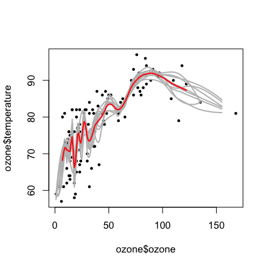
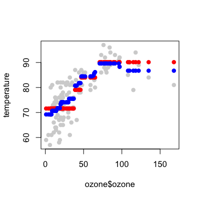

## Bootstrap aggregating (bagging)

__Basic idea__: 

1. Resample cases and recalculate predictions
2. Average or majority vote

__Notes__:

* Similar bias 
* Reduced variance
* More useful for non-linear functions


---

## Ozone data


```r
library(ElemStatLearn); data(ozone,package="ElemStatLearn")
ozone <- ozone[order(ozone$ozone),]
head(ozone)
```

```
    ozone radiation temperature wind
17      1         8          59  9.7
19      4        25          61  9.7
14      6        78          57 18.4
45      7        48          80 14.3
106     7        49          69 10.3
7       8        19          61 20.1
```

[http://en.wikipedia.org/wiki/Bootstrap_aggregating](http://en.wikipedia.org/wiki/Bootstrap_aggregating)


---

## Bagged loess


```r
ll <- matrix(NA,nrow=10,ncol=155)
for(i in 1:10){
  ss <- sample(1:dim(ozone)[1],replace=T)
  ozone0 <- ozone[ss,]; ozone0 <- ozone0[order(ozone0$ozone),]
  loess0 <- loess(temperature ~ ozone,data=ozone0,span=0.2)
  ll[i,] <- predict(loess0,newdata=data.frame(ozone=1:155))
}
```


---

## Bagged loess


```r
plot(ozone$ozone,ozone$temperature,pch=19,cex=0.5)
for(i in 1:10){lines(1:155,ll[i,],col="grey",lwd=2)}
lines(1:155,apply(ll,2,mean),col="red",lwd=2)
```

<div class="rimage center"></div>


---

## Bagging in caret

* Some models perform bagging for you, in `train` function consider `method` options 
  * `bagEarth` 
  * `treebag`
  * `bagFDA`
* Alternatively you can bag any model you choose using the `bag` function

---

## More bagging in caret


```r
predictors = data.frame(ozone=ozone$ozone)
temperature = ozone$temperature
treebag <- bag(predictors, temperature, B = 10,
                bagControl = bagControl(fit = ctreeBag$fit,
                                        predict = ctreeBag$pred,
                                        aggregate = ctreeBag$aggregate))
```


http://www.inside-r.org/packages/cran/caret/docs/nbBag


---

## Example of custom bagging (continued)


```r
plot(ozone$ozone,temperature,col='lightgrey',pch=19)
points(ozone$ozone,predict(treebag$fits[[1]]$fit,predictors),pch=19,col="red")
points(ozone$ozone,predict(treebag,predictors),pch=19,col="blue")
```

<div class="rimage center"></div>


---

## Parts of bagging


```r
ctreeBag$fit
```

```
function (x, y, ...) 
{
    library(party)
    data <- as.data.frame(x)
    data$y <- y
    ctree(y ~ ., data = data)
}
<environment: namespace:caret>
```


---

## Parts of bagging


```r
ctreeBag$pred
```

```
function (object, x) 
{
    obsLevels <- levels(object@data@get("response")[, 1])
    if (!is.null(obsLevels)) {
        rawProbs <- treeresponse(object, x)
        probMatrix <- matrix(unlist(rawProbs), ncol = length(obsLevels), 
            byrow = TRUE)
        out <- data.frame(probMatrix)
        colnames(out) <- obsLevels
        rownames(out) <- NULL
    }
    else out <- unlist(treeresponse(object, x))
    out
}
<environment: namespace:caret>
```


---

## Parts of bagging


```r
ctreeBag$aggregate
```

```
function (x, type = "class") 
{
    if (is.matrix(x[[1]]) | is.data.frame(x[[1]])) {
        pooled <- x[[1]] & NA
        classes <- colnames(pooled)
        for (i in 1:ncol(pooled)) {
            tmp <- lapply(x, function(y, col) y[, col], col = i)
            tmp <- do.call("rbind", tmp)
            pooled[, i] <- apply(tmp, 2, median)
        }
        if (type == "class") {
            out <- factor(classes[apply(pooled, 1, which.max)], 
                levels = classes)
        }
        else out <- as.data.frame(pooled)
    }
    else {
        x <- matrix(unlist(x), ncol = length(x))
        out <- apply(x, 1, median)
    }
    out
}
<environment: namespace:caret>
```


---

## Notes and further resources

__Notes__:

* Bagging is most useful for nonlinear models
* Often used with trees - an extension is random forests
* Several models use bagging in caret's _train_ function

__Further resources__:

* [Bagging](http://en.wikipedia.org/wiki/Bootstrap_aggregating)
* [Bagging and boosting](http://stat.ethz.ch/education/semesters/FS_2008/CompStat/sk-ch8.pdf)
* [Elements of Statistical Learning](http://www-stat.stanford.edu/~tibs/ElemStatLearn/)

