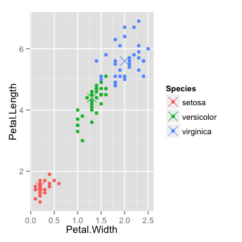
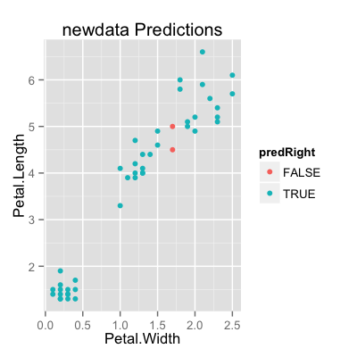

## Random forests

1. Bootstrap samples
2. At each split, bootstrap variables
3. Grow multiple trees and vote

__Pros__:

1. Accuracy

__Cons__:

1. Speed
2. Interpretability
3. Overfitting


---

## Random forests


[http://www.robots.ox.ac.uk/~az/lectures/ml/lect5.pdf](http://www.robots.ox.ac.uk/~az/lectures/ml/lect5.pdf)


---

## Iris data


```r
data(iris); library(ggplot2)
inTrain <- createDataPartition(y=iris$Species,
                              p=0.7, list=FALSE)
training <- iris[inTrain,]
testing <- iris[-inTrain,]
```


---

## Random forests


```r
library(caret)
modFit <- train(Species~ .,data=training,method="rf",prox=TRUE)
modFit
```

```
105 samples
  4 predictors
  3 classes: 'setosa', 'versicolor', 'virginica' 

No pre-processing
Resampling: Bootstrap (25 reps) 

Summary of sample sizes: 105, 105, 105, 105, 105, 105, ... 

Resampling results across tuning parameters:

  mtry  Accuracy  Kappa  Accuracy SD  Kappa SD
  2     0.9       0.9    0.03         0.04    
  3     0.9       0.9    0.03         0.05    
  4     0.9       0.9    0.03         0.05    

Accuracy was used to select the optimal model using  the largest value.
The final value used for the model was mtry = 3. 
```


---

## Getting a single tree


```r
getTree(modFit$finalModel,k=2)
```

```
   left daughter right daughter split var split point status prediction
1              2              3         4        0.70      1          0
2              0              0         0        0.00     -1          1
3              4              5         4        1.70      1          0
4              6              7         3        4.95      1          0
5              8              9         3        4.85      1          0
6              0              0         0        0.00     -1          2
7             10             11         4        1.55      1          0
8             12             13         1        5.95      1          0
9              0              0         0        0.00     -1          3
10             0              0         0        0.00     -1          3
11             0              0         0        0.00     -1          2
12             0              0         0        0.00     -1          2
13             0              0         0        0.00     -1          3
```


---

## Class "centers"


```r
irisP <- classCenter(training[,c(3,4)], training$Species, modFit$finalModel$prox)
irisP <- as.data.frame(irisP); irisP$Species <- rownames(irisP)
p <- qplot(Petal.Width, Petal.Length, col=Species,data=training)
p + geom_point(aes(x=Petal.Width,y=Petal.Length,col=Species),size=5,shape=4,data=irisP)
```

<div class="rimage center"></div>


---

## Predicting new values


```r
pred <- predict(modFit,testing); testing$predRight <- pred==testing$Species
table(pred,testing$Species)
```

```
            
pred         setosa versicolor virginica
  setosa         15          0         0
  versicolor      0         14         1
  virginica       0          1        14
```


---

## Predicting new values


```r
qplot(Petal.Width,Petal.Length,colour=predRight,data=testing,main="newdata Predictions")
```

<div class="rimage center"></div>


---

## Notes and further resources

__Notes__:

* Random forests are usually one of the two top
performing algorithms along with boosting in prediction contests.
* Random forests are difficult to interpret but often very accurate. 
* Care should be taken to avoid overfitting (see [rfcv](http://cran.r-project.org/web/packages/randomForest/randomForest.pdf) funtion)


__Further resources__:

* [Random forests](http://www.stat.berkeley.edu/~breiman/RandomForests/cc_home.htm)
* [Random forest Wikipedia](http://en.wikipedia.org/wiki/Random_forest)
* [Elements of Statistical Learning](http://www-stat.stanford.edu/~tibs/ElemStatLearn/)
