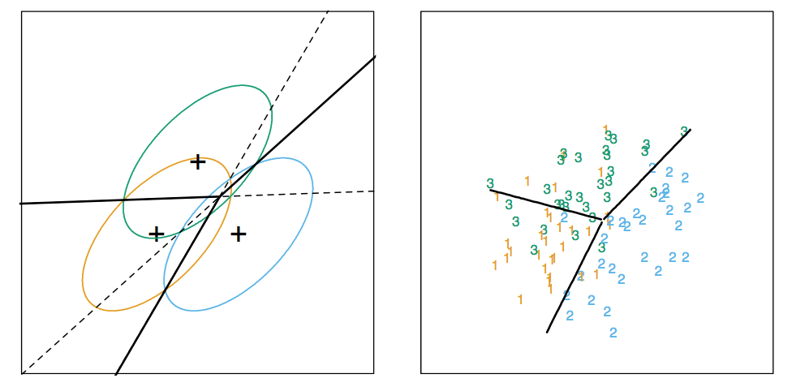

```{r setup, cache = F, echo = F, message = F, warning = F, tidy = F}
library(knitr)
library(caret)
# make this an external chunk that can be included in any file
options(width = 100)
opts_chunk$set(message = F, error = F, warning = F, comment = NA, fig.align = 'center', dpi = 100, cache=TRUE,tidy = F, cache.path = '.cache/', fig.path = 'fig/')

options(xtable.type = 'html')
knit_hooks$set(inline = function(x) {
  if(is.numeric(x)) {
    round(x, getOption('digits'))
  } else {
    paste(as.character(x), collapse = ', ')
  }
})
knit_hooks$set(plot = knitr:::hook_plot_html)
```


## Basic idea

1. Assume the data follow a probabilistic model
2. Use Bayes' theorem to identify optimal classifiers

__Pros:__

* Can take advantage of structure of the data
* May be computationally convenient
* Are reasonably accurate on real problems

__Cons:__

* Make additional assumptions about the data
* When the model is incorrect you may get reduced accuracy

---

## Model based approach


1. Our goal is to build parametric model for conditional distribution $P(Y = k | X = x)$

2. A typical approach is to apply [Bayes theorem](http://en.wikipedia.org/wiki/Bayes'_theorem):
$$ Pr(Y = k | X=x) = \frac{Pr(X=x|Y=k)Pr(Y=k)}{\sum_{\ell=1}^K Pr(X=x |Y = \ell) Pr(Y=\ell)}$$
$$Pr(Y = k | X=x) = \frac{f_k(x) \pi_k}{\sum_{\ell = 1}^K f_{\ell}(x) \pi_{\ell}}$$

3. Typically prior probabilities $\pi_k$ are set in advance.

4. A common choice for $f_k(x) = \frac{1}{\sigma_k \sqrt{2 \pi}}e^{-\frac{(x-\mu_k)^2}{\sigma_k^2}}$, a Gaussian distribution

5. Estimate the parameters ($\mu_k$,$\sigma_k^2$) from the data.

6. Classify to the class with the highest value of $P(Y = k | X = x)$

---

## Classifying using the model

A range of models use this approach

* Linear discriminant analysis assumes $f_k(x)$ is multivariate Gaussian with same covariances
* Quadratic discrimant analysis assumes $f_k(x)$ is multivariate Gaussian with different covariances
* [Model based prediction](http://www.stat.washington.edu/mclust/) assumes more complicated versions for the covariance matrix 
* Naive Bayes assumes independence between features for model building

http://statweb.stanford.edu/~tibs/ElemStatLearn/


---

## Why linear discriminant analysis?

$$log \frac{Pr(Y = k | X=x)}{Pr(Y = j | X=x)}$$
$$ = log \frac{f_k(x)}{f_j(x)} + log \frac{\pi_k}{\pi_j}$$
$$ = log \frac{\pi_k}{\pi_j} - \frac{1}{2}(\mu_k^T \Sigma^{-1}\mu_k - \mu_j^T \Sigma^{-1}\mu_j)$$
$$ + x^T \Sigma^{-1} (\mu_k - \mu_j)$$

http://statweb.stanford.edu/~tibs/ElemStatLearn/


---

## Decision boundaries



---

## Discriminant function

$$\delta_k(x) = x^T \Sigma^{-1} \mu_k - \frac{1}{2}\mu_k \Sigma^{-1}\mu_k + log(\mu_k)$$


* Decide on class based on $\hat{Y}(x) = argmax_k \delta_k(x)$
* We usually estimate parameters with maximum likelihood


---

## Naive Bayes

Suppose we have many predictors, we would want to model: $P(Y = k | X_1,\ldots,X_m)$

We could use Bayes Theorem to get:

$$P(Y = k | X_1,\ldots,X_m) = \frac{\pi_k P(X_1,\ldots,X_m| Y=k)}{\sum_{\ell = 1}^K P(X_1,\ldots,X_m | Y=k) \pi_{\ell}}$$
$$ \propto \pi_k P(X_1,\ldots,X_m| Y=k)$$

This can be written:

$$P(X_1,\ldots,X_m, Y=k) = \pi_k P(X_1 | Y = k)P(X_2,\ldots,X_m | X_1,Y=k)$$
$$ = \pi_k P(X_1 | Y = k) P(X_2 | X_1, Y=k) P(X_3,\ldots,X_m | X_1,X_2, Y=k)$$
$$ = \pi_k P(X_1 | Y = k) P(X_2 | X_1, Y=k)\ldots P(X_m|X_1\ldots,X_{m-1},Y=k)$$

We could make an assumption to write this:

$$ \approx \pi_k P(X_1 | Y = k) P(X_2 | Y = k)\ldots P(X_m |,Y=k)$$

---

## Example: Iris Data

```{r iris, cache=TRUE}
data(iris); library(ggplot2)
names(iris)
table(iris$Species)
```


---

## Create training and test sets

```{r trainingTest, dependson="iris",cache=TRUE}
inTrain <- createDataPartition(y=iris$Species,
                              p=0.7, list=FALSE)
training <- iris[inTrain,]
testing <- iris[-inTrain,]
dim(training); dim(testing)
```

---

## Build predictions

```{r fit,dependson="trainingTest"}
modlda = train(Species ~ .,data=training,method="lda")
modnb = train(Species ~ ., data=training,method="nb")
plda = predict(modlda,testing); pnb = predict(modnb,testing)
table(plda,pnb)
```


---

## Comparison of results

```{r,dependson="fit",fig.height=4,fig.width=4}
equalPredictions = (plda==pnb)
qplot(Petal.Width,Sepal.Width,colour=equalPredictions,data=testing)
```

---

## Notes and further reading

* [Introduction to statistical learning](http://www-bcf.usc.edu/~gareth/ISL/)
* [Elements of Statistical Learning](http://www-stat.stanford.edu/~tibs/ElemStatLearn/)
* [Model based clustering](http://www.stat.washington.edu/raftery/Research/PDF/fraley2002.pdf)
* [Linear Discriminant Analysis](http://en.wikipedia.org/wiki/Linear_discriminant_analysis)
* [Quadratic Discriminant Analysis](http://en.wikipedia.org/wiki/Quadratic_classifier)
