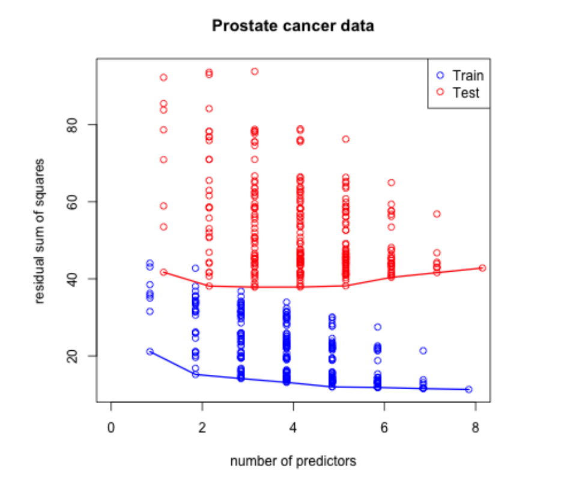
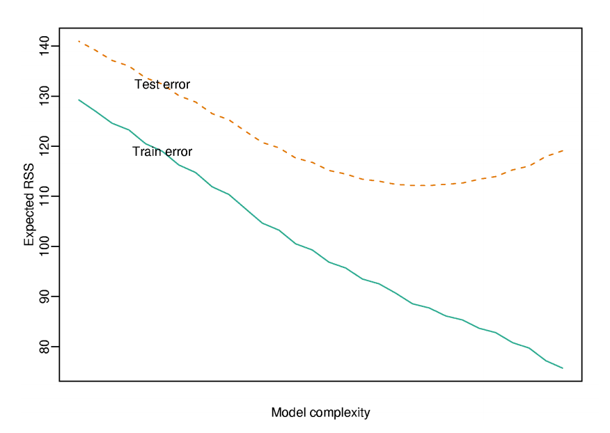
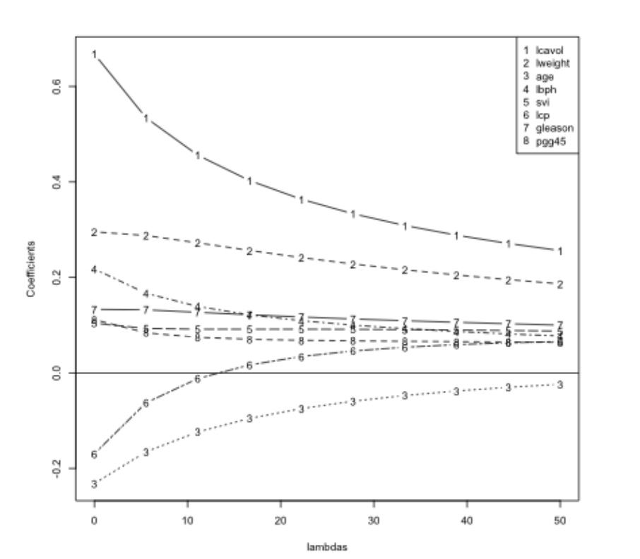

## Basic idea

1. Fit a regression model
2. Penalize (or shrink) large coefficients

__Pros:__

* Can help with the bias/variance tradeoff
* Can help with model selection

__Cons:__

* May be computationally demanding on large data sets
* Does not perform as well as random forests and boosting


---

## A motivating example

$$Y = \beta_0 + \beta_1 X_1 + \beta_2 X_2 + \epsilon$$

where $X_1$ and $X_2$ are nearly perfectly correlated (co-linear). You can approximate this model by:

$$Y = \beta_0 + (\beta_1 + \beta_2)X_1 + \epsilon$$

The result is:

* You will get a good estimate of $Y$
* The estimate (of $Y$) will be biased 
* We may reduce variance in the estimate

---

## Prostate cancer 


```r
library(ElemStatLearn); data(prostate)
str(prostate)
```

```
'data.frame':	97 obs. of  10 variables:
 $ lcavol : num  -0.58 -0.994 -0.511 -1.204 0.751 ...
 $ lweight: num  2.77 3.32 2.69 3.28 3.43 ...
 $ age    : int  50 58 74 58 62 50 64 58 47 63 ...
 $ lbph   : num  -1.39 -1.39 -1.39 -1.39 -1.39 ...
 $ svi    : int  0 0 0 0 0 0 0 0 0 0 ...
 $ lcp    : num  -1.39 -1.39 -1.39 -1.39 -1.39 ...
 $ gleason: int  6 6 7 6 6 6 6 6 6 6 ...
 $ pgg45  : int  0 0 20 0 0 0 0 0 0 0 ...
 $ lpsa   : num  -0.431 -0.163 -0.163 -0.163 0.372 ...
 $ train  : logi  TRUE TRUE TRUE TRUE TRUE TRUE ...
```


---

## Subset selection



[Code here](http://www.cbcb.umd.edu/~hcorrada/PracticalML/src/selection.R)


---

## Most common pattern



http://www.biostat.jhsph.edu/~ririzarr/Teaching/649/

---

## Model selection approach: split samples

* No method better when data/computation time permits it

* Approach
  1. Divide data into training/test/validation
  2. Treat validation as test data, train all competing models on the train data and pick the best one on validation. 
  3. To appropriately assess performance on new data apply to test set
  4. You may re-split and reperform steps 1-3

* Two common problems
  * Limited data
  * Computational complexity
  
http://www.biostat.jhsph.edu/~ririzarr/Teaching/649/
http://www.cbcb.umd.edu/~hcorrada/PracticalML/


---

## Decomposing expected prediction error

Assume $Y_i = f(X_i) + \epsilon_i$

$EPE(\lambda) = E\left[\{Y - \hat{f}_{\lambda}(X)\}^2\right]$

Suppose $\hat{f}_{\lambda}$ is the estimate from the training data and look at a new data point $X = x^*$

$$E\left[\{Y - \hat{f}_{\lambda}(x^*)\}^2\right] = \sigma^2 + \{E[\hat{f}_{\lambda}(x^*)] - f(x^*)\}^2 + var[\hat{f}_\lambda(x_0)]$$

<center> = Irreducible error + Bias$^2$ + Variance </center>

http://www.biostat.jhsph.edu/~ririzarr/Teaching/649/
http://www.cbcb.umd.edu/~hcorrada/PracticalML/

---

## Another issue for high-dimensional data


```r
small = prostate[1:5,]
lm(lpsa ~ .,data =small)
```

```

Call:
lm(formula = lpsa ~ ., data = small)

Coefficients:
(Intercept)       lcavol      lweight          age         lbph          svi          lcp  
     9.6061       0.1390      -0.7914       0.0952           NA           NA           NA  
    gleason        pgg45    trainTRUE  
    -2.0871           NA           NA  
```


http://www.biostat.jhsph.edu/~ririzarr/Teaching/649/
http://www.cbcb.umd.edu/~hcorrada/PracticalML/

---

## Hard thresholding

* Model $Y = f(X) + \epsilon$

* Set $\hat{f}_{\lambda}(x) = x'\beta$

* Constrain only $\lambda$ coefficients to be nonzero. 

* Selection problem is after chosing $\lambda$ figure out which $p - \lambda$ coefficients to make nonzero

http://www.biostat.jhsph.edu/~ririzarr/Teaching/649/
http://www.cbcb.umd.edu/~hcorrada/PracticalML/

---

## Regularization for regression

If the $\beta_j$'s are unconstrained:
* They can explode
* And hence are susceptible to very high variance

To control variance, we might regularize/shrink the coefficients. 

$$ PRSS(\beta) = \sum_{j=1}^n (Y_j - \sum_{i=1}^m \beta_{1i} X_{ij})^2 + P(\lambda; \beta)$$

where $PRSS$ is a penalized form of the sum of squares. Things that are commonly looked for

* Penalty reduces complexity
* Penalty reduces variance
* Penalty respects structure of the problem

---

## Ridge regression

Solve:

$$ \sum_{i=1}^N \left(y_i - \beta_0 + \sum_{j=1}^p x_{ij}\beta_j \right)^2 + \lambda \sum_{j=1}^p \beta_j^2$$

equivalent to solving

$\sum_{i=1}^N \left(y_i - \beta_0 + \sum_{j=1}^p x_{ij}\beta_j \right)^2$ subject to $\sum_{j=1}^p \beta_j^2 \leq s$ where $s$ is inversely proportional to $\lambda$ 


Inclusion of $\lambda$ makes the problem non-singular even if $X^TX$ is not invertible.

http://www.biostat.jhsph.edu/~ririzarr/Teaching/649/
http://www.cbcb.umd.edu/~hcorrada/PracticalML/


---

## Ridge coefficient paths



http://www.biostat.jhsph.edu/~ririzarr/Teaching/649/
http://www.cbcb.umd.edu/~hcorrada/PracticalML/

---

## Tuning parameter $\lambda$

* $\lambda$ controls the size of the coefficients
* $\lambda$ controls the amount of {\bf regularization}
* As $\lambda \rightarrow 0$ we obtain the least square solution
* As $\lambda \rightarrow \infty$ we have $\hat{\beta}_{\lambda=\infty}^{ridge} = 0$


---

## Lasso 

$\sum_{i=1}^N \left(y_i - \beta_0 + \sum_{j=1}^p x_{ij}\beta_j \right)^2$ subject to $\sum_{j=1}^p |\beta_j| \leq s$ 

also has a lagrangian form 

$$ \sum_{i=1}^N \left(y_i - \beta_0 + \sum_{j=1}^p x_{ij}\beta_j \right)^2 + \lambda \sum_{j=1}^p |\beta_j|$$

For orthonormal design matrices (not the norm!) this has a closed form solution

$$\hat{\beta}_j = sign(\hat{\beta}_j^0)(|\hat{\beta}_j^0 - \gamma)^{+}$$
 
but not in general. 

http://www.biostat.jhsph.edu/~ririzarr/Teaching/649/
http://www.cbcb.umd.edu/~hcorrada/PracticalML/


---

## Notes and further reading


* [Hector Corrada Bravo's Practical Machine Learning lecture notes](http://www.cbcb.umd.edu/~hcorrada/PracticalML/)
* [Hector's penalized regression reading list](http://www.cbcb.umd.edu/~hcorrada/AMSC689.html#readings)
* [Elements of Statistical Learning](http://statweb.stanford.edu/~tibs/ElemStatLearn/)
* In `caret` methods are:
  * `ridge`
  * `lasso`
  * `relaxo`

