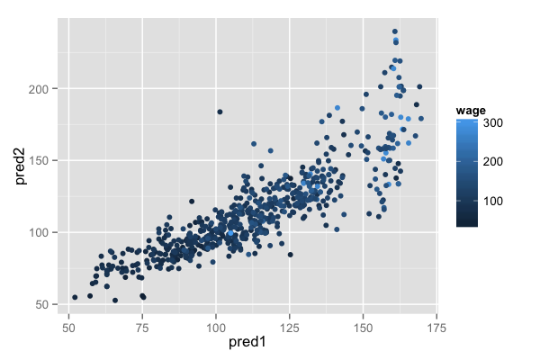

## Key ideas

* You can combine classifiers by averaging/voting
* Combining classifiers improves accuracy
* Combining classifiers reduces interpretability
* Boosting, bagging, and random forests are variants on this theme

---

## Netflix prize

BellKor = Combination of 107 predictors 


[http://www.netflixprize.com//leaderboard](http://www.netflixprize.com//leaderboard)

---

## Heritage health prize - Progress Prize 1


[Market Makers](https://kaggle2.blob.core.windows.net/wiki-files/327/e4cd1d25-eca9-49ca-9593-b254a773fe03/Market%20Makers%20-%20Milestone%201%20Description%20V2%201.pdf)


[Mestrom](https://kaggle2.blob.core.windows.net/wiki-files/327/09ccf652-8c1c-4a3d-b979-ce2369c985e4/Willem%20Mestrom%20-%20Milestone%201%20Description%20V2%202.pdf)


---

## Basic intuition - majority vote

Suppose we have 5 completely independent classifiers

If accuracy is 70% for each:
  * $10\times(0.7)^3(0.3)^2 + 5\times(0.7)^4(0.3)^2 + (0.7)^5$
  * 83.7% majority vote accuracy

With 101 independent classifiers
  * 99.9% majority vote accuracy
  

---

## Approaches for combining classifiers

1. Bagging, boosting, random forests
  * Usually combine similar classifiers
2. Combining different classifiers
  * Model stacking
  * Model ensembling

---

## Example with Wage data

__Create training, test and validation sets__


```r
library(ISLR); data(Wage); library(ggplot2); library(caret);
Wage <- subset(Wage,select=-c(logwage))

# Create a building data set and validation set
inBuild <- createDataPartition(y=Wage$wage,
                              p=0.7, list=FALSE)
validation <- Wage[-inBuild,]; buildData <- Wage[inBuild,]

inTrain <- createDataPartition(y=buildData$wage,
                              p=0.7, list=FALSE)
training <- buildData[inTrain,]; testing <- buildData[-inTrain,]
```


---

## Wage data sets

__Create training, test and validation sets__


```r
dim(training)
```

```
[1] 1474   11
```

```r
dim(testing)
```

```
[1] 628  11
```

```r
dim(validation)
```

```
[1] 898  11
```


---

## Build two different models


```r
mod1 <- train(wage ~.,method="glm",data=training)
mod2 <- train(wage ~.,method="rf",
              data=training, 
              trControl = trainControl(method="cv"),number=3)
```


---

## Predict on the testing set 


```r
pred1 <- predict(mod1,testing); pred2 <- predict(mod2,testing)
qplot(pred1,pred2,colour=wage,data=testing)
```

<div class="rimage center"></div>


---

## Fit a model that combines predictors


```r
predDF <- data.frame(pred1,pred2,wage=testing$wage)
combModFit <- train(wage ~.,method="gam",data=predDF)
combPred <- predict(combModFit,predDF)
```


---

## Testing errors


```r
sqrt(sum((pred1-testing$wage)^2))
```

```
[1] 827.1
```

```r
sqrt(sum((pred2-testing$wage)^2))
```

```
[1] 866.8
```

```r
sqrt(sum((combPred-testing$wage)^2))
```

```
[1] 813.9
```


---

## Predict on validation data set


```r
pred1V <- predict(mod1,validation); pred2V <- predict(mod2,validation)
predVDF <- data.frame(pred1=pred1V,pred2=pred2V)
combPredV <- predict(combModFit,predVDF)
```


---

## Evaluate on validation


```r
sqrt(sum((pred1V-validation$wage)^2))
```

```
[1] 1003
```

```r
sqrt(sum((pred2V-validation$wage)^2))
```

```
[1] 1068
```

```r
sqrt(sum((combPredV-validation$wage)^2))
```

```
[1] 999.9
```


---

## Notes and further resources

* Even simple blending can be useful
* Typical model for binary/multiclass data
  * Build an odd number of models
  * Predict with each model
  * Predict the class by majority vote
* This can get dramatically more complicated
  * Simple blending in caret: [caretEnsemble](https://github.com/zachmayer/caretEnsemble) (use at your own risk!)
  * Wikipedia [ensemlbe learning](http://en.wikipedia.org/wiki/Ensemble_learning)

---

## Recall - scalability matters


</br></br></br>

[http://www.techdirt.com/blog/innovation/articles/20120409/03412518422/](http://www.techdirt.com/blog/innovation/articles/20120409/03412518422/)

[http://techblog.netflix.com/2012/04/netflix-recommendations-beyond-5-stars.html](http://techblog.netflix.com/2012/04/netflix-recommendations-beyond-5-stars.html)
