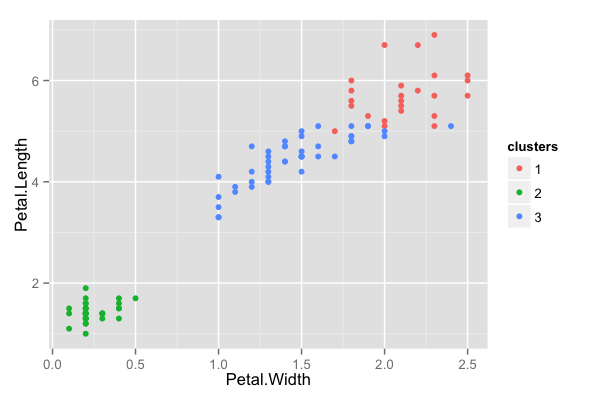

## Key ideas

* Sometimes you don't know the labels for prediction
* To build a predictor
  * Create clusters
  * Name clusters
  * Build predictor for clusters
* In a new data set
  * Predict clusters


---

## Iris example ignoring species labels


```r
data(iris); library(ggplot2)
inTrain <- createDataPartition(y=iris$Species,
                              p=0.7, list=FALSE)
training <- iris[inTrain,]
testing <- iris[-inTrain,]
dim(training); dim(testing)
```

```
[1] 45  5
```


---

## Cluster with k-means


```r
kMeans1 <- kmeans(subset(training,select=-c(Species)),centers=3)
training$clusters <- as.factor(kMeans1$cluster)
qplot(Petal.Width,Petal.Length,colour=clusters,data=training)
```

<div class="rimage center"></div>


---

## Compare to real labels


```r
table(kMeans1$cluster,training$Species)
```

```
   
    setosa versicolor virginica
  1      0          1        23
  2     35          0         0
  3      0         34        12
```


---

## Build predictor


```r
modFit <- train(clusters ~.,data=subset(training,select=-c(Species)),method="rpart")
table(predict(modFit,training),training$Species)
```

```
   
    setosa versicolor virginica
  1      0          0        21
  2     35          0         0
  3      0         35        14
```


---

## Apply on test


```r
testClusterPred <- predict(modFit,testing) 
table(testClusterPred ,testing$Species)
```

```
               
testClusterPred setosa versicolor virginica
              1      0          0        13
              2     15          0         0
              3      0         15         2
```


---

## Notes and further reading

* The cl_predict function in the clue package provides similar functionality
* Beware over-interpretation of clusters!
* This is one basic approach to [recommendation engines](http://en.wikipedia.org/wiki/Recommender_system)
* [Elements of statistical learning](http://www-stat.stanford.edu/~tibs/ElemStatLearn/)
* [Introduction to statistical learning](http://www-bcf.usc.edu/~gareth/ISL/)

