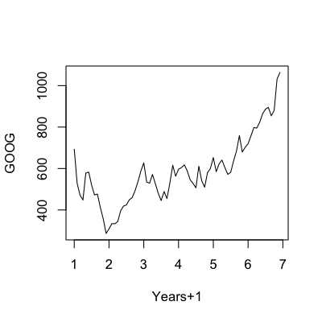
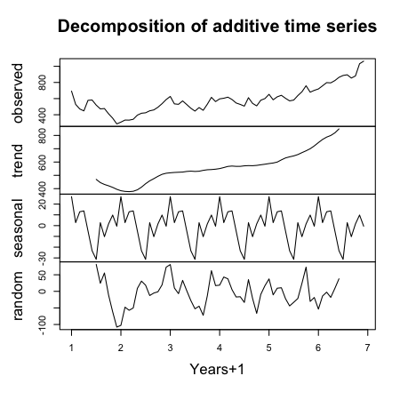
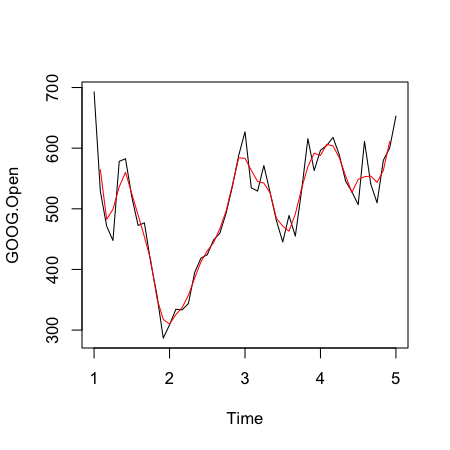
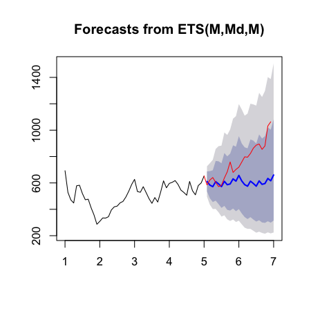

## Time series data


[https://www.google.com/finance](https://www.google.com/finance)

---

## What is different?

* Data are dependent over time
* Specific pattern types
  * Trends - long term increase or decrease
  * Seasonal patterns - patterns related to time of week, month, year, etc.
  * Cycles - patterns that rise and fall periodically
* Subsampling into training/test is more complicated
* Similar issues arise in spatial data 
  * Dependency between nearby observations
  * Location specific effects
* Typically goal is to predict one or more observations into the future. 
* All standard predictions can be used (with caution!)

---

## Beware spurious correlations!


[http://www.google.com/trends/correlate](http://www.google.com/trends/correlate)

[http://www.newscientist.com/blogs/onepercent/2011/05/google-correlate-passes-our-we.html](http://www.newscientist.com/blogs/onepercent/2011/05/google-correlate-passes-our-we.html)

---

## Also common in geographic analyses


[http://xkcd.com/1138/](http://xkcd.com/1138/)


---

## Beware extrapolation!


[http://www.nature.com/nature/journal/v431/n7008/full/431525a.html](http://www.nature.com/nature/journal/v431/n7008/full/431525a.html)

---

## Google data


```r
library(quantmod)
from.dat <- as.Date("01/01/08", format="%m/%d/%y")
to.dat <- as.Date("12/31/13", format="%m/%d/%y")
getSymbols("GOOG", src="google", from = from.dat, to = to.dat)
```

```
[1] "GOOG"
```

```r
head(GOOG)
```

```
           GOOG.Open GOOG.High GOOG.Low GOOG.Close GOOG.Volume
2008-01-02     692.9     697.4    677.7      685.2     4306848
2008-01-03     685.3     686.9    676.5      685.3     3252846
2008-01-04     679.7     681.0    655.0      657.0     5359834
2008-01-07     653.9     662.3    637.4      649.2     6404945
2008-01-08     653.0     660.0    631.0      631.7     5341949
2008-01-09     630.0     653.3    622.5      653.2     6744242
```


---

## Summarize monthly and store as time series


```r
mGoog <- to.monthly(GOOG)
googOpen <- Op(mGoog)
ts1 <- ts(googOpen,frequency=12)
plot(ts1,xlab="Years+1", ylab="GOOG")
```

<div class="rimage center"></div>


---

## Example time series decomposition

* __Trend__  - Consistently increasing pattern over time 
* __Seasonal__ -  When there is a pattern over a fixed period of time that recurs.
* __Cyclic__ -  When data rises and falls over non fixed periods

[https://www.otexts.org/fpp/6/1](https://www.otexts.org/fpp/6/1)


---

## Decompose a time series into parts


```r
plot(decompose(ts1),xlab="Years+1")
```

<div class="rimage center"></div>


---

## Training and test sets


```r
ts1Train <- window(ts1,start=1,end=5)
ts1Test <- window(ts1,start=5,end=(7-0.01))
ts1Train
```

```
    Jan   Feb   Mar   Apr   May   Jun   Jul   Aug   Sep   Oct   Nov   Dec
1 692.9 528.7 471.5 447.7 578.3 582.5 519.6 472.5 476.8 412.1 357.6 286.7
2 308.6 334.3 333.3 343.8 395.0 418.7 424.2 448.7 459.7 493.0 537.1 588.1
3 627.0 534.6 529.2 571.4 526.5 480.4 445.3 489.0 455.0 530.0 615.7 563.0
4 596.5 604.5 617.8 588.8 545.7 528.0 506.7 611.2 540.8 509.9 580.1 600.0
5 652.9                                                                  
```


---

## Simple moving average

$$ Y_{t}=\frac{1}{2*k+1}\sum_{j=-k}^k {y_{t+j}}$$


```r
plot(ts1Train)
lines(ma(ts1Train,order=3),col="red")
```

<div class="rimage center"></div>


---

## Exponential smoothing

__Example - simple exponential smoothing__
$$\hat{y}_{t+1} = \alpha y_t + (1-\alpha)\hat{y}_{t-1}$$


[https://www.otexts.org/fpp/7/6](https://www.otexts.org/fpp/7/6)

---

## Exponential smoothing


```r
ets1 <- ets(ts1Train,model="MMM")
fcast <- forecast(ets1)
plot(fcast); lines(ts1Test,col="red")
```

<div class="rimage center"></div>


---

## Get the accuracy


```r
accuracy(fcast,ts1Test)
```

```
                   ME   RMSE    MAE     MPE   MAPE   MASE    ACF1 Theil's U
Training set   0.9464  48.78  39.35 -0.3297  7.932 0.3733 0.07298        NA
Test set     156.1890 205.76 160.78 18.1819 18.971 1.5254 0.77025     3.745
```


---

## Notes and further resources

* [Forecasting and timeseries prediction](http://en.wikipedia.org/wiki/Forecasting) is an entire field
* Rob Hyndman's [Forecasting: principles and practice](https://www.otexts.org/fpp/) is a good place to start
* Cautions
  * Be wary of spurious correlations
  * Be careful how far you predict (extrapolation)
  * Be wary of dependencies over time
* See [quantmod](http://cran.r-project.org/web/packages/quantmod/quantmod.pdf) or [quandl](http://www.quandl.com/help/packages/r) packages for finance-related problems.


