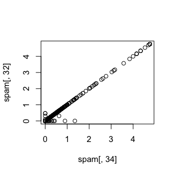
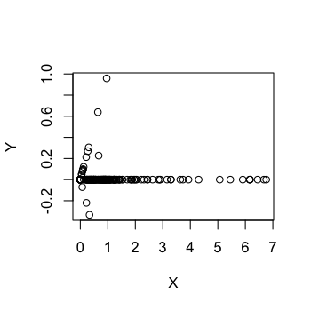
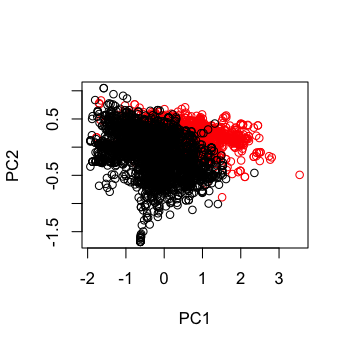
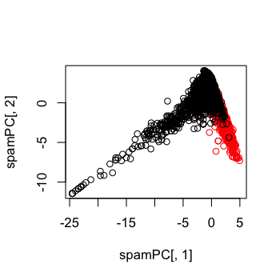

## Correlated predictors


```r
library(caret); library(kernlab); data(spam)
inTrain <- createDataPartition(y=spam$type,
                              p=0.75, list=FALSE)
training <- spam[inTrain,]
testing <- spam[-inTrain,]

M <- abs(cor(training[,-58]))
diag(M) <- 0
which(M > 0.8,arr.ind=T)
```

```
       row col
num415  34  32
num857  32  34
```


---

## Correlated predictors


```r
names(spam)[c(34,32)]
```

```
[1] "num415" "num857"
```

```r
plot(spam[,34],spam[,32])
```

<div class="rimage center"></div>


---

## Basic PCA idea

* We might not need every predictor
* A weighted combination of predictors might be better
* We should pick this combination to capture the "most information" possible
* Benefits
  * Reduced number of predictors
  * Reduced noise (due to averaging)


---

## We could rotate the plot

$$ X = 0.71 \times {\rm num 415} + 0.71 \times {\rm num857}$$

$$ Y = 0.71 \times {\rm num 415} - 0.71 \times {\rm num857}$$


```r
X <- 0.71*training$num415 + 0.71*training$num857
Y <- 0.71*training$num415 - 0.71*training$num857
plot(X,Y)
```

<div class="rimage center"></div>


---

## Related problems

You have multivariate variables $X_1,\ldots,X_n$ so $X_1 = (X_{11},\ldots,X_{1m})$

* Find a new set of multivariate variables that are uncorrelated and explain as much variance as possible.
* If you put all the variables together in one matrix, find the best matrix created with fewer variables (lower rank) that explains the original data.


The first goal is <font color="#330066">statistical</font> and the second goal is <font color="#993300">data compression</font>.

---

## Related solutions - PCA/SVD

__SVD__

If $X$ is a matrix with each variable in a column and each observation in a row then the SVD is a "matrix decomposition"

$$ X = UDV^T$$

where the columns of $U$ are orthogonal (left singular vectors), the columns of $V$ are orthogonal (right singluar vectors) and $D$ is a diagonal matrix (singular values). 

__PCA__

The principal components are equal to the right singular values if you first scale (subtract the mean, divide by the standard deviation) the variables.

---

## Principal components in R - prcomp


```r
smallSpam <- spam[,c(34,32)]
prComp <- prcomp(smallSpam)
plot(prComp$x[,1],prComp$x[,2])
```

<div class="rimage center"></div>


---

## Principal components in R - prcomp


```r
prComp$rotation
```

```
          PC1     PC2
num415 0.7081  0.7061
num857 0.7061 -0.7081
```


---

## PCA on SPAM data


```r
typeColor <- ((spam$type=="spam")*1 + 1)
prComp <- prcomp(log10(spam[,-58]+1))
plot(prComp$x[,1],prComp$x[,2],col=typeColor,xlab="PC1",ylab="PC2")
```

<div class="rimage center"></div>


---

## PCA with caret


```r
preProc <- preProcess(log10(spam[,-58]+1),method="pca",pcaComp=2)
spamPC <- predict(preProc,log10(spam[,-58]+1))
plot(spamPC[,1],spamPC[,2],col=typeColor)
```

<div class="rimage center"></div>


---

## Preprocessing with PCA


```r
preProc <- preProcess(log10(training[,-58]+1),method="pca",pcaComp=2)
trainPC <- predict(preProc,log10(training[,-58]+1))
modelFit <- train(training$type ~ .,method="glm",data=trainPC)
```


---

## Preprocessing with PCA


```r
testPC <- predict(preProc,log10(testing[,-58]+1))
confusionMatrix(testing$type,predict(modelFit,testPC))
```

```
Confusion Matrix and Statistics

          Reference
Prediction nonspam spam
   nonspam     646   51
   spam         64  389
                                        
               Accuracy : 0.9           
                 95% CI : (0.881, 0.917)
    No Information Rate : 0.617         
    P-Value [Acc > NIR] : <2e-16        
                                        
                  Kappa : 0.79          
 Mcnemar's Test P-Value : 0.263         
                                        
            Sensitivity : 0.910         
            Specificity : 0.884         
         Pos Pred Value : 0.927         
         Neg Pred Value : 0.859         
             Prevalence : 0.617         
         Detection Rate : 0.562         
   Detection Prevalence : 0.606         
                                        
       'Positive' Class : nonspam       
                                        
```


---

## Alternative (sets # of PCs)


```r
modelFit <- train(training$type ~ .,method="glm",preProcess="pca",data=training)
confusionMatrix(testing$type,predict(modelFit,testing))
```

```
Confusion Matrix and Statistics

          Reference
Prediction nonspam spam
   nonspam     660   37
   spam         54  399
                                        
               Accuracy : 0.921         
                 95% CI : (0.904, 0.936)
    No Information Rate : 0.621         
    P-Value [Acc > NIR] : <2e-16        
                                        
                  Kappa : 0.833         
 Mcnemar's Test P-Value : 0.0935        
                                        
            Sensitivity : 0.924         
            Specificity : 0.915         
         Pos Pred Value : 0.947         
         Neg Pred Value : 0.881         
             Prevalence : 0.621         
         Detection Rate : 0.574         
   Detection Prevalence : 0.606         
                                        
       'Positive' Class : nonspam       
                                        
```


---

## Final thoughts on PCs

* Most useful for linear-type models
* Can make it harder to interpret predictors
* Watch out for outliers! 
  * Transform first (with logs/Box Cox)
  * Plot predictors to identify problems
* For more info see 
  * Exploratory Data Analysis
  * [Elements of Statistical Learning](http://statweb.stanford.edu/~tibs/ElemStatLearn/)
  
