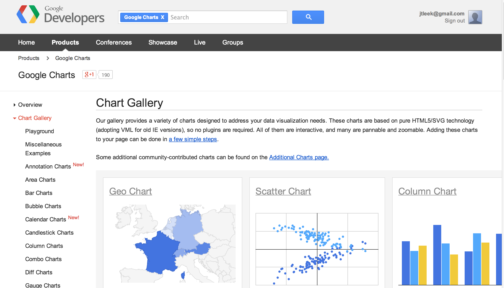
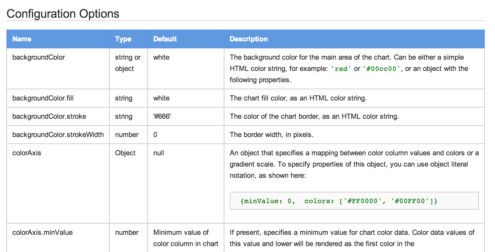

## Google Vis API



https://developers.google.com/chart/interactive/docs/gallery


---

## Basic idea

* The R function creates an HTML page
* The HTML page calls Google Charts
* The result is an interactive HTML graphic

---

## Example 

```{r gv,results="asis"}
suppressPackageStartupMessages(library(googleVis))
M <- gvisMotionChart(Fruits, "Fruit", "Year",
                     options=list(width=600, height=400))
print(M,"chart")
```

---

## Charts in googleVis

<center> "gvis + ChartType" </center>

* Motion charts:  `gvisMotionChart`
* Interactive maps: `gvisGeoChart`
* Interactive tables: `gvisTable`
* Line charts: `gvisLineChart`
* Bar charts: `gvisColumnChart`
* Tree maps: `gvisTreeMap`

http://cran.r-project.org/web/packages/googleVis/googleVis.pdf

---

## Plots on maps

```{r,dependson="gv",results="asis"}
G <- gvisGeoChart(Exports, locationvar="Country",
                  colorvar="Profit",options=list(width=600, height=400))
print(G,"chart")
```


---

## Specifying a region

```{r,dependson="gv",results="asis"}
G2 <- gvisGeoChart(Exports, locationvar="Country",
                  colorvar="Profit",options=list(width=600, height=400,region="150"))
print(G2,"chart")
```

---

## Finding parameters to set under `options`




https://developers.google.com/chart/interactive/docs/gallery/geochart

---

## Setting more options

```{r linechart,dependson="gv",results="asis"}
df <- data.frame(label=c("US", "GB", "BR"), val1=c(1,3,4), val2=c(23,12,32))
Line <- gvisLineChart(df, xvar="label", yvar=c("val1","val2"),
        options=list(title="Hello World", legend="bottom",
                titleTextStyle="{color:'red', fontSize:18}",                         
                vAxis="{gridlines:{color:'red', count:3}}",
                hAxis="{title:'My Label', titleTextStyle:{color:'blue'}}",
                series="[{color:'green', targetAxisIndex: 0}, 
                         {color: 'blue',targetAxisIndex:1}]",
                vAxes="[{title:'Value 1 (%)', format:'##,######%'}, 
                                  {title:'Value 2 (\U00A3)'}]",                          
                curveType="function", width=500, height=300                         
                ))
```

https://github.com/mages/Introduction_to_googleVis/blob/gh-pages/index.Rmd

---

## Setting more options

```{r ,dependson="linechart",results="asis"}
print(Line,"chart")
```


---

## Combining multiple plots together

```{r multiplot,dependson="gv",results="asis"}
G <- gvisGeoChart(Exports, "Country", "Profit",options=list(width=200, height=100))
T1 <- gvisTable(Exports,options=list(width=200, height=270))
M <- gvisMotionChart(Fruits, "Fruit", "Year", options=list(width=400, height=370))
GT <- gvisMerge(G,T1, horizontal=FALSE)
GTM <- gvisMerge(GT, M, horizontal=TRUE,tableOptions="bgcolor=\"#CCCCCC\" cellspacing=10")
```

---

## Combining multiple plots together

```{r,dependson="multiplot",results="asis"}
print(GTM,"chart")
```


---

## Seeing the HTML code

```{r ,dependson="gv"}
M <- gvisMotionChart(Fruits, "Fruit", "Year", options=list(width=600, height=400))
print(M)
print(M, 'chart', file='myfilename.html')
```

---

## Things you can do with Google Vis

* The visualizations can be embedded in websites with HTML code
* Dynamic visualizations can be built with Shiny, Rook, and R.rsp
* Embed them in [R markdown](http://www.rstudio.com/ide/docs/authoring/using_markdown) based documents
  * Set `results="asis"` in the chunk options
  * Can be used with [knitr](http://cran.r-project.org/web/packages/knitr/index.html) and [slidify](http://slidify.org/)


---

## For more info

```{r,eval=FALSE}
demo(googleVis)
```

* http://cran.r-project.org/web/packages/googleVis/vignettes/googleVis.pdf
* http://cran.r-project.org/web/packages/googleVis/googleVis.pdf
* https://developers.google.com/chart/interactive/docs/gallery
* https://developers.google.com/chart/interactive/faq
