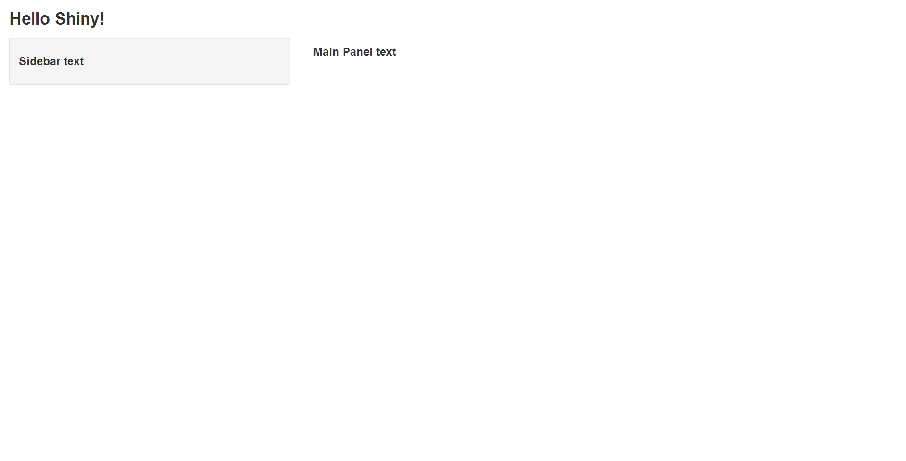
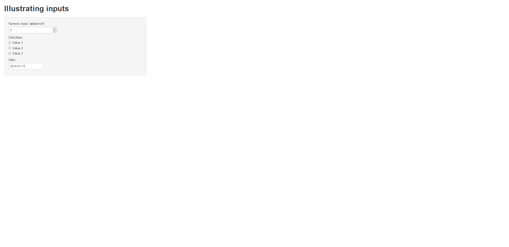
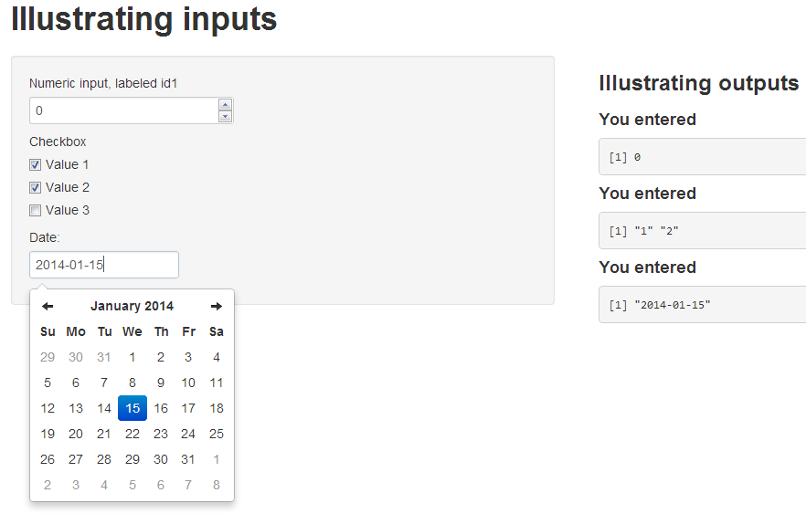
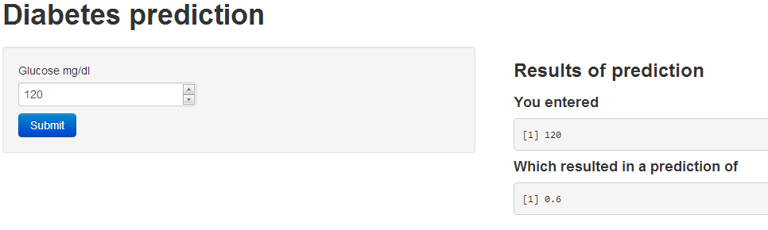
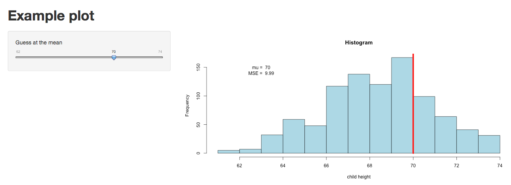

## What is Shiny?

- Shiny is a platform for creating interactive R programs embedded into a web page.
- Suppose that you create a prediction algorithm, with shiny you can *very easily* create web input form that calls R and thus your prediction algorithm and displays the results.
- Using Shiny, the time to create simple, yet powerful, web-based interactive data products in R is minimized.
  - However, it lacks the flexibility of full featured (and more complex) solutions.
- Shiny is made by the fine folks at R Studio.

---
## Some mild prerequisites 
- Shiny doesn't really require it, but as with all web programming, a little knowledge of html, css and js is very helpful
  - html gives a web page structure and sectioning as well as markup instructions
  - css gives the style
  - js for interactivity
- There are too many tutorials online to count for getting basic proficiency in these topics to count. 
- Shiny uses [bootstrap](http://getbootstrap.com/) (no relation to the statistics bootstrap) style, which (to me) seems to look nice and renders well on mobile platforms

---
## What else is out there?
- Creating any solution requiring fairly deep knowledge of web client/server programming
- [OpenCPU](https://public.opencpu.org/) by Jerome Ooms, is a really neat project providing an API for calling R from web documents
  - And he even hosts an OpenCPU server, but you can create your own

---
## Context
- You created a novel prediction algorithm to predict risk for developing
  diabetes.
    - You're hoping patients and caregivers will be able to enter their data and, if needed, take preventative measures.
- You want to create a web site so that users can input the relevant predictors and obtain their prediction.
- Your prediction algorithm (ok, so you're not going to be saving the world with this one)
  - [link for a real prediction score](http://www.ncbi.nlm.nih.gov/pubmed/12610029)
```{r}
diabetesRisk <- function(glucose) glucose / 200
```


---
## Getting started
- Make sure you have the latest release of R installed
- If on windows, make sure that you have Rtools installed
- `install.packages("shiny")`
- `library(shiny)`
- Great tutorial at 
[http://shiny.rstudio.com/tutorial/](http://shiny.rstudio.com/tutorial/)
- Basically, this lecture is walking through that tutorial offering some of our insights
- Note, some of the proposed interactive plotting uses of Shiny could be handled by the very simple `manipulate` function [rstudio manipulate](http://www.rstudio.com/ide/docs/advanced/manipulate)
- Also, `rCharts` is will be covered in a different lecture.

---
## A Shiny project
- A shiny project is a directory containing at least two parts
  - One named ui.R (for user interface) controls how it looks.
  - One named server.R that controls what it does.

---
## ui.R
```
library(shiny)
shinyUI(pageWithSidebar(
  headerPanel("Data science FTW!"),
  sidebarPanel(
    h3('Sidebar text')
  ),
  mainPanel(
      h3('Main Panel text')
  )
))
```

---
## server.r
```
library(shiny)
shinyServer(
  function(input, output) {
  }
)
```

---
## To run it
- In R, change to the directories with these files and type `runApp()`
- or put the path to the directory as an argument
- It should open an browser window with the app running

---


---
## R functions for HTML markup
`ui.R`
```
shinyUI(pageWithSidebar(
  headerPanel("Illustrating markup"),
  sidebarPanel(
      h1('Sidebar panel'),
      h1('H1 text'),
      h2('H2 Text'),
      h3('H3 Text'),
      h4('H4 Text')
      
  ),
  mainPanel(
      h3('Main Panel text'),
      code('some code'),
      p('some ordinary text')
  )
))

```

---


---
## Illustrating inputs ui.R
```
shinyUI(pageWithSidebar(
  headerPanel("Illustrating inputs"),
  sidebarPanel(
    numericInput('id1', 'Numeric input, labeled id1', 0, min = 0, max = 10, step = 1),
    checkboxGroupInput("id2", "Checkbox",
                   c("Value 1" = "1",
                     "Value 2" = "2",
                     "Value 3" = "3")),
    dateInput("date", "Date:")  
  ),
  mainPanel(
      
  )
))
```

---


---
## Part of ui.R
```
  mainPanel(
        h3('Illustrating outputs'),
        h4('You entered'),
        verbatimTextOutput("oid1"),
        h4('You entered'),
        verbatimTextOutput("oid2"),
        h4('You entered'),
        verbatimTextOutput("odate")
  )
```

---
## server.R
```
shinyServer(
  function(input, output) {
    output$oid1 <- renderPrint({input$id1})
    output$oid2 <- renderPrint({input$id2})
    output$odate <- renderPrint({input$date})
  }
)
```

---


---
## Let's build our prediction function

---
## 
```
shinyUI(
  pageWithSidebar(
    # Application title
    headerPanel("Diabetes prediction"),
  
    sidebarPanel(
      numericInput('glucose', 'Glucose mg/dl', 90, min = 50, max = 200, step = 5),
      submitButton('Submit')
    ),
    mainPanel(
        h3('Results of prediction'),
        h4('You entered'),
        verbatimTextOutput("inputValue"),
        h4('Which resulted in a prediction of '),
        verbatimTextOutput("prediction")
    )
  )
)
```

---
## server.R
```
diabetesRisk <- function(glucose) glucose / 200

shinyServer(
  function(input, output) {
    output$inputValue <- renderPrint({input$glucose})
    output$prediction <- renderPrint({diabetesRisk(input$glucose)})
  }
)
```

---
## The result


---
## Image example
- Let's build an example with an image
- How about we create a histogram of data
- Put a slider on so that the user has to guess the mean

---
## ui.R
```
shinyUI(pageWithSidebar(
  headerPanel("Example plot"),
  sidebarPanel(
    sliderInput('mu', 'Guess at the mean',value = 70, min = 62, max = 74, step = 0.05,)
  ),
  mainPanel(
    plotOutput('newHist')
  )
))
```

---
## server.R
```
library(UsingR)
data(galton)

shinyServer(
  function(input, output) {
    output$newHist <- renderPlot({
      hist(galton$child, xlab='child height', col='lightblue',main='Histogram')
      mu <- input$mu
      lines(c(mu, mu), c(0, 200),col="red",lwd=5)
      mse <- mean((galton$child - mu)^2)
      text(63, 150, paste("mu = ", mu))
      text(63, 140, paste("MSE = ", round(mse, 2)))
      })
    
  }
)
```

---
## The output


---
## Tighter control over style
- All of the style elements are handled through ui.R
- Instead, you can create a www directory and then an index.html file in that directory
  - [This link](http://rstudio.github.io/shiny/tutorial/#html-ui) goes through the html needed
  - You just have to have specific js libraries and appropriately name ids and classes. This is beyond the scope of this class
  - For students with a lot of experience in html, js, css it would be a breeze and probably easier and more flexible than the R html controls in ui.R

---
## Other things Shiny can do
- Allow users to upload or download files
- Have tabbed main panels
- Have editable data tables
- Have a dynamic UI
- User defined inputs and outputs 
- Put a submit button so that Shiny only executes complex code after user hits submit


---
## Distributing a Shiny app
- The quickest way is to send (or put on github or gist or dropbox or whatever) someone the app directory and they can then call `runApp`
- You could create an R package and create a wrapper that calls `runApp`  
  - Of course, these solutions only work if the user knows R
- Another option is to run a shiny server
  - Requires setting up a (Shiny server)[http://www.rstudio.com/shiny/server/]
    - Probably easiest if you use one of the virtual machines where they already have Shiny servers running well (for example, on AWS)
  - Setting up a Shiny server is beyond the scope of this class as it involves some amount of linux server administration
  - Groups are creating a Shiny hosting services that will presumably eventually be a fee for service or freemium service
  - BTW, don't put system calls in your code (this is one of the first things many of us do for fun, but it introduces security concerns)

