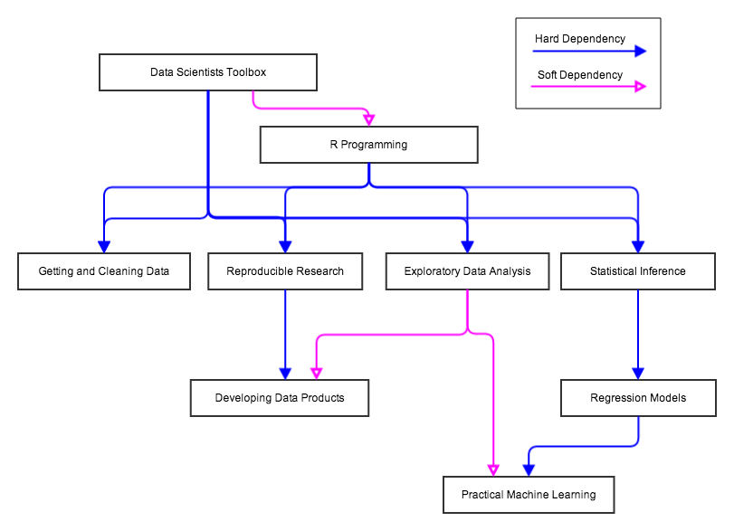

### Data Science Specialization

These are the course materials for the Johns Hopkins Data Science Specialization on Coursera

https://www.coursera.org/specialization/jhudatascience/1

Materials are under development and subject to change. 

#### Course map

The following graph describes the dependency tree of the courses in this specialization. Things further down the tree depend on knowledge in courses higher up the tree.

### Contributors

* Brian Caffo
* Jeff Leek
* Roger Peng
* Nick Carchedi 
* Sean Kross

### License

These course materials are available under the Creative Commons Attribution NonCommercial ShareAlike (CC-NC-SA) license (http://www.tldrlegal.com/l/CC-NC-SA). 

